# CAB System – DDD, Bounded Context & Microservice Design

> Tài liệu thiết kế Domain-Driven Design cho CAB System.  
> Mỗi **Bounded Context (BC)** được ánh xạ thành **một Microservice riêng**, có API, database và ngôn ngữ nghiệp vụ riêng.

---

# 1. Nguyên tắc kiến trúc

```text
Bounded Context
    ↓
Microservice
    ↓
Database riêng
```

Quy tắc chính:

- Mỗi BC chỉ sở hữu dữ liệu của chính nó.
- Microservice không truy cập trực tiếp database của service khác.
- Giao tiếp đồng bộ qua REST API khi cần phản hồi ngay.
- Giao tiếp bất đồng bộ qua Event khi chỉ cần thông báo sự kiện đã xảy ra.
- Không tạo Foreign Key xuyên database.
- Không dùng một enum `Status` chung cho toàn hệ thống.
- Một khái niệm có thể có ý nghĩa khác nhau ở các BC khác nhau.

Core workflow:

```text
Booking
   ↓
Dispatch
   ↓
Trip
   ↓
Pricing
   ↓
Payment
```

Các BC hỗ trợ:

```text
Identity & Access
Customer
Driver & Fleet
Geo & Routing
Notification
Reputation
Operations
Audit
Reporting
```

---

# 2. Context Map tổng thể

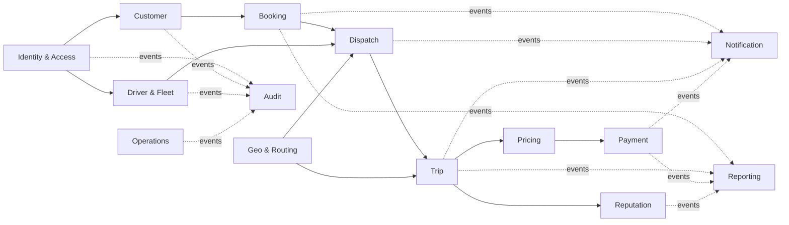
```mermaid
flowchart LR
    ID[Identity & Access]
    CU[Customer]
    DF[Driver & Fleet]
    BO[Booking]
    DI[Dispatch]
    GE[Geo & Routing]
    TR[Trip]
    PR[Pricing]
    PA[Payment]
    NO[Notification]
    RE[Reputation]
    OP[Operations]
    AU[Audit]
    RP[Reporting]

    ID --> CU
    ID --> DF
    CU --> BO
    BO --> DI
    DF --> DI
    GE --> DI
    DI --> TR
    GE --> TR
    TR --> PR
    PR --> PA
    TR --> RE

    BO -.events.-> NO
    DI -.events.-> NO
    TR -.events.-> NO
    PA -.events.-> NO

    ID -.events.-> AU
    CU -.events.-> AU
    DF -.events.-> AU
    OP -.events.-> AU

    BO -.events.-> RP
    TR -.events.-> RP
    PA -.events.-> RP
    RE -.events.-> RP
```

---

# 3. BC01 – Identity & Access

## 3.1. BC làm gì?

Quản lý danh tính và quyền truy cập:

- Đăng ký.
- Đăng nhập.
- Token/Session.
- Role.
- Permission.
- Khóa/mở khóa Account.
- Xác thực và phân quyền API.

Không quản lý hồ sơ nghiệp vụ Customer hoặc Driver.

## 3.2. FR liên quan

**Sở hữu chính:**

```text
FR01 – Đăng ký tài khoản
FR02 – Đăng nhập
FR04 – Quản lý phân quyền
FR56 – Xác thực người dùng
FR57 – Kiểm soát quyền truy cập
FR58 – Bảo vệ dữ liệu
```

**Phối hợp:**

```text
FR49 – Khóa/Mở khóa tài khoản khách hàng
```

## 3.3. Business Process / Workflow

**BP01 – Quản lý tài khoản và quyền**

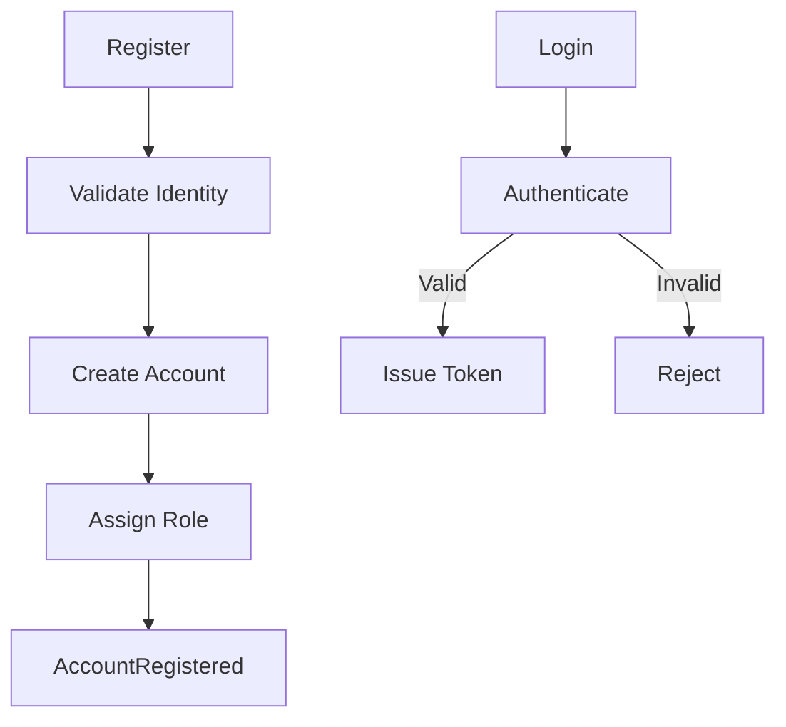
```mermaid
flowchart TD
    A[Register] --> B[Validate Identity]
    B --> C[Create Account]
    C --> D[Assign Role]
    D --> E[AccountRegistered]

    F[Login] --> G[Authenticate]
    G -->|Valid| H[Issue Token]
    G -->|Invalid| I[Reject]
```

## 3.4. Ubiquitous Language

```text
Account
Credential
Role
Permission
Session
Access Token
Authenticate
Authorize
Account Status
```

Hành vi:

```text
RegisterAccount
AuthenticateAccount
AssignRole
GrantPermission
LockAccount
UnlockAccount
```

## 3.5. Aggregate

```text
Account
├── AccountId
├── LoginIdentity
├── PasswordHash
├── AccountStatus
└── Roles
```

## 3.6. Microservice

```text
identity-service
```

## 3.7. API chính

| Method | Endpoint |
|---|---|
| POST | `/api/v1/auth/register` |
| POST | `/api/v1/auth/login` |
| POST | `/api/v1/auth/refresh` |
| POST | `/api/v1/auth/logout` |
| GET | `/api/v1/accounts/{id}` |
| PATCH | `/api/v1/accounts/{id}/lock` |
| PATCH | `/api/v1/accounts/{id}/unlock` |
| POST | `/api/v1/accounts/{id}/roles` |
| DELETE | `/api/v1/accounts/{id}/roles/{roleId}` |

## 3.8. Database

```text
identity_db
```

Tables:

```text
accounts
roles
permissions
account_roles
role_permissions
sessions
```

## 3.9. ERD

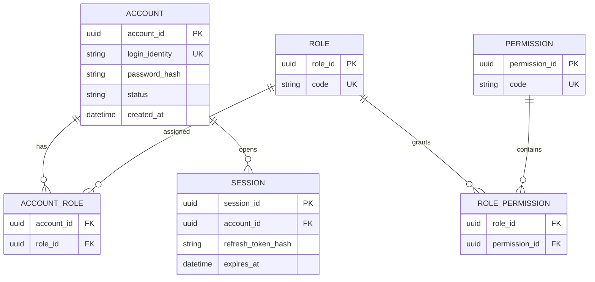
```mermaid
erDiagram
    ACCOUNT {
        uuid account_id PK
        string login_identity UK
        string password_hash
        string status
        datetime created_at
    }

    ROLE {
        uuid role_id PK
        string code UK
    }

    PERMISSION {
        uuid permission_id PK
        string code UK
    }

    ACCOUNT_ROLE {
        uuid account_id FK
        uuid role_id FK
    }

    ROLE_PERMISSION {
        uuid role_id FK
        uuid permission_id FK
    }

    SESSION {
        uuid session_id PK
        uuid account_id FK
        string refresh_token_hash
        datetime expires_at
    }

    ACCOUNT ||--o{ ACCOUNT_ROLE : has
    ROLE ||--o{ ACCOUNT_ROLE : assigned
    ROLE ||--o{ ROLE_PERMISSION : grants
    PERMISSION ||--o{ ROLE_PERMISSION : contains
    ACCOUNT ||--o{ SESSION : opens
```

## 3.10. Database Type

**Khuyến nghị: PostgreSQL hoặc MySQL**

Lý do kỹ thuật:

- Account, Role, Permission có quan hệ nhiều-nhiều rõ ràng.
- Cần unique constraint cho email/phone/login identity.
- Cần transaction chặt chẽ khi gán role/quyền.
- Authorization data cần tính nhất quán cao.

`Redis` có thể dùng bổ trợ để lưu token/session cache hoặc blacklist token, nhưng không nên là database chính.

## 3.11. Domain Events

```text
AccountRegistered
AccountAuthenticated
RoleAssigned
AccountLocked
AccountUnlocked
```

---

# 4. BC02 – Customer

## 4.1. BC làm gì?

Quản lý hồ sơ nghiệp vụ của khách hàng:

- Thông tin cá nhân.
- Contact.
- Trạng thái Customer.
- Operator xem/cập nhật Customer.
- Suspend/Reactivate Customer.

## 4.2. FR liên quan

```text
FR03 – Cập nhật thông tin cá nhân
FR46 – Xem danh sách khách hàng
FR47 – Xem thông tin khách hàng
FR48 – Cập nhật thông tin khách hàng
FR49 – Khóa/Mở khóa khách hàng
```

## 4.3. Business Process / Workflow

**BP01, BP02, BP08**

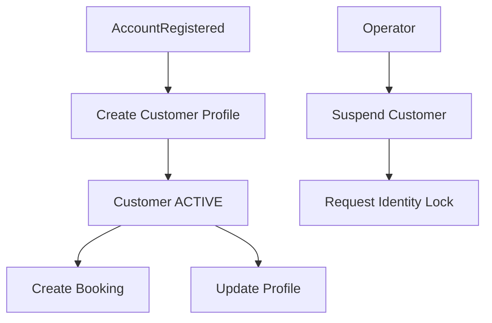
```mermaid
flowchart TD
    A[AccountRegistered] --> B[Create Customer Profile]
    B --> C[Customer ACTIVE]
    C --> D[Create Booking]
    C --> E[Update Profile]
    F[Operator] --> G[Suspend Customer]
    G --> H[Request Identity Lock]
```

## 4.4. Ubiquitous Language

```text
Customer
Customer Profile
Contact Info
Customer Status
Suspend Customer
Reactivate Customer
```

## 4.5. Aggregate

```text
Customer
├── CustomerId
├── AccountId
├── FullName
├── ContactInfo
└── CustomerStatus
```

## 4.6. Microservice

```text
customer-service
```

## 4.7. API chính

| Method | Endpoint |
|---|---|
| POST | `/api/v1/customers` |
| GET | `/api/v1/customers/me` |
| PATCH | `/api/v1/customers/me` |
| GET | `/api/v1/customers` |
| GET | `/api/v1/customers/{id}` |
| PATCH | `/api/v1/customers/{id}` |
| POST | `/api/v1/customers/{id}/suspend` |
| POST | `/api/v1/customers/{id}/reactivate` |

## 4.8. Database

```text
customer_db
```

Tables:

```text
customers
customer_contacts
customer_status_history
```

## 4.9. ERD

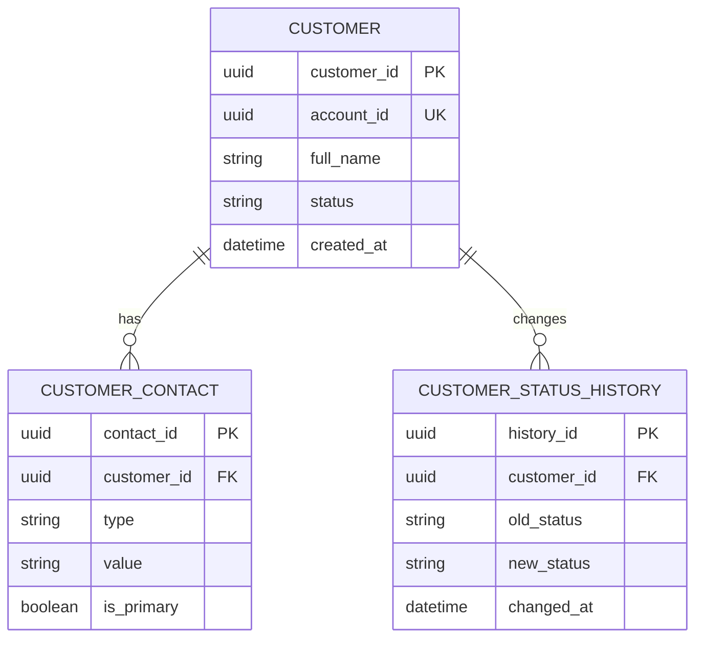
```mermaid
erDiagram
    CUSTOMER {
        uuid customer_id PK
        uuid account_id UK
        string full_name
        string status
        datetime created_at
    }

    CUSTOMER_CONTACT {
        uuid contact_id PK
        uuid customer_id FK
        string type
        string value
        boolean is_primary
    }

    CUSTOMER_STATUS_HISTORY {
        uuid history_id PK
        uuid customer_id FK
        string old_status
        string new_status
        datetime changed_at
    }

    CUSTOMER ||--o{ CUSTOMER_CONTACT : has
    CUSTOMER ||--o{ CUSTOMER_STATUS_HISTORY : changes
```

## 4.10. Database Type

**Khuyến nghị: PostgreSQL/MySQL**

Lý do:

- Customer có quan hệ với contact và status history.
- Cần unique constraint và validation tốt.
- Dữ liệu hồ sơ thay đổi không quá nhanh, cần tính nhất quán hơn tốc độ ghi cực lớn.
- Query thường theo `customer_id`, `account_id`, `phone`, `status`.

## 4.11. Domain Events

```text
CustomerProfileCreated
CustomerUpdated
CustomerSuspended
CustomerReactivated
```

---

# 5. BC03 – Driver & Fleet

## 5.1. BC làm gì?

Quản lý:

- Driver Profile.
- Driver Status.
- Availability.
- Vehicle.
- Vehicle Type.
- Vehicle đang active.

Không quyết định Driver nào được nhận chuyến; đó là Dispatch.

## 5.2. FR liên quan

```text
FR03 – Cập nhật thông tin Driver
FR50 – Quản lý tài xế
FR51 – Quản lý phương tiện
```

Phối hợp:

```text
FR12, FR13, FR15, FR30, FR52
```

## 5.3. Business Process / Workflow

**BP03, BP04, BP08**

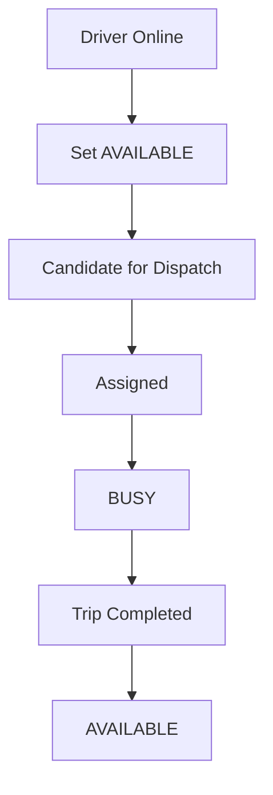
```mermaid
flowchart TD
    A[Driver Online] --> B[Set AVAILABLE]
    B --> C[Candidate for Dispatch]
    C --> D[Assigned]
    D --> E[BUSY]
    E --> F[Trip Completed]
    F --> G[AVAILABLE]
```

## 5.4. Ubiquitous Language

```text
Driver
Driver Profile
Driver Status
Availability
Vehicle
Vehicle Type
Active Vehicle
```

## 5.5. Aggregate

```text
Driver
Vehicle
```

## 5.6. Microservice

```text
driver-fleet-service
```

## 5.7. API chính

| Method | Endpoint |
|---|---|
| POST | `/api/v1/drivers` |
| GET | `/api/v1/drivers/{id}` |
| PATCH | `/api/v1/drivers/{id}` |
| POST | `/api/v1/drivers/{id}/available` |
| POST | `/api/v1/drivers/{id}/offline` |
| POST | `/api/v1/drivers/{id}/busy` |
| POST | `/api/v1/drivers/{id}/release` |
| GET | `/api/v1/drivers?status=AVAILABLE&vehicleType=...` |
| POST | `/api/v1/vehicles` |
| PATCH | `/api/v1/vehicles/{id}` |
| GET | `/api/v1/vehicle-types` |

## 5.8. Database

```text
driver_fleet_db
```

Tables:

```text
drivers
vehicles
vehicle_types
driver_status_history
```

## 5.9. ERD

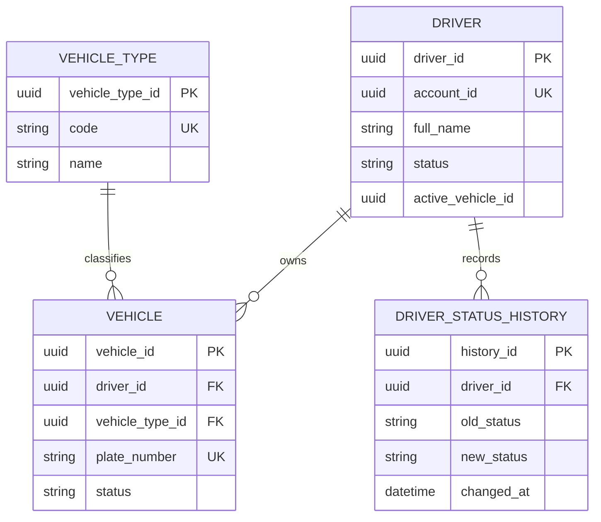
```mermaid
erDiagram
    DRIVER {
        uuid driver_id PK
        uuid account_id UK
        string full_name
        string status
        uuid active_vehicle_id
    }

    VEHICLE_TYPE {
        uuid vehicle_type_id PK
        string code UK
        string name
    }

    VEHICLE {
        uuid vehicle_id PK
        uuid driver_id FK
        uuid vehicle_type_id FK
        string plate_number UK
        string status
    }

    DRIVER_STATUS_HISTORY {
        uuid history_id PK
        uuid driver_id FK
        string old_status
        string new_status
        datetime changed_at
    }

    DRIVER ||--o{ VEHICLE : owns
    VEHICLE_TYPE ||--o{ VEHICLE : classifies
    DRIVER ||--o{ DRIVER_STATUS_HISTORY : records
```

## 5.10. Database Type

**Khuyến nghị: PostgreSQL/MySQL**

Lý do:

- Driver–Vehicle–VehicleType có quan hệ rõ ràng.
- Plate number, accountId cần unique constraint.
- Trạng thái Driver cần cập nhật nhất quán để tránh cùng lúc nhận nhiều Trip.
- Có thể index mạnh trên `status`, `vehicle_type_id`.

Có thể dùng `Redis` bổ trợ để cache tập Driver `AVAILABLE`, nhưng source of truth vẫn nên là SQL database.

## 5.11. Domain Events

```text
DriverBecameAvailable
DriverWentOffline
DriverBecameBusy
DriverReleased
VehicleRegistered
VehicleActivated
```

---

# 6. BC04 – Booking

## 6.1. BC làm gì?

Quản lý yêu cầu đặt xe trước khi trở thành Trip:

- Pickup.
- Destination.
- Vehicle Type.
- Validate Booking.
- Create Booking.
- Cancel Booking.
- Booking Status.

## 6.2. FR liên quan

```text
FR05 – Xác định điểm đón
FR06 – Xác định điểm đến
FR07 – Chọn loại xe
FR08 – Tạo yêu cầu đặt xe
FR09 – Kiểm tra thông tin
FR10 – Hủy yêu cầu
```

## 6.3. Business Process / Workflow

**BP02 – Đặt xe**

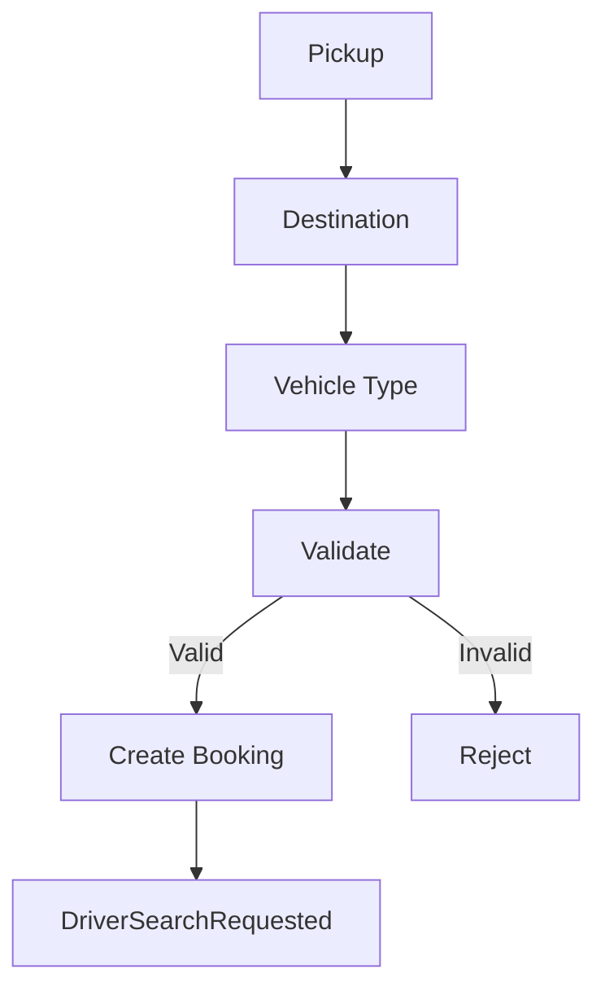
```mermaid
flowchart TD
    A[Pickup] --> B[Destination]
    B --> C[Vehicle Type]
    C --> D[Validate]
    D -->|Valid| E[Create Booking]
    E --> F[DriverSearchRequested]
    D -->|Invalid| G[Reject]
```

## 6.4. Ubiquitous Language

```text
Booking
Pickup
Destination
Requested Vehicle Type
Booking Status
Cancel Booking
```

## 6.5. Aggregate

```text
Booking
```

Status:

```text
CREATED
SEARCHING_DRIVER
DRIVER_ASSIGNED
CANCELLED
NO_DRIVER_FOUND
CONVERTED_TO_TRIP
```

## 6.6. Microservice

```text
booking-service
```

## 6.7. API chính

| Method | Endpoint |
|---|---|
| POST | `/api/v1/bookings/validate` |
| POST | `/api/v1/bookings` |
| GET | `/api/v1/bookings/{id}` |
| POST | `/api/v1/bookings/{id}/cancel` |
| GET | `/api/v1/customers/{customerId}/bookings` |

## 6.8. Database

```text
booking_db
```

Tables:

```text
bookings
booking_status_history
```

## 6.9. ERD

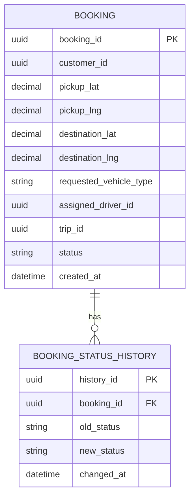
```mermaid
erDiagram
    BOOKING {
        uuid booking_id PK
        uuid customer_id
        decimal pickup_lat
        decimal pickup_lng
        decimal destination_lat
        decimal destination_lng
        string requested_vehicle_type
        uuid assigned_driver_id
        uuid trip_id
        string status
        datetime created_at
    }

    BOOKING_STATUS_HISTORY {
        uuid history_id PK
        uuid booking_id FK
        string old_status
        string new_status
        datetime changed_at
    }

    BOOKING ||--o{ BOOKING_STATUS_HISTORY : has
```

## 6.10. Database Type

**Khuyến nghị: PostgreSQL/MySQL**

Lý do:

- Booking có state transition rõ ràng.
- Cần transaction và consistency khi cancel/assign.
- Query nhiều theo `customer_id`, `status`, `created_at`.
- Booking là transactional data nên SQL phù hợp hơn document store.

## 6.11. Domain Events

```text
BookingCreated
BookingCancelled
DriverSearchRequested
DriverAssignedToBooking
NoDriverFound
```

---

# 7. BC05 – Dispatch

## 7.1. BC làm gì?

Tự động tìm và phân công Driver:

- Candidate Pool.
- Filter.
- Rank.
- Offer.
- Accept/Reject.
- Timeout.
- Retry Driver khác.
- Assignment.

## 7.2. FR liên quan

```text
FR12 – Tìm tài xế
FR13 – Lọc loại xe
FR15 – Lọc trạng thái
FR16 – Xếp hạng
FR17 – Gửi yêu cầu nhận chuyến
FR18 – Driver từ chối
FR19 – Driver không phản hồi
FR21 – Nhận chuyến
FR22 – Từ chối chuyến
```

Phối hợp:

```text
FR11, FR14, FR20, FR45
```

## 7.3. Business Process / Workflow

**BP03 – Tìm và phân công tài xế**

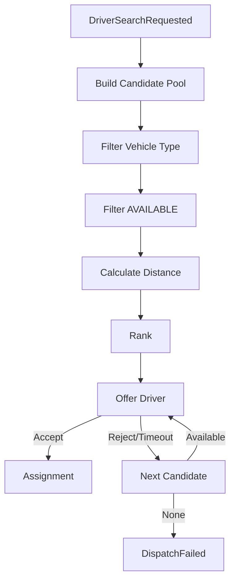
```mermaid
flowchart TD
    A[DriverSearchRequested] --> B[Build Candidate Pool]
    B --> C[Filter Vehicle Type]
    C --> D[Filter AVAILABLE]
    D --> E[Calculate Distance]
    E --> F[Rank]
    F --> G[Offer Driver]

    G -->|Accept| H[Assignment]
    G -->|Reject/Timeout| I[Next Candidate]
    I -->|Available| G
    I -->|None| J[DispatchFailed]
```

## 7.4. Ubiquitous Language

```text
Candidate
Candidate Pool
Rank
Offer
Accept
Reject
Timeout
Assignment
Dispatch Attempt
```

## 7.5. Aggregate

```text
Dispatch
├── DriverOffer
└── Assignment
```

## 7.6. Microservice

```text
dispatch-service
```

## 7.7. API chính

| Method | Endpoint |
|---|---|
| POST | `/internal/v1/dispatches` |
| GET | `/api/v1/dispatches/{id}` |
| GET | `/api/v1/drivers/{driverId}/offers` |
| POST | `/api/v1/offers/{id}/accept` |
| POST | `/api/v1/offers/{id}/reject` |
| POST | `/internal/v1/offers/{id}/expire` |

## 7.8. Database

```text
dispatch_db
```

Tables:

```text
dispatches
dispatch_candidates
driver_offers
assignments
```

## 7.9. ERD

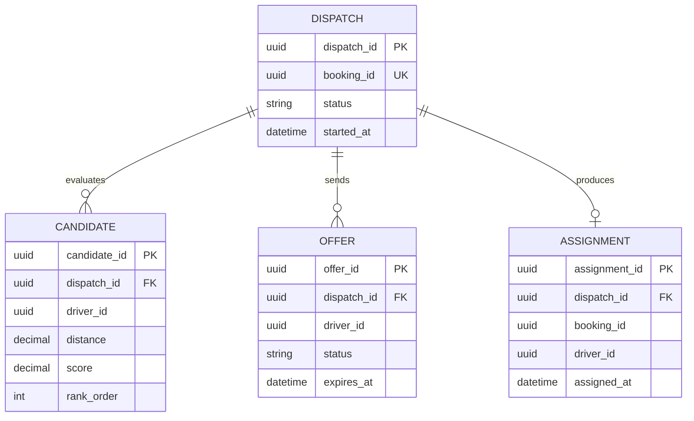
```mermaid
erDiagram
    DISPATCH {
        uuid dispatch_id PK
        uuid booking_id UK
        string status
        datetime started_at
    }

    CANDIDATE {
        uuid candidate_id PK
        uuid dispatch_id FK
        uuid driver_id
        decimal distance
        decimal score
        int rank_order
    }

    OFFER {
        uuid offer_id PK
        uuid dispatch_id FK
        uuid driver_id
        string status
        datetime expires_at
    }

    ASSIGNMENT {
        uuid assignment_id PK
        uuid dispatch_id FK
        uuid booking_id
        uuid driver_id
        datetime assigned_at
    }

    DISPATCH ||--o{ CANDIDATE : evaluates
    DISPATCH ||--o{ OFFER : sends
    DISPATCH ||--o| ASSIGNMENT : produces
```

## 7.10. Database Type

**Khuyến nghị: PostgreSQL**

Lý do:

- Assignment phải đảm bảo một Booking không bị gán cho hai Driver.
- Offer cần transaction/locking hoặc unique constraint để tránh race condition.
- Candidate/Offer có quan hệ chặt với Dispatch.

**Redis có thể dùng bổ trợ** cho:

- Queue Candidate.
- TTL của Offer.
- Cache Driver available.

Redis phù hợp dữ liệu sống ngắn và timeout nhanh, nhưng Assignment cuối cùng vẫn nên ghi vào PostgreSQL.

## 7.11. Domain Events

```text
DispatchStarted
TripOfferedToDriver
DriverAcceptedOffer
DriverRejectedOffer
OfferExpired
DriverAssigned
DispatchFailed
```

---

# 8. BC06 – Geo & Routing

## 8.1. BC làm gì?

Quản lý:

- Driver Location.
- Distance.
- ETA.
- Route.
- Chuẩn hóa dữ liệu Map/GPS Provider.

## 8.2. FR liên quan

```text
FR11 – Xác định vị trí Driver
FR28 – Cập nhật vị trí
FR31 – Theo dõi vị trí
FR32 – ETA
```

Phối hợp:

```text
FR05, FR06, FR14, FR16
```

## 8.3. Business Process / Workflow

**BP03, BP04, BP05**

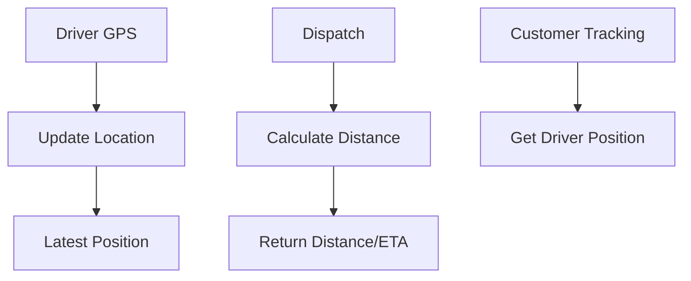
```mermaid
flowchart TD
    A[Driver GPS] --> B[Update Location]
    B --> C[Latest Position]

    D[Dispatch] --> E[Calculate Distance]
    E --> F[Return Distance/ETA]

    G[Customer Tracking] --> H[Get Driver Position]
```

## 8.4. Ubiquitous Language

```text
GeoPoint
Driver Position
Distance
ETA
Route
Location Snapshot
```

## 8.5. Aggregate

```text
DriverLocation
```

## 8.6. Microservice

```text
geo-service
```

## 8.7. API chính

| Method | Endpoint |
|---|---|
| PUT | `/api/v1/drivers/{id}/location` |
| GET | `/api/v1/drivers/{id}/location` |
| POST | `/internal/v1/geo/distance` |
| POST | `/internal/v1/geo/eta` |
| POST | `/internal/v1/geo/routes` |

## 8.8. Database

```text
geo_db
```

Collections/Tables:

```text
driver_latest_locations
driver_location_history
route_cache
```

## 8.9. ERD

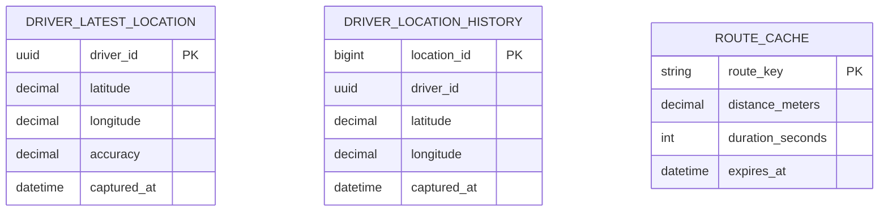
```mermaid
erDiagram
    DRIVER_LATEST_LOCATION {
        uuid driver_id PK
        decimal latitude
        decimal longitude
        decimal accuracy
        datetime captured_at
    }

    DRIVER_LOCATION_HISTORY {
        bigint location_id PK
        uuid driver_id
        decimal latitude
        decimal longitude
        datetime captured_at
    }

    ROUTE_CACHE {
        string route_key PK
        decimal distance_meters
        int duration_seconds
        datetime expires_at
    }
```

## 8.10. Database Type

**Khuyến nghị: PostgreSQL + PostGIS kết hợp Redis**

Lý do:

- PostGIS hỗ trợ query geospatial như bán kính, nearest point, distance.
- Driver location cập nhật thường xuyên, cần spatial index.
- `Redis GEO` có thể dùng cho vị trí mới nhất và truy vấn Driver gần rất nhanh.
- Route/ETA cache có thể lưu Redis với TTL.
- Location history dài hạn vẫn nên lưu PostgreSQL/PostGIS.

Nếu chỉ cần prototype đơn giản, PostgreSQL/PostGIS một mình là đủ.

## 8.11. Domain Events

```text
DriverPositionUpdated
RouteResolved
EtaCalculated
```

---

# 9. BC07 – Trip

## 9.1. BC làm gì?

Quản lý vòng đời chuyến thực tế:

```text
ASSIGNED
→ ARRIVED
→ PICKED_UP
→ IN_PROGRESS
→ COMPLETED
```

## 9.2. FR liên quan

```text
FR23 – Cập nhật trạng thái chuyến
FR24 – Driver đã đến
FR25 – Đã đón khách
FR26 – Đang di chuyển
FR27 – Hoàn thành
FR29 – Theo dõi trạng thái
FR30 – Xem Driver
FR33 – Lịch sử chuyến
```

## 9.3. Business Process / Workflow

**BP04, BP05, BP08**

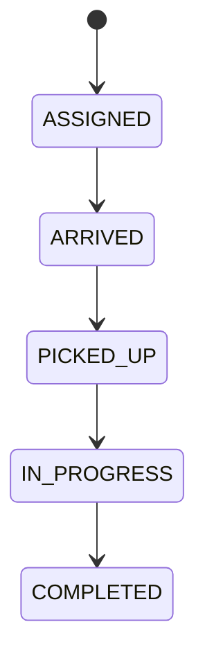
```mermaid
stateDiagram-v2
    [*] --> ASSIGNED
    ASSIGNED --> ARRIVED
    ARRIVED --> PICKED_UP
    PICKED_UP --> IN_PROGRESS
    IN_PROGRESS --> COMPLETED
```

## 9.4. Ubiquitous Language

```text
Trip
Assigned Driver
Arrived
Picked Up
In Progress
Completed
Trip Timeline
Trip Incident
```

## 9.5. Aggregate

```text
Trip
```

## 9.6. Microservice

```text
trip-service
```

## 9.7. API chính

| Method | Endpoint |
|---|---|
| POST | `/internal/v1/trips` |
| GET | `/api/v1/trips/{id}` |
| POST | `/api/v1/trips/{id}/arrive` |
| POST | `/api/v1/trips/{id}/pickup` |
| POST | `/api/v1/trips/{id}/start` |
| POST | `/api/v1/trips/{id}/complete` |
| POST | `/api/v1/trips/{id}/incidents` |
| GET | `/api/v1/customers/{id}/trips` |

## 9.8. Database

```text
trip_db
```

Tables:

```text
trips
trip_status_history
trip_incidents
```

## 9.9. ERD

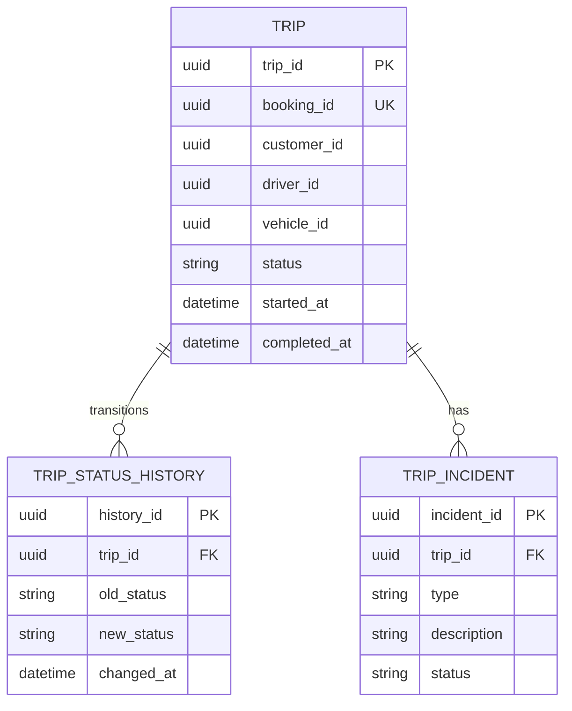
```mermaid
erDiagram
    TRIP {
        uuid trip_id PK
        uuid booking_id UK
        uuid customer_id
        uuid driver_id
        uuid vehicle_id
        string status
        datetime started_at
        datetime completed_at
    }

    TRIP_STATUS_HISTORY {
        uuid history_id PK
        uuid trip_id FK
        string old_status
        string new_status
        datetime changed_at
    }

    TRIP_INCIDENT {
        uuid incident_id PK
        uuid trip_id FK
        string type
        string description
        string status
    }

    TRIP ||--o{ TRIP_STATUS_HISTORY : transitions
    TRIP ||--o{ TRIP_INCIDENT : has
```

## 9.10. Database Type

**Khuyến nghị: PostgreSQL/MySQL**

Lý do:

- Trip là transactional aggregate quan trọng.
- State transition cần consistency.
- BookingId nên unique để tránh tạo hai Trip cho một Booking.
- Query nhiều theo `driver_id`, `customer_id`, `status`, `completed_at`.

Nếu cần lưu trace GPS dày đặc, không nên nhét toàn bộ vào `trip_db`; dữ liệu GPS nên để Geo Service quản lý.

## 9.11. Domain Events

```text
TripCreated
DriverArrived
CustomerPickedUp
TripStarted
TripCompleted
TripIncidentReported
```

---

# 10. BC08 – Pricing

## 10.1. BC làm gì?

Tính cước từ dữ liệu Trip:

```text
Trip
+
Pricing Rule
=
Fare
```

Không xử lý việc thu tiền.

## 10.2. FR liên quan

```text
FR34 – Tính cước chuyến đi
```

## 10.3. Business Process / Workflow

**BP06 – Tính cước và thanh toán**

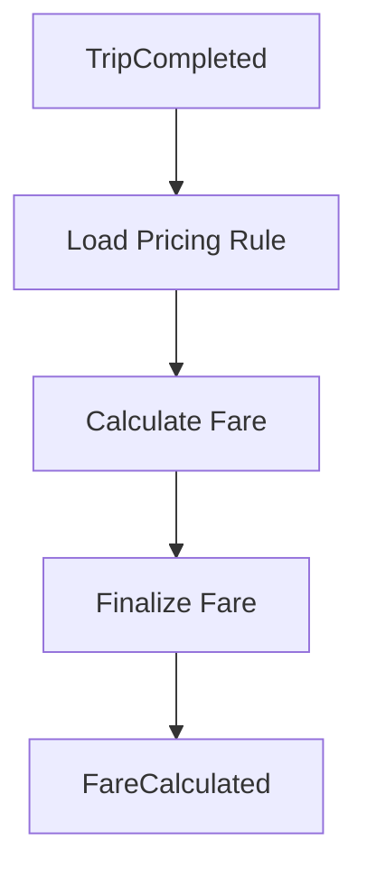
```mermaid
flowchart TD
    A[TripCompleted] --> B[Load Pricing Rule]
    B --> C[Calculate Fare]
    C --> D[Finalize Fare]
    D --> E[FareCalculated]
```

## 10.4. Ubiquitous Language

```text
Fare
Pricing Rule
Base Fare
Distance Charge
Time Charge
Fare Component
Money
```

## 10.5. Aggregate

```text
Fare
PricingRule
```

## 10.6. Microservice

```text
pricing-service
```

## 10.7. API chính

| Method | Endpoint |
|---|---|
| POST | `/internal/v1/fares/calculate` |
| GET | `/api/v1/fares/{id}` |
| GET | `/api/v1/trips/{tripId}/fare` |
| GET | `/api/v1/pricing-rules` |
| POST | `/api/v1/pricing-rules` |
| PATCH | `/api/v1/pricing-rules/{id}` |

## 10.8. Database

```text
pricing_db
```

Tables:

```text
pricing_rules
fares
fare_components
```

## 10.9. ERD

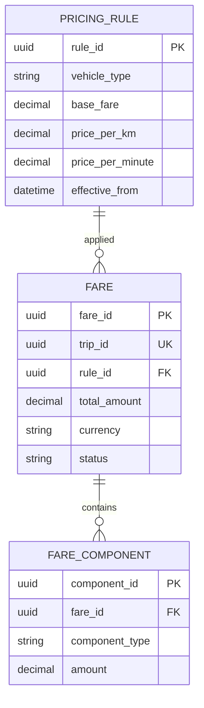
```mermaid
erDiagram
    PRICING_RULE {
        uuid rule_id PK
        string vehicle_type
        decimal base_fare
        decimal price_per_km
        decimal price_per_minute
        datetime effective_from
    }

    FARE {
        uuid fare_id PK
        uuid trip_id UK
        uuid rule_id FK
        decimal total_amount
        string currency
        string status
    }

    FARE_COMPONENT {
        uuid component_id PK
        uuid fare_id FK
        string component_type
        decimal amount
    }

    PRICING_RULE ||--o{ FARE : applied
    FARE ||--o{ FARE_COMPONENT : contains
```

## 10.10. Database Type

**Khuyến nghị: PostgreSQL/MySQL**

Lý do:

- Pricing Rule có version/effective date.
- Fare và Fare Component có quan hệ chặt.
- Tiền tệ yêu cầu precision và transaction tốt.
- Không phù hợp với eventual consistency cho kết quả cước cuối cùng.

## 10.11. Domain Events

```text
FareCalculated
FareCalculationFailed
```

---

# 11. BC09 – Payment

## 11.1. BC làm gì?

Quản lý:

- Payment.
- Payment Method.
- Transaction.
- Electronic Provider.
- Callback.
- Retry.
- Payment Status.

## 11.2. FR liên quan

```text
FR35 – Chọn phương thức thanh toán
FR36 – Thanh toán điện tử
FR37 – Ghi nhận kết quả
FR38 – Xử lý thất bại
FR55 – Tra cứu giao dịch
```

## 11.3. Business Process / Workflow

**BP06, BP08**

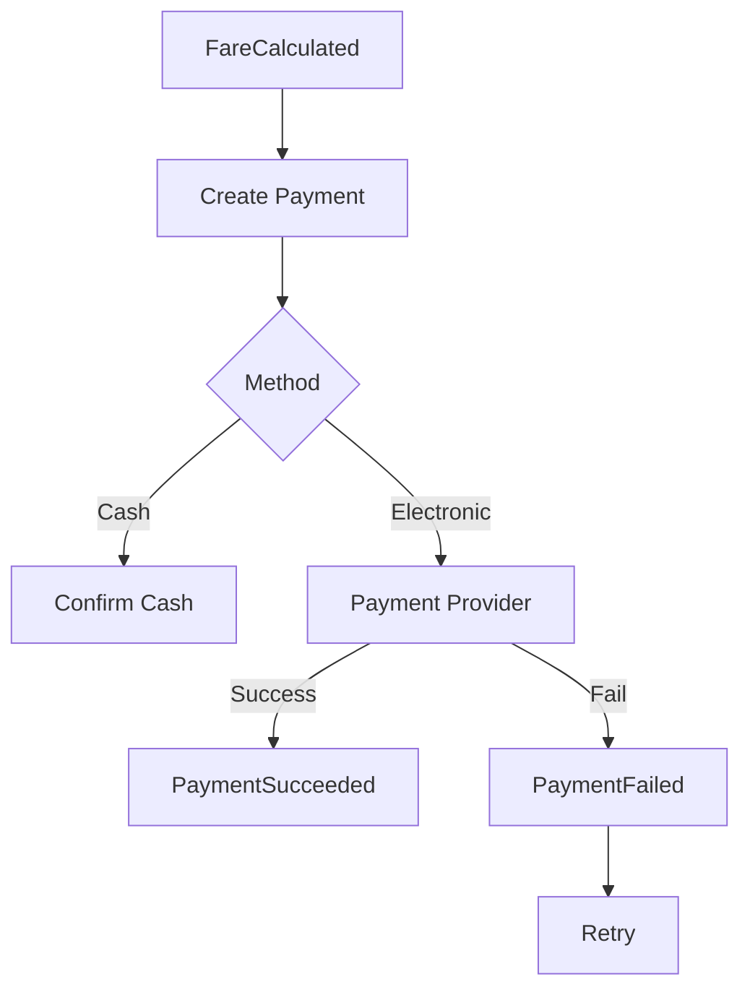
```mermaid
flowchart TD
    A[FareCalculated] --> B[Create Payment]
    B --> C{Method}
    C -->|Cash| D[Confirm Cash]
    C -->|Electronic| E[Payment Provider]
    E -->|Success| F[PaymentSucceeded]
    E -->|Fail| G[PaymentFailed]
    G --> H[Retry]
```

## 11.4. Ubiquitous Language

```text
Payment
Payment Method
Transaction
Payment Status
Provider Reference
Retry
```

## 11.5. Aggregate

```text
Payment
├── Transaction
└── PaymentAttempt
```

## 11.6. Microservice

```text
payment-service
```

## 11.7. API chính

| Method | Endpoint |
|---|---|
| POST | `/api/v1/payments` |
| GET | `/api/v1/payments/{id}` |
| POST | `/api/v1/payments/{id}/cash/confirm` |
| POST | `/api/v1/payments/{id}/electronic` |
| POST | `/api/v1/payments/{id}/retry` |
| POST | `/api/v1/payment-provider/callback` |
| GET | `/api/v1/transactions` |

## 11.8. Database

```text
payment_db
```

Tables:

```text
payments
payment_transactions
payment_attempts
provider_callbacks
```

## 11.9. ERD

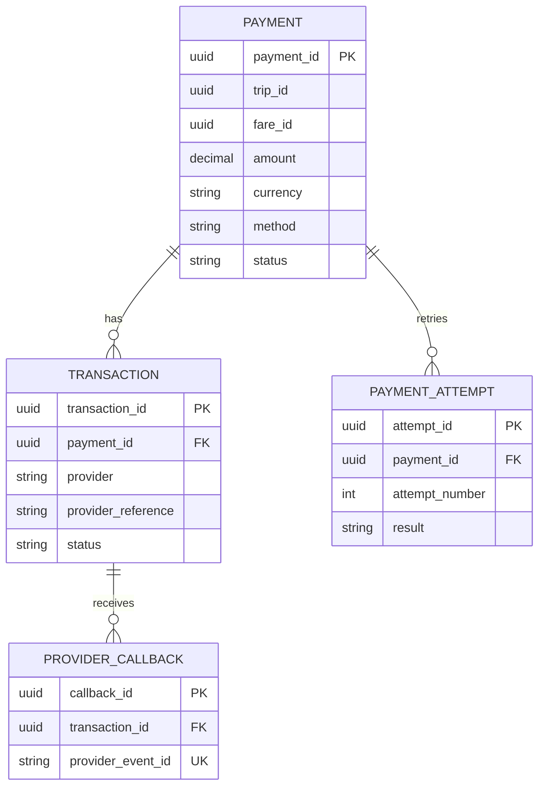
```mermaid
erDiagram
    PAYMENT {
        uuid payment_id PK
        uuid trip_id
        uuid fare_id
        decimal amount
        string currency
        string method
        string status
    }

    TRANSACTION {
        uuid transaction_id PK
        uuid payment_id FK
        string provider
        string provider_reference
        string status
    }

    PAYMENT_ATTEMPT {
        uuid attempt_id PK
        uuid payment_id FK
        int attempt_number
        string result
    }

    PROVIDER_CALLBACK {
        uuid callback_id PK
        uuid transaction_id FK
        string provider_event_id UK
    }

    PAYMENT ||--o{ TRANSACTION : has
    PAYMENT ||--o{ PAYMENT_ATTEMPT : retries
    TRANSACTION ||--o{ PROVIDER_CALLBACK : receives
```

## 11.10. Database Type

**Khuyến nghị: PostgreSQL hoặc Microsoft SQL Server**

Lý do:

- Payment cần ACID mạnh.
- Amount, status và provider callback phải nhất quán.
- Cần unique constraint để chống xử lý callback trùng.
- Query transaction/audit thường theo thời gian và trạng thái.
- SQL Server phù hợp nếu hệ thống triển khai trong hệ sinh thái Microsoft; PostgreSQL phù hợp cho kiến trúc mở và microservice.

Không dùng MongoDB làm primary store cho payment vì tính nhất quán và quan hệ giao dịch quan trọng hơn schema linh hoạt.

## 11.11. Domain Events

```text
PaymentCreated
PaymentSucceeded
PaymentFailed
PaymentRetryRequested
```

---

# 12. BC10 – Notification

## 12.1. BC làm gì?

Nhận Event từ BC khác và gửi thông báo:

- Push.
- SMS.
- Email.
- In-app.

Không quyết định business rule của Booking/Trip/Payment.

## 12.2. FR liên quan

```text
FR20 – Không tìm thấy Driver
FR40 – Booking created
FR41 – Driver nhận chuyến
FR42 – Driver đến
FR43 – Hoàn thành Trip
FR44 – Kết quả Payment
FR45 – Chuyến mới cho Driver
```

## 12.3. Business Process / Workflow

**BP07 – Gửi và quản lý thông báo**

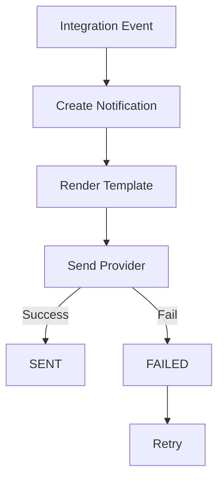
```mermaid
flowchart TD
    A[Integration Event] --> B[Create Notification]
    B --> C[Render Template]
    C --> D[Send Provider]
    D -->|Success| E[SENT]
    D -->|Fail| F[FAILED]
    F --> G[Retry]
```

## 12.4. Ubiquitous Language

```text
Notification
Recipient
Channel
Template
Delivery
Delivery Status
```

## 12.5. Aggregate

```text
Notification
├── Delivery
└── Template Reference
```

## 12.6. Microservice

```text
notification-service
```

## 12.7. API chính

| Method | Endpoint |
|---|---|
| POST | `/internal/v1/notifications` |
| GET | `/api/v1/notifications/me` |
| POST | `/api/v1/notifications/{id}/read` |
| POST | `/internal/v1/notifications/{id}/retry` |

## 12.8. Database

```text
notification_db
```

Collections:

```text
notifications
notification_deliveries
notification_templates
```

## 12.9. ERD

```mermaid
erDiagram
    NOTIFICATION {
        uuid notification_id PK
        uuid recipient_id
        string recipient_type
        string event_type
        string title
        string body
        datetime created_at
    }

    DELIVERY {
        uuid delivery_id PK
        uuid notification_id
        string channel
        string provider
        string status
        int retry_count
    }

    TEMPLATE {
        uuid template_id PK
        string event_type
        string channel
        string template_body
    }
```

## 12.10. Database Type

**Khuyến nghị: MongoDB**

Lý do:

- Notification là dữ liệu dạng document.
- Nội dung từng loại notification có thể khác nhau.
- Schema thay đổi linh hoạt theo channel/template.
- Query chủ yếu theo `recipient_id`, `created_at`, `read_at`.
- Quan hệ giữa các entity không quá chặt.

Có thể dùng `Redis` cho queue/retry/TTL tạm thời, nhưng lịch sử Notification nên lưu MongoDB.

## 12.11. Domain Events

```text
NotificationCreated
NotificationSent
NotificationDeliveryFailed
```

---

# 13. BC11 – Reputation

## 13.1. BC làm gì?

Quản lý Rating và Feedback sau Trip.

## 13.2. FR liên quan

```text
FR39 – Tạo đánh giá tài xế
```

## 13.3. Business Process / Workflow

Workflow hậu chuyến:

```mermaid
flowchart TD
    A[TripCompleted] --> B[Check Eligibility]
    B -->|Valid| C[Submit Rating]
    B -->|Invalid| D[Reject]
    C --> E[DriverRated]
```

## 13.4. Ubiquitous Language

```text
Rating
Review
Rated Trip
Rated Driver
Rating Eligibility
```

## 13.5. Aggregate

```text
DriverRating
```

## 13.6. Microservice

```text
reputation-service
```

## 13.7. API chính

| Method | Endpoint |
|---|---|
| GET | `/api/v1/trips/{tripId}/rating-eligibility` |
| POST | `/api/v1/ratings` |
| GET | `/api/v1/drivers/{driverId}/ratings` |
| GET | `/api/v1/drivers/{driverId}/rating-summary` |

## 13.8. Database

```text
reputation_db
```

Collections/Tables:

```text
driver_ratings
driver_rating_summary
```

## 13.9. ERD

```mermaid
erDiagram
    DRIVER_RATING {
        uuid rating_id PK
        uuid trip_id UK
        uuid customer_id
        uuid driver_id
        int score
        string comment
        datetime created_at
    }

    DRIVER_RATING_SUMMARY {
        uuid driver_id PK
        decimal average_score
        int rating_count
    }
```

## 13.10. Database Type

**Khuyến nghị: MongoDB hoặc PostgreSQL**

Nếu ưu tiên đơn giản và quan hệ chặt với `trip_id`, dùng PostgreSQL.

Nếu muốn lưu review linh hoạt, metadata/moderation fields có thể thay đổi theo thời gian và đọc nhiều hơn ghi, MongoDB phù hợp.

Với CAB System hiện tại, **PostgreSQL là lựa chọn an toàn hơn** vì một Trip chỉ có một Rating và cần unique constraint rõ ràng.

## 13.11. Domain Events

```text
DriverRated
RatingRejected
```

---

# 14. BC12 – Operations

## 14.1. BC làm gì?

Hỗ trợ Operator:

- Dashboard.
- Theo dõi Trip đang chạy.
- Operational Case.
- Incident.
- Intervention.

Không sửa trực tiếp database của BC khác.

## 14.2. FR liên quan

```text
FR52 – Theo dõi chuyến đang diễn ra
FR53 – Hỗ trợ xử lý chuyến lỗi
```

Phối hợp:

```text
FR46–FR51
FR55
FR59
```

## 14.3. Business Process / Workflow

**BP08 – Quản lý vận hành**

```mermaid
flowchart TD
    A[Domain Events] --> B[Operations Projection]
    B --> C[Dashboard]
    C --> D[Open Case]
    D --> E[Intervention]
    E --> F[Call Owner Service]
    F --> G[Record Result]
```

## 14.4. Ubiquitous Language

```text
Operations Dashboard
Active Trip View
Incident
Operational Case
Intervention
```

## 14.5. Aggregate

```text
OperationalCase
```

## 14.6. Microservice

```text
operations-service
```

## 14.7. API chính

| Method | Endpoint |
|---|---|
| GET | `/api/v1/operations/dashboard` |
| GET | `/api/v1/operations/active-trips` |
| GET | `/api/v1/operations/incidents` |
| POST | `/api/v1/operations/cases` |
| POST | `/api/v1/operations/cases/{id}/interventions` |
| POST | `/api/v1/operations/cases/{id}/resolve` |

## 14.8. Database

```text
operations_db
```

Collections:

```text
operational_cases
operational_interventions
active_trip_projection
driver_status_projection
payment_status_projection
```

## 14.9. ERD

```mermaid
erDiagram
    OPERATIONAL_CASE {
        uuid case_id PK
        string reference_type
        uuid reference_id
        string incident_type
        string status
        uuid operator_id
    }

    INTERVENTION {
        uuid intervention_id PK
        uuid case_id
        uuid operator_id
        string action_type
        string note
    }

    ACTIVE_TRIP_PROJECTION {
        uuid trip_id PK
        uuid driver_id
        string trip_status
        datetime last_updated_at
    }
```

## 14.10. Database Type

**Khuyến nghị: MongoDB**

Lý do:

- Operations chủ yếu dùng read model/projection.
- Dữ liệu gom từ nhiều BC, cấu trúc không hoàn toàn đồng nhất.
- Dashboard cần đọc nhanh, không cần join quan hệ chặt như source transaction.
- Operational Case có thể chứa metadata khác nhau theo loại incident.

Có thể dùng Redis để cache dashboard nóng hoặc các active trip rất thường xuyên được đọc.

## 14.11. Domain Events

```text
OperationalCaseOpened
OperationalInterventionRecorded
OperationalCaseResolved
```

---

# 15. BC13 – Audit

## 15.1. BC làm gì?

Ghi lại thao tác quan trọng để truy vết:

```text
Ai?
Làm gì?
Với đối tượng nào?
Khi nào?
Kết quả?
```

Audit là append-only.

## 15.2. FR liên quan

```text
FR59 – Audit Log
```

Phối hợp:

```text
FR04, FR49, FR50, FR51, FR53, FR55, FR57, FR58
```

## 15.3. Business Process / Workflow

**BP09 – Ghi nhận và truy vết**

```mermaid
flowchart TD
    A[Auditable Event] --> B[Audit Consumer]
    B --> C[Normalize]
    C --> D[Append Audit Entry]
    D --> E[Authorized Query]
```

## 15.4. Ubiquitous Language

```text
Audit Entry
Actor
Action
Target
Outcome
Trace ID
```

## 15.5. Aggregate

```text
AuditEntry
```

## 15.6. Microservice

```text
audit-service
```

## 15.7. API chính

| Method | Endpoint |
|---|---|
| POST | `/internal/v1/audit-entries` |
| GET | `/api/v1/audit-entries` |
| GET | `/api/v1/audit-entries/{id}` |

## 15.8. Database

```text
audit_db
```

Collection:

```text
audit_entries
```

## 15.9. ERD

```mermaid
erDiagram
    AUDIT_ENTRY {
        uuid audit_id PK
        uuid actor_id
        string actor_type
        string action
        string target_type
        uuid target_id
        string outcome
        string trace_id
        string metadata_json
        datetime occurred_at
    }
```

## 15.10. Database Type

**Khuyến nghị: MongoDB**

Lý do:

- Audit log là append-only.
- Metadata khác nhau theo từng loại event.
- Không cần quan hệ FK chặt.
- Query thường theo thời gian, actor, target, traceId.
- MongoDB phù hợp lưu document/event có cấu trúc linh hoạt.

Nếu khối lượng log cực lớn, có thể chuyển sang Elasticsearch/OpenSearch cho tìm kiếm hoặc object storage để archive dài hạn.

## 15.11. Domain Events

Audit thường là **consumer**, không cần phát nhiều event nghiệp vụ.

Có thể phát:

```text
AuditEntryRecorded
```

---

# 16. BC14 – Reporting

## 16.1. BC làm gì?

Xây read model và KPI cho quản trị:

- Revenue.
- Trip Count.
- Payment Success Rate.
- Customer Count.
- Driver Count.
- Rating KPI.

Không phải source of truth cho transaction.

## 16.2. FR liên quan

```text
FR60 – Xem báo cáo
FR61 – Lọc báo cáo
FR62 – Xem KPI
```

## 16.3. Business Process / Workflow

**BP10 – Báo cáo quản trị**

```mermaid
flowchart TD
    A[Domain Events] --> B[Reporting Consumer]
    B --> C[Build Projection]
    C --> D[Reporting DB]
    D --> E[Filter Period]
    E --> F[Dashboard/KPI]
```

## 16.4. Ubiquitous Language

```text
Reporting Period
KPI
Revenue
Trip Count
Payment Success Rate
Report Snapshot
```

## 16.5. Aggregate / Read Model

```text
DailyTripSummary
DailyRevenueSummary
DailyPaymentSummary
DailyCustomerSummary
DailyDriverSummary
DailyRatingSummary
```

## 16.6. Microservice

```text
reporting-service
```

## 16.7. API chính

| Method | Endpoint |
|---|---|
| GET | `/api/v1/reports/overview` |
| GET | `/api/v1/reports/revenue` |
| GET | `/api/v1/reports/trips` |
| GET | `/api/v1/reports/payments` |
| GET | `/api/v1/reports/customers` |
| GET | `/api/v1/reports/drivers` |
| GET | `/api/v1/reports/kpis` |

## 16.8. Database

```text
reporting_db
```

Collections/Tables:

```text
daily_trip_summary
daily_revenue_summary
daily_payment_summary
daily_customer_summary
daily_driver_summary
daily_rating_summary
```

## 16.9. ERD

```mermaid
erDiagram
    DAILY_TRIP_SUMMARY {
        date report_date PK
        int total_trips
        int completed_trips
    }

    DAILY_REVENUE_SUMMARY {
        date report_date PK
        decimal revenue
        string currency
    }

    DAILY_PAYMENT_SUMMARY {
        date report_date PK
        int successful_payments
        int failed_payments
        decimal success_rate
    }

    DAILY_DRIVER_SUMMARY {
        date report_date PK
        int active_drivers
        int available_drivers
    }

    DAILY_CUSTOMER_SUMMARY {
        date report_date PK
        int active_customers
        int new_customers
    }
```

## 16.10. Database Type

**Khuyến nghị: MongoDB hoặc PostgreSQL**

Nếu báo cáo chủ yếu là dashboard và projection dạng document theo ngày/tháng:

- MongoDB đọc nhanh theo period.
- Schema linh hoạt.
- Không cần quan hệ chặt.

Nếu cần query SQL phức tạp, BI, GROUP BY nhiều chiều:

- PostgreSQL phù hợp hơn.

Với CAB System học thuật hiện tại, **PostgreSQL** dễ tích hợp Power BI/SQL query hơn; nếu muốn nhấn mạnh CQRS/read-model thì có thể chọn **MongoDB**.

## 16.11. Domain Events

Reporting chủ yếu consume:

```text
BookingCreated
DriverAssigned
TripCompleted
FareCalculated
PaymentSucceeded
PaymentFailed
DriverRated
```

---

# 17. Tóm tắt lựa chọn Database

| Microservice | Database Type đề xuất | Lý do chính |
|---|---|---|
| identity-service | PostgreSQL/MySQL | Quan hệ Role/Permission chặt, ACID |
| customer-service | PostgreSQL/MySQL | Hồ sơ + contact + history |
| driver-fleet-service | PostgreSQL/MySQL | Driver–Vehicle quan hệ rõ |
| booking-service | PostgreSQL/MySQL | Transaction và state consistency |
| dispatch-service | PostgreSQL + Redis | Assignment chặt, Offer cần TTL/cache |
| geo-service | PostgreSQL/PostGIS + Redis | Geospatial + vị trí realtime |
| trip-service | PostgreSQL/MySQL | State machine, transaction |
| pricing-service | PostgreSQL/MySQL | Rule + Fare quan hệ chặt |
| payment-service | PostgreSQL/SQL Server | ACID, callback/idempotency |
| notification-service | MongoDB + Redis | Document linh hoạt, queue/cache |
| reputation-service | PostgreSQL | Unique Trip Rating |
| operations-service | MongoDB + Redis | Projection/read model linh hoạt |
| audit-service | MongoDB | Append-only, metadata linh hoạt |
| reporting-service | PostgreSQL hoặc MongoDB | Tùy kiểu BI/query |

---

# 18. Quy tắc giao tiếp giữa Microservice

## 18.1. REST đồng bộ

Dùng khi cần kết quả ngay:

```text
Dispatch -> Driver/Fleet
Dispatch -> Geo
Operations -> Customer
Operations -> Trip
```

## 18.2. Event bất đồng bộ

Dùng khi chỉ cần thông báo:

```text
BookingCreated
DriverAssigned
TripCompleted
FareCalculated
PaymentSucceeded
PaymentFailed
DriverRated
```

## 18.3. Không dùng Distributed Transaction

Ví dụ:

```text
TripCompleted
    ↓
FareCalculated
    ↓
PaymentCreated
```

Nếu Payment thất bại thì không rollback Trip.

---

# 19. Event Bus chính

| Producer | Event | Consumer |
|---|---|---|
| Identity | `AccountRegistered` | Customer/Driver, Audit |
| Booking | `DriverSearchRequested` | Dispatch |
| Dispatch | `DriverAssigned` | Booking, Trip, Notification |
| Dispatch | `DispatchFailed` | Booking, Notification |
| Trip | `TripCompleted` | Pricing, Notification, Reporting |
| Pricing | `FareCalculated` | Payment, Reporting |
| Payment | `PaymentSucceeded` | Notification, Reporting |
| Payment | `PaymentFailed` | Notification, Operations, Reporting |
| Reputation | `DriverRated` | Reporting |
| Operations | `OperationalInterventionRecorded` | Audit |

---

# 20. API Gateway Routing

```text
/auth/**                -> identity-service
/accounts/**            -> identity-service
/customers/**           -> customer-service
/drivers/**             -> driver-fleet-service
/vehicles/**            -> driver-fleet-service
/bookings/**            -> booking-service
/dispatches/**          -> dispatch-service
/offers/**              -> dispatch-service
/geo/**                 -> geo-service
/trips/**               -> trip-service
/fares/**               -> pricing-service
/payments/**            -> payment-service
/transactions/**        -> payment-service
/notifications/**       -> notification-service
/ratings/**             -> reputation-service
/operations/**          -> operations-service
/audit-entries/**       -> audit-service
/reports/**             -> reporting-service
```

---

# 21. Kết luận

CAB System được chia thành 14 Bounded Context:

```text
1. Identity & Access
2. Customer
3. Driver & Fleet
4. Booking
5. Dispatch
6. Geo & Routing
7. Trip
8. Pricing
9. Payment
10. Notification
11. Reputation
12. Operations
13. Audit
14. Reporting
```

Mỗi BC:

```text
Có ngôn ngữ riêng
Có Aggregate riêng
Có Microservice riêng
Có API riêng
Có Database riêng
Có ERD riêng
Có loại Database được chọn theo đặc điểm kỹ thuật
```

Các nhóm dữ liệu được chọn database theo nguyên tắc:

```text
Quan hệ chặt + ACID
    → PostgreSQL / MySQL / SQL Server

Document linh hoạt + đọc nhanh + ít ràng buộc
    → MongoDB

Dữ liệu tạm thời + TTL + cache + realtime
    → Redis

Dữ liệu vị trí / khoảng cách
    → PostgreSQL + PostGIS

Log/Event append-only
    → MongoDB / Elasticsearch tùy quy mô
```

Thiết kế này giữ đúng ranh giới DDD nhưng vẫn đủ thực tế để triển khai CAB System theo Microservice.
