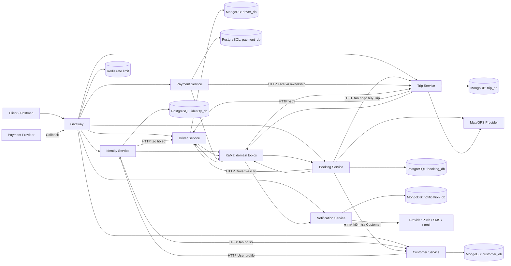
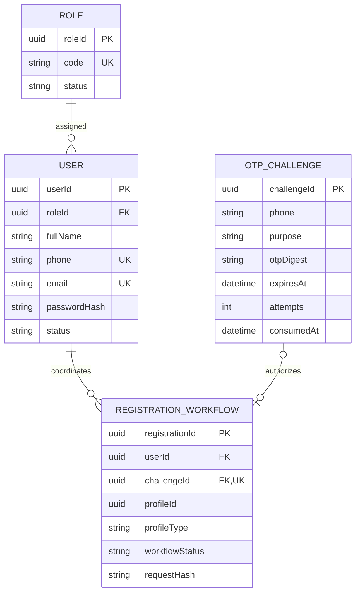
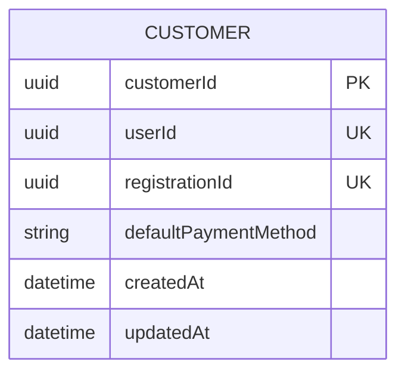
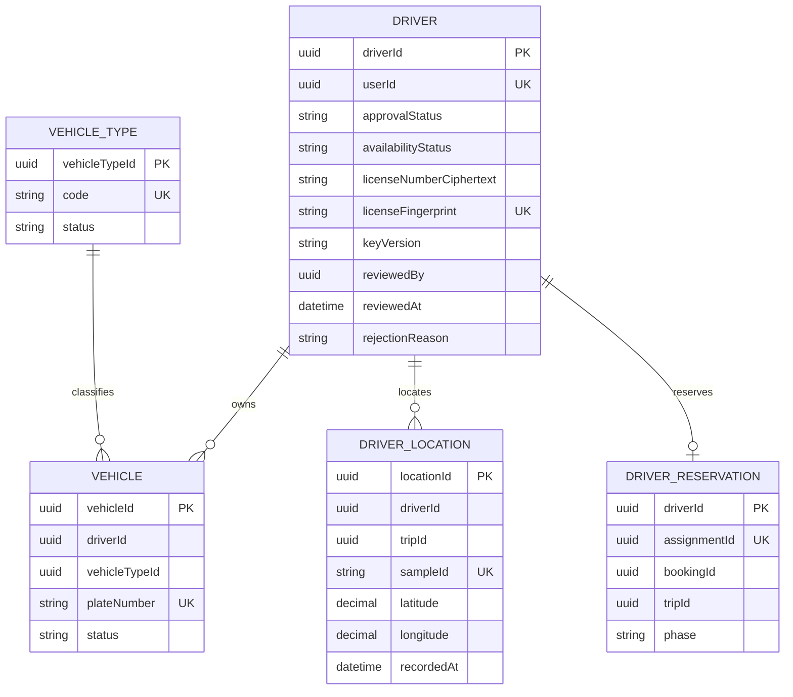
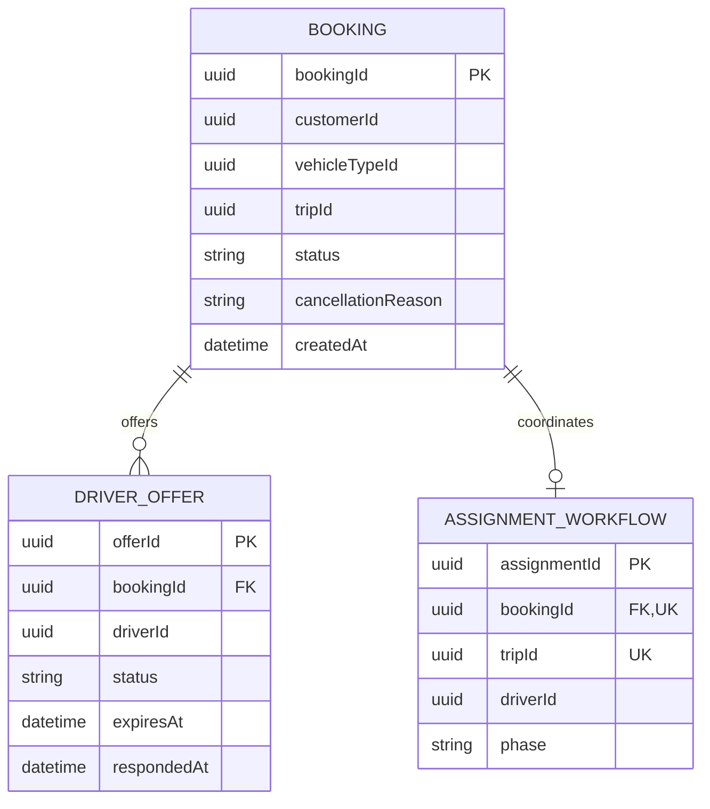
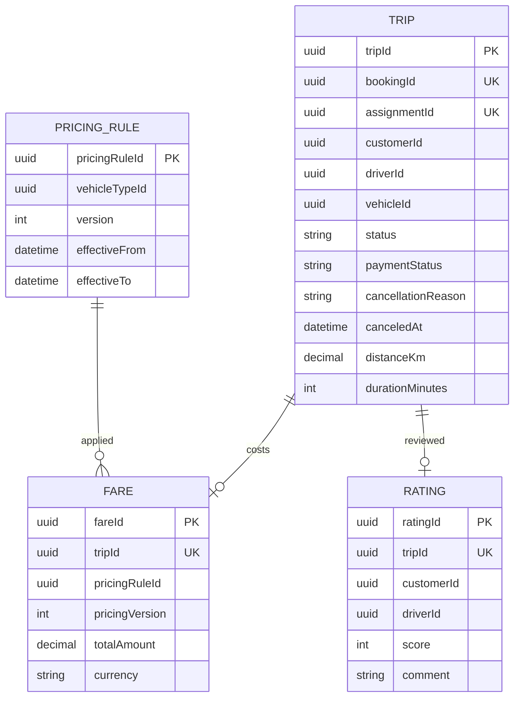
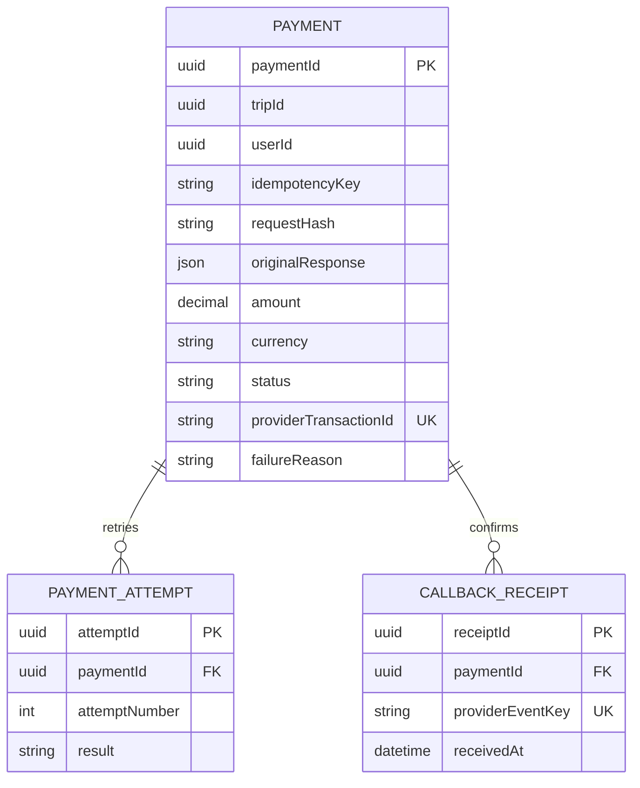
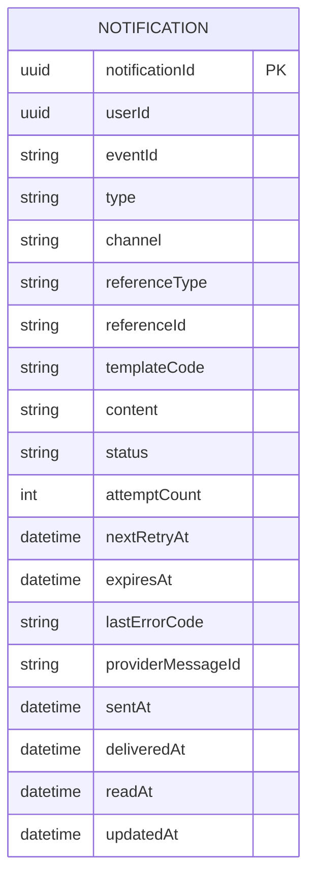
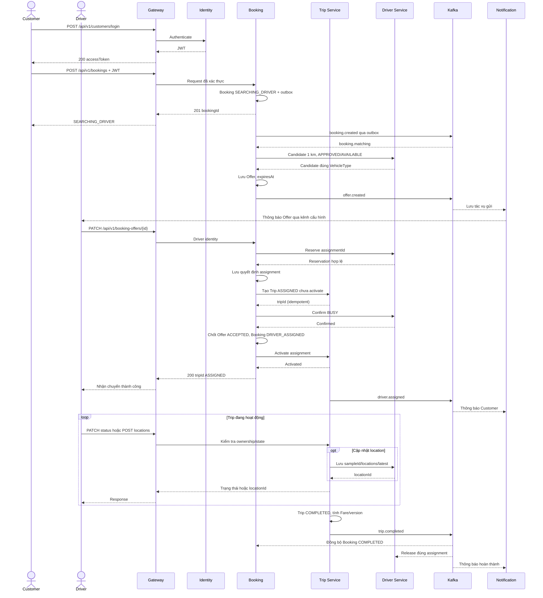
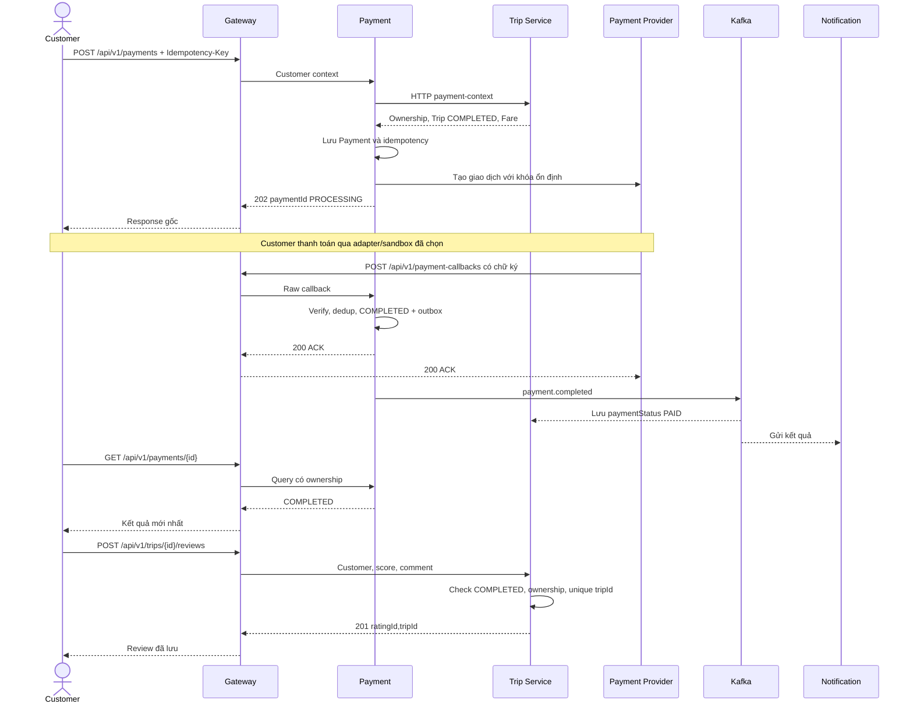

# CAB System – DDD, Bounded Context & Microservice Design

> Căn cứ: [SRS](../requirements/srs.md) và [README](../../README.md), đặc biệt mục II–V và IX–XI. Đây là thiết kế MVP, chưa xác nhận code/API/container đã hoạt động. SRS là nguồn yêu cầu; chi tiết kỹ thuật dưới đây phải giữ tương thích với hợp đồng SRS.

## Mục lục

- [I – Ranh giới miền và triển khai](#i--ranh-giới-miền-và-triển-khai)
- [II – Gateway](#ii--gateway)
- [III – Identity Service](#iii--identity-service)
- [IV – Customer Service](#iv--customer-service)
- [V – Driver Service](#v--driver-service)
- [VI – Booking Service](#vi--booking-service)
- [VII – Trip Service](#vii--trip-service)
- [VIII – Payment Service](#viii--payment-service)
- [IX – Notification Service](#ix--notification-service)
- [X – IPC và nhất quán dữ liệu](#x--ipc-và-nhất-quán-dữ-liệu)
- [XI – Luồng xuyên suốt](#xi--luồng-xuyên-suốt)
- [XII – Hạ tầng, bảo mật và nghiệm thu](#xii--hạ-tầng-bảo-mật-và-nghiệm-thu)

# I – Ranh giới miền và triển khai

## 1.1 Nguyên tắc

MVP có **7 microservice nghiệp vụ**: identity-service, customer-service, driver-service, booking-service, trip-service, payment-service, notification-service; **gateway** là thành phần hạ tầng tiếp nhận request. Theo SRS IX, có **8 container ứng dụng + 4 container hạ tầng**: PostgreSQL, MongoDB, Kafka KRaft, Redis. Identity/Booking/Payment dùng PostgreSQL; Customer/Driver/Trip/Notification dùng MongoDB. Đây là mốc container demo, không phải cấu hình HA.

Bounded context là ranh giới mô hình nghiệp vụ, không bắt buộc là một tiến trình triển khai. Các miền phân tích riêng được đóng gói thành module trong service theo SRS. Module cùng service gọi application interface, không tạo HTTP/event bus cho mọi lời gọi nội bộ.

- Mỗi service sở hữu DB/schema và tài khoản truy cập riêng; không đọc/ghi trực tiếp DB service khác, không FK xuyên DB.
- Transaction cục bộ; liên service dùng idempotency, outbox/inbox và bù/đối soát.
- API ngoài dùng đúng method/path SRS X, không thêm prefix phiên bản vào bộ API nghiệm thu.
- Dùng userId theo SRS; camelCase ở hợp đồng/model MongoDB, snake_case trong SQL nếu có mapping rõ. _id nội bộ không thay ID trong API.
- Không dùng một enum Status chung. Ride = Trip, Review = Rating; hủy là CANCELED, Payment thành công là COMPLETED.
- ERD dưới đây là mô hình logic rút gọn, không yêu cầu entity MongoDB trở thành bảng SQL; PK/UK mô tả định danh/tính duy nhất, quan hệ MongoDB không tự có FK SQL; trường nghiệp vụ đầy đủ và constraint theo SRS IV. Bảng kỹ thuật bổ sung phải được phân biệt với aggregate nghiệp vụ.

## 1.2 Ánh xạ 14 miền phân tích vào service MVP

| Miền / module | Nơi thực thi | Aggregate / dữ liệu | BP đúng theo SRS |
|---|---|---|---|
| Identity & Access | Identity | User, Role, OTP, registration | BP-01, BP-12 |
| Customer | Customer | Customer; fullName/phone/email thuộc User | BP-01, BP-11 |
| Driver & Fleet | Driver | Driver, Vehicle, VehicleType | BP-02, BP-11 |
| Booking | Booking | Booking | BP-03 |
| Dispatch / Matching | Booking | DriverOffer, assignment workflow | BP-04 |
| Geo & Routing | Driver sở hữu location; Booking/Trip dùng Map/GPS adapter | DriverLocation, kết quả distance/ETA | BP-04, BP-06 |
| Trip | Trip | Trip | BP-05, BP-06 |
| Pricing | Trip | PricingRule, Fare | BP-07 |
| Payment | Payment | Payment, attempt, callback | BP-08 |
| Notification | Notification | Notification, delivery task | BP-09 |
| Reputation | Trip | Rating liên kết Trip | BP-10 |
| Operations | Các service sở hữu nghiệp vụ | Profile tại Customer/Identity/Driver, Trip tại Trip, giao dịch tại Payment | BP-11 |
| Audit | Module tại mỗi service phát sinh thao tác | AuditLog append-only cục bộ | BP-12 |
| Reporting | Module đọc tại Booking, gọi API tổng hợp owner | KPI model, thời điểm cập nhật | BP-13 |

Customer và Trip là bounded context triển khai độc lập, có API và DB riêng. Dispatch nằm trong Booking; Pricing và Reputation nằm trong Trip. Geo, Operations, Audit và Reporting chưa có container riêng trong MVP. Báo cáo/dashboard nâng cao là Should; audit và kiểm soát truy cập vẫn bắt buộc tại nghiệp vụ tương ứng.

## 1.3 Context Map triển khai



Demo có 3 DB trong PostgreSQL và 4 DB trong MongoDB, mỗi service có tài khoản/quyền riêng trên DB của mình. MongoDB chạy replica set hỗ trợ transaction theo 12.1. IPC nội bộ không vòng qua Gateway; mọi request client và callback ngoài phải qua Gateway.

# II – Gateway

Gateway định tuyến theo method/path, kiểm tra JWT/vai trò route, rate limit, giới hạn body/content type, CORS, correlationId và tổng hợp health. Header danh tính/quyền do client tự đặt phải bị loại bỏ. Service tiếp tục xác minh ngữ cảnh đáng tin cậy, ownership và business rules.

Gateway không tạo Booking, gán Driver, tính Fare hay quyết định Payment thành công. Request thay đổi dữ liệu không tự retry khi chưa có idempotency. Timeout upstream trả 504, service không sẵn sàng trả 503. Callback giữ nguyên dữ liệu cần xác minh chữ ký; Payment kiểm tra chữ ký. Login/đăng ký/OTP là public có rate limit, không yêu cầu JWT người dùng.

| Route theo SRS | Service đích |
|---|---|
| POST /api/v1/customers/register, POST /api/v1/drivers/register, POST /api/v1/customers/login, POST /api/v1/drivers/login, POST /api/v1/admin/login, /api/v1/driver-otp-* | Identity |
| GET /api/v1/customers/{id} | Customer |
| GET /api/v1/drivers, GET /api/v1/drivers/{id}, PATCH /api/v1/drivers/me, /api/v1/driver-applications* | Driver |
| POST /api/v1/bookings, /api/v1/bookings/*, /api/v1/booking-offers/*, GET /api/v1/bookings?customerId={id}, GET /api/v1/booking-offers | Booking |
| /api/v1/trips/* | Trip |
| /api/v1/payments* | Payment |
| /api/v1/notifications* | Notification |
| /api/v1/health, /api/v1/ready, /api/v1/health/services | Gateway / health aggregator |

Route cụ thể ưu tiên trước tổng quát: Offer thuộc Booking dù bắt đầu /api/v1/drivers; danh sách Booking thuộc Booking dù bắt đầu /customers. Location Trip qua Trip Service kiểm tra quyền rồi chuyển Driver lưu.

# III – Identity Service

## 3.1 Phạm vi và API

**Persistence:** PostgreSQL identity_db. Migration SQL riêng tại service.

Sở hữu User, Role, Credential, OTP Challenge, Registration; hồ sơ Customer thuộc Customer Service. User là nguồn fullName/phone/email. Một User có roleId theo SRS; chưa tự mở rộng nhiều role hoặc refresh session bắt buộc. FR01–FR04 (phần tài khoản), phối hợp FR48–FR49, điều phối FR76; FR56–FR59 xuyên service. UC01–UC03, UC13, UC18; BP-01, BP-11, BP-12.

| API public | Input / quyền | Kết quả |
|---|---|---|
| POST /api/v1/customers/register | fullName,phone/email,password; public | 201 userId,customerId; trùng 409 |
| POST /api/v1/customers/login | phone hoặc email,password | 200 accessToken,tokenType=Bearer,expiresIn; sai credential 401 |
| POST /api/v1/drivers/login | phone hoặc email,password | 200 accessToken,tokenType=Bearer,expiresIn; sai credential 401 |
| POST /api/v1/admin/login | phone hoặc email,password; Admin/Operator | 200 accessToken,tokenType=Bearer,expiresIn; sai credential 401 |
| POST /api/v1/driver-otp-challenges | phone | 202 challengeId,expiresIn; không trả OTP |
| POST /api/v1/driver-otp-verifications | challengeId,otp | 200 registrationToken; sai/hết hạn/đã dùng 400 |
| POST /api/v1/drivers/register | registrationToken,fullName,password,licenseNumber,vehicle | 201 driverId,PENDING,OFFLINE sau khi hồ sơ được tạo |

Identity cập nhật trường User và thực thi khóa/mở User, phân quyền theo FR03/FR04/FR48/FR49; Customer quản lý hồ sơ nghiệp vụ và điều phối thao tác liên quan tài khoản. Route quản trị bổ sung được ghi thành hợp đồng khi triển khai, không thay API nghiệm thu.

## 3.2 Workflow đăng ký và OTP

1. Tạo challenge và digest/HMAC; OTP sống 5 phút, tối đa 5 lần nhập sai; gửi lại cách nhau >=60 giây, mã mới vô hiệu mã cũ.
2. Ghi tác vụ bền vững và phát otp.requested với payload bảo vệ; mã không vào log/Notification content.
3. Verify thành công cấp registrationToken một lần, hạn 5 phút, ràng buộc phone/mục đích; token này không gọi API nghiệp vụ.
4. Tạo User và workflow registrationId, gọi Driver bằng registrationId/userId ổn định để tạo Driver/Vehicle PENDING/OFFLINE.
5. Chỉ trả thành công khi có userId và driverId. Timeout tra cứu/retry cùng registrationId, không tạo lại hoặc xóa User khi chưa biết kết quả bên Driver. Lưu workflow dở dang để phục hồi; token đã dùng không tạo một đăng ký mới.

Đăng ký Customer dùng workflow registrationId: Identity tạo User và gọi Customer tạo hồ sơ idempotent; chỉ trả 201 khi có userId/customerId. Timeout tra cứu/retry cùng registrationId, lưu tiến độ để phục hồi; không giả định transaction chung và không xóa User khi outcome chưa rõ. Login nghiệp vụ chỉ được cấp sau khi workflow đăng ký hoàn tất. Login yêu cầu User ACTIVE. Driver PENDING được xem hồ sơ/kết quả xét duyệt nhưng không AVAILABLE. Trạng thái workflow kỹ thuật không thay User ACTIVE/LOCKED/INACTIVE.

## 3.3 ERD nội bộ



RegistrationWorkflow/OTPChallenge là bảng hỗ trợ theo SRS 9.4; profileId tham chiếu customerId hoặc driverId theo profileType, không FK. challengeId chỉ bắt buộc cho đăng ký Driver; đăng ký Customer không tự thêm yêu cầu OTP. Password hash có salt; không trả hash/digest qua API.

# IV – Customer Service

## 4.1 Bounded context và API

**Persistence:** MongoDB customer_db. Model/schema, validator và index riêng tại service; không dùng migration SQL. Script khởi tạo/chuyển đổi dữ liệu phải có version và chạy lại an toàn.

Customer Service sở hữu Customer trong customer_db, tách khỏi Identity & Access. Identity giữ User, fullName/phone/email, credential, role và trạng thái truy cập; Customer giữ customerId, userId, defaultPaymentMethod và metadata hồ sơ theo SRS IV. Không lưu password/OTP hoặc tạo bản sao User làm nguồn dữ liệu thứ hai.

FR46–FR49, FR75; phối hợp FR01/FR03 và FR80; UC01, UC03, UC13; BP-01, BP-11. GET /api/v1/customers/{id} qua Gateway cho chính chủ/Admin/Operator; trả 200 hồ sơ được ghép qua API Identity, 403 sai quyền, 404 không tồn tại. Khi Identity không sẵn sàng, trả 503 thay vì giả lập hồ sơ. Danh sách Booking vẫn do Booking Service cung cấp.

Tạo hồ sơ qua POST /api/v1/internal-customer-registrations với registrationId/userId ổn định; UNIQUE cả hai khóa. GET /api/v1/internal-customer-registrations/{registrationId} phục hồi timeout. Identity điều phối POST /api/v1/customers/register và chỉ trả 201 userId/customerId sau khi cả hai bên hoàn tất. Body khác với cùng khóa trả 409.

FR48 cập nhật defaultPaymentMethod tại Customer; fullName/phone/email qua Identity. FR49 khóa/mở tài khoản do Identity thực thi, Customer điều phối bằng operationId idempotent, lưu outcome để đối soát; không báo thành công trước xác nhận. Route quản trị bổ sung cần đặc tả khi triển khai.

## 4.2 ERD và invariant



userId là tham chiếu ngoài sang Identity, không FK xuyên DB. registrationId là khóa kỹ thuật phục hồi. Mỗi User có tối đa một Customer; quyền truy cập luôn kiểm tra userId từ ngữ cảnh đã xác thực. Audit và outbox/inbox khi cần nằm trong customer_db.

# V – Driver Service

## 5.1 Phạm vi và API

**Persistence:** MongoDB driver_db. Model/schema, validator và index riêng tại service; không dùng migration SQL. Script khởi tạo/chuyển đổi dữ liệu phải có version và chạy lại an toàn.

Sở hữu Driver, VehicleType, Vehicle, DriverLocation, xét duyệt, availability và giữ Driver. FR11/FR14/FR28 về vị trí, FR50–FR51, FR54, FR77–FR79; phối hợp FR12–FR22, FR30–FR32, FR66, FR76. UC03, UC05–UC08, UC14–UC16; BP-02, BP-04, BP-06, BP-11.

| API public | Quyền / input | Hành vi |
|---|---|---|
| GET /api/v1/drivers/{id} | JWT | Driver xem mình; Admin/Operator theo quyền; Customer chỉ dữ liệu công khai Driver APPROVED |
| GET /api/v1/drivers | lat,lng,radiusKm=1,page=1,limit=10,status tùy quyền | Lọc khoảng cách/quyền/trạng thái rồi sort distanceKm ASC,driverId và phân trang |
| PATCH /api/v1/drivers/me | Driver; AVAILABLE/OFFLINE | Customer 403; chưa APPROVED hoặc BUSY chuyển không hợp lệ 409 |
| GET /api/v1/driver-applications | Admin; status=PENDING,page,limit | Danh sách hồ sơ; GET /api/v1/drivers/{id} với Admin xem chi tiết gồm xe |
| PATCH /api/v1/driver-applications/{id} | Admin; decision,reason khi REJECTED | Lưu xét duyệt/audit/outbox; không còn PENDING trả 409 |

page >=1, limit 1–100; radiusKm >0 và <=5, mặc định 1 km. Customer chỉ thấy APPROVED/AVAILABLE trong API khu vực; Admin/Operator lọc nhiều trạng thái. Matching còn lọc VehicleType/vị trí đủ mới. Response items/page/limit/total và distanceKm, không lộ GPLX.

## 5.2 Aggregate và state

approvalStatus: PENDING → APPROVED/REJECTED; REJECTED được sửa/nộp lại PENDING. Chỉ Admin duyệt, lưu reviewedBy/reviewedAt/rejectionReason; verified suy ra từ approvalStatus. Duyệt không tự bật AVAILABLE.

availabilityStatus: OFFLINE ↔ AVAILABLE; nhận chuyến BUSY; kết thúc/hủy về AVAILABLE hoặc OFFLINE theo ý định online. SUSPENDED không nhận chuyến; suspend khi BUSY không phá Trip active. Client không tự đặt BUSY/release. Mỗi Driver tối đa một Trip active; reservation là chi tiết kỹ thuật, không thêm enum public.



userId/reviewedBy/tripId/bookingId không FK xuyên DB. Reservation/sampleId hỗ trợ idempotency. DriverLocation lưu GeoJSON Point [longitude, latitude] với index 2dsphere; adapter ánh xạ latitude/longitude từ API và quy đổi mét/km. Candidate dựa trên vị trí mới nhất đủ mới của mỗi Driver, không dùng mẫu lịch sử để giả lập vị trí hiện tại. PostGIS không bắt buộc trong phương án đã chọn. Vị trí stale kèm timestamp; Map/GPS lỗi không làm mất Trip.

# VI – Booking Service

## 6.1 Bounded context và API

**Persistence:** PostgreSQL booking_db. Migration SQL riêng tại service.

Booking sở hữu Booking, DriverOffer, Matching/Dispatch và workflow assignment/cancellation trong booking_db. Trip, PricingRule, Fare và Rating thuộc Trip Service; Booking chỉ giữ tripId/thông tin trạng thái suy ra để tra cứu, không ghi trip_db.

FR05–FR22, FR64, FR80; phối hợp FR11/FR14 với Driver, FR66 với Trip/Driver. UC04–UC06; BP-03, BP-04. Reporting đọc tại Booking qua API tổng hợp của Customer/Trip/Payment/Driver, không join DB xuyên service.

| API | Actor / input | Kết quả |
|---|---|---|
| POST /api/v1/bookings | Customer; pickup,destination,vehicleTypeId | 201 bookingId,SEARCHING_DRIVER; matching bất đồng bộ |
| GET /api/v1/bookings?customerId={id} | Chính chủ/Admin/Operator; page,limit,status | Booking mọi trạng thái; sort createdAt DESC rồi bookingId |
| GET /api/v1/booking-offers | Driver; status=PENDING,page,limit | Offer của mình, expiresAt, thông tin chuyến cần thiết |
| PATCH /api/v1/booking-offers/{id} | Driver được mời | 200 tripId,bookingId,driverId,status=ASSIGNED sau workflow thành công; hết hạn/đã xử lý 409 |
| PATCH /api/v1/bookings/{id} | Customer sở hữu; reason không rỗng | 200 Booking CANCELED, Trip CANCELED nếu có sau xác nhận Trip; hủy muộn 409 |

FR80 danh sách Booking là Must, FR33 lịch sử Trip là Should tại Trip Service. page >=1, limit mặc định 10, tối đa 100; tham số sai 400, sai quyền 403. PATCH /api/v1/booking-offers/{id} là hợp đồng bổ sung khi triển khai. Customer identity được xác minh bằng API Customer và user context, không tin customerId do client tự khai.

## 6.2 State và Matching

```text
Booking: CREATED → SEARCHING_DRIVER → DRIVER_ASSIGNED → CONFIRMED → COMPLETED
         SEARCHING_DRIVER → NO_DRIVER_FOUND
         CREATED/SEARCHING_DRIVER hoặc Booking có Trip trước PICKED_UP → CANCELED
DriverOffer: PENDING → ACCEPTED / REJECTED / TIMEOUT / CANCELED
```

Matching đọc APPROVED/AVAILABLE đúng VehicleType trong bán kính mặc định 1 km, rank và lưu Offer với expiresAt. Reject/timeout thử candidate tiếp; hết candidate đặt NO_DRIVER_FOUND và phát sự kiện. Late accept không tạo Trip. Offer history thuộc FR64. Mốc Booking CONFIRMED cần chốt trong state contract; COMPLETED được cập nhật từ trip.completed, CANCELED từ workflow hủy hoặc trip.canceled. Event cũ không được làm lùi trạng thái cuối.

## 6.3 ERD nội bộ



Customer/Driver/VehicleType/Trip là ID ngoài. Workflow là bảng kỹ thuật; giữ tọa độ/địa chỉ Booking và rankOrder/rejectReason Offer theo SRS IV. Saga nhận/hủy chuyến được mô tả ở mục IPC; không dùng transaction chung Booking/Trip/Driver.

# VII – Trip Service

## 7.1 Bounded context và API

**Persistence:** MongoDB trip_db. Model/schema, validator và index riêng tại service; không dùng migration SQL. Script khởi tạo/chuyển đổi dữ liệu phải có version và chạy lại an toàn.

Trip sở hữu vòng đời chuyến đi, tracking orchestration, PricingRule, Fare, Rating và projection paymentStatus trong trip_db. Driver vẫn sở hữu DriverLocation; Payment sở hữu giao dịch và trạng thái thanh toán gốc. Trip được tạo từ assignment đã được Booking xác nhận; không cung cấp API public tạo Trip tùy ý.

FR23–FR34, FR39, FR52–FR53, FR63, FR68; phối hợp FR28/FR67 với Driver, FR66 với Booking. UC07–UC09, UC12, UC15–UC16; BP-05–BP-07, BP-10–BP-11. API qua Gateway:

| API | Actor / input | Kết quả |
|---|---|---|
| PATCH /api/v1/trips/{id} | Driver được gán; status | 200 state mới; sai thứ tự 409 |
| POST /api/v1/trips/{id}/locations | Driver được gán; latitude,longitude,recordedAt | Kiểm tra quyền rồi gọi Driver lưu, 201 locationId |
| GET /api/v1/trips/{id} | Customer sở hữu, Driver được gán, Admin/Operator | status,driver/vehicle,latestLocation,paymentStatus |
| POST /api/v1/trips/{id}/reviews | Customer sở hữu Trip COMPLETED; score,comment | 201 ratingId,tripId; score ngoài 1–5 trả 400, trùng 409 |

POST /api/v1/internal-trips nhận assignmentId/tripId/bookingId, customerId và snapshot tuyến/Driver/Vehicle đã xác minh; unique bookingId/assignmentId chống tạo trùng. GET /api/v1/internal-trips?assignmentId={assignmentId} tra cứu timeout. Thao tác activate/cancellations nội bộ dùng operationId và conditional update; Trip chỉ cho chuyển trạng thái public sau khi assignment được activate. phase kỹ thuật không thêm enum public.

## 7.2 State, Fare và Rating

```text
Trip: ASSIGNED → DRIVER_ARRIVING → DRIVER_ARRIVED → PICKED_UP → IN_PROGRESS → COMPLETED
      ASSIGNED/DRIVER_ARRIVING/DRIVER_ARRIVED → CANCELED
Trip.paymentStatus: UNPAID → PAID khi nhận payment.completed hợp lệ
```

FR24 cho phép ASSIGNED → DRIVER_ARRIVED. Hủy phải có reason/canceledAt; không hủy từ PICKED_UP/IN_PROGRESS/COMPLETED. Cạnh tranh cancel và PICKED_UP được phân xử bằng conditional update trong trip_db. Trip phát driver.assigned sau activate, driver.arrived khi đến, trip.canceled/trip.completed sau transaction tương ứng; Booking/Driver/Notification nhận theo group riêng.

Fare chỉ tính khi Trip COMPLETED, có distanceKm/durationMinutes và PricingRule hợp lệ; lưu pricingRuleId/pricingVersion/snapshot cùng các thành phần tiền. Không có rule/metrics phải báo lỗi, không tự ghi Fare giả. SRS CL-06 còn yêu cầu chốt thời điểm lấy rule; không mặc nhiên chọn chính sách khác. Một Fare hiện hành/Trip, tính lại kiểm soát version. Payment phải lấy Fare phía server.

Rating có UNIQUE(tripId), score 1–5, đúng Customer và Trip COMPLETED. Không thêm điều kiện đã PAID cho đánh giá. RatingAvg nếu đồng bộ sang Driver chỉ là dữ liệu suy ra.


## 7.3 ERD nội bộ



bookingId/customerId/driverId/vehicleId/vehicleTypeId là ID ngoài, không FK xuyên DB. Fare/Rating tham chiếu Trip trong MongoDB, được application/transaction kiểm tra; không có FK SQL. Trip.bookingId/assignmentId, Rating.tripId và Fare.tripId hiện hành có unique index. Nếu lưu lịch sử Fare, dùng index theo version và partial unique index cho bản hiện hành. paymentStatus là projection từ Payment; giữ đầy đủ thời điểm Trip, snapshot pricing và thành phần Fare theo SRS IV.

# VIII – Payment Service

## 8.1 Phạm vi và API

**Persistence:** PostgreSQL payment_db. Migration SQL riêng tại service.

Sở hữu Payment, attempt, callback receipt và idempotency; FR35–FR38, FR55, FR65, NFR-S13; UC10, UC17; BP-08. Không tính Fare hoặc tin amount từ client.

| API | Input / quyền | Kết quả |
|---|---|---|
| POST /api/v1/payments | Customer; tripId,method=ELECTRONIC; Idempotency-Key | 202 paymentId,PROCESSING; lưu response gốc |
| POST /api/v1/payment-callbacks | Provider signature; paymentId,providerTransactionId,status,amount,currency | 200 ACK hợp lệ; chữ ký sai 401, amount/currency sai 400 |
| GET /api/v1/payments/{id} | Customer sở hữu/Admin/Operator | 200 status,amount,currency,tripId hiện tại |

PENDING → PROCESSING → COMPLETED hoặc FAILED; timeout chưa có kết quả cuối phải reconcile, không suy diễn thành công. CASH vẫn có trong model nhưng người xác nhận còn CL-07, không tự cho Customer quyền xác nhận. Online là Must; provider/sandbox và cách Customer thực hiện thanh toán cần chốt trước demo.

## 8.2 Idempotency và callback

1. Xác thực Customer, gọi Trip Service lấy Trip COMPLETED, Fare và ownership.
2. Lưu UNIQUE(userId,idempotencyKey), requestHash/paymentId trước provider call; cùng khóa khác payload 409, cùng khóa/payload trả HTTP status/body gốc, không charge thêm.
3. Khóa nghiệp vụ tripId để request khác khóa không charge đồng thời. Trip đã được trả tiền không charge lại dù PAID ở Trip chưa cập nhật; Payment dùng dữ liệu COMPLETED của chính mình.
4. Gọi provider với khóa ổn định/paymentId nếu hỗ trợ; timeout tra cứu kết quả, không tạo giao dịch mới mù quáng. Lưu attempt để đối soát.
5. Callback verify chữ ký trên dữ liệu gốc, reference, amount/currency; dedup callback, không cho callback cũ hạ COMPLETED.
6. Transaction lưu Payment + outbox; payment.completed cập nhật Trip PAID và Notification. Payment lỗi không rollback Trip hoàn thành.



tripId/userId tham chiếu ngoài. Composite unique userId/idempotencyKey, providerTransactionId unique khi có. Attempts/callback receipt là bảng hỗ trợ; giữ method/provider/createdAt/updatedAt theo SRS. Không CVV/full card secret, token hoặc credential trong originalResponse.

# IX – Notification Service

## 9.1 Ranh giới, API và sự kiện

**Persistence:** MongoDB notification_db. Model/schema, validator và index riêng tại service; không dùng migration SQL. Script khởi tạo/chuyển đổi dữ liệu phải có version và chạy lại an toàn.

notification-service là thành phần **bên trong CAB**. Stakeholder “Notification Service” trong SRS còn chỉ nhà cung cấp delivery ngoài; tài liệu này gọi **Notification Provider** khi nói hệ thống Push/SMS/Email ngoài. Provider không quyết định nghiệp vụ Booking/Trip/Payment.

FR40–FR45, FR70–FR74; phối hợp FR76/FR77; UC11, BP-09. Thông báo gồm Booking, Offer, Driver nhận/đến, Trip hoàn thành/hủy, Payment, NO_DRIVER_FOUND, OTP và kết quả xét duyệt. FR71 lịch sử/đã đọc, delivery callback khi provider hỗ trợ và dashboard nâng cao là Should; chống trùng/retry tối thiểu là Must. Không bắt buộc đồng thời IN_APP và kênh ngoài.

GET /api/v1/notifications qua Gateway dùng JWT, trả items/page/limit/total của người nhận. Kênh ngoài có thể dùng sandbox inbox làm minh chứng theo SRS. Đánh dấu đã đọc chỉ khi chọn FR71, phải kiểm tra ownership.

OTP trước đăng ký chưa có userId: dùng recipient phone/challengeId từ Identity và tác vụ gửi kỹ thuật có TTL, không tạo Notification lịch sử/User giả. Notification nghiệp vụ sau đăng ký dùng userId theo SRS IV. Mã OTP thật không được ghi plaintext vào content/log.

## 9.2 Aggregate và delivery



UNIQUE(eventId,userId,channel); userId không FK ngoài. Giữ title/createdAt theo SRS. PENDING → PROCESSING → SENT; SENT → DELIVERED khi có xác nhận. Lỗi tạm thời về PENDING có lịch retry; lỗi vĩnh viễn/hết số lần FAILED; hết hiệu lực EXPIRED. SENT chỉ là kênh tiếp nhận; readAt độc lập cho IN_APP. Callback cũ không ghi đè DELIVERED; provider xác nhận delivery thất bại có thể SENT → FAILED.

Consumer dedup và lưu task bền vững trước commit offset. Worker kiểm tra người nhận/template/kênh, Offer còn PENDING và chưa hết hạn trước mỗi lần gửi. Nếu cần state hiện tại gọi API owner, không đọc DB ngoài. OTP hết hạn không gửi; payload bí mật được bảo vệ/dọn theo TTL.

Retry backoff giới hạn, tôn trọng Retry-After; PROCESSING treo được thu hồi theo timeout. Token/địa chỉ sai là lỗi vĩnh viễn kênh tương ứng. Provider có idempotency thì dùng cùng khóa; không có dedup/tra cứu thì không cam kết delivery đúng một lần. Lỗi thông báo không rollback nghiệp vụ nguồn.

# X – IPC và nhất quán dữ liệu

## 10.1 Hợp đồng HTTP nội bộ đề xuất

IPC là giao tiếp giữa các process/container. Dùng HTTP khi cần kết quả ngay; Kafka khi phát sự kiện/công việc xử lý sau. Các path /api/v1/internal-* chỉ trong network nội bộ, có xác thực service/correlationId, không public qua Gateway. Đây là chi tiết triển khai SRS 9.3, không thay API client.

| Caller → owner | API nội bộ đề xuất | Mục đích / idempotency |
|---|---|---|
| Identity → Customer | POST /api/v1/internal-customer-registrations; GET /api/v1/internal-customer-registrations/{registrationId} | Tạo/tra cứu hồ sơ idempotent theo registrationId/userId |
| Customer → Identity | GET /api/v1/internal/users/{userId}/profiles; PATCH /api/v1/internal/users/{userId} | Ghép/cập nhật trường User hoặc khóa/mở theo quyền; mutation có operationId |
| Booking → Customer | GET /api/v1/internal-customers/{id} | Kiểm tra userId/ownership, chỉ trả dữ liệu cần thiết |
| Booking → Trip | POST /api/v1/internal-trips; GET /api/v1/internal-trips?assignmentId={assignmentId} | Tạo/tra cứu Trip duy nhất, snapshot đã xác minh |
| Booking → Trip | POST /api/v1/internal-trips/{id}/activations; POST /api/v1/internal-trips/{id}/cancellations | assignmentId/operationId, kiểm tra state; cancel có reason |
| Identity → Driver | POST /api/v1/internal-driver-registrations | userId,registrationId,profile,vehicle; unique registrationId/userId |
| Identity → Driver | GET /api/v1/internal-driver-registrations/{registrationId} | Tra cứu outcome timeout |
| Driver → Identity | GET /api/v1/internal/users/{userId}/profiles | Lấy trường hồ sơ cần thiết để ghép response theo quyền; không trả passwordHash/OTP/secret |
| Booking → Driver | GET /api/v1/internal-drivers | APPROVED/AVAILABLE, loại xe, bán kính mặc định 1 km |
| Booking → Driver | PUT /api/v1/internal-drivers/{id}/reservations | assignmentId,bookingId,tripId; giữ có điều kiện; cùng ID cùng kết quả |
| Booking → Driver | GET /api/v1/internal-drivers/{id}/reservations | Tra cứu outcome sau timeout |
| Booking → Driver | POST /api/v1/internal-drivers/{id}/reservations/confirmations | Chốt BUSY đúng assignmentId |
| Booking → Driver | POST /api/v1/internal-drivers/{id}/reservations/releases | Chỉ release đúng assignmentId; event cũ không release chuyến mới |
| Trip → Driver | POST /api/v1/internal-drivers/{id}/locations | sampleId,tripId,coordinate,time; unique sampleId |
| Trip → Driver | GET /api/v1/internal-drivers/{id}/locations/latest | Latest location + recordedAt hoặc unavailable |
| Payment → Trip | GET /api/v1/internal-trips/{id}/payment-contexts | Fare/version/amount/currency, owner, state; quyền service Payment |
| Notification → Booking | GET /api/v1/internal-offers/{id}/delivery-contexts | Recipient, trạng thái/hạn Offer |

Mạng nội bộ không thay xác thực. Payment truyền user context đã xác minh, Trip kiểm tra ownership; không tin userId tùy ý từ client. HTTP timeout không đồng nghĩa chưa ghi dữ liệu: tra cứu/retry cùng ID trước bù.

## 10.2 Kafka topics, consumer groups và offset

Kafka dùng topic theo miền, partition key ổn định như bảng dưới. Thứ tự được bảo toàn trong một partition, không có thứ tự chung giữa các topic. Event có eventId, eventType, version (schema), aggregateId, aggregateVersion (phiên bản nghiệp vụ), occurredAt, correlationId và payload tối thiểu. Outbox phát theo thứ tự aggregate; consumer kiểm tra version và trạng thái hợp lệ để event cũ không làm lùi trạng thái.

| Topic | Event / producer | Partition key | Consumer group |
|---|---|---|---|
| cab.booking.events | booking.created, offer.created, booking.canceled, booking.no-driver-found / Booking | bookingId | booking.matching (booking.created); notification.events (lọc event cần gửi) |
| cab.trip.events | driver.assigned, driver.arrived, trip.canceled, trip.completed / Trip | tripId | booking.trip-status; driver.trip-status; notification.events |
| cab.payment.events | payment.completed, payment.failed, payment.processing / Payment | tripId | trip.payment-status (payment.completed); notification.events |
| cab.driver.events | driver.application.reviewed / Driver | driverId | notification.events |
| cab.identity.otp | otp.requested / Identity | challengeId | notification.otp |

Group độc lập nhận cùng sự kiện cho từng nghiệp vụ; các instance cùng group chia partition. Consumer lọc eventType phù hợp và commit cả record đã bỏ qua hợp lệ. cab.trip.events chứa assignmentId/bookingId/customerId/driverId trong payload để đồng bộ đúng đối tượng. Fare thuộc Trip; trip.completed không tự charge, Customer vẫn chọn thanh toán.

Producer cấu hình acks=all, enable.idempotence=true; ghi outbox cùng SQL transaction hoặc MongoDB session/transaction theo 12.1, chỉ đánh dấu đã gửi sau broker acknowledgement. Consumer tắt auto commit, ghi inbox có unique constraint/index trên (consumerName,eventId) cùng transaction cập nhật DB của owner; sau commit DB mới commit offset kế tiếp. Xử lý tuần tự mỗi partition, không commit vượt record chưa hoàn tất. Crash giữa DB commit và offset commit có thể gây đọc lại; inbox ngăn tác dụng trùng. Không cam kết exactly-once cho DB/provider ngoài Kafka.

Đề xuất MVP: retry tại consumer tối đa 5 lần với backoff 1/2/4/8/16 giây; pause partition lỗi nhưng duy trì poll/heartbeat. Lỗi schema hoặc hết retry được publish vào <source-topic>.<consumer-group>.dlt kèm eventId, topic/partition/offset gốc, attempts và lỗi đã mask; chỉ commit offset nguồn sau khi DLT được broker xác nhận. Nếu ghi DLT lỗi, giữ offset và cảnh báo. DLT không chặn record sau, vì vậy nghiệp vụ phụ thuộc thứ tự phải kiểm tra aggregateVersion, đối soát gap qua API owner và lưu công việc phục hồi bền vững trước commit. Replay có kiểm soát giữ nguyên eventId, chống trùng; không reset offset production tùy ý.

Retention đề xuất cho domain topics là 7 ngày, DLT 14 ngày; consumer lag/outbox backlog phải được cảnh báo trước khi quá retention. OTP ở topic riêng, ACL chỉ Identity publish/Notification đọc, payload mã hóa và retention ngắn (đề xuất 1 giờ); retention không thay TTL từng OTP. Consumer kiểm tra expiresAt của OTP/Offer trước gửi; dữ liệu hết hạn được bỏ qua có ghi nhận. Notification lưu delivery task bền vững rồi commit offset; gửi provider/retry delivery diễn ra riêng và chống trùng bằng khóa tác vụ.

Demo dùng một Kafka node KRaft (broker/controller), volume bền vững, replication.factor=1 và min.insync.replicas=1; cấu hình này không có HA. Production cần cụm nhiều broker/controller phù hợp, đề xuất replication.factor=3, min.insync.replicas=2, acks=all và kiểm thử mất broker. Theo dõi consumer lag, outbox, retry/DLT, rebalance; Kafka broker acknowledgement chỉ xác nhận ghi log, không xác nhận xử lý nghiệp vụ. Cơ chế partition/group/offset tham khảo [Apache Kafka Design](https://kafka.apache.org/41/design/design/); tên topic, retry và retention trên là quyết định thiết kế CAB.

## 10.3 Assignment và hủy chuyến

1. Booking giành quyền xử lý bằng conditional update/lock cục bộ và lưu assignmentId/tripId ổn định. Accept và cancel dùng chung workflow để chỉ một nhánh thắng tại Booking; Offer hết hạn/đã xử lý trả 409.
2. Booking gọi Driver reserve APPROVED/AVAILABLE có điều kiện, reservation chặn assignment khác. Mỗi HTTP call có timeout/idempotency; không giữ transaction DB trong lúc gọi mạng.
3. Booking ghi quyết định assignment và hủy Offer còn lại trong transaction cục bộ, rồi gọi Trip tạo ASSIGNED chưa activate với snapshot Booking/Customer/Driver/Vehicle. Trip UNIQUE bookingId/assignmentId. Timeout tra cứu bằng assignmentId trước retry; không tạo ID mới.
4. Booking confirm Driver BUSY, chốt Offer ACCEPTED/Booking DRIVER_ASSIGNED, gọi Trip activate cùng assignmentId. Chỉ trả accept 200 sau khi các bước xác nhận hoàn tất. Trip phát driver.assigned qua outbox lúc activate; trước đó Driver không được chuyển trạng thái chuyến. Crash được worker tiếp tục cùng workflow/ID.
5. Lỗi tạm thời ưu tiên tiếp tục. Khi xác định lỗi vĩnh viễn trước activate, ghi quyết định bù, hủy Trip đã tạo bằng operationId, xác nhận không còn Trip active rồi mới release Driver đúng assignment; lưu trạng thái kết thúc Booking/Offer phù hợp. Không tự hết hạn reservation khi chưa biết outcome Trip. Lỗi sau activate phải xử lý như chuyến đã được gán, không release mù quáng.
6. Hủy Booking chưa có Trip được quyết định cục bộ, chặn tạo/activations Trip sau đó. Nếu assignment đang dở, workflow tuần tự hóa và tra cứu outcome; chưa xác định được trả 503/504, không báo 200. Khi có Trip, Booking gọi cancel nội bộ với operationId/reason; Trip kiểm tra state và cập nhật CANCELED cùng outbox một cách nguyên tử trong trip_db. Nếu PICKED_UP thắng race, Trip trả 409 và Booking không bị hủy. Sau xác nhận Trip, Booking cập nhật CANCELED/hủy Offer rồi trả 200. Crash giữa hai service được phục hồi qua workflow hoặc trip.canceled.
7. trip.canceled/trip.completed cập nhật Booking và giải phóng Driver qua group riêng. Driver chỉ release đúng assignmentId/tripId; event cũ không release chuyến mới. Đối soát khi thiếu event; Payment/Notification lỗi không rollback Trip.

Workflow kỹ thuật không thêm enum public. Test hai Offer/hai Booking đồng thời, cancel trong lúc accept/PICKED_UP, crash ở từng bước, event trùng/cũ. Retry accept đã hoàn tất trả 409 theo SRS; client query Trip lấy kết quả. Release Driver/thông báo là nhất quán cuối cùng, được kiểm tra bằng polling có giới hạn trong demo.

## 10.4 Payment và phục hồi

Payment COMPLETED/outbox commit trước, Trip consume payment.completed để đặt PAID idempotent. Mục tiêu demo <=5 giây trong môi trường ổn định theo AC10.6; UNPAID tạm thời không cho phép charge lại. Identity/Customer hoặc Identity/Driver registration timeout cũng phải tra cứu registrationId và phục hồi, không xóa User khi chưa biết hồ sơ đã tạo hay chưa. Event cũ/trùng không hạ trạng thái cuối. Không rollback Trip vì Payment/Notification lỗi.

# XI – Luồng xuyên suốt

## 11.1 Đặt xe, nhận chuyến, hoàn thành



Reject/timeout thử candidate tiếp; hết candidate NO_DRIVER_FOUND và thông báo. Hủy trước PICKED_UP → CANCELED, lưu reason, hủy Offer, release Driver, thông báo các bên. GET /api/v1/trips/{id} kiểm tra quyền trước trả Driver/Vehicle/location; dữ liệu stale kèm timestamp/unavailable.

Sơ đồ minh họa nhánh tính Fare thành công. Nếu tính Fare lỗi, Trip vẫn COMPLETED và sự kiện giải phóng Driver vẫn được xử lý; ghi lỗi để tính lại/đối soát, không tạo Fare giả và không cho Payment dùng cước chưa hợp lệ.

## 11.2 Thanh toán và đánh giá



Replay POST trả response gốc 202; GET trả trạng thái mới nhất. Payment lỗi không rollback Trip; PAID không là điều kiện thêm của Rating. Sandbox phải có cách thực hiện thanh toán cụ thể, không coi callback giả không xác thực là tích hợp thành công.

# XII – Hạ tầng, bảo mật và nghiệm thu

## 12.1 Database, transaction và audit/reporting

| Service | Engine / database | Constraint/index quan trọng |
|---|---|---|
| Identity | PostgreSQL / identity_db | UNIQUE phone/email, registrationId; Role FK cục bộ, OTP expiry/attempts |
| Booking | PostgreSQL / booking_db | customerId+createdAt; Offer status+expiresAt; một assignment thắng/bookingId |
| Payment | PostgreSQL / payment_db | UNIQUE(userId,idempotencyKey), providerTransactionId khi có; khóa tripId, callback dedup |
| Customer | MongoDB / customer_db | unique customerId/userId/registrationId |
| Driver | MongoDB / driver_db | unique userId/plateNumber/licenseFingerprint; approvalStatus+availabilityStatus; unique driverId/assignmentId cho reservation; location 2dsphere, sampleId unique |
| Trip | MongoDB / trip_db | unique bookingId/assignmentId, Rating.tripId, Fare hiện hành/tripId; version pricing |
| Notification | MongoDB / notification_db | unique(eventId,userId,channel); status+nextRetryAt, userId+createdAt/readAt |

Mỗi service có AuditLog và outbox/inbox theo vai trò trong DB của mình. Unique index MongoDB phải được tạo và kiểm chứng trong DB, không chỉ khai báo validation ở model. Index trên field optional cần xử lý giá trị thiếu/null phù hợp. OTP trước đăng ký dùng delivery task theo challengeId, không tạo User/Notification lịch sử giả.

PostgreSQL service dùng migration riêng; script bootstrap tạo 3 database/user và quyền tối thiểu. MongoDB service dùng model/schema, collection validator và script version hóa để tạo index/chuyển đổi dữ liệu, không dùng migration SQL. ID API theo SRS; ánh xạ _id nếu cần. Tiền dùng NUMERIC/số nguyên ở PostgreSQL và Decimal128/số nguyên phù hợp ở MongoDB, không dùng số thực nhị phân cho cước; response VND vẫn là số nguyên, timestamp UTC.

### 12.1.1 Atomicity của nghiệp vụ, audit, outbox và inbox

- PostgreSQL cập nhật nghiệp vụ/audit/outbox trong một transaction cục bộ. Consumer cập nhật inbox và nghiệp vụ cùng transaction, commit DB rồi mới commit offset.
- MongoDB cần replica set cho transaction nhiều document/collection; các thao tác cùng session và chỉ trong database của owner. Demo dự kiến một mongodb container chạy replica set một member; phải kiểm chứng commit/rollback và primary readiness, cấu hình này không có HA. Điều kiện transaction theo [SRS 9.1.2](../requirements/srs.md#912-schema-vật-lý-transaction-và-thay-đổi-dữ-liệu).
- Driver reserve/release kiểm tra state/assignment/version và cập nhật có điều kiện; nếu availability và reservation ở nhiều document, cập nhật trong cùng transaction. Trip cancel/PICKED_UP dùng conditional update tại trip_db; state/audit/outbox nguyên tử. Không dùng read-then-write thiếu kiểm soát.
- Notification lưu inbox và delivery task cùng transaction trước commit offset. Worker gửi provider sau khi DB commit, dùng khóa tác vụ ổn định để chống trùng và phục hồi PROCESSING bị gián đoạn.
- Không gọi HTTP/provider hoặc chờ Kafka trong transaction. Liên service dùng workflow/idempotency/saga; không có transaction chung PostgreSQL–MongoDB hoặc giữa DB các service.

Redis lưu bộ đếm rate limit chung, cache nghiệp vụ tùy chọn; Kafka là broker. Audit append-only gồm actorUserId,action,targetType/targetId,beforeData/afterData đã mask,ipAddress,correlationId,createdAt. Reporting gọi API owner hoặc projection có freshness, không join DB xuyên service; phân biệt Fare với doanh thu Payment COMPLETED.

## 12.2 Bảo mật theo SRS

| NFR | Thiết kế / kiểm chứng |
|---|---|
| NFR-S01, NFR-S02, NFR-S10, NFR-S11 | JWT verify chữ ký/algorithm/exp/issuer/audience; sai token 401, sai role 403; ownership tại owner |
| NFR-S03, NFR-S07 | Password hash có salt; GPLX ciphertext có xác thực, keyVersion và fingerprint có khóa; khóa ngoài DB/source, quy trình đổi khóa |
| NFR-S04–NFR-S06 | Không CVV/full card secret, không OTP/token plaintext; lọc PII, mask audit/log |
| NFR-S08 | PostgreSQL query tham số hóa; MongoDB validate kiểu/allowlist field và toán tử, không đưa nguyên input object vào filter/update. SQL/NoSQL injection không bypass auth/ownership; trả 400/401 phù hợp, không lộ lỗi DB. Test AC-S25 và AC-S31 |
| NFR-S09 | Tên/comment plain text, response JSON; client escape theo ngữ cảnh; thêm test rendering |
| NFR-S12 | POST /api/v1/bookings 30 request/phút/user, 120/phút/IP; Redis chung; vượt một ngưỡng trả 429 + Retry-After trước khi tạo Booking |
| NFR-S13 | Replay Payment cùng khóa/body trả response gốc; khác body 409; đổi khóa trên Trip đã trả không charge lại |

Password không dùng mã hóa có thể giải mã; mã hóa GPLX không thay kiểm tra quyền. Cấu hình qua môi trường/secret; .env.example chỉ placeholder cho PostgreSQL connection, MongoDB URI/database/authSource/replicaSet, JWT/service credential, Kafka/Redis và provider/key reference. Không commit secret hoặc token thật trong Postman. Artifact hiện có phải được kiểm tra theo SRS, không suy ra đạt yêu cầu chỉ vì file tồn tại.

## 12.3 Container, health và observability

| Container | Public từ host | Vai trò |
|---|---|---|
| gateway | 8080 demo, TLS production | Entry point, route, health |
| identity-service | Không | identity_db, OTP/JWT/registration |
| customer-service | Không | customer_db, hồ sơ Customer |
| trip-service | Không | trip_db, Trip/tracking/Pricing/Fare/Rating |
| driver-service | Không | driver_db, approval/availabilities/locations/latest |
| booking-service | Không | booking_db, Booking/Offer/matching |
| payment-service | Không | payment_db, provider/idempotency |
| notification-service | Không | notification_db, delivery |
| postgres | Không | Volume, identity_db/booking_db/payment_db, user/migration riêng |
| mongodb | Không | Volume, replica set demo; customer_db/driver_db/trip_db/notification_db, user/model/index riêng |
| kafka | Không publish listener từ host | KRaft broker/controller demo; topic/partition/offset, volume bền vững |
| redis | Không | Bộ đếm rate limit chung |

Compose đích có network nội bộ, healthcheck, dependency readiness, restart policy và volume cho PostgreSQL/MongoDB/Kafka. MongoDB readiness kiểm tra primary/replica set đã khởi tạo; mỗi service kiểm tra đúng DB engine/owner. Chỉ Gateway publish cổng host khi nghiệm thu. Worker outbox/matching/delivery có thể trong service process MVP, không tự tăng container bắt buộc. Source theo SRS/README: services/{gateway,identity,customer,driver,booking,trip,payment,notification}, shared/contracts, infra/{postgres,mongodb,kafka,redis}, scripts, tests, postman. Tài liệu hiện nằm ở docs/requirements, docs/architecture và docs/api_document; docs/api/api-document là quy hoạch trong README, cần đồng bộ đường dẫn nếu tiếp tục di chuyển. CLAUDE.md/.claude/agents (BA/Dev/Test) phục vụ phát triển, không phải service/container. Dev tạo migration cho 3 service PostgreSQL và model/index/script chuyển đổi cho 4 service MongoDB.

| Endpoint Gateway | Auth | Kết quả |
|---|---|---|
| GET /api/v1/health | Public | 200 healthy khi process sống |
| GET /api/v1/ready | Public | 200 ready khi dependency bắt buộc sẵn sàng; lỗi 503 not_ready |
| GET /api/v1/health/services | Admin JWT | 200 danh sách healthy; 503 degraded/unavailable khi dependency bắt buộc lỗi |

Chạy từ root: docker compose -f compose.yaml config → up -d --build → ps (đều dùng cùng -f) → bootstrap/migration/model-index → health → seed → Postman/Kafka test. Service có health/readiness nội bộ; kiểm tra dừng/khởi động PostgreSQL, MongoDB và Kafka, phản ánh dependency lỗi và phục hồi. Log correlationId/eventId/notificationId, status và thời gian; giám sát consumer lag/outbox backlog, retry, DLT. NFR-P01 API p95 <=2 giây; NFR-P02 search/rank <=3 giây khi dependency ổn định; NFR-P03 location chu kỳ 5–10 giây; NFR-P04 report <=5 giây là mục tiêu SRS, không phải số đo đã đạt.

### 12.3.1 Hiện trạng cần đối soát trước nghiệm thu

Runtime cập nhật ngày 01/10/2026: Compose chạy 3 PostgreSQL owner, 4 MongoDB owner trên replica set, Kafka KRaft và Redis có volume/readiness. Mỗi owner dùng tài khoản DB riêng; default chỉ publish Gateway. Cổng quản trị host nằm trong `infra/compose.local.yaml`. Secret được tạo bằng `scripts/configure-local.js`, không đặt giá trị thật trong repository.

PostgreSQL dùng `cab_records` với aggregate JSONB, unique index nghiệp vụ và migration version; MongoDB dùng model/index và transaction. ERD ở phần trước là mô hình logic, không phải danh sách bảng vật lý của adapter hiện tại. Fare nằm trong Trip aggregate; Vehicle nằm trong Driver aggregate. JWT actor được kiểm chứng độc lập ở IPC cần quyền người dùng, không tin header user context từ client.

Payment dùng sandbox durable có HMAC raw-body callback, idempotent charge và retry callback. PricingRule được snapshot tại tạo assignment. Trip COMPLETED vẫn phát event giải phóng Driver khi Fare thiếu dữ liệu; Fare PENDING không được thanh toán và worker retry sau đối soát. Không tự giả lập distance/amount. Source cũ và volume PostgreSQL cũ được giữ để tham khảo/chuyển đổi có kiểm chứng.

Bằng chứng và giới hạn: [báo cáo sửa](../reports/fixes.md); vận hành: [operations](../operations.md). Chưa nghiệm thu hiệu năng/HA hoặc provider ngân hàng/SMS/push thật.

## 12.4 Phân công FR01–FR80

| FR | Owner / phối hợp | UC | BP |
|---|---|---|---|
| FR01–FR04 | Identity (tài khoản), Customer (hồ sơ) | UC01–UC03, UC13 | BP-01, BP-11 |
| FR46–FR49, FR75 | Customer; Identity cập nhật User/khóa tài khoản | UC03, UC13 | BP-01, BP-11 |
| FR76 | Identity điều phối, Driver tạo hồ sơ, Notification gửi OTP | UC01, UC11 | BP-01, BP-09 |
| FR50–FR51, FR54, FR77–FR79 | Driver | UC03, UC05, UC06, UC14, UC15 | BP-02, BP-04, BP-11 |
| FR05–FR10, FR80 | Booking | UC04 | BP-03 |
| FR11–FR22, FR64 | Booking matching; Driver location/filter/reservations | UC05, UC06 | BP-04 |
| FR23–FR33 | Trip/tracking; Driver lưu/đọc location | UC07, UC08 | BP-05, BP-06 |
| FR34, FR63, FR68 | Trip Pricing/Fare | UC09, UC15 | BP-07 |
| FR35–FR38, FR55, FR65 | Payment | UC10, UC17 | BP-08 |
| FR39 | Trip Rating | UC12 | BP-10 |
| FR40–FR45, FR70–FR74 | Notification; event do owner phát | UC11 | BP-09 |
| FR52–FR53, FR66 | Trip giám sát/state; Booking điều phối hủy; Driver release | UC04, UC07, UC16 | BP-03, BP-05, BP-11 |
| FR56–FR59 | Gateway/Identity và mọi service; audit cục bộ | UC02, UC03, UC18 | BP-12 |
| FR60–FR62, FR69 | Booking reporting và API tổng hợp owner | UC19 | BP-13 |
| FR67 | Booking/Trip Map/GPS adapter, Driver location | UC04, UC05, UC08 | BP-03, BP-04, BP-06 |

FR33, FR71, báo cáo, ETA, dashboard nâng cao theo Should ở SRS XI; không thay tính năng Must. BP dùng đúng BP-01–BP-13 của SRS, không đánh số theo service.

## 12.5 Ma trận nghiệm thu và dữ liệu demo

| TC theo SRS XI / phiếu chấm | Thành phần | Bằng chứng |
|---|---|---|
| TC01–TC08 | Source/Gateway/IPC/Compose/broker/health/cấu hình | 3 PostgreSQL DB + 4 MongoDB DB/user riêng; 12 container demo, migration/model/index, transaction rollback, 3 health endpoint, event trace/offset commit, retry/DLT/lag/restart, chặn truy cập trực tiếp service |
| TC09–TC12 | Identity/Customer/Driver | Register/login JWT, tra cứu ID đúng quyền |
| TC13–TC14 | Driver/Booking | >=5 Driver nhiều trạng thái, biên 1 km; >=5 Booking/Customer khác, paging/limit/total |
| TC15–TC18 | Booking/Trip/Driver/Notification | SEARCHING_DRIVER, Offer accept/Trip, state/location, CANCELED có lý do/thông báo |
| TC19–TC20 | Payment/Trip | Callback hợp lệ, Payment COMPLETED, Trip PAID; Rating liên kết Trip |
| TC21–TC23 | Identity/Driver/Notification | OTP sandbox, PENDING, duyệt/từ chối, notification, AVAILABLE/OFFLINE |
| TC24–TC28 | DB/key, API, client | Hash/ciphertext, SQL/NoSQL injection (AC-S25/AC-S31), XSS rendering, JWT sửa 401, sai role 403 |
| TC29–TC30 | Gateway/Redis/Payment | >1000 request/giây có 429, health còn phục vụ; replay response gốc và một charge |

Collection dùng baseUrl Gateway, token qua login, seed Admin trước health/services. Dữ liệu theo SRS 11.3: Customer A/B; >=6 Driver với AVAILABLE/BUSY/OFFLINE/SUSPENDED trong/ngoài 1 km; 2 hồ sơ PENDING độc lập cho duyệt/từ chối; >=5 Booking A và >=1 Booking B; Trip riêng để hoàn thành, hủy, từ chối hủy muộn; Fare/Payment sandbox và review trùng. Có tọa độ thật, kiểm tra ca biên và total sau lọc.

Seed/reset phân theo owner: SQL migration/seed cho Identity/Booking/Payment; MongoDB model/index và seed cho Customer/Driver/Trip/Notification, liên kết ID qua workflow/API. Kiểm tra AC-A09: unique Customer.userId/Trip.bookingId/Rating.tripId, rollback giữa nghiệp vụ và outbox/inbox, restart DB giữ dữ liệu. Reset fixture hoặc ID riêng cho test thay đổi dữ liệu. Test chịu tải cần công cụ tải/báo cáo tài nguyên/thời lượng; at rest cần DB/key evidence; XSS cần client rendering ngoài Postman. Đây là kế hoạch, chưa có Pass/Fail. Chi tiết AC/30 tiêu chí giữ tại SRS XI để tránh hai nguồn yêu cầu.

## 12.6 Các điểm cần chốt khi triển khai

- Adapter thanh toán sandbox và cách Customer hoàn tất thanh toán; callback giả không xác thực không là bằng chứng tích hợp.
- Kênh OTP/Notification và cách đọc sandbox inbox; không lộ OTP trong response production.
- Timeout DriverOffer, thời điểm snapshot PricingRule, cash confirmer theo CL-04/CL-06/CL-07; không tự đổi chính sách SRS.
- Mốc Booking CONFIRMED và endpoint quản trị/Should chưa có tại SRS X. API bắt buộc đã nêu phải giữ tương thích.
- Hoàn thiện migration cho PostgreSQL, model/index/script chuyển đổi cho MongoDB, OpenAPI, Compose, seed và Postman theo cấu trúc hiện hành. Kiểm chứng replica set/transaction, quyền DB riêng, DB/broker persistence và các khoảng cách ở 12.3.1 trước nghiệm thu.

## Cấu trúc triển khai bên trong service

Mỗi owner dùng `src/config`, `routes`, `controllers`, `services`, `repositories` và `models` (MongoDB) hoặc `migrations` (PostgreSQL). `src/index.js` ghép dependency; `app.js` tạo HTTP app; `server.js` khởi động. Luồng request đi qua routes → controllers → services → repositories; không có `domain.js` gom tất cả xử lý. Kafka workflow/event handler ở service, cơ chế HTTP/auth/DB/Kafka dùng chung ở `shared/lib`. Gateway dùng cùng các tầng nhưng repository lưu rate limit Redis, không sở hữu DB nghiệp vụ. Chi tiết và ví dụ API: [source_structure.md](source_structure.md).
