# Software Requirements Specification (SRS)

## CAB System – Nền tảng đặt xe trực tuyến
 
**Date:** 2026-09-29  
**Author:** Nguyễn Đình Trọng – 23669941  
**Project Timeline:** 7 tuần  
**Client:** Công ty ABC  

---

## Mục lục

- [I – Phân tích yêu cầu sơ khởi](#i--phân-tích-yêu-cầu-sơ-khởi)
   - 1.1 [Business Context (Ngữ cảnh nghiệp vụ)](#11-business-context-ngữ-cảnh-nghiệp-vụ)
   - 1.2 [Business Problem (Vấn đề nghiệp vụ)](#12-business-problem-vấn-đề-nghiệp-vụ)
   - 1.3 [Stakeholders (Các bên liên quan)](#13-stakeholders-các-bên-liên-quan)
   - 1.4 [Business Goals (Mục tiêu nghiệp vụ)](#14-business-goals-mục-tiêu-nghiệp-vụ)
   - 1.5 [Phạm vi hệ thống](#15-phạm-vi-hệ-thống)
     - 1.5.1 [Trong phạm vi – Giai đoạn MVP](#151-trong-phạm-vi--giai-đoạn-mvp)
     - 1.5.2 [Ngoài phạm vi – Giai đoạn MVP](#152-ngoài-phạm-vi--giai-đoạn-mvp)
     - 1.5.3 [Ranh giới hệ thống](#153-ranh-giới-hệ-thống)
   - 1.6 [Yêu cầu nghiệp vụ](#16-business-requirements-yêu-cầu-nghiệp-vụ)
     - 1.6.1 [Quản lý tài khoản & Xác thực](#161-quản-lý-tài-khoản--xác-thực)
     - 1.6.2 [Đặt xe & Quản lý Booking](#162-đặt-xe--quản-lý-booking)
     - 1.6.3 [Quản lý tài xế & Phương tiện](#163-quản-lý-tài-xế--phương-tiện)
     - 1.6.4 [Tìm & Phân công tài xế](#164-tìm--phân-công-tài-xế)
     - 1.6.5 [Quản lý chuyến đi & Theo dõi](#165-quản-lý-chuyến-đi--theo-dõi)
     - 1.6.6 [Tính cước & Thanh toán](#166-tính-cước--thanh-toán)
     - 1.6.7 [Thông báo](#167-thông-báo)
     - 1.6.8 [Đánh giá & Phản hồi](#168-đánh-giá--phản-hồi)
     - 1.6.9 [Quản trị, Báo cáo & Bảo mật](#169-quản-trị-báo-cáo--bảo-mật)
     - 1.6.10 [Tổng hợp yêu cầu nghiệp vụ](#1610-tổng-hợp-business-requirements)
   - 1.7 [Quy trình nghiệp vụ](#17-quy-trình-nghiệp-vụ)
     - 1.7.1 [Sơ đồ quy trình tổng thể theo 4 giai đoạn](#171-sơ-đồ-quy-trình-tổng-thể-theo-4-giai-đoạn)
     - 1.7.2 [BP-01: Tài khoản và truy cập](#172-bp-01-quy-trình-tài-khoản-và-truy-cập)
     - 1.7.3 [BP-02: Quản lý trạng thái hoạt động của tài xế](#173-bp-02-quy-trình-quản-lý-trạng-thái-hoạt-động-của-tài-xế)
     - 1.7.4 [BP-03: Đặt xe](#174-bp-03-quy-trình-đặt-xe)
     - 1.7.5 [BP-04: Tìm và phân công tài xế](#175-bp-04-quy-trình-tìm-và-phân-công-tài-xế)
     - 1.7.6 [BP-05: Thực hiện chuyến đi](#176-bp-05-quy-trình-thực-hiện-chuyến-đi)
     - 1.7.7 [BP-06: Theo dõi chuyến đi](#177-bp-06-quy-trình-theo-dõi-chuyến-đi)
     - 1.7.8 [BP-07: Tính cước](#178-bp-07-quy-trình-tính-cước)
     - 1.7.9 [BP-08: Thanh toán](#179-bp-08-quy-trình-thanh-toán)
     - 1.7.10 [BP-09: Thông báo](#1710-bp-09-quy-trình-thông-báo)
     - 1.7.11 [BP-10: Đánh giá](#1711-bp-10-quy-trình-đánh-giá)
     - 1.7.12 [BP-11: Vận hành hệ thống](#1712-bp-11-quy-trình-vận-hành-hệ-thống)
     - 1.7.13 [BP-12: Bảo mật và nhật ký kiểm toán](#1713-bp-12-quy-trình-bảo-mật-và-nhật-ký-kiểm-toán)
     - 1.7.14 [BP-13: Báo cáo](#1714-bp-13-quy-trình-báo-cáo)
   - 1.8 [Các điểm chưa rõ cần xác nhận](#18-các-điểm-chưa-rõ-cần-xác-nhận)
- [II – Phân rã yêu cầu chức năng](#ii--phân-rã-yêu-cầu-chức-năng-functional-requirements-decomposition)
   - 2.1 [Cây phân rã chức năng](#21-cây-phân-rã-chức-năng-functional-decomposition-tree)
   - 2.2 [Bảng phân rã chi tiết yêu cầu chức năng theo từng phân hệ](#22-bảng-phân-rã-chi-tiết-yêu-cầu-chức-năng-theo-từng-phân-hệ)
   - 2.3 [Ma trận liên kết chức năng và tác nhân](#23-ma-trận-liên-kết-chức-năng-và-tác-nhân-function-actor-matrix)
- [III – Quy tắc nghiệp vụ & Xử lý ngoại lệ](#iii--quy-tắc-nghiệp-vụ-business-rules--xử-lý-ngoại-lệ-exception-handling)
   - 3.1 [Danh mục Quy tắc nghiệp vụ](#31-danh-mục-quy-tắc-nghiệp-vụ-business-rules-catalog)
   - 3.2 [Danh mục Trường hợp ngoại lệ & Cơ chế xử lý](#32-danh-mục-trường-hợp-ngoại-lệ--cơ-chế-xử-lý-exception-handling--edge-cases)
   - 3.3 [Ma trận Rule–Exception](#33-ma-trận-liên-kết-quy-tắc-nghiệp-vụ--trường-hợp-ngoại-lệ-rule-exception-traceability-matrix)
- [IV – Mô hình hóa dữ liệu](#iv--mô-hình-hóa-dữ-liệu-data-modeling--database-design)
   - 4.1 [ERD](#41-sơ-đồ-thực-thể-liên-kết-entity-relationship-diagram---erd)
   - 4.2 [Data Dictionary](#42-từ-điển-dữ-liệu-chi-tiết-data-dictionary--schema-specification)
   - 4.3 [Indexes & Geospatial Strategy](#43-chiến-lược-chỉ-mục--tối-ưu-hóa-truy-vấn-địa-không-gian-indexes--geospatial-strategy)
- [V – Yêu cầu phi chức năng](#v--yêu-cầu-phi-chức-năng-non-functional-requirements---nfrs)
   - 5.1 [Performance & Latency](#51-hiệu-năng--khả-năng-đáp-ứng-performance--latency)
   - 5.2 [Security & Privacy](#52-bảo-mật--quyền-riêng-tư-security--privacy)
   - 5.3 [Reliability & Availability](#53-độ-tin-cậy--tính-sẵn-sàng-reliability--availability)
   - 5.4 [Scalability & Architecture](#54-khả-năng-mở-rộng--kiến-trúc-scalability--architecture)
   - 5.5 [Usability & User Experience](#55-khả-năng-sử-dụng--trải-nghiệm-usability--user-experience)
   - 5.6 [Maintainability & Observability](#56-khả-năng-bảo-trì--giám-sát-maintainability--observability)
   - 5.7 [NFR–BG Traceability Matrix](#57-ma-trận-truy-xuất-nfrs-với-business-goals-nfr-bg-traceability-matrix)
- [VI – Mô hình hóa Use Case](#vi--mô-hình-hóa-use-case-use-case-modeling--diagrams)
   - 6.1 [Actor Catalog](#61-danh-mục-tác-nhân-actor-catalog)
   - 6.2 [System-Level Use Case Diagram](#62-sơ-đồ-use-case-tổng-thể-system-level-use-case-diagram)
   - 6.3 [Use Case theo nhóm tác nhân](#63-sơ-đồ-use-case-theo-từng-nhóm-tác-nhân)
   - 6.4 [Use Case Specifications](#64-bảng-đặc-tả-chi-tiết-các-use-case-use-case-specifications)
- [VII – Tiêu chí chấp nhận](#vii--tiêu-chí-chấp-nhận-acceptance-criteria---ac)
   - 7.1 [Nguyên tắc & định dạng AC](#71-nguyên-tắc--định-dạng-tiêu-chí-chấp-nhận-given-when-then--rule-based-ac)
   - 7.2 [Acceptance Criteria theo phân hệ](#72-bảng-tổng-hợp-tiêu-chí-chấp-nhận-chi-tiết-theo-từng-phân-hệ-chức-năng)
   - 7.3 [AC–FR Matrix](#73-ma-trận-đối-soát-acceptance-criteria-với-functional-requirements-ac-fr-matrix)
- [VIII – Requirements Traceability Matrix](#viii--ma-trận-truy-xuất-yêu-cầu-requirements-traceability-matrix---rtm)
   - 8.1 [Mục đích & cấu trúc RTM](#81-mục-đích--cấu-trúc-ma-trận-rtm)
   - 8.2 [RTM toàn diện](#82-bảng-ma-trận-truy-xuất-yêu-cầu-toàn-diện-rtm-table)
- [IX – Kiến trúc và triển khai đề xuất](#ix--kiến-trúc-và-triển-khai-đề-xuất)
  - [9.1 Phạm vi và tổ chức source](#91-phạm-vi-và-tổ-chức-source)
    - [9.1.1 Bounded context và quyền sở hữu dữ liệu](#911-bounded-context-và-quyền-sở-hữu-dữ-liệu)
    - [9.1.2 Schema vật lý, transaction và thay đổi dữ liệu](#912-schema-vật-lý-transaction-và-thay-đổi-dữ-liệu)
    - [9.1.3 Quy trình BA – Dev – Test](#913-quy-trình-ba--dev--test)
  - [9.2 Gateway, container và ranh giới mạng](#92-gateway-container-và-ranh-giới-mạng)
    - [9.2.3 Khoảng cách giữa cấu hình hiện có và kiến trúc đích](#923-khoảng-cách-giữa-cấu-hình-hiện-có-và-kiến-trúc-đích)
  - [9.3 IPC và độ tin cậy](#93-ipc-và-độ-tin-cậy)
  - [9.4 Cấu hình, bí mật và health](#94-cấu-hình-bí-mật-và-health)
- [X – Hợp đồng API phục vụ chấm](#x--hợp-đồng-api-phục-vụ-chấm)
  - [10.1 Quy ước chung](#101-quy-ước-chung)
  - [10.2 Danh mục endpoint](#102-danh-mục-endpoint)
  - [10.3 Ví dụ hợp đồng và callback](#103-ví-dụ-hợp-đồng-và-callback)
- [XI – Tiêu chí bổ sung và kế hoạch nghiệm thu theo phiếu chấm](#xi--tiêu-chí-bổ-sung-và-kế-hoạch-nghiệm-thu-theo-phiếu-chấm)
  - [11.1 Acceptance Criteria bổ sung](#111-acceptance-criteria-bổ-sung)
  - [11.2 Ma trận 30 tiêu chí](#112-ma-trận-30-tiêu-chí--yêu-cầu--kiểm-thử--bằng-chứng)
  - [11.3 Dữ liệu seed và thứ tự demo](#113-dữ-liệu-seed-và-thứ-tự-demo)
  - [11.4 Ưu tiên và kiểm soát phạm vi](#114-ưu-tiên-và-kiểm-soát-phạm-vi)

---

# I – Phân tích yêu cầu sơ khởi

## 1.1 Business Context (Ngữ cảnh nghiệp vụ)

### 1.1.1 Giới thiệu doanh nghiệp

Công ty ABC cung cấp dịch vụ đặt xe cho khách hàng thông qua tổng đài và một ứng dụng đơn giản. Công ty có đội ngũ tài xế, phương tiện và bộ phận vận hành thực hiện tiếp nhận – điều phối – theo dõi chuyến.

Khi số lượng khách hàng và chuyến tăng, quy trình thủ công gây khó khăn trong phân công tài xế, giám sát trạng thái chuyến, tính cước, thanh toán, truy vết và báo cáo. Vì vậy CAB System được xây dựng để số hóa toàn bộ vòng đời đặt xe.

### 1.1.2 Hiện trạng hệ thống (AS-IS)

```text
Khách hàng
   │
   ├── Gọi tổng đài / dùng ứng dụng đơn giản
   ▼
Bộ phận tiếp nhận
   │
   ├── Chuyển yêu cầu
   ▼
Nhân viên vận hành
   │
   ├── Tìm tài xế thủ công
   ├── Gọi / liên hệ tài xế
   ▼
Tài xế
   │
   ├── Nhận chuyến
   ├── Thực hiện chuyến
   ▼
Thanh toán / ghi nhận thủ công
```

**Đặc điểm chính của AS-IS:**
- Tiếp nhận yêu cầu từ nhiều kênh nhưng dữ liệu chưa tập trung hoàn toàn.
- Phân công tài xế phụ thuộc Operator.
- Trạng thái tài xế và vị trí chưa chuẩn hóa.
- Khách hàng khó theo dõi tài xế theo thời gian thực.
- Thanh toán và đối soát còn rời rạc.
- Báo cáo cần tổng hợp thủ công.
- Chưa có audit log đầy đủ.

### 1.1.3 Bối cảnh và định hướng TO-BE

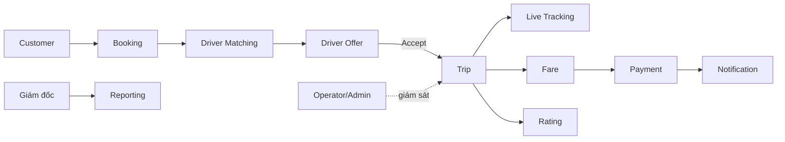

Hệ thống TO-BE hướng tới:
- Customer tự đặt xe.
- Driver tự bật/tắt khả năng nhận chuyến.
- Hệ thống tự tìm Driver theo vị trí, loại xe và trạng thái.
- Driver nhận/từ chối Offer.
- Trip được tạo sau khi Driver chấp nhận.
- Customer theo dõi Driver/Trip/ETA.
- Fare được tính từ PricingRule.
- Thanh toán được ghi nhận tập trung.
- Các sự kiện chính phát Notification.
- Operator/Admin có dashboard vận hành.
- Giám đốc có báo cáo tổng hợp.

---

## 1.2 Business Problem (Vấn đề nghiệp vụ)

### Vấn đề 1 – Phân công tài xế thủ công

| Khía cạnh | Mô tả |
|---|---|
| **Hiện trạng** | Operator phải tự tìm tài xế phù hợp |
| **Hậu quả** | Thời gian chờ kéo dài, dễ bỏ sót Driver gần |
| **Tác động** | Trải nghiệm khách hàng kém, khó mở rộng |
| **Kỳ vọng** | Matching tự động theo Availability, VehicleType, vị trí |

### Vấn đề 2 – Khách hàng khó theo dõi chuyến

| Khía cạnh | Mô tả |
|---|---|
| **Hiện trạng** | Customer không biết Driver ở đâu hoặc Trip đang ở bước nào |
| **Hậu quả** | Phải liên hệ Operator/tổng đài |
| **Tác động** | Tăng chi phí vận hành, giảm trải nghiệm |
| **Kỳ vọng** | Theo dõi Driver, Trip Status và ETA |

### Vấn đề 3 – Thanh toán chưa quản lý tập trung

| Khía cạnh | Mô tả |
|---|---|
| **Hiện trạng** | Tiền mặt và giao dịch điện tử chưa có một nguồn dữ liệu thống nhất |
| **Hậu quả** | Khó tra cứu, đối soát |
| **Tác động** | Rủi ro sai lệch doanh thu |
| **Kỳ vọng** | Payment tập trung, trạng thái rõ ràng, idempotency |

### Vấn đề 4 – Trạng thái tài xế không chuẩn hóa

| Khía cạnh | Mô tả |
|---|---|
| **Hiện trạng** | Chưa có cơ chế rõ ràng OFFLINE/AVAILABLE/BUSY |
| **Hậu quả** | Matching có thể chọn Driver không thực sự sẵn sàng |
| **Tác động** | Tăng thất bại matching |
| **Kỳ vọng** | Driver Availability được quản lý tập trung |

### Vấn đề 5 – Thiếu cấu hình giá tập trung

| Khía cạnh | Mô tả |
|---|---|
| **Hiện trạng** | Quy tắc cước chưa được mô hình hóa thành dữ liệu |
| **Hậu quả** | Khó đổi giá, khó truy vết |
| **Tác động** | Rủi ro sai cước |
| **Kỳ vọng** | PricingRule có version và thời gian hiệu lực |

### Vấn đề 6 – Khó truy vết thao tác

| Khía cạnh | Mô tả |
|---|---|
| **Hiện trạng** | Chưa có AuditLog chuẩn cho thao tác quan trọng |
| **Hậu quả** | Khó xác định người thay đổi dữ liệu |
| **Tác động** | Tăng rủi ro vận hành/bảo mật |
| **Kỳ vọng** | Audit actor/action/target/time |

### Vấn đề 7 – Báo cáo chưa tập trung

| Khía cạnh | Mô tả |
|---|---|
| **Hiện trạng** | Tổng hợp thủ công |
| **Hậu quả** | Báo cáo chậm, khó thống nhất |
| **Tác động** | Ban lãnh đạo thiếu thông tin |
| **Kỳ vọng** | Dashboard số chuyến, Fare, Payment, Customer, Driver |

---

## 1.3 Stakeholders (Các bên liên quan)

### 1.3.1 Stakeholders Table

| # | Stakeholder | Vai trò & trách nhiệm | Mức độ quan trọng |
|---|---|---|---|
| 1 | **Ban giám đốc** | Sponsor, phê duyệt dự án, xem báo cáo, quyết định chính sách | Rất cao |
| 2 | **Customer** | Đăng ký, đặt/hủy xe, theo dõi, thanh toán, đánh giá | Rất cao |
| 3 | **Driver** | Quản lý Availability, nhận/từ chối Offer, thực hiện Trip, cập nhật vị trí | Rất cao |
| 4 | **Operator** | Quản lý Customer/Driver/Vehicle, giám sát Trip, tra cứu Payment | Cao |
| 5 | **Admin** | Quản trị tài khoản/quyền/cấu hình/audit | Cao |
| 6 | **Bộ phận tài chính** | Đối soát giao dịch và doanh thu | Trung bình |
| 7 | **BA/Dev/QA** | Phân tích, phát triển, kiểm thử | Trung bình |
| 8 | **Payment Provider** | Xử lý thanh toán điện tử | Bên ngoài |
| 9 | **Map/GPS Provider** | Geocoding, distance, route, ETA | Bên ngoài |
| 10 | **Notification Service (Dịch vụ thông báo)** | Cung cấp API gửi Push/SMS/Email; trả mã tham chiếu và trạng thái gửi; phối hợp xử lý lỗi, hạn mức và sự cố tích hợp | Bên ngoài – Phụ trợ |

### 1.3.2 Stakeholder Matrix

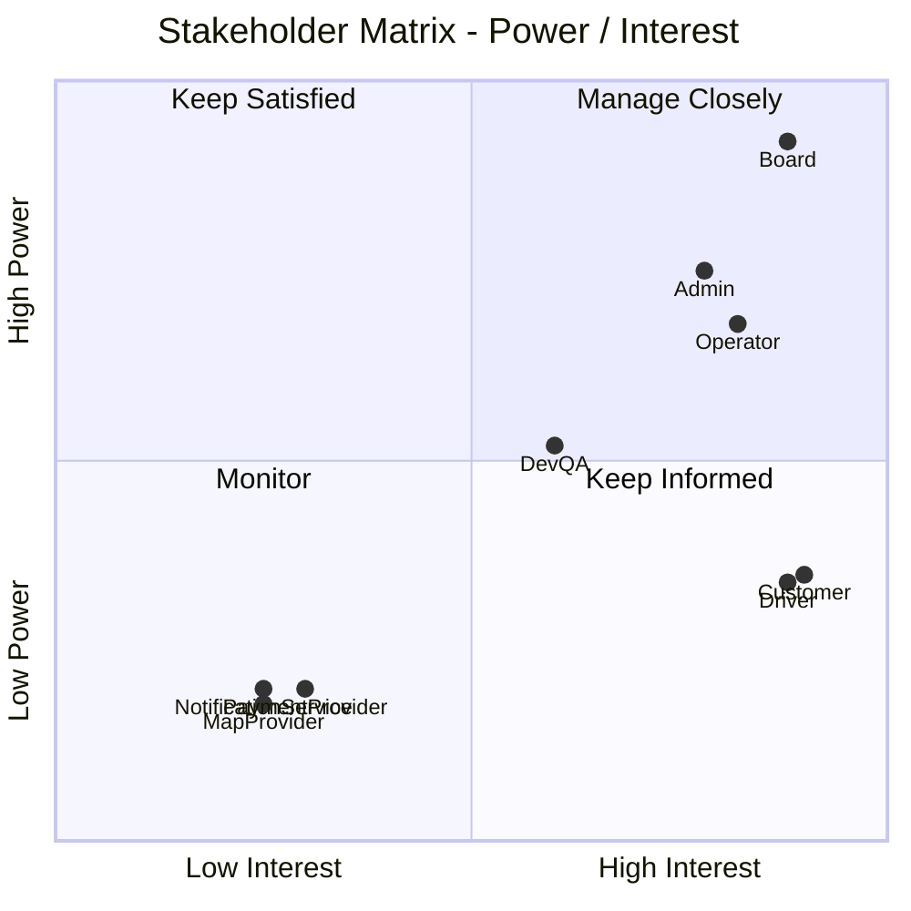

| Nhóm | Stakeholder | Chiến lược |
|---|---|---|
| Manage Closely | Ban giám đốc, Admin, Operator | Review yêu cầu/tiến độ định kỳ |
| Keep Informed | Customer, Driver, Dev/QA | Thu thập feedback và cập nhật thay đổi |
| Keep Satisfied | Finance/IT Management | Cập nhật quyết định ảnh hưởng lớn |
| Monitor | Payment Provider, Map/GPS Provider, Notification Service | Theo dõi SLA/API, hạn mức gửi và sự cố tích hợp |

---

## 1.4 Business Goals (Mục tiêu nghiệp vụ)

> KPI định lượng dưới đây là **mục tiêu đề xuất cho MVP**. Nếu Sponsor chưa xác nhận thì không xem là SLA chính thức.

### 1.4.1 Mục tiêu chiến lược

| ID | Mục tiêu | Mô tả | KPI đề xuất |
|---|---|---|---|
| BG-01 | Chuyển đổi số quy trình đặt xe | Từ Booking đến Payment được quản lý tập trung | ≥ 85% Booking hợp lệ xử lý không cần Operator phân công tay |
| BG-02 | Mở rộng quy mô | Giảm phụ thuộc nhân lực điều phối | Core API 95% ≤ 2 giây ở tải MVP chuẩn |
| BG-03 | Kiểm soát tài chính | Tập trung Fare/Payment | 100% Payment được lưu trạng thái |

### 1.4.2 Mục tiêu vận hành

| ID | Mục tiêu | KPI đề xuất |
|---|---|---|
| BG-04 | Matching tự động | Có Driver phù hợp → mục tiêu tìm trong ≤ 2 phút |
| BG-05 | Tracking minh bạch | Trip active có state; location update mục tiêu 5–10 giây |
| BG-06 | Tính cước tự động | 100% Trip COMPLETED có Fare hợp lệ |
| BG-07 | Quản lý Driver/Vehicle | Driver active có profile + Vehicle hợp lệ |
| BG-08 | Notification theo sự kiện | Sự kiện chính tạo Notification |

### 1.4.3 Mục tiêu quản lý

| ID | Mục tiêu | KPI đề xuất |
|---|---|---|
| BG-09 | Dashboard vận hành | Các nghiệp vụ chính thực hiện trên hệ thống |
| BG-10 | Báo cáo | Có số chuyến, Fare/Revenue, Payment, Customer, Driver |

### 1.4.4 Mục tiêu kỹ thuật & bảo mật

| ID | Mục tiêu | KPI đề xuất |
|---|---|---|
| BG-11 | Kiến trúc linh hoạt | Payment/Notification lỗi không làm mất Booking/Trip lõi |
| BG-12 | Bảo mật & truy vết | 100% thao tác quản trị quan trọng có AuditLog |

---

## 1.5 Phạm vi hệ thống

### 1.5.1 Trong phạm vi – Giai đoạn MVP

Hệ thống CAB MVP tập trung vào quy trình cốt lõi:

**Đặt xe → Tìm và phân công tài xế → Thực hiện chuyến đi → Tính cước → Thanh toán → Đánh giá**.

#### A. Tác nhân tương tác với hệ thống

| # | Tác nhân | Loại | Mô tả |
|---|---|---|---|
| 1 | **Khách hàng** | Chính – Bên ngoài | Đăng ký, đặt/hủy xe, theo dõi chuyến, thanh toán, đánh giá |
| 2 | **Tài xế** | Chính – Bên ngoài | Quản lý trạng thái hoạt động, nhận/từ chối chuyến, thực hiện chuyến, cập nhật vị trí |
| 3 | **Nhân viên vận hành** | Chính – Nội bộ | Quản lý khách hàng, tài xế, phương tiện, giám sát chuyến và tra cứu giao dịch |
| 4 | **Quản trị viên** | Chính – Nội bộ | Quản trị tài khoản, phân quyền, cấu hình và nhật ký kiểm toán |
| 5 | **Giám đốc** | Nội bộ – Ra quyết định | Xem báo cáo vận hành và kinh doanh |
| 6 | **Cổng thanh toán** | Phụ trợ – Hệ thống ngoài | Xử lý thanh toán điện tử |
| 7 | **Dịch vụ bản đồ/GPS** | Phụ trợ – Hệ thống ngoài | Geocoding, khoảng cách, tuyến đường, ETA |
| 8 | **Dịch vụ thông báo** | Phụ trợ – Hệ thống ngoài | Gửi thông báo qua kênh được cấu hình |

#### B. Chức năng chi tiết theo từng phân hệ

---

**Phân hệ 1: Quản lý tài khoản và xác thực**

| # | Chức năng | Tác nhân | Ưu tiên | Mô tả |
|---|---|---|---|---|
| F-01 | Đăng ký tài khoản | Khách hàng, Tài xế | Bắt buộc | Tạo tài khoản và hồ sơ tương ứng |
| F-02 | Đăng nhập | Tất cả người dùng | Bắt buộc | Xác thực và truy cập theo vai trò |
| F-03 | Cập nhật hồ sơ | Khách hàng, Tài xế | Bắt buộc | Sửa thông tin được phép |
| F-04 | Quản lý vai trò/quyền | Quản trị viên | Bắt buộc | Phân quyền truy cập chức năng |
| F-05 | Khóa/mở tài khoản | Nhân viên vận hành, Quản trị viên | Nên có | Thay đổi trạng thái tài khoản theo quyền |

---

**Phân hệ 2: Quản lý tài xế và phương tiện**

| # | Chức năng | Tác nhân | Ưu tiên | Mô tả |
|---|---|---|---|---|
| F-06 | Quản lý hồ sơ tài xế | Tài xế, Nhân viên vận hành | Bắt buộc | Hồ sơ, giấy phép, xác minh |
| F-07 | Bật/tắt trạng thái hoạt động | Tài xế | Bắt buộc | OFFLINE ↔ AVAILABLE; hệ thống tự BUSY khi có chuyến |
| F-08 | Quản lý phương tiện | Tài xế, Nhân viên vận hành | Bắt buộc | Biển số, loại xe, trạng thái |
| F-09 | Quản lý loại xe | Nhân viên vận hành, Quản trị viên | Bắt buộc | VehicleType phục vụ đặt xe/matching/pricing |
| F-10 | Cập nhật vị trí GPS | Tài xế | Bắt buộc | Gửi vị trí phục vụ matching/tracking |

---

**Phân hệ 3: Đặt xe và quản lý Booking**

| # | Chức năng | Tác nhân | Ưu tiên | Mô tả |
|---|---|---|---|---|
| F-11 | Nhập điểm đón | Khách hàng | Bắt buộc | Địa chỉ hoặc tọa độ hợp lệ |
| F-12 | Nhập điểm đến | Khách hàng | Bắt buộc | Địa chỉ hoặc tọa độ hợp lệ |
| F-13 | Chọn loại xe | Khách hàng | Bắt buộc | Chọn loại xe đang hoạt động |
| F-14 | Tạo Booking | Khách hàng | Bắt buộc | Tạo yêu cầu đặt xe |
| F-15 | Hủy Booking | Khách hàng | Bắt buộc | Hủy khi trạng thái/chính sách cho phép |
| F-16 | Xem lịch sử chuyến | Khách hàng | Nên có | Xem các chuyến đã hoàn thành/hủy |

---

**Phân hệ 4: Tìm và phân công tài xế**

| # | Chức năng | Tác nhân | Ưu tiên | Mô tả |
|---|---|---|---|---|
| F-17 | Tìm tài xế phù hợp | Hệ thống | Bắt buộc | Tìm Driver AVAILABLE |
| F-18 | Lọc tài xế | Hệ thống | Bắt buộc | Theo xác minh, loại xe, vị trí |
| F-19 | Xếp hạng tài xế | Hệ thống | Bắt buộc | Ưu tiên theo khoảng cách/tiêu chí |
| F-20 | Tạo yêu cầu chuyến cho tài xế | Hệ thống | Bắt buộc | Tạo DriverOffer có thời hạn |
| F-21 | Chấp nhận chuyến | Tài xế | Bắt buộc | Nhận chuyến khi Offer còn hiệu lực |
| F-22 | Từ chối chuyến | Tài xế | Bắt buộc | Từ chối và chuyển Candidate |
| F-23 | Xử lý hết thời gian phản hồi | Hệ thống | Bắt buộc | TIMEOUT và thử tài xế tiếp theo |
| F-24 | Xử lý nhiều tài xế nhận đồng thời | Hệ thống | Bắt buộc | Chỉ một Driver được gán |

---

**Phân hệ 5: Quản lý và theo dõi chuyến đi**

| # | Chức năng | Tác nhân | Ưu tiên | Mô tả |
|---|---|---|---|---|
| F-25 | Tạo chuyến đi | Hệ thống | Bắt buộc | Chỉ tạo sau Driver ACCEPT hợp lệ |
| F-26 | Cập nhật trạng thái chuyến | Tài xế | Bắt buộc | Đang đến → Đã đến → Đã đón → Đang đi → Hoàn thành |
| F-27 | Theo dõi trạng thái | Khách hàng | Bắt buộc | Xem state hiện tại |
| F-28 | Theo dõi vị trí | Khách hàng | Bắt buộc | Xem vị trí Driver |
| F-29 | Hiển thị ETA | Khách hàng | Nên có | ETA khi dịch vụ bản đồ khả dụng |
| F-30 | Giám sát chuyến | Nhân viên vận hành | Bắt buộc | Xem các Trip active/problem |

---

**Phân hệ 6: Tính cước và thanh toán**

| # | Chức năng | Tác nhân | Ưu tiên | Mô tả |
|---|---|---|---|---|
| F-31 | Cấu hình bảng giá | Quản trị viên/Nhân viên vận hành có quyền | Bắt buộc | Giá theo loại xe và thời gian hiệu lực |
| F-32 | Tính cước tự động | Hệ thống | Bắt buộc | Tính Fare sau Trip COMPLETED |
| F-33 | Lưu phiên bản bảng giá | Hệ thống | Bắt buộc | Truy vết rule dùng để tính Fare |
| F-34 | Thanh toán tiền mặt | Khách hàng | Bắt buộc | Ghi nhận phương thức CASH |
| F-35 | Thanh toán điện tử | Khách hàng | Bắt buộc | Tích hợp cổng thanh toán |
| F-36 | Xử lý thất bại/timeout | Hệ thống | Bắt buộc | Retry/reconcile theo chính sách |
| F-37 | Chống xử lý giao dịch trùng | Hệ thống | Bắt buộc | Idempotency |

---

**Phân hệ 7: Thông báo**

| # | Chức năng | Tác nhân | Ưu tiên | Mô tả |
|---|---|---|---|---|
| F-38 | Thông báo Booking | Khách hàng | Bắt buộc | Yêu cầu đặt xe được tiếp nhận |
| F-39 | Thông báo có chuyến mới | Tài xế | Bắt buộc | Driver nhận DriverOffer |
| F-40 | Thông báo tài xế nhận/đến | Khách hàng | Bắt buộc | Theo sự kiện của Trip |
| F-41 | Thông báo hoàn thành | Khách hàng, Tài xế | Bắt buộc | Trip completed |
| F-42 | Thông báo kết quả thanh toán | Khách hàng | Bắt buộc | Payment result |

Phân hệ còn bao gồm thông báo hủy chuyến/không tìm được tài xế, lịch sử IN_APP, đánh dấu đã đọc, chống trùng, retry và theo dõi lỗi theo FR70–FR74.

---

**Phân hệ 8: Đánh giá và phản hồi**

| # | Chức năng | Tác nhân | Ưu tiên | Mô tả |
|---|---|---|---|---|
| F-43 | Đánh giá tài xế | Khách hàng | Bắt buộc | 1–5 sao và nhận xét |
| F-44 | Xem điểm đánh giá | Khách hàng, Tài xế | Nên có | Hiển thị rating tổng hợp |

---

**Phân hệ 9: Quản trị, bảo mật và báo cáo**

| # | Chức năng | Tác nhân | Ưu tiên | Mô tả |
|---|---|---|---|---|
| F-45 | Quản lý khách hàng | Nhân viên vận hành, Quản trị viên | Bắt buộc | Danh sách, chi tiết, khóa/mở |
| F-46 | Quản lý tài xế | Nhân viên vận hành, Quản trị viên | Bắt buộc | Hồ sơ, xác minh, trạng thái |
| F-47 | Quản lý phương tiện | Nhân viên vận hành, Quản trị viên | Bắt buộc | Vehicle/VehicleType |
| F-48 | Tra cứu thanh toán | Nhân viên vận hành, Quản trị viên | Nên có | Tìm theo Trip/Payment/statuses |
| F-49 | Nhật ký kiểm toán | Hệ thống, Quản trị viên | Bắt buộc | Lưu thao tác quan trọng |
| F-50 | Báo cáo vận hành | Giám đốc | Nên có | Số chuyến, tỷ lệ trạng thái |
| F-51 | Báo cáo tài chính | Giám đốc | Nên có | Fare/Payment/doanh thu |
| F-52 | Báo cáo tài xế | Giám đốc | Có thể có | Hiệu quả tài xế |

#### C. Tổng hợp phạm vi MVP

| Thống kê | Số lượng |
|---|---:|
| Tác nhân chính | 5 |
| Hệ thống/dịch vụ ngoài | 3 |
| Phân hệ chức năng | 9 |
| Chức năng mô tả ở mức phạm vi | 52 mục F nền; FR75–FR80 bổ sung chi tiết phục vụ chấm |
| Business Process được giữ trong SRS | 13 |
| Use Case | 19 |

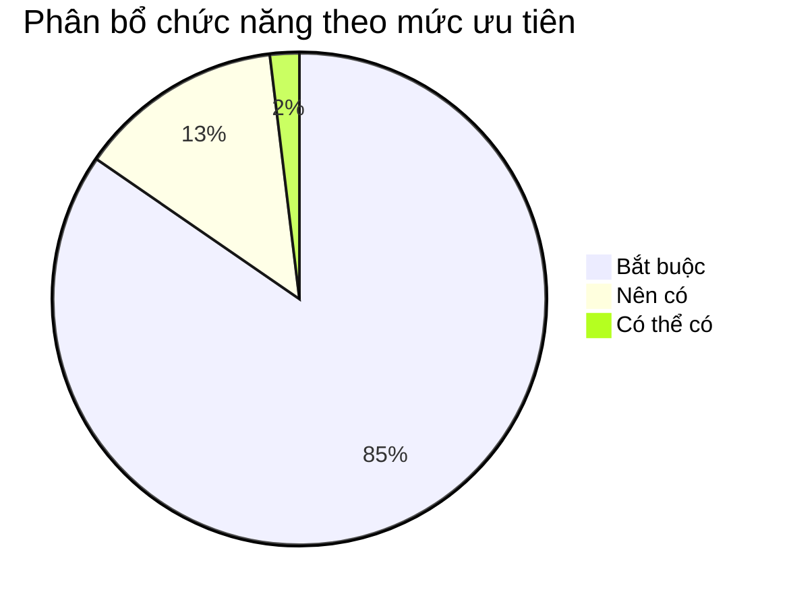

### 1.5.2 Ngoài phạm vi – Giai đoạn MVP

Các nội dung dưới đây không thuộc MVP nhưng có thể xem xét ở phiên bản sau:

| # | Tính năng | Lý do chưa đưa vào MVP | Giai đoạn dự kiến |
|---|---|---|---|
| OS-01 | Ứng dụng mobile native | MVP ưu tiên web/responsive hoặc client hiện có | Sau MVP |
| OS-02 | Ride sharing/carpool | Tăng đáng kể độ phức tạp matching và pricing | Sau MVP |
| OS-03 | Chuyến nhiều điểm dừng | Cần mở rộng Route/Trip/Fare | Sau MVP |
| OS-04 | Đặt xe theo lịch nâng cao | Cần scheduler và reservation matching riêng | Sau MVP |
| OS-05 | Surge pricing tự động | Cần rule/demand engine nâng cao | Sau MVP |
| OS-06 | Ví nội bộ/điểm thưởng | Không thuộc luồng thanh toán cốt lõi | Sau MVP |
| OS-07 | Driver payout/commission đầy đủ | Thuộc nghiệp vụ kế toán/đối soát mở rộng | Sau MVP |
| OS-08 | Refund/chargeback tự động | Phụ thuộc sâu Payment Provider | Sau MVP |
| OS-09 | SOS/emergency integration | Yêu cầu quy trình an toàn/chính sách riêng | Sau MVP |
| OS-10 | Fraud detection bằng ML | Không cần cho MVP học thuật | Sau MVP |
| OS-11 | Multi-country tax/currency | MVP chỉ cần phạm vi kinh doanh hiện tại | Sau MVP |

### 1.5.3 Ranh giới hệ thống

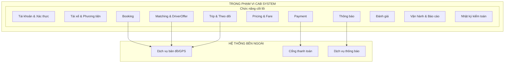

**Nguyên tắc ranh giới**
- CAB System chịu trách nhiệm về trạng thái nghiệp vụ và dữ liệu cốt lõi.
- Dịch vụ bản đồ chỉ cung cấp dữ liệu vị trí/khoảng cách/ETA.
- Cổng thanh toán xử lý dữ liệu thanh toán nhạy cảm; CAB không lưu CVV hoặc thông tin thẻ đầy đủ.
- Dịch vụ thông báo chỉ thực hiện delivery; lỗi gửi thông báo không rollback Booking/Trip/Payment.
- Việc chia microservice, API Gateway, Kafka và Docker Compose thuộc phần kiến trúc triển khai, không làm thay đổi business scope của SRS.
---

## 1.6 Business Requirements (Yêu cầu nghiệp vụ)

### 1.6.1 Quản lý tài khoản & Xác thực

| Ký hiệu | Tên | Diễn giải |
|---|---|---|
| BR-001 | Đăng ký tài khoản | Customer tạo tài khoản; Driver xác minh OTP rồi nộp hồ sơ PENDING |
| BR-002 | Đăng nhập | User hợp lệ xác thực để truy cập hệ thống |
| BR-003 | Quản lý hồ sơ | User cập nhật dữ liệu được phép |
| BR-004 | Phân quyền | Role/Permission kiểm soát chức năng |

### 1.6.2 Đặt xe & Quản lý Booking

| Ký hiệu | Tên | Diễn giải |
|---|---|---|
| BR-005 | Pickup/Destination | Chọn vị trí hợp lệ |
| BR-006 | VehicleType | Chọn loại xe active |
| BR-007 | Create Booking | Tạo Booking và bắt đầu matching |
| BR-008 | Cancel Booking | Hủy khi policy/state cho phép |
| BR-009 | Cancellation Consistency | Đồng bộ Booking/Trip/Offer/Driver |

### 1.6.3 Quản lý tài xế & Phương tiện

| Ký hiệu | Tên | Diễn giải |
|---|---|---|
| BR-010 | Driver Profile | Hồ sơ PENDING/APPROVED/REJECTED; Admin duyệt/từ chối và Driver nhận kết quả |
| BR-011 | Driver Availability | OFFLINE/AVAILABLE/BUSY/SUSPENDED |
| BR-012 | Vehicle | Quản lý phương tiện |
| BR-013 | VehicleType | Loại xe |
| BR-014 | Driver Location | Vị trí phục vụ matching/tracking |

### 1.6.4 Tìm & Phân công tài xế

| Ký hiệu | Tên | Diễn giải |
|---|---|---|
| BR-015 | Candidate Search | Tìm Driver AVAILABLE |
| BR-016 | Candidate Filter | Lọc verified/VehicleType |
| BR-017 | Candidate Ranking | Xếp hạng Driver |
| BR-018 | DriverOffer | Offer có thời hạn và history |
| BR-019 | Reject/Timeout | Candidate tiếp theo |
| BR-020 | Concurrent Accept | Chỉ một Driver thắng |
| BR-021 | No Driver | Hết Candidate → NO_DRIVER_FOUND |

### 1.6.5 Quản lý chuyến đi & Theo dõi

| Ký hiệu | Tên | Diễn giải |
|---|---|---|
| BR-022 | Create Trip | Chỉ sau ACCEPT hợp lệ |
| BR-023 | Trip Lifecycle | Theo State Model |
| BR-024 | Tracking | Status + Driver + Vehicle + Location |
| BR-025 | ETA | Từ Map/GPS Provider khi khả dụng |
| BR-026 | Trip History | Customer xem lịch sử |

### 1.6.6 Tính cước & Thanh toán

| Ký hiệu | Tên | Diễn giải |
|---|---|---|
| BR-027 | PricingRule | Giá theo VehicleType và hiệu lực |
| BR-028 | Fare | Tính tự động sau Trip COMPLETED |
| BR-029 | Fare Traceability | Lưu rule/version/snapshot |
| BR-030 | Payment Method | CASH/ELECTRONIC |
| BR-031 | Payment Provider | Electronic qua provider ngoài |
| BR-032 | Payment Failure | Retry/reconcile |
| BR-033 | Payment Idempotency | Không xử lý giao dịch logic trùng |

### 1.6.7 Thông báo

| Ký hiệu | Tên | Diễn giải |
|---|---|---|
| BR-034 | Customer Notification | Booking/Driver/Trip/Payment events |
| BR-035 | Driver Notification | Offer, thay đổi Trip, OTP đăng ký và kết quả xét duyệt hồ sơ |
| BR-036 | Channel Extensibility & Reliability | Hỗ trợ IN_APP và mở rộng Push/SMS/Email theo cấu hình; theo dõi trạng thái, chống trùng và retry có giới hạn |

CAB System xác định sự kiện, người nhận, nội dung và kênh gửi. Notification Service là hệ thống ngoài phụ trách delivery qua Push/SMS/Email; IN_APP được lưu và hiển thị trong CAB System. MVP phải chứng minh được thông báo Offer, hủy chuyến, kết quả thanh toán, OTP và kết quả duyệt hồ sơ. Kênh gửi được chọn theo môi trường demo; không bắt buộc đồng thời IN_APP và kênh ngoài. FR71 (lịch sử/đã đọc), delivery callback và dashboard lỗi nâng cao thuộc Should; chống trùng và retry tối thiểu vẫn thuộc Must. OTP có thể dùng adapter giả lập trong môi trường kiểm thử, phải ghi rõ và không trả OTP trong API production.

### 1.6.8 Đánh giá & Phản hồi

| Ký hiệu | Tên | Diễn giải |
|---|---|---|
| BR-037 | Rating | Customer đánh giá 1–5 sau Trip |
| BR-038 | Rating Integrity | Một Rating/Trip, đúng ownership |

### 1.6.9 Quản trị, Báo cáo & Bảo mật

| Ký hiệu | Tên | Diễn giải |
|---|---|---|
| BR-039 | Customer Management | Quản lý Customer |
| BR-040 | Driver Management | Quản lý Driver |
| BR-041 | Vehicle Management | Quản lý Vehicle/VehicleType |
| BR-042 | Trip Monitoring | Giám sát Trip |
| BR-043 | Payment Lookup | Tra cứu Payment |
| BR-044 | Reporting | Báo cáo vận hành/kinh doanh |
| BR-045 | Authentication | Endpoint private phải xác thực |
| BR-046 | Authorization | Kiểm tra quyền server-side |
| BR-047 | Data Protection | Bảo vệ PII/location/payment |
| BR-048 | Audit | Audit thao tác quan trọng |

### 1.6.10 Tổng hợp Business Requirements

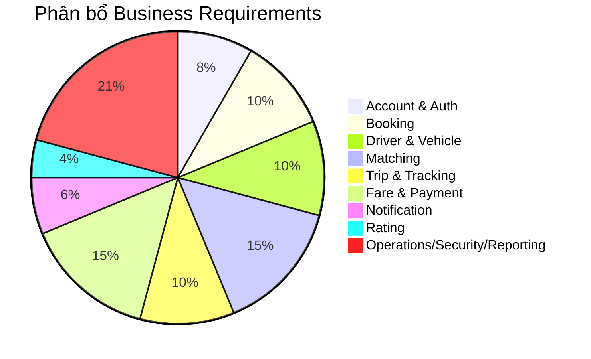

**Ma trận Business Requirements → Business Goals**

| Nhóm BR | Business Goals |
|---|---|
| BR-001–BR-004 | BG-01, BG-09, BG-12 |
| BR-005–BR-009 | BG-01, BG-04, BG-05 |
| BR-010–BR-014 | BG-05, BG-07 |
| BR-015–BR-021 | BG-01, BG-04 |
| BR-022–BR-026 | BG-05, BG-06 |
| BR-027–BR-033 | BG-03, BG-06 |
| BR-034–BR-036 | BG-08, BG-11 |
| BR-037–BR-038 | BG-05 |
| BR-039–BR-048 | BG-09, BG-10, BG-12 |

---

## 1.7 Quy trình nghiệp vụ

Hệ thống giữ nguyên **13 Business Process** để bảo đảm khả năng truy xuất yêu cầu từ nghiệp vụ đến FR, Use Case và Acceptance Criteria. Cấu trúc trình bày được chia nhỏ tương tự bài tham khảo, nhưng nội dung vẫn theo đúng CAB System của dự án.

### 1.7.1 Sơ đồ Quy trình Tổng thể (End-to-End Business Flow)

Quy trình end-to-end của CAB System được chia thành **4 giai đoạn nghiệp vụ chính**:

1. **Giai đoạn 1 – Đặt xe & phân công tài xế**
2. **Giai đoạn 2 – Thực hiện chuyến đi**
3. **Giai đoạn 3 – Tính cước & thanh toán**
4. **Giai đoạn 4 – Đánh giá & hoàn tất**

```mermaid
sequenceDiagram
    autonumber

    actor C as Khách hàng
    participant S as Hệ thống CAB
    actor D as Tài xế
    participant P as Cổng thanh toán

    rect rgb(255, 246, 173)
        Note over C,D: GIAI ĐOẠN 1: ĐẶT XE & PHÂN CÔNG TÀI XẾ

        C->>S: Nhập điểm đón, điểm đến, chọn loại xe
        S-->>C: Hiển thị thông tin đặt xe

        C->>S: Xác nhận đặt xe
        S->>S: Tạo Booking
        S->>S: Tìm tài xế AVAILABLE phù hợp

        S->>D: Gửi DriverOffer

        alt Tài xế chấp nhận
            D->>S: ACCEPT
            S->>S: Gán tài xế cho Booking
            S->>S: Chuyển Driver sang BUSY
            S->>S: Tạo Trip
            S-->>C: Thông báo tài xế đã nhận chuyến
        else Tài xế từ chối
            D-->>S: REJECT
            S->>S: Chuyển DriverOffer sang REJECTED
            S->>S: Chọn tài xế tiếp theo
        else Hết thời gian phản hồi
            S->>S: Chuyển DriverOffer sang TIMEOUT
            S->>S: Chọn tài xế tiếp theo
        end
    end

    rect rgb(211, 238, 255)
        Note over C,D: GIAI ĐOẠN 2: THỰC HIỆN CHUYẾN ĐI

        D->>S: Cập nhật DRIVER_ARRIVING
        S-->>C: Hiển thị tài xế đang đến

        D->>S: Cập nhật DRIVER_ARRIVED
        S-->>C: Thông báo tài xế đã đến

        D->>S: Cập nhật PICKED_UP
        S-->>C: Cập nhật trạng thái đã đón khách

        D->>S: Cập nhật IN_PROGRESS
        S-->>C: Cập nhật trạng thái đang thực hiện chuyến

        loop Trong quá trình chuyến đi
            D->>S: Gửi vị trí GPS
            S-->>C: Hiển thị vị trí tài xế và ETA
        end

        D->>S: Cập nhật COMPLETED
        S-->>C: Thông báo chuyến đi hoàn thành
    end

    rect rgb(221, 255, 221)
        Note over C,P: GIAI ĐOẠN 3: TÍNH CƯỚC & THANH TOÁN

        S->>S: Lấy PricingRule có hiệu lực
        S->>S: Tính Fare
        S-->>C: Hiển thị số tiền cần thanh toán

        C->>S: Chọn phương thức thanh toán

        alt Thanh toán tiền mặt
            S->>S: Tạo Payment với phương thức CASH
            S-->>C: Ghi nhận thanh toán tiền mặt
        else Thanh toán điện tử
            S->>S: Tạo Payment và idempotencyKey
            S->>P: Gửi yêu cầu thanh toán
            P-->>S: Trả kết quả giao dịch

            alt Thanh toán thành công
                S->>S: Payment chuyển COMPLETED
                S-->>C: Thông báo thanh toán thành công
            else Thanh toán thất bại
                S->>S: Payment chuyển FAILED
                S-->>C: Thông báo thanh toán thất bại
            else Cổng thanh toán chưa phản hồi
                S->>S: Payment giữ PENDING / PROCESSING
                S-->>C: Thông báo giao dịch đang được xử lý
            end
        end
    end

    rect rgb(241, 224, 255)
        Note over C,D: GIAI ĐOẠN 4: ĐÁNH GIÁ & HOÀN TẤT

        S-->>C: Yêu cầu đánh giá tài xế
        C->>S: Gửi số sao và nhận xét
        S->>S: Kiểm tra Trip và quyền đánh giá
        S->>S: Lưu Rating
        S->>S: Cập nhật điểm đánh giá tài xế
        S->>S: Chuyển Driver sang AVAILABLE nếu vẫn online
        S-->>C: Hoàn tất quy trình chuyến đi
    end
```

#### Giai đoạn 1 – Đặt xe & phân công tài xế

Khách hàng nhập điểm đón, điểm đến và loại xe mong muốn. Hệ thống tạo Booking, tìm các tài xế đang ở trạng thái `AVAILABLE`, lọc theo loại xe và khoảng cách, sau đó gửi `DriverOffer`.

Nếu tài xế chấp nhận, hệ thống gán tài xế cho Booking, chuyển tài xế sang `BUSY` và tạo Trip. Nếu tài xế từ chối hoặc hết thời gian phản hồi, hệ thống tiếp tục tìm tài xế phù hợp tiếp theo.

#### Giai đoạn 2 – Thực hiện chuyến đi

Sau khi Trip được tạo, tài xế lần lượt cập nhật các trạng thái:

```text
ASSIGNED
→ DRIVER_ARRIVING
→ DRIVER_ARRIVED
→ PICKED_UP
→ IN_PROGRESS
→ COMPLETED
```

Trong quá trình thực hiện chuyến, tài xế gửi vị trí GPS về hệ thống. Khách hàng có thể theo dõi trạng thái chuyến, vị trí tài xế và ETA nếu dịch vụ bản đồ khả dụng.

#### Giai đoạn 3 – Tính cước & thanh toán

Sau khi Trip chuyển sang `COMPLETED`, hệ thống lấy `PricingRule` phù hợp để tính Fare.

Khách hàng lựa chọn:

- **Thanh toán tiền mặt**
- **Thanh toán điện tử**

Đối với thanh toán điện tử, hệ thống gửi yêu cầu tới Cổng thanh toán và cập nhật trạng thái Payment theo kết quả trả về.

Các trạng thái Payment chính:

```text
PENDING
→ PROCESSING
→ COMPLETED

hoặc

PROCESSING
→ FAILED
```

#### Giai đoạn 4 – Đánh giá & hoàn tất

Sau khi chuyến đi hoàn thành, khách hàng có thể đánh giá tài xế từ **1 đến 5 sao** và nhập nhận xét.

Hệ thống lưu Rating, cập nhật chỉ số đánh giá của tài xế và chuyển tài xế về `AVAILABLE` nếu tài xế vẫn đang trực tuyến.

Dữ liệu của Booking, Trip, Fare, Payment và Rating sau đó được sử dụng cho chức năng báo cáo và thống kê.

---

### 1.7.2 BP-01: Quy trình tài khoản và truy cập

| Thuộc tính | Chi tiết |
|---|---|
| **Mục đích** | Đăng ký, đăng nhập và quản lý truy cập người dùng |
| **Tác nhân** | Khách hàng, Tài xế, Nhân viên vận hành, Quản trị viên, Giám đốc |
| **Tiền điều kiện** | Người dùng có dữ liệu hợp lệ hoặc tài khoản đã tồn tại |
| **Hậu điều kiện** | User/Profile được tạo hoặc phiên đăng nhập hợp lệ được cấp |
| **BR liên quan** | BR-001 → BR-004 |
| **FR liên quan** | FR01–FR04, FR56–FR59, FR75, FR76, FR78 |
| **UC liên quan** | UC01, UC02, UC03 |

**Luồng chính**
1. Người dùng đăng ký hoặc mở màn hình đăng nhập.
2. Hệ thống kiểm tra dữ liệu/credential.
3. Kiểm tra trạng thái tài khoản.
4. Xác định vai trò và quyền.
5. Cấp quyền truy cập phù hợp.
6. Các thay đổi quản trị quan trọng được ghi AuditLog.

---

### 1.7.3 BP-02: Quy trình quản lý trạng thái hoạt động của tài xế

| Thuộc tính | Chi tiết |
|---|---|
| **Mục đích** | Xác định tài xế có sẵn sàng nhận chuyến hay không |
| **Tác nhân** | Tài xế, Hệ thống, Nhân viên vận hành/Quản trị viên |
| **Tiền điều kiện** | Driver hợp lệ, không bị SUSPENDED |
| **Hậu điều kiện** | Driver có state OFFLINE/AVAILABLE/BUSY/SUSPENDED nhất quán |
| **BR liên quan** | BR-010, BR-011, BR-014 |
| **FR liên quan** | FR28, FR50, FR54 |
| **UC liên quan** | UC06, UC07, UC14 |

```text
OFFLINE → AVAILABLE
AVAILABLE → BUSY khi nhận chuyến
BUSY → AVAILABLE/OFFLINE khi Trip kết thúc
AVAILABLE/OFFLINE → SUSPENDED khi bị quản trị khóa
```

---

### 1.7.4 BP-03: Quy trình đặt xe

| Thuộc tính | Chi tiết |
|---|---|
| **Mục đích** | Tạo Booking hợp lệ từ yêu cầu Customer |
| **Tác nhân** | Khách hàng, Hệ thống, Dịch vụ bản đồ/GPS |
| **Tiền điều kiện** | Customer ACTIVE; VehicleType hoạt động |
| **Hậu điều kiện** | Booking CREATED/SEARCHING_DRIVER hoặc CANCELED |
| **BR liên quan** | BR-005 → BR-009 |
| **FR liên quan** | FR05–FR10, FR66, FR67, FR80 |
| **UC liên quan** | UC04 |

**Luồng chính**
1. Customer chọn điểm đón.
2. Chọn điểm đến.
3. Chọn loại xe.
4. Hệ thống chuẩn hóa tọa độ khi cần.
5. Validate Booking.
6. Customer xác nhận.
7. Tạo Booking và chuyển `SEARCHING_DRIVER`.
8. Kích hoạt BP-04.

---

### 1.7.5 BP-04: Quy trình tìm và phân công tài xế

| Thuộc tính | Chi tiết |
|---|---|
| **Mục đích** | Tìm Driver phù hợp và tạo Trip sau khi Driver chấp nhận |
| **Tác nhân** | Hệ thống, Tài xế, Dịch vụ bản đồ/GPS |
| **Tiền điều kiện** | Booking SEARCHING_DRIVER |
| **Hậu điều kiện** | Driver được gán + Trip được tạo, hoặc NO_DRIVER_FOUND |
| **BR liên quan** | BR-015 → BR-021 |
| **FR liên quan** | FR11–FR22, FR64, FR67, FR79 |
| **UC liên quan** | UC05, UC06 |

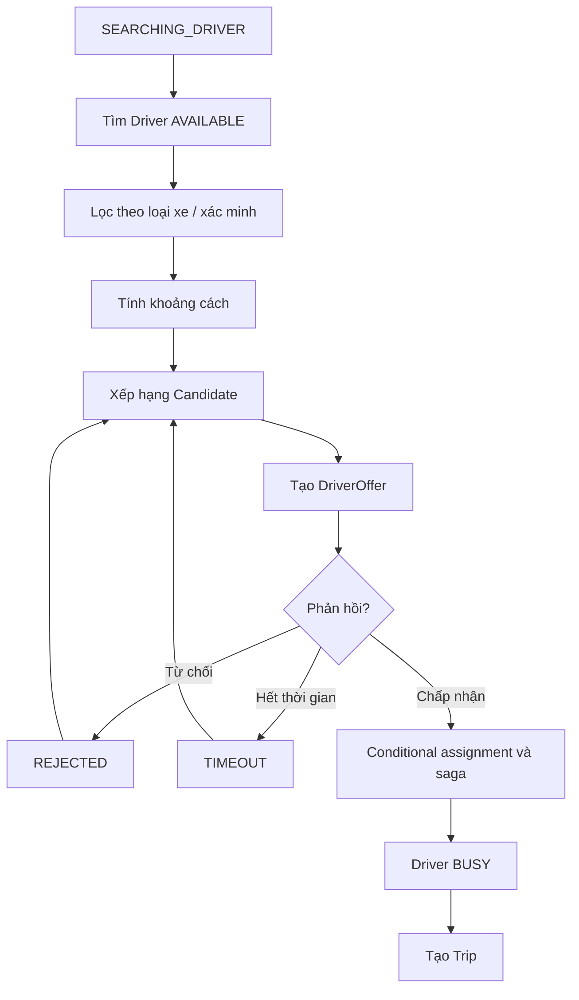

---

### 1.7.6 BP-05: Quy trình thực hiện chuyến đi

| Thuộc tính | Chi tiết |
|---|---|
| **Mục đích** | Thực hiện chuyến đúng vòng đời nghiệp vụ |
| **Tác nhân** | Tài xế, Hệ thống |
| **Tiền điều kiện** | Trip ASSIGNED |
| **Hậu điều kiện** | Trip COMPLETED hoặc CANCELED |
| **BR liên quan** | BR-022, BR-023 |
| **FR liên quan** | FR23–FR27, FR54, FR66 |
| **UC liên quan** | UC07 |

```text
ASSIGNED
→ DRIVER_ARRIVING
→ DRIVER_ARRIVED
→ PICKED_UP
→ IN_PROGRESS
→ COMPLETED
```

Hệ thống từ chối mọi transition không hợp lệ.

---

### 1.7.7 BP-06: Quy trình theo dõi chuyến đi

| Thuộc tính | Chi tiết |
|---|---|
| **Mục đích** | Cung cấp trạng thái, vị trí và ETA của Trip |
| **Tác nhân** | Khách hàng, Tài xế, Hệ thống, Dịch vụ bản đồ/GPS, Nhân viên vận hành |
| **Tiền điều kiện** | Trip tồn tại và actor có quyền xem |
| **Hậu điều kiện** | Hiển thị dữ liệu mới nhất hoặc trạng thái degraded |
| **BR liên quan** | BR-014, BR-024 → BR-026 |
| **FR liên quan** | FR28–FR33, FR52, FR67 |
| **UC liên quan** | UC08, UC16 |

**Luồng chính**
1. Driver gửi tọa độ.
2. Hệ thống lưu vị trí mới nhất.
3. Customer/Operator yêu cầu tracking.
4. Hệ thống trả Trip state, Driver/Vehicle, location.
5. Map Provider hỗ trợ tính ETA.
6. Khi GPS/Map lỗi, hiển thị dữ liệu cuối và thời điểm cập nhật.

---

### 1.7.8 BP-07: Quy trình tính cước

| Thuộc tính | Chi tiết |
|---|---|
| **Mục đích** | Tính Fare chính xác và có thể truy vết |
| **Tác nhân** | Hệ thống, Quản trị viên/Nhân viên vận hành có quyền |
| **Tiền điều kiện** | Trip COMPLETED |
| **Hậu điều kiện** | Fare được tạo |
| **BR liên quan** | BR-027 → BR-029 |
| **FR liên quan** | FR34, FR63, FR68 |
| **UC liên quan** | UC09, UC15 |

```text
Trip COMPLETED
→ Xác định VehicleType
→ Lấy PricingRule hiệu lực
→ Đọc distance/duration
→ Tính cước
→ Áp dụng minimum/adjustment
→ Lưu Fare + pricing version
```

---

### 1.7.9 BP-08: Quy trình thanh toán

| Thuộc tính | Chi tiết |
|---|---|
| **Mục đích** | Ghi nhận thanh toán Fare an toàn và nhất quán |
| **Tác nhân** | Khách hàng, Hệ thống, Cổng thanh toán |
| **Tiền điều kiện** | Fare tồn tại |
| **Hậu điều kiện** | Payment COMPLETED/FAILED hoặc chờ reconcile |
| **BR liên quan** | BR-030 → BR-033 |
| **FR liên quan** | FR35–FR38, FR55, FR65 |
| **UC liên quan** | UC10, UC17 |

**Tiền mặt**
```text
Chọn CASH → Tạo Payment → Ghi nhận kết quả theo quy trình MVP
```

**Điện tử**
```text
Chọn ELECTRONIC
→ Tạo Payment + idempotencyKey
→ Gọi Provider
→ PROCESSING
→ Callback/Result
→ COMPLETED / FAILED / PENDING-Reconcile
```

---

### 1.7.10 BP-09: Quy trình thông báo

| Thuộc tính | Chi tiết |
|---|---|
| **Mục đích** | Thông báo kịp thời các sự kiện quan trọng |
| **Tác nhân** | Hệ thống, Khách hàng, Tài xế, Dịch vụ thông báo |
| **Tiền điều kiện** | Có sự kiện và recipient hợp lệ |
| **Hậu điều kiện** | Notification được lưu và có trạng thái gửi, lỗi hoặc chờ retry; lỗi gửi không rollback nghiệp vụ nguồn |
| **BR liên quan** | BR-034 → BR-036 |
| **FR liên quan** | FR40–FR45, FR70–FR74 |
| **UC liên quan** | UC11 |

**Sự kiện chính**
- Booking được tiếp nhận.
- DriverOffer mới.
- Driver đã nhận chuyến.
- Driver đã đến.
- Trip hoàn thành.
- Kết quả Payment.
- Hủy chuyến/không tìm được tài xế.

**Ma trận sự kiện – người nhận**

| Sự kiện | Người nhận | Nội dung tối thiểu |
|---|---|---|
| Booking created | Customer sở hữu Booking | Mã Booking, xác nhận tiếp nhận |
| DriverOffer created | Driver được mời | Mã Offer, thông tin chuyến cần thiết, hạn phản hồi |
| Driver accepted / arrived | Customer của chuyến | Mã chuyến, thông tin tài xế, trạng thái |
| Trip completed | Customer và Driver của chuyến | Mã chuyến, xác nhận hoàn thành |
| Payment result | Customer thanh toán | Mã giao dịch, số tiền, trạng thái thực tế; timeout không được báo thành công |
| Booking/Trip cancelled | Customer và Driver đã được gán, nếu có | Mã Booking/Trip, lý do hủy được phép hiển thị |
| NO_DRIVER_FOUND | Customer sở hữu Booking | Kết quả tìm tài xế, hướng dẫn thử lại |
| OTP requested | Người đăng ký Driver sở hữu phone | Mã một lần và thời hạn, không lưu plaintext trong log/Notification content |
| Driver application approved/rejected | Driver nộp hồ sơ | Kết quả và lý do từ chối nếu có |

**Quy trình xử lý**

1. Ghi nhận bền vững sự kiện đã commit cùng eventId và tham chiếu nghiệp vụ để có thể xử lý lại sau sự cố.
2. Xác định người nhận theo quyền sở hữu, chọn template/kênh; mỗi người nhận/kênh có một bản ghi riêng.
3. Chống trùng theo eventId + userId + channel; kiểm tra hiệu lực trước mỗi lần gửi, đặc biệt với DriverOffer.
4. Lưu IN_APP hoặc gửi bất đồng bộ qua Notification Service; ghi nhận trạng thái và mã tham chiếu.
5. Retry lỗi tạm thời với backoff, số lần tối đa và thời hạn cấu hình; lỗi vĩnh viễn/hết số lần chuyển FAILED, hết hiệu lực chuyển EXPIRED.
6. Customer/Driver xem lịch sử IN_APP và đánh dấu đã đọc; Operator/Admin tra cứu lỗi theo quyền.

---

### 1.7.11 BP-10: Quy trình đánh giá

| Thuộc tính | Chi tiết |
|---|---|
| **Mục đích** | Thu thập phản hồi sau chuyến |
| **Tác nhân** | Khách hàng, Hệ thống |
| **Tiền điều kiện** | Trip COMPLETED thuộc Customer và chưa Rating |
| **Hậu điều kiện** | Rating được lưu |
| **BR liên quan** | BR-037, BR-038 |
| **FR liên quan** | FR39 |
| **UC liên quan** | UC12 |

1. Customer chọn Trip đã hoàn thành.
2. Nhập 1–5 sao và nhận xét tùy chọn.
3. Hệ thống kiểm tra ownership và uniqueness.
4. Lưu Rating.
5. Cập nhật rating tổng hợp nếu sử dụng cache.

---

### 1.7.12 BP-11: Quy trình vận hành hệ thống

| Thuộc tính | Chi tiết |
|---|---|
| **Mục đích** | Hỗ trợ bộ phận vận hành quản lý hệ thống hằng ngày |
| **Tác nhân** | Nhân viên vận hành, Quản trị viên |
| **Tiền điều kiện** | Actor đã xác thực và có quyền |
| **Hậu điều kiện** | Dữ liệu/action vận hành được cập nhật hợp lệ |
| **BR liên quan** | BR-010, BR-035, BR-039 → BR-043 |
| **FR liên quan** | FR46–FR55, FR77, FR78 |
| **UC liên quan** | UC13–UC17 |

Bao gồm:
- Quản lý Customer.
- Quản lý Driver.
- Quản lý Vehicle/VehicleType.
- Giám sát Trip.
- Hỗ trợ Trip lỗi.
- Tra cứu Payment.
- Các action nhạy cảm được chuyển sang BP-12 để audit.

---

### 1.7.13 BP-12: Quy trình bảo mật và nhật ký kiểm toán

| Thuộc tính | Chi tiết |
|---|---|
| **Mục đích** | Bảo vệ dữ liệu và truy vết hành vi |
| **Tác nhân** | Hệ thống, Quản trị viên, mọi actor được xác thực |
| **Tiền điều kiện** | Có request/action cần bảo vệ hoặc audit |
| **Hậu điều kiện** | Request được cho phép/từ chối đúng quyền; audit được lưu khi cần |
| **BR liên quan** | BR-045 → BR-048 |
| **FR liên quan** | FR56–FR59 |
| **UC liên quan** | UC02, UC03, UC18 |

**Nguyên tắc**
1. Xác thực danh tính.
2. Kiểm tra quyền server-side.
3. Chỉ trả dữ liệu đúng phạm vi.
4. Mask dữ liệu nhạy cảm trong log.
5. Ghi actor, action, target, timestamp và correlationId khi khả dụng.

---

### 1.7.14 BP-13: Quy trình báo cáo

| Thuộc tính | Chi tiết |
|---|---|
| **Mục đích** | Cung cấp dữ liệu tổng hợp phục vụ quản lý và ra quyết định |
| **Tác nhân** | Giám đốc; Nhân viên vận hành/Quản trị viên theo quyền |
| **Tiền điều kiện** | Actor có quyền xem báo cáo |
| **Hậu điều kiện** | Báo cáo được hiển thị theo bộ lọc và thời điểm dữ liệu |
| **BR liên quan** | BR-044 |
| **FR liên quan** | FR60–FR62, FR69 |
| **UC liên quan** | UC19 |

**Các chỉ số tối thiểu**
- Số lượng chuyến.
- Trạng thái/ tỷ lệ hoàn thành và hủy nếu có.
- Fare/doanh thu.
- Payment theo trạng thái/phương thức.
- Số Customer.
- Số Driver.
- Dữ liệu theo khoảng thời gian.
---

## 1.8 Các điểm chưa rõ cần xác nhận

| ID | Điểm cần xác nhận | Giả định hiện tại trong SRS |
|---|---|---|
| CL-01 | Chính sách hủy MVP | Customer được hủy trước PICKED_UP; phải nhập lý do; từ PICKED_UP trở đi trả 409. Chưa áp dụng phí hủy. |
| CL-02 | Có phí hủy không? | Chưa áp dụng trong MVP |
| CL-03 | Bán kính tìm Driver mặc định | 1 km theo phiếu chấm; API khu vực và matching dùng mặc định này |
| CL-04 | Timeout DriverOffer bao nhiêu giây? | Cấu hình hệ thống |
| CL-05 | Driver có thể có nhiều Vehicle active? | Có thể lưu nhiều, nhưng một Trip dùng một Vehicle |
| CL-06 | Fare dùng thời điểm Booking hay Trip complete để chọn PricingRule? | Khuyến nghị snapshot rule khi Booking/Trip được xác nhận |
| CL-07 | Cash Payment do ai xác nhận? | Quy trình MVP cần Sponsor chốt |
| CL-08 | Có refund không? | Ngoài MVP |
| CL-09 | Operator có quyền sửa Trip state không? | Chỉ action hỗ trợ được định nghĩa, phải audit |
| CL-10 | KPI/NFR định lượng chính thức? | Các số hiện tại chỉ là target đề xuất |

---

# II – Phân rã yêu cầu chức năng (Functional Requirements Decomposition)

## 2.1 Cây phân rã chức năng (Functional Decomposition Tree)

```mermaid
graph TD
    SYS[CAB System]

    SYS --> A[1. Account & Security]
    SYS --> B[2. Driver & Vehicle]
    SYS --> C[3. Booking]
    SYS --> D[4. Matching]
    SYS --> E[5. Trip & Tracking]
    SYS --> F[6. Pricing & Fare]
    SYS --> G[7. Payment]
    SYS --> H[8. Notification & Rating]
    SYS --> I[9. Operations]
    SYS --> J[10. Reporting & Audit]

    A --> A1[Register]
    A --> A2[Login]
    A --> A3[Profile]
    A --> A4[RBAC]

    B --> B1[Availability]
    B --> B2[Driver Profile]
    B --> B3[Vehicle]
    B --> B4[VehicleType]

    C --> C1[Pickup/Destination]
    C --> C2[Create Booking]
    C --> C3[Cancel Booking]

    D --> D1[Find Candidates]
    D --> D2[Filter & Rank]
    D --> D3[DriverOffer]
    D --> D4[Accept/Reject/Timeout]

    E --> E1[Trip Lifecycle]
    E --> E2[Driver Location]
    E --> E3[ETA/Tracking]
    E --> E4[Trip History]

    F --> F1[PricingRule]
    F --> F2[Calculate Fare]

    G --> G1[Cash]
    G --> G2[Electronic]
    G --> G3[Idempotency]
    G --> G4[Reconcile]

    H --> H1[Notification]
    H1 --> H3[OTP và kết quả xét duyệt]
    H --> H2[Rating]

    I --> I1[Customer Management]
    I --> I2[Driver Management]
    I --> I3[Vehicle Management]
    I --> I4[Trip Monitoring]
    I --> I5[Payment Lookup]

    J --> J1[AuditLog]
    J --> J2[Reporting]
```

---

## 2.2 Bảng phân rã chi tiết yêu cầu chức năng theo từng phân hệ

### 2.2.1 Account & Access

| FR | Tên chức năng | Input | Processing | Output | Priority |
|---|---|---|---|---|---|
| FR01 | Đăng ký | Thông tin User | Validate, duplicate check, tạo User/Profile | Account | Must |
| FR02 | Đăng nhập | Credential | Authenticate + status check | JWT access token | Must |
| FR03 | Cập nhật hồ sơ | Profile fields | Validate + authorize | Updated profile | Must |
| FR04 | Quản lý quyền | User/Role/Permission | Authorization + audit | Updated access | Must |
| FR56 | Authentication enforcement | Request | Verify identity | Allow/deny | Must |
| FR57 | Authorization/RBAC | Actor/action/resource | Evaluate permission | Allow/deny | Must |
| FR58 | Data protection | PII/location/payment data | Mask/restrict | Protected view | Must |
| FR59 | Audit Log | Action context | Sanitize + persist | Audit record | Must |
| FR75 | Customer Detail API | Customer ID + JWT | Ownership hoặc Operator/Admin | Hồ sơ không chứa bí mật | Must |
| FR76 | Driver OTP Registration | Phone, OTP, profile, vehicle | Xác minh OTP một lần, tạo User/Driver/Vehicle nhất quán | Driver PENDING/OFFLINE | Must |

### 2.2.2 Booking

| FR | Tên | Input | Processing | Output | Priority |
|---|---|---|---|---|---|
| FR05 | Pickup | Address/coordinate | Geocode/validate | Pickup | Must |
| FR06 | Destination | Address/coordinate | Geocode/validate | Destination | Must |
| FR07 | VehicleType | Type selection | Check active | VehicleType | Must |
| FR08 | Create Booking | Booking request | Validate + persist | Booking CREATED | Must |
| FR09 | Validate Booking | Booking data | Rule validation | Valid/invalid | Must |
| FR10 | Cancel Booking | Booking + reason | State/policy check | CANCELED | Must |
| FR66 | Cancellation consistency | Booking/Trip/Driver | Transaction cục bộ và saga nhất quán cuối cùng | Released resources | Must |
| FR67 | Map/GPS integration | Location request | Provider adapter | Geo/distance/ETA | Must |
| FR80 | Customer Booking List | Customer ID, page, limit, status tùy chọn | Ownership; query Booking mọi trạng thái, sort createdAt DESC rồi bookingId | items + page/limit/total | Must |

### 2.2.3 Driver Availability & Matching

| FR | Tên | Input | Processing | Output | Priority |
|---|---|---|---|---|---|
| FR11 | Driver Location | Driver | Read latest location | Position | Must |
| FR12 | Find Driver | Booking | Search AVAILABLE | Candidates | Must |
| FR13 | Vehicle filter | Candidates | Filter VehicleType | Candidates | Must |
| FR14 | Distance filter | Coordinates | Distance calculation | Candidates | Must |
| FR15 | Status filter | Driver status | AVAILABLE only | Candidates | Must |
| FR16 | Rank | Candidate features | Sort/rank | Ordered list | Must |
| FR17 | Send Offer | Candidate | Create DriverOffer | PENDING Offer | Must |
| FR18 | Reject handling | Offer response | Mark REJECTED | Continue search | Must |
| FR19 | Timeout handling | Offer expiry | Mark TIMEOUT | Continue search | Must |
| FR20 | No Driver | Candidate exhaustion | Update Booking | NO_DRIVER_FOUND | Must |
| FR21 | Driver Accept | Offer | Conditional accept và saga assignment | Assigned Driver | Must |
| FR22 | Driver Reject | Offer | Reject | Matching continues | Must |
| FR54 | Availability | Driver action/system | Transition state | OFFLINE/AVAILABLE/BUSY | Must |
| FR64 | Offer history | Offer lifecycle | Persist events | Traceable history | Must |
| FR77 | Driver Application Review | Driver ID, APPROVED/REJECTED, reason | Chỉ Admin; lưu xét duyệt, audit, thông báo | Trạng thái hồ sơ mới | Must |
| FR78 | Driver Detail API | Driver ID + JWT | Kiểm tra vai trò và phạm vi hồ sơ | Hồ sơ theo quyền | Must |
| FR79 | Nearby Driver List | lat, lng, radiusKm=1, page=1, limit=10, status tùy chọn | Lọc khoảng cách <= bán kính, quyền/trạng thái; sort distance ASC rồi driverId; phân trang sau lọc | items + distanceKm + page/limit/total | Must |

Customer chỉ xem Driver APPROVED/AVAILABLE ở API khu vực và dữ liệu công khai của Driver APPROVED ở API chi tiết; Driver xem đầy đủ hồ sơ của mình, Admin/Operator xem theo quyền. Matching chỉ dùng APPROVED/AVAILABLE, đúng VehicleType. API danh sách: page >= 1, limit 1–100, radiusKm > 0 và <= 5 (mặc định 1); dữ liệu sai trả 400. FR33 lịch sử Trip là Should; FR80 danh sách Booking là Must.

### 2.2.4 Trip & Tracking

| FR | Tên | Input | Processing | Output | Priority |
|---|---|---|---|---|---|
| FR23 | Update Trip State | Trip + target state | Validate transition | New state | Must |
| FR24 | Driver Arrived | Trip | ASSIGNED/DRIVER_ARRIVING → DRIVER_ARRIVED | Status | Must |
| FR25 | Picked Up | Trip | DRIVER_ARRIVED → PICKED_UP | Status | Must |
| FR26 | In Progress | Trip | PICKED_UP → IN_PROGRESS | Status | Must |
| FR27 | Complete Trip | Trip | IN_PROGRESS → COMPLETED | Event/Fare trigger | Must |
| FR28 | Update Location | GPS sample | Validate/store latest | DriverLocation | Must |
| FR29 | Track Trip State | Trip | Read current state | Status | Must |
| FR30 | View Driver/Vehicle | Trip | Access check | Driver/Vehicle | Must |
| FR31 | Track Driver Location | Trip | Read latest | Map position | Must |
| FR32 | ETA | Trip/locations/latest | Provider calculation | ETA | Should |
| FR33 | Trip History | Customer | Query completed/cancelled trips | List | Should |

### 2.2.5 Pricing & Fare

| FR | Tên | Input | Processing | Output | Priority |
|---|---|---|---|---|---|
| FR34 | Calculate Fare | Trip + PricingRule | Formula | Fare | Must |
| FR63 | PricingRule Management | Price configuration | Validate effective range/version | PricingRule | Must |
| FR68 | Pricing consistency | Fare calculation context | Snapshot/version | Traceable Fare | Must |

### 2.2.6 Payment

| FR | Tên | Input | Processing | Output | Priority |
|---|---|---|---|---|---|
| FR35 | Payment Method | Method | Validate | Selected method | Must |
| FR36 | Electronic Payment | Fare/payment request | Call Provider | Transaction | Must |
| FR37 | Record Result | Provider/cash result | Validate transition | Payment state | Must |
| FR38 | Failure Handling | Failed/timeout Payment | Retry/reconcile | Final/pending state | Must |
| FR55 | Payment Lookup | Search criteria | Query | Payment data | Should |
| FR65 | Idempotency | Idempotency key/callback | Detect duplicate | One logical result | Must |

### 2.2.7 Notification & Rating

| FR | Tên | Mô tả |
|---|---|---|
| FR39 | Rating | Customer đánh giá Driver sau Trip |
| FR40 | Booking Notification | Booking created |
| FR41 | Driver Accepted Notification | Customer được báo Driver đã nhận |
| FR42 | Driver Arrived Notification | Customer được báo Driver đã đến |
| FR43 | Trip Completed Notification | Thông báo hoàn thành |
| FR44 | Payment Notification | Kết quả Payment |
| FR45 | Driver Offer Notification | Driver nhận Offer |
| FR70 | Cancellation & No Driver Notification | Thông báo hủy Booking/Trip và NO_DRIVER_FOUND đúng người nhận theo BP-09 |
| FR71 | Notification History & Read Status | Xem danh sách IN_APP phân trang, số chưa đọc, đánh dấu đã đọc; kiểm tra ownership ở server |
| FR72 | Reliable Dispatch & Retry | Xử lý bất đồng bộ từ sự kiện bền vững, chống trùng theo eventId/userId/channel; retry có backoff, giới hạn số lần và thời hạn |
| FR73 | Channel & Recipient Resolution | Chọn template/kênh theo cấu hình; xác định đúng người nhận, kiểm tra địa chỉ/token và hiệu lực; hạn chế dữ liệu nhạy cảm |
| FR74 | Delivery Status & Operations | Lưu trạng thái gửi gồm OTP/kết quả xét duyệt, lần thử, lỗi, providerMessageId; callback nếu provider hỗ trợ; dashboard nâng cao Should |

### 2.2.8 Operations & Reporting

| FR | Tên |
|---|---|
| FR46 | Xem danh sách Customer |
| FR47 | Customer Detail |
| FR48 | Cập nhật Customer |
| FR49 | Lock/Unlock Customer |
| FR50 | Quản lý Driver |
| FR51 | Quản lý Vehicle |
| FR52 | Theo dõi Trip active |
| FR53 | Hỗ trợ Trip lỗi |
| FR60 | Xem báo cáo |
| FR61 | Lọc báo cáo |
| FR62 | KPI báo cáo |
| FR69 | Report Data Integrity |

### 2.2.9 Tổng hợp Functional Requirements

| Phân hệ | FR |
|---|---|
| Account & Security | FR01–FR04, FR56–FR59, FR75, FR76 |
| Booking | FR05–FR10, FR66–FR67, FR80 |
| Driver & Matching | FR11–FR22, FR54, FR64, FR77–FR79 |
| Trip & Tracking | FR23–FR33 |
| Pricing & Fare | FR34, FR63, FR68 |
| Payment | FR35–FR38, FR55, FR65 |
| Notification & Rating | FR39–FR45, FR70–FR74 |
| Operations | FR46–FR53 |
| Reporting | FR60–FR62, FR69 |

---

## 2.3 Ma trận liên kết chức năng và tác nhân (Function-Actor Matrix)

Ký hiệu: **C** = Create, **R** = Read, **U** = Update, **E** = Execute, **A** = Administer.

| Function | Customer | Driver | Operator | Admin | Director | System |
|---|---:|---:|---:|---:|---:|---:|
| Account | C/R/U | C/R/U | R/U | A | R | E |
| Driver Availability | - | U | R/U | A | - | E |
| Booking | C/R/U | R | R | R | - | E |
| Matching | R | R/U | R | A | - | E |
| Trip | R | R/U | R/U | A | - | E |
| Tracking | R | U | R | R | - | E |
| Pricing/Fare | R | R | R | A | R | E |
| Payment | C/R | R | R | A | R | E |
| Notification | R/U | R/U | R | A | - | E |
| Rating | C/R | R | R | A | - | E |
| Operations | - | - | R/U | A | R | E |
| Audit | - | - | R | A | - | E |
| Reporting | - | - | R | R | R | E |

---

# III – Quy tắc nghiệp vụ (Business Rules) & Xử lý ngoại lệ (Exception Handling)

## 3.1 Danh mục Quy tắc nghiệp vụ (Business Rules Catalog)

| Rule | Nội dung | Liên quan |
|---|---|---|
| BRL-01 | Chỉ Driver AVAILABLE mới được matching | FR12, FR15, FR54 |
| BRL-02 | Driver phải verified và có Vehicle active đúng VehicleType | FR13 |
| BRL-03 | Một Driver tối đa một Trip active trong MVP | FR21, FR23 |
| BRL-04 | Một Booking chỉ có một Driver được gán chính thức | FR21 |
| BRL-05 | DriverOffer có thời hạn | FR17, FR19 |
| BRL-06 | REJECT/TIMEOUT chuyển Candidate tiếp theo | FR18, FR19 |
| BRL-07 | Hết Candidate → NO_DRIVER_FOUND | FR20 |
| BRL-08 | Trip chỉ tạo sau ACCEPT hợp lệ | FR21 |
| BRL-09 | ACCEPT → Driver BUSY | FR21, FR54 |
| BRL-10 | Trip kết thúc/hủy → release Driver theo online state | FR27, FR54, FR66 |
| BRL-11 | Trip State chỉ chuyển theo State Model | FR23 |
| BRL-12 | Booking chỉ hủy khi state/policy cho phép | FR10 |
| BRL-13 | Cancellation phải đồng bộ Booking/Trip/Offer/Driver | FR66 |
| BRL-14 | Chỉ Trip COMPLETED mới tính Fare | FR34 |
| BRL-15 | Fare dùng PricingRule hiệu lực | FR34, FR63 |
| BRL-16 | Fare phải truy vết PricingRule/version | FR68 |
| BRL-17 | Electronic Payment qua Provider | FR36 |
| BRL-18 | Không lưu dữ liệu thẻ nhạy cảm | FR58 |
| BRL-19 | Payment request/callback phải idempotent | FR65 |
| BRL-20 | Chỉ Trip COMPLETED được Rating | FR39 |
| BRL-21 | Một Rating/Trip trong MVP | FR39 |
| BRL-22 | User chỉ thao tác theo Role/Permission | FR57 |
| BRL-23 | Thao tác quản trị quan trọng phải audit | FR59 |
| BRL-24 | Location chỉ hiển thị trong ngữ cảnh được phép | FR31, FR58 |
| BRL-25 | Report không sửa dữ liệu nguồn | FR69 |
| BRL-26 | Chỉ phát thông báo từ sự kiện đã commit; lỗi gửi không rollback nghiệp vụ nguồn | FR40–FR45, FR70, FR72 |
| BRL-27 | Một bản ghi cho mỗi eventId + userId + channel; retry dùng cùng bản ghi và khóa idempotency khi provider hỗ trợ | FR72 |
| BRL-28 | Không gửi Offer đã xử lý/hết hạn; không retry lỗi vĩnh viễn hoặc vượt giới hạn/thời hạn | FR45, FR72, FR73 |
| BRL-29 | SENT là kênh tiếp nhận, DELIVERED cần xác nhận delivery; readAt độc lập và chỉ chủ sở hữu được cập nhật | FR71, FR74 |
| BRL-30 | Callback phải được xác thực và khớp providerMessageId; callback trùng/cũ không được làm lùi trạng thái cuối | FR74 |
| BRL-31 | OTP hết hạn sau 5 phút, tối đa 5 lần nhập sai; gửi lại cách nhau ít nhất 60 giây; mã mới vô hiệu mã cũ, mã đã dùng không dùng lại | FR76 |
| BRL-32 | Driver mới PENDING/OFFLINE; chỉ APPROVED được AVAILABLE; REJECTED bắt buộc lý do; chỉ Admin xét duyệt | FR54, FR76, FR77 |
| BRL-33 | Hủy trước PICKED_UP phải có lý do, đồng bộ Booking/Trip/Offer, giải phóng Driver và thông báo; hủy muộn trả 409 | FR10, FR66, FR70 |
| BRL-34 | Payment COMPLETED làm Trip.paymentStatus=PAID một cách idempotent; hoàn thành Trip không tự đồng nghĩa đã thanh toán | FR37, FR65 |

### 3.1.1 State Rules

Tên chuẩn API/DB/test: CANCELED (hủy), Payment COMPLETED (thanh toán thành công). Ride tương ứng Trip; Review tương ứng Rating; ONLINE tương ứng AVAILABLE. verified được suy ra từ approvalStatus.

**Hồ sơ Driver:** PENDING → APPROVED hoặc REJECTED; REJECTED được sửa/nộp lại về PENDING. Chỉ Admin duyệt, duyệt không tự bật AVAILABLE.

**Hủy Trip:** ASSIGNED/DRIVER_ARRIVING/DRIVER_ARRIVED → CANCELED; không hủy từ PICKED_UP, IN_PROGRESS, COMPLETED. Booking chưa có Trip được hủy khi CREATED/SEARCHING_DRIVER; Booking đã có Trip tuân theo trạng thái Trip.

**Driver**
```text
OFFLINE → AVAILABLE
AVAILABLE → OFFLINE
AVAILABLE → BUSY
BUSY → AVAILABLE/OFFLINE
OFFLINE/AVAILABLE → SUSPENDED
```

**Booking**
```text
CREATED
→ SEARCHING_DRIVER
→ DRIVER_ASSIGNED
→ CONFIRMED
→ COMPLETED

SEARCHING_DRIVER → NO_DRIVER_FOUND
SEARCHING_DRIVER/DRIVER_ASSIGNED/CONFIRMED → CANCELED (theo policy)
```

**DriverOffer**
```text
PENDING → ACCEPTED | REJECTED | TIMEOUT | CANCELED
```

**Trip**
```text
ASSIGNED
→ DRIVER_ARRIVING
→ DRIVER_ARRIVED
→ PICKED_UP
→ IN_PROGRESS
→ COMPLETED
```

**Payment**
```text
PENDING → PROCESSING → COMPLETED | FAILED
FAILED → PROCESSING (retry)
PROCESSING → PENDING (reconcile khi provider timeout)
```

---

## 3.2 Danh mục Trường hợp ngoại lệ & Cơ chế xử lý (Exception Handling & Edge Cases)

| ID | Ngoại lệ | Cơ chế xử lý |
|---|---|---|
| EX-01 | Không có Driver phù hợp | Booking → NO_DRIVER_FOUND; thông báo Customer |
| EX-02 | Driver Reject | Offer → REJECTED; thử Candidate tiếp |
| EX-03 | Driver Timeout | Offer → TIMEOUT; thử Candidate tiếp |
| EX-04 | Driver Accept sau khi Booking cancelled | Từ chối ACCEPT; Offer → CANCELED |
| EX-05 | Hai Driver Accept gần đồng thời | Conditional update tại Booking và reservation tại Driver; saga bảo đảm chỉ một assignment/Trip thắng |
| EX-06 | GPS unavailable | Dùng vị trí cuối cùng + stale indicator |
| EX-07 | Map Provider lỗi | Không mất Booking/Trip; ETA unavailable |
| EX-08 | Không có PricingRule | Không tạo Fare; log + Operator review |
| EX-09 | Payment Provider timeout | Giữ PENDING/PROCESSING và reconcile |
| EX-10 | Callback Payment trùng | Trả kết quả idempotent |
| EX-11 | Notification Service lỗi/timeout/rate limit | Retry lỗi tạm thời có backoff, tôn trọng Retry-After nếu có; FAILED khi hết số lần; không rollback nghiệp vụ nguồn |
| EX-12 | Unauthorized | Deny + audit theo policy |
| EX-13 | Trip transition sai | Reject transition |
| EX-14 | Rating trùng | Không tạo Rating thứ hai |
| EX-15 | Cancellation sau Driver assigned | Hủy entity liên quan và release Driver |
| EX-16 | Driver bị suspend khi BUSY | Không phá Trip active; xử lý theo policy vận hành |
| EX-17 | Sự kiện/callback thông báo trùng hoặc callback sai xác thực | Chống trùng; từ chối callback sai xác thực hoặc không khớp tham chiếu |
| EX-18 | Offer/thông báo hết hiệu lực trước khi gửi lại | EXPIRED, ngừng gửi; không kéo dài hạn Offer |
| EX-19 | Token/địa chỉ nhận không hợp lệ | FAILED cho kênh lỗi, không retry lỗi vĩnh viễn; IN_APP vẫn truy cập được |
| EX-20 | Truy cập thông báo của người khác | Từ chối đọc/đánh dấu đã đọc, không tiết lộ nội dung |
| EX-21 | OTP sai/hết hạn/đã dùng, gửi quá giới hạn | 400/429 theo nguyên nhân; không tạo hồ sơ, không ghi OTP plaintext |
| EX-22 | Driver chưa APPROVED nhận chuyến hoặc hồ sơ đã được duyệt | Từ chối transition 409; sai vai trò xét duyệt trả 403 |
| EX-23 | Customer hủy sau PICKED_UP hoặc thiếu lý do | 409 cho sai state, 400 cho thiếu lý do; giữ nguyên dữ liệu |
| EX-24 | Callback Payment sai chữ ký/amount/currency hoặc replay khác payload | 401/400/409 theo hợp đồng; không charge hoặc đánh dấu PAID sai |

---

## 3.3 Ma trận liên kết Quy tắc nghiệp vụ & Trường hợp ngoại lệ (Rule-Exception Traceability Matrix)

| Business Rule | Exception liên quan |
|---|---|
| BRL-01, BRL-02 | EX-01 |
| BRL-05, BRL-06 | EX-02, EX-03, EX-04 |
| BRL-04, BRL-08 | EX-05 |
| BRL-10, BRL-13 | EX-15, EX-16 |
| BRL-11 | EX-13 |
| BRL-14, BRL-15, BRL-16 | EX-08 |
| BRL-17, BRL-18, BRL-19 | EX-09, EX-10 |
| BRL-20, BRL-21 | EX-14 |
| BRL-22, BRL-23, BRL-24 | EX-12 |
| BRL-24 | EX-06, EX-07 |
| BRL-26–BRL-30 | EX-11, EX-17, EX-18, EX-19, EX-20 |
| BRL-31, BRL-32 | EX-21, EX-22 |
| BRL-33 | EX-15, EX-23 |
| BRL-34 | EX-09, EX-10, EX-24 |

---

# IV – Mô hình hóa dữ liệu (Data Modeling & Database Design)

> Mô hình dưới đây là mô hình dữ liệu logic toàn hệ thống, không yêu cầu mọi entity trở thành bảng SQL. Theo README và mục 9.1.1–9.1.2, Identity/Booking/Payment dùng PostgreSQL; Customer/Driver/Trip/Notification dùng MongoDB. Ký hiệu PK/FK/UNIQUE mô tả định danh, quan hệ và tính duy nhất; MongoDB thực thi bằng model/schema, kiểm tra nghiệp vụ và index thích hợp. Quan hệ xuyên service dùng ID và API/event, không tạo FK, join trực tiếp hoặc transaction chung xuyên database của các service.

## 4.1 Sơ đồ thực thể liên kết (Entity Relationship Diagram - ERD)

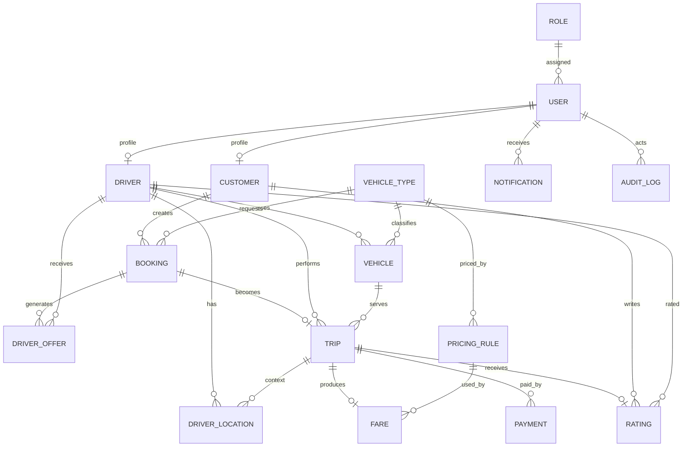

---

## 4.2 Từ điển dữ liệu chi tiết (Data Dictionary / Schema Specification)

### 4.2.1 Role

| Field | Type | Constraint | Mô tả |
|---|---|---|---|
| roleId | UUID/String | PK | Mã role |
| code | String | UNIQUE | CUSTOMER/DRIVER/OPERATOR/ADMIN/DIRECTOR |
| name | String | NOT NULL | Tên role |
| status | Enum | ACTIVE/INACTIVE | Trạng thái |
| createdAt | DateTime | NOT NULL | Ngày tạo |

### 4.2.2 User

| Field | Type | Constraint | Mô tả |
|---|---|---|---|
| userId | UUID/String | PK | User ID |
| roleId | FK | → Role | Vai trò |
| fullName | String | NOT NULL | Họ tên |
| phone | String | UNIQUE | Điện thoại |
| email | String | UNIQUE/nullable | Email |
| passwordHash | String | NOT NULL | Mật khẩu đã hash |
| status | Enum | ACTIVE/LOCKED/INACTIVE | Trạng thái |
| createdAt | DateTime | NOT NULL | Tạo lúc |
| updatedAt | DateTime | NOT NULL | Cập nhật |

### 4.2.3 Customer

| Field | Type | Constraint | Mô tả |
|---|---|---|---|
| customerId | UUID/String | PK | Customer ID |
| userId | FK | UNIQUE → User | User tương ứng |
| defaultPaymentMethod | Enum/String | Optional | Phương thức mặc định |
| createdAt | DateTime | NOT NULL | Ngày tạo |

### 4.2.4 Driver

| Field | Type | Constraint | Mô tả |
|---|---|---|---|
| driverId | UUID/String | PK | Driver ID |
| userId | FK | UNIQUE → User | User |
| licenseNumberCiphertext | String | NOT NULL | GPLX mã hóa có xác thực |
| licenseFingerprint | String | UNIQUE | Fingerprint có khóa để kiểm tra trùng |
| keyVersion | String | NOT NULL | Phiên bản khóa, không chứa khóa |
| availabilityStatus | Enum | OFFLINE/AVAILABLE/BUSY/SUSPENDED | Availability |
| verified | Boolean | Derived | true khi approvalStatus = APPROVED; không cập nhật độc lập |
| approvalStatus | Enum | PENDING/APPROVED/REJECTED | Vòng đời xét duyệt, độc lập availabilityStatus |
| reviewedBy | FK | Optional → User | Admin xét duyệt |
| reviewedAt | DateTime | Optional | Thời điểm duyệt/từ chối |
| rejectionReason | String | Required when REJECTED | Lý do từ chối |
| ratingAvg | Decimal | Optional/derived | Điểm TB |
| createdAt | DateTime | NOT NULL | Tạo lúc |
| updatedAt | DateTime | NOT NULL | Cập nhật |

### 4.2.5 VehicleType

| Field | Type | Constraint | Mô tả |
|---|---|---|---|
| vehicleTypeId | UUID/String | PK | ID |
| code | String | UNIQUE | Code |
| name | String | NOT NULL | Tên |
| capacity | Integer | > 0 | Sức chứa |
| status | Enum | ACTIVE/INACTIVE | Trạng thái |

### 4.2.6 Vehicle

| Field | Type | Constraint | Mô tả |
|---|---|---|---|
| vehicleId | UUID/String | PK | Vehicle ID |
| driverId | FK | → Driver | Tài xế |
| vehicleTypeId | FK | → VehicleType | Loại xe |
| plateNumber | String | UNIQUE | Biển số |
| brand | String | Optional | Hãng |
| model | String | Optional | Model |
| color | String | Optional | Màu |
| status | Enum | ACTIVE/INACTIVE/SUSPENDED | Trạng thái |
| createdAt | DateTime | NOT NULL | Tạo lúc |

### 4.2.7 Booking

| Field | Type | Constraint | Mô tả |
|---|---|---|---|
| bookingId | UUID/String | PK | Booking |
| customerId | FK | → Customer | Người đặt |
| vehicleTypeId | FK | → VehicleType | Loại xe |
| pickupAddress | String | NOT NULL | Điểm đón |
| pickupLat | Decimal | Valid latitude | Lat |
| pickupLng | Decimal | Valid longitude | Lng |
| destinationAddress | String | NOT NULL | Điểm đến |
| destinationLat | Decimal | Valid latitude | Lat |
| destinationLng | Decimal | Valid longitude | Lng |
| status | Enum | Booking State | Trạng thái |
| cancellationReason | String | Optional | Lý do hủy |
| createdAt | DateTime | NOT NULL | Tạo lúc |
| updatedAt | DateTime | NOT NULL | Cập nhật |

### 4.2.8 DriverOffer

| Field | Type | Constraint | Mô tả |
|---|---|---|---|
| offerId | UUID/String | PK | Offer |
| bookingId | FK | → Booking | Booking |
| driverId | FK | → Driver | Driver |
| rankOrder | Integer | >= 1 | Thứ tự Candidate |
| status | Enum | PENDING/ACCEPTED/REJECTED/TIMEOUT/CANCELED | Trạng thái |
| sentAt | DateTime | NOT NULL | Gửi lúc |
| expiresAt | DateTime | NOT NULL | Hết hạn |
| respondedAt | DateTime | Optional | Phản hồi |
| rejectReason | String | Optional | Lý do |

### 4.2.9 Trip

| Field | Type | Constraint | Mô tả |
|---|---|---|---|
| tripId | UUID/String | PK | Trip |
| paymentStatus | Enum | UNPAID/PAID, default UNPAID | PAID sau Payment COMPLETED, độc lập trạng thái chuyến |
| canceledAt | DateTime | Optional | Thời điểm hủy |
| cancellationReason | String | Required when CANCELED | Lý do hủy |
| bookingId | FK | UNIQUE → Booking | Booking nguồn |
| driverId | FK | → Driver | Driver |
| vehicleId | FK | → Vehicle | Vehicle |
| status | Enum | Trip State | Trạng thái |
| startedAt | DateTime | Optional | Bắt đầu |
| pickedUpAt | DateTime | Optional | Đón khách |
| completedAt | DateTime | Optional | Hoàn thành |
| distanceKm | Decimal | >= 0 | Khoảng cách |
| durationMinutes | Integer | >= 0 | Thời gian |
| createdAt | DateTime | NOT NULL | Tạo lúc |

### 4.2.10 DriverLocation

| Field | Type | Constraint | Mô tả |
|---|---|---|---|
| locationId | UUID/String | PK | ID |
| driverId | FK | → Driver | Driver |
| tripId | FK | Optional → Trip | Trip context |
| latitude | Decimal | Valid | Lat |
| longitude | Decimal | Valid | Lng |
| accuracyMeters | Decimal | Optional | Accuracy |
| recordedAt | DateTime | NOT NULL | Timestamp |

### 4.2.11 PricingRule

| Field | Type | Constraint | Mô tả |
|---|---|---|---|
| pricingRuleId | UUID/String | PK | Pricing ID |
| vehicleTypeId | FK | → VehicleType | Loại xe |
| baseFare | Decimal | >= 0 | Giá mở cửa |
| pricePerKm | Decimal | >= 0 | Giá/km |
| pricePerMinute | Decimal | >= 0 | Giá/phút |
| minimumFare | Decimal | >= 0 | Cước tối thiểu |
| effectiveFrom | DateTime | NOT NULL | Bắt đầu |
| effectiveTo | DateTime | Optional | Kết thúc |
| status | Enum | ACTIVE/INACTIVE | Trạng thái |
| version | Integer | NOT NULL | Version |

### 4.2.12 Fare

| Field | Type | Constraint | Mô tả |
|---|---|---|---|
| fareId | UUID/String | PK | Fare |
| tripId | FK | UNIQUE/current | Trip |
| pricingRuleId | FK | → PricingRule | Rule |
| baseAmount | Decimal | >= 0 | Base |
| distanceAmount | Decimal | >= 0 | Distance |
| timeAmount | Decimal | >= 0 | Time |
| adjustmentAmount | Decimal | Có thể +/- | Điều chỉnh |
| totalAmount | Decimal | >= 0 | Tổng |
| currency | String | Default VND | Tiền tệ |
| pricingVersion | Integer | NOT NULL | Version |
| calculatedAt | DateTime | NOT NULL | Tính lúc |

### 4.2.13 Payment

| Field | Type | Constraint | Mô tả |
|---|---|---|---|
| paymentId | UUID/String | PK | Payment |
| tripId | FK | → Trip | Trip |
| method | Enum | CASH/ELECTRONIC | Phương thức |
| provider | String | Optional | Provider |
| providerTransactionId | String | UNIQUE when present | Ref ngoài |
| idempotencyKey | String | UNIQUE theo userId | Chống trùng |
| userId | FK | NOT NULL | Người thực hiện Payment |
| requestHash | String | NOT NULL | Đối chiếu cùng khóa khác payload |
| originalResponse | JSON | NOT NULL sau tiếp nhận | HTTP status/body gốc cho replay |
| currency | String | VND | Đơn vị tiền tệ |
| amount | Decimal | >= 0 | Amount |
| status | Enum | PENDING/PROCESSING/COMPLETED/FAILED | State |
| failureReason | String | Optional | Lỗi |
| createdAt | DateTime | NOT NULL | Tạo |
| updatedAt | DateTime | NOT NULL | Update |

### 4.2.14 Notification

| Field | Type | Constraint | Mô tả |
|---|---|---|---|
| notificationId | UUID/String | PK | ID |
| userId | FK | → User | Người nhận |
| type | String/Enum | NOT NULL | Event type |
| channel | Enum | IN_APP/PUSH/SMS/EMAIL | Kênh |
| title | String | Optional | Tiêu đề |
| content | String | NOT NULL | Nội dung |
| status | Enum | PENDING/PROCESSING/SENT/DELIVERED/FAILED/EXPIRED | Trạng thái gửi, độc lập với đã đọc |
| eventId | UUID/String | NOT NULL | ID ổn định của sự kiện nguồn |
| referenceType / referenceId | String | NOT NULL | Tham chiếu Booking/Trip/Payment/DriverOffer |
| templateCode | String | NOT NULL | Mẫu nội dung theo sự kiện |
| attemptCount | Integer | >= 0, default 0 | Số lần đã thử gửi |
| nextRetryAt | DateTime | Optional | Lịch thử lại |
| expiresAt | DateTime | NOT NULL | Hạn gửi cấu hình; không vượt expiresAt của Offer |
| lastErrorCode | String | Optional | Mã lỗi không chứa dữ liệu nhạy cảm |
| deliveredAt | DateTime | Optional | Thời điểm có xác nhận delivery |
| readAt | DateTime | Optional | Thời điểm người nhận đọc IN_APP |
| updatedAt | DateTime | NOT NULL | Cập nhật gần nhất |
| providerMessageId | String | Optional | Provider ref |
| createdAt | DateTime | NOT NULL | Tạo |
| sentAt | DateTime | Optional | Gửi |

**Quy ước trạng thái Notification:**

- PENDING → PROCESSING → SENT; SENT → DELIVERED khi có xác nhận hợp lệ từ kênh ngoài.
- PROCESSING → PENDING khi lỗi tạm thời còn được retry; PROCESSING → FAILED khi lỗi vĩnh viễn/hết số lần.
- PENDING/PROCESSING → EXPIRED nếu kiểm tra trước khi gửi thấy hết hạn hoặc sự kiện không còn hiệu lực.
- SENT → FAILED nếu provider xác nhận delivery thất bại; callback cũ không được ghi đè DELIVERED.
- IN_APP chuyển SENT khi đã lưu và sẵn sàng hiển thị; readAt không phải xác nhận delivery của kênh ngoài.
- Tác vụ PROCESSING bị gián đoạn phải được thu hồi sau timeout cấu hình. Gửi lại dùng cùng khóa idempotency nếu provider hỗ trợ; nếu không hỗ trợ idempotency/tra cứu kết quả thì không cam kết gửi đúng một lần ở kênh ngoài.

### 4.2.15 Rating

| Field | Type | Constraint | Mô tả |
|---|---|---|---|
| ratingId | UUID/String | PK | ID |
| tripId | FK | UNIQUE → Trip | Trip |
| customerId | FK | → Customer | Người đánh giá |
| driverId | FK | → Driver | Driver |
| score | Integer | 1..5 | Điểm |
| comment | String | Optional | Nhận xét |
| createdAt | DateTime | NOT NULL | Tạo |

### 4.2.16 AuditLog

| Field | Type | Constraint | Mô tả |
|---|---|---|---|
| auditId | UUID/String | PK | Audit |
| actorUserId | FK/String | User/System | Actor |
| action | String | NOT NULL | Action |
| targetType | String | NOT NULL | Entity |
| targetId | String | NOT NULL | Target |
| beforeData | JSON | Optional/masked | Trước |
| afterData | JSON | Optional/masked | Sau |
| ipAddress | String | Optional | IP |
| correlationId | String | Optional | Trace |
| createdAt | DateTime | NOT NULL | Timestamp |

---

## 4.3 Chiến lược chỉ mục & Tối ưu hóa truy vấn địa không gian (Indexes & Geospatial Strategy)

### 4.3.1 Index đề xuất

| Entity / owner | Database | Index / constraint |
|---|---|---|
| User / Identity | PostgreSQL | UNIQUE(phone), UNIQUE(email) khi có; roleId FK cục bộ |
| Customer / Customer | MongoDB | unique customerId, userId, registrationId; registrationId là khóa kỹ thuật |
| Driver / Driver | MongoDB | unique driverId, userId, licenseFingerprint; approvalStatus+availabilityStatus; verified suy ra từ approvalStatus |
| Vehicle / Driver | MongoDB | unique vehicleId, plateNumber; driverId, vehicleTypeId |
| DriverReservation / Driver | MongoDB | unique driverId cho reservation hiện hành, unique assignmentId; giữ/release có điều kiện theo đúng assignment |
| Booking / Booking | PostgreSQL | customerId+createdAt, status+createdAt; một assignment thắng/bookingId |
| DriverOffer / Booking | PostgreSQL | bookingId+status, driverId+status, expiresAt; bookingId FK cục bộ |
| Trip / Trip | MongoDB | unique tripId, bookingId, assignmentId; driverId+status, status+createdAt |
| DriverLocation / Driver | MongoDB | unique sampleId; driverId+recordedAt; GeoJSON location có index 2dsphere |
| PricingRule / Trip | MongoDB | unique pricingRuleId; vehicleTypeId+status+effectiveFrom; version được kiểm soát |
| Fare / Trip | MongoDB | unique fareId; unique tripId cho Fare hiện hành; nếu lưu lịch sử version thì dùng partial unique index cho bản hiện hành |
| Payment / Payment | PostgreSQL | tripId+status, UNIQUE(userId, idempotencyKey), UNIQUE(providerTransactionId) khi có |
| Rating / Trip | MongoDB | unique ratingId, tripId; driverId+createdAt |
| Notification / Notification | MongoDB | unique(eventId,userId,channel); userId+channel+createdAt, userId+readAt, status+nextRetryAt, providerMessageId |
| AuditLog / mỗi owner | DB của service | actorUserId+createdAt, targetType+targetId; append-only theo quyền |
| Outbox / Inbox / mỗi owner có publish hoặc consume | DB của service | unique outbox.eventId, unique inbox(consumerName,eventId); outbox status+createdAt |

Index phải được tạo và kiểm chứng trong DB, không chỉ khai báo validation ở application. Các trường optional và bản ghi kỹ thuật cần index phù hợp để không xung đột giá trị thiếu/null. OTP trước đăng ký dùng delivery task riêng theo challengeId, không tạo User/Notification lịch sử giả. Constraint cục bộ không thay kiểm tra ownership qua API owner.

### 4.3.2 Geospatial Strategy

- DriverLocation thuộc Driver Service trên MongoDB. Lưu GeoJSON Point theo thứ tự tọa độ [longitude, latitude], dùng index 2dsphere để hỗ trợ truy vấn vị trí. Tham khảo [MongoDB 2dsphere indexes](https://www.mongodb.com/docs/manual/core/indexes/index-types/geospatial/2dsphere/).
- API bên ngoài vẫn dùng latitude/longitude hoặc lat/lng theo mục X; adapter chuyển sang GeoJSON, kiểm tra latitude trong [-90,90], longitude trong [-180,180] và quy đổi mét/km rõ ràng.
- Matching tại Booking gọi Driver API, không truy vấn driver_db trực tiếp. Candidate phải APPROVED/AVAILABLE, đúng VehicleType, nằm trong bán kính và có vị trí đủ mới theo freshness threshold cấu hình; lọc trước khi phân trang và tính total.
- Chỉ dùng vị trí mới nhất hợp lệ của mỗi Driver để chọn candidate, không chọn Driver dựa trên mẫu lịch sử từng nằm gần điểm đón. Giữ lịch sử phục vụ tracking theo policy.
- Location stale có thể hiển thị kèm recordedAt nhưng không được giả lập thành vị trí mới. PostGIS không phải thành phần bắt buộc của phương án dữ liệu đã chọn.

---

# V – Yêu cầu phi chức năng (Non-Functional Requirements - NFRs)

> Mọi số liệu là target đề xuất để kiểm thử, cần Sponsor xác nhận nếu biến thành SLA.

## 5.1 Hiệu năng & Khả năng đáp ứng (Performance & Latency)

| NFR | Yêu cầu |
|---|---|
| NFR-P01 | 95% API thông thường mục tiêu ≤ 2 giây |
| NFR-P02 | Candidate search/ranking mục tiêu ≤ 3 giây khi provider/DB ổn định |
| NFR-P03 | Location update hỗ trợ chu kỳ mục tiêu 5–10 giây |
| NFR-P04 | Report phổ biến mục tiêu phản hồi ≤ 5 giây với khoảng thời gian chuẩn |

---

## 5.2 Bảo mật & Quyền riêng tư (Security & Privacy)

| NFR | Yêu cầu |
|---|---|
| NFR-S01 | Endpoint private yêu cầu authentication |
| NFR-S02 | Authorization kiểm tra server-side |
| NFR-S03 | Password lưu one-way hash |
| NFR-S04 | Không lưu CVV/full card secret |
| NFR-S05 | PII/location/payment data chỉ hiển thị theo quyền |
| NFR-S06 | Audit không lưu credential/plain sensitive data |
| NFR-S07 | Password hash một chiều có salt; số GPLX lưu ciphertext có xác thực và keyVersion. Khóa nằm ngoài DB/source/Git, cấp qua secret cấu hình và có quy trình đổi khóa; log/backup không lộ plaintext hoặc khóa |
| NFR-S08 | SQL/NoSQL injection không bypass xác thực hoặc ownership; PostgreSQL dùng query tham số hóa, MongoDB chỉ nhận field/toán tử do server cho phép, không đưa nguyên object từ client vào filter/update; validate kiểu dữ liệu, trả 400/401 phù hợp, không lộ lỗi DB |
| NFR-S09 | Tên/nhận xét là plain text; API trả JSON đúng content type; client escape theo ngữ cảnh hiển thị, không thực thi script |
| NFR-S10 | JWT phải verify chữ ký, thuật toán cho phép, exp, issuer/audience; thiếu/sai/hết hạn/sửa token trả 401; decode không thay thế verification |
| NFR-S11 | JWT hợp lệ nhưng sai vai trò trả 403; Customer không thực hiện action Driver/Admin; service kiểm tra ownership |
| NFR-S12 | Gateway giới hạn POST /api/v1/bookings mặc định 30 request/phút/user và 120 request/phút/IP; vượt một ngưỡng trả 429 + Retry-After trước khi tạo Booking. Bộ đếm dùng chung, ngưỡng cấu hình được |
| NFR-S13 | Cùng Idempotency-Key và payload Payment trả HTTP status/body đã lưu, không double charge; cùng khóa khác payload trả 409; cùng Trip đã PAID không charge lại kể cả đổi khóa |

---

## 5.3 Độ tin cậy & Tính sẵn sàng (Reliability & Availability)

| NFR | Yêu cầu |
|---|---|
| NFR-R01 | Core Booking/Trip availability mục tiêu ≥ 99% |
| NFR-R02 | Notification failure không rollback core transaction |
| NFR-R03 | Payment timeout không tự suy diễn COMPLETED |
| NFR-R04 | Matching concurrency không tạo nhiều Trip cho một Booking |
| NFR-R05 | Cancellation nhất quán Booking/Trip/DriverOffer/Driver |
| NFR-R06 | Sự kiện thông báo đã commit không mất khi worker khởi động lại; xử lý lại không tạo bản ghi trùng; retry có giới hạn và thời hạn cấu hình |

---

## 5.4 Khả năng mở rộng & Kiến trúc (Scalability & Architecture)

| NFR | Yêu cầu |
|---|---|
| NFR-A01 | Customer, Booking, Trip, Driver/location, Payment và Notification có thể triển khai/scale độc lập; Matching nằm trong Booking |
| NFR-A02 | Provider tích hợp qua adapter/interface |
| NFR-A03 | Pricing là cấu hình dữ liệu, không hard-code UI |
| NFR-A04 | Cho phép thêm VehicleType/Payment/Notification Service |
| NFR-A05 | Client và callback ngoài đi qua Gateway; service/DB/broker trong network nội bộ; IPC không bắt buộc vòng qua Gateway |
| NFR-A06 | Database per service theo README: Identity/Booking/Payment dùng PostgreSQL, Customer/Driver/Trip/Notification dùng MongoDB; tài khoản DB riêng và quyền tối thiểu. IPC HTTP nội bộ/Kafka; không đọc/ghi/join trực tiếp DB service khác |
| NFR-A07 | compose.yaml khởi động 8 container ứng dụng và 4 container hạ tầng PostgreSQL/MongoDB/Kafka/Redis của demo; MongoDB có replica set hỗ trợ transaction, DB/broker có volume và health/readiness. Cấu hình qua môi trường/secret, .env thật không vào Git |

---

## 5.5 Khả năng sử dụng & Trải nghiệm (Usability & User Experience)

| NFR | Yêu cầu |
|---|---|
| NFR-U01 | State hiển thị nhất quán giữa UI/API |
| NFR-U02 | Thông báo lỗi dễ hiểu, không lộ chi tiết bảo mật |
| NFR-U03 | Customer xem được progress của Booking/Trip |
| NFR-U04 | Operator có filter/search cho danh sách lớn |

---

## 5.6 Khả năng bảo trì & Giám sát (Maintainability & Observability)

| NFR | Yêu cầu |
|---|---|
| NFR-M01 | Module có trách nhiệm rõ |
| NFR-M02 | Request quan trọng có correlation/request ID |
| NFR-M03 | Lỗi provider được log có cấu trúc |
| NFR-M04 | AuditLog có actor/action/target/time |
| NFR-M05 | Có backup/restore phù hợp môi trường triển khai |
| NFR-M06 | Giám sát backlog, độ trễ gửi, tỷ lệ lỗi/retry theo kênh; cảnh báo khi vượt ngưỡng cấu hình; log có eventId/notificationId nhưng không chứa token/credential |

---

## 5.7 Ma trận truy xuất NFRs với Business Goals (NFR-BG Traceability Matrix)

| NFR | BG liên quan |
|---|---|
| NFR-P01–P04 | BG-02, BG-04, BG-05 |
| NFR-S01–S13 | BG-12 |
| NFR-R01–R05 | BG-01, BG-03, BG-11 |
| NFR-R06, NFR-M06 | BG-08, BG-11 |
| NFR-A01–A07 | BG-02, BG-11, BG-12 |
| NFR-U01–U04 | BG-01, BG-05, BG-09 |
| NFR-M01–M05 | BG-09, BG-11, BG-12 |

---

# VI – Mô hình hóa Use Case (Use Case Modeling & Diagrams)

## 6.1 Danh mục Tác nhân (Actor Catalog)

| Actor | Mô tả |
|---|---|
| Customer | Người sử dụng dịch vụ đặt xe |
| Driver | Người thực hiện Trip |
| Operator | Nhân viên vận hành |
| Admin | Quản trị hệ thống |
| Giám đốc | Xem báo cáo/ra quyết định |
| Payment Provider | Hệ thống thanh toán ngoài |
| Map/GPS Provider | Bản đồ, khoảng cách, ETA |
| Notification Service | Hệ thống ngoài gửi Push/SMS/Email; trả mã tham chiếu và phản hồi delivery nếu hỗ trợ |
| System | Tác nhân tự động cho matching/fare/audit |

---

## 6.2 Sơ đồ Use Case Tổng thể (System-Level Use Case Diagram)

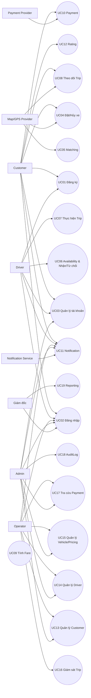

---

## 6.3 Sơ đồ Use Case theo từng Nhóm Tác nhân

### 6.3.1 Customer

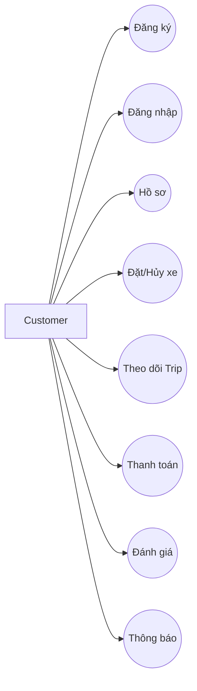

### 6.3.2 Driver

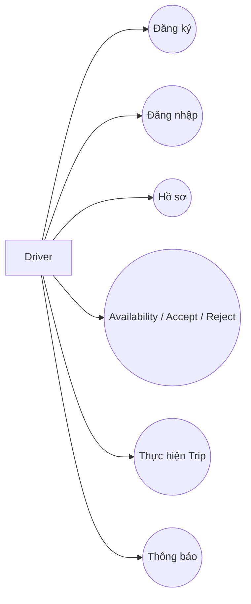

### 6.3.3 Operator/Admin/Director

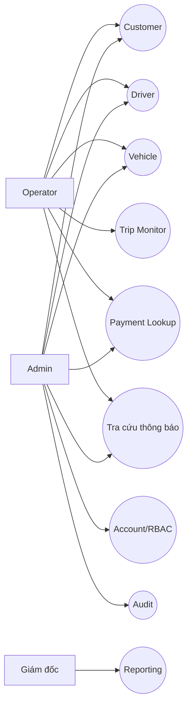

---

## 6.4 Bảng đặc tả chi tiết các Use Case cốt lõi (Use Case Specifications)


### UC01 – Đăng ký tài khoản

**Luồng bổ sung phục vụ phiếu chấm:** Nhánh Driver (FR76): phone → gửi OTP → verify → registrationToken một lần, hạn 5 phút, ràng buộc phone/mục đích → nộp hồ sơ cá nhân/xe → User/Driver/Vehicle tạo nhất quán, PENDING/OFFLINE. Token đăng ký không được gọi API nghiệp vụ. OTP sai/hết hạn/đã dùng bị từ chối; vượt giới hạn trả 429. Customer không bắt buộc OTP trong phạm vi chấm.

| Thành phần | Nội dung |
|---|---|
| **Use Case ID** | UC01 |
| **Tên** | Đăng ký tài khoản |
| **Actor** | Customer, Driver |
| **Mục tiêu** | Người dùng tạo tài khoản mới. |
| **Tiền điều kiện** | Chưa có tài khoản trùng định danh. |
| **Hậu điều kiện** | User và profile tương ứng được tạo. |

**Luồng chính (Customer; Driver dùng nhánh OTP nêu trên):**

1. Mở màn hình đăng ký.
2. Chọn đăng ký Customer; nếu chọn Driver, chuyển nhánh OTP bắt buộc.
3. Nhập thông tin bắt buộc.
4. Hệ thống validate.
5. Kiểm tra phone/email trùng.
6. Tạo User.
7. Tạo Customer/Driver profile.
8. Thông báo thành công.

**Luồng thay thế / ngoại lệ:**

- E1: Thiếu dữ liệu → yêu cầu nhập lại.
- E2: Định danh đã tồn tại → từ chối.
- E3: Lỗi lưu → rollback.


### UC02 – Đăng nhập

| Thành phần | Nội dung |
|---|---|
| **Use Case ID** | UC02 |
| **Tên** | Đăng nhập |
| **Actor** | Customer, Driver, Operator, Admin, Giám đốc |
| **Mục tiêu** | Xác thực người dùng. |
| **Tiền điều kiện** | Account tồn tại. |
| **Hậu điều kiện** | Cấp JWT access token nếu hợp lệ. |

**Luồng chính:**

1. Nhập credential.
2. Hệ thống xác thực.
3. Kiểm tra account status.
4. Xác định role/permission.
5. Cấp JWT access token.
6. Điều hướng theo role.

**Luồng thay thế / ngoại lệ:**

- E1: Sai credential → từ chối.
- E2: LOCKED/INACTIVE → từ chối.


### UC03 – Quản lý tài khoản

**Luồng bổ sung phục vụ phiếu chấm:** Tra cứu theo mã (FR75/FR78): JWT + ID → kiểm tra quyền → trả hồ sơ theo phạm vi; không trả passwordHash, OTP, ciphertext/khóa. Không tồn tại trả 404, sai quyền trả 403.

| Thành phần | Nội dung |
|---|---|
| **Use Case ID** | UC03 |
| **Tên** | Quản lý tài khoản |
| **Actor** | Customer, Driver, Admin; Operator theo quyền |
| **Mục tiêu** | Cập nhật profile và quản trị access. |
| **Tiền điều kiện** | Đã đăng nhập. |
| **Hậu điều kiện** | Thay đổi được lưu; action quản trị được audit. |

**Luồng chính:**

1. Mở profile.
2. Tải dữ liệu được phép.
3. Sửa trường cho phép.
4. Admin có thể quản lý access theo quyền.
5. Validate.
6. Lưu.
7. Audit nếu cần.

**Luồng thay thế / ngoại lệ:**

- E1: Unauthorized → từ chối.
- E2: Dữ liệu không hợp lệ → không lưu.


### UC04 – Đặt/Hủy xe

**Luồng bổ sung phục vụ phiếu chấm:** FR80: Customer xem Booking của mình mọi trạng thái với page/limit, không dùng lịch sử Trip thay thế. Hủy phải nhập lý do và xác nhận, chỉ trước PICKED_UP; đồng bộ CANCELED, giải phóng Driver và thông báo; hủy không hợp lệ trả 409.

| Thành phần | Nội dung |
|---|---|
| **Use Case ID** | UC04 |
| **Tên** | Đặt/Hủy xe |
| **Actor** | Customer |
| **Mục tiêu** | Tạo Booking hoặc hủy Booking theo policy. |
| **Tiền điều kiện** | Customer ACTIVE; VehicleType ACTIVE. |
| **Hậu điều kiện** | Booking SEARCHING_DRIVER hoặc CANCELED. |

**Luồng chính:**

1. Nhập pickup.
2. Nhập destination.
3. Chọn VehicleType.
4. Chuẩn hóa tọa độ qua Map/GPS nếu cần.
5. Validate.
6. Xác nhận.
7. Tạo Booking CREATED.
8. Chuyển SEARCHING_DRIVER.
9. Phát matching event.

**Luồng thay thế / ngoại lệ:**

- E1: Địa chỉ/tọa độ lỗi → sửa.
- E2: VehicleType inactive → từ chối.
- E3: Hủy trước confirm → không tạo.
- E4: Hủy sau tạo khi policy cho phép → đồng bộ cancellation.


### UC05 – Tìm và phân công tài xế

**Luồng bổ sung phục vụ phiếu chấm:** FR79: truy vấn Driver quanh lat/lng, radiusKm mặc định 1, page/limit; lọc quyền/trạng thái và khoảng cách trước phân trang, trả distanceKm và total. API này độc lập với việc gửi Offer trong matching.

| Thành phần | Nội dung |
|---|---|
| **Use Case ID** | UC05 |
| **Tên** | Tìm và phân công tài xế |
| **Actor** | System; Driver |
| **Mục tiêu** | Tìm Driver phù hợp và tạo Trip sau Accept. |
| **Tiền điều kiện** | Booking SEARCHING_DRIVER. |
| **Hậu điều kiện** | Driver assigned + Trip created, hoặc NO_DRIVER_FOUND. |

**Luồng chính:**

1. Tìm Driver AVAILABLE.
2. Lọc verified/VehicleType.
3. Lấy location.
4. Tính khoảng cách.
5. Rank candidates.
6. Tạo DriverOffer.
7. Gửi Offer.
8. Driver ACCEPT.
9. Booking kiểm tra có điều kiện Booking/Offer, Driver giữ chỗ có điều kiện; workflow phối hợp Trip theo mục 9.3.4, chỉ một assignment thắng.
10. Offer ACCEPTED.
11. Booking DRIVER_ASSIGNED.
12. Driver BUSY.
13. Tạo Trip ASSIGNED.
14. Cancel các Offer khác.

**Luồng thay thế / ngoại lệ:**

- E1: REJECT → candidate tiếp.
- E2: TIMEOUT → candidate tiếp.
- E3: Hết candidate → NO_DRIVER_FOUND.
- E4: Accept đồng thời → chỉ một Driver thắng.
- E5: Booking cancelled → reject late accept.


### UC06 – Availability & Nhận/Từ chối chuyến

| Thành phần | Nội dung |
|---|---|
| **Use Case ID** | UC06 |
| **Tên** | Availability & Nhận/Từ chối chuyến |
| **Actor** | Driver |
| **Mục tiêu** | Driver quản lý Availability và phản hồi Offer. |
| **Tiền điều kiện** | Driver đăng nhập, verified. |
| **Hậu điều kiện** | Availability/Offer cập nhật hợp lệ. |

**Luồng chính:**

1. Driver bật AVAILABLE.
2. Nhận Offer.
3. Xem thông tin cần thiết.
4. Chọn ACCEPT/REJECT.
5. Nếu ACCEPT, kiểm tra Offer còn hạn và Driver AVAILABLE.
6. Nếu hợp lệ, chuyển sang flow assignment.
7. Nếu REJECT, matching tiếp tục.

**Luồng thay thế / ngoại lệ:**

- E1: BUSY/SUSPENDED không bật AVAILABLE.
- E2: Offer expired không accept.
- E3: Offer processed không xử lý lại.


### UC07 – Thực hiện chuyến

| Thành phần | Nội dung |
|---|---|
| **Use Case ID** | UC07 |
| **Tên** | Thực hiện chuyến |
| **Actor** | Driver |
| **Mục tiêu** | Thực hiện Trip lifecycle. |
| **Tiền điều kiện** | Trip ASSIGNED. |
| **Hậu điều kiện** | Trip COMPLETED/CANCELED; Driver release. |

**Luồng chính:**

1. DRIVER_ARRIVING.
2. DRIVER_ARRIVED.
3. PICKED_UP.
4. IN_PROGRESS.
5. Gửi location.
6. COMPLETED.
7. Phát Fare event.
8. Release Driver theo online state.

**Luồng thay thế / ngoại lệ:**

- E1: Sai transition → reject.
- E2: Sai Driver → reject.
- E3: GPS lỗi → Trip vẫn tiếp tục.
- E4: Cancellation hợp lệ → CANCELED.


### UC08 – Theo dõi chuyến

| Thành phần | Nội dung |
|---|---|
| **Use Case ID** | UC08 |
| **Tên** | Theo dõi chuyến |
| **Actor** | Customer |
| **Mục tiêu** | Xem trạng thái và vị trí Trip. |
| **Tiền điều kiện** | Customer sở hữu Trip. |
| **Hậu điều kiện** | Hiển thị dữ liệu mới nhất. |

**Luồng chính:**

1. Mở Trip.
2. Check ownership.
3. Load status.
4. Load Driver/Vehicle.
5. Load latest location.
6. Tính ETA nếu có.
7. Hiển thị.

**Luồng thay thế / ngoại lệ:**

- E1: GPS stale → hiển thị thời gian cập nhật.
- E2: Map Provider lỗi → ETA unavailable.
- E3: Trip complete → show summary.


### UC09 – Tính cước

| Thành phần | Nội dung |
|---|---|
| **Use Case ID** | UC09 |
| **Tên** | Tính cước |
| **Actor** | System |
| **Mục tiêu** | Tạo Fare từ Trip và PricingRule. |
| **Tiền điều kiện** | Trip COMPLETED. |
| **Hậu điều kiện** | Fare được lưu và truy vết rule. |

**Luồng chính:**

1. Nhận Trip completed.
2. Lấy VehicleType.
3. Tìm PricingRule.
4. Lấy distance/duration.
5. Tính thành phần cước.
6. Áp minimum fare.
7. Lưu Fare + version.
8. Thông báo amount.

**Luồng thay thế / ngoại lệ:**

- E1: Không có PricingRule → lỗi nghiệp vụ.
- E2: Thiếu Trip metrics → xử lý lỗi.
- E3: Recalculate → không tạo duplicate logic.


### UC10 – Thanh toán

**Luồng bổ sung phục vụ phiếu chấm:** Callback phải xác thực chữ ký, đối chiếu paymentId/providerTransactionId, amount/currency; hợp lệ mới chuyển Payment COMPLETED và Trip.paymentStatus=PAID. Replay cùng khóa/payload trả kết quả gốc; khác payload trả 409. Nếu giao dịch gốc đang xử lý trả cùng paymentId/PROCESSING, không charge thêm.

| Thành phần | Nội dung |
|---|---|
| **Use Case ID** | UC10 |
| **Tên** | Thanh toán |
| **Actor** | Customer; Payment Provider |
| **Mục tiêu** | Thanh toán Fare. |
| **Tiền điều kiện** | Trip COMPLETED; Fare tồn tại. |
| **Hậu điều kiện** | Payment final/pending reconcile. |

**Luồng chính:**

1. Chọn method.
2. CASH hoặc ELECTRONIC.
3. Electronic: tạo Payment + idempotencyKey.
4. Gọi Provider.
5. Cập nhật PROCESSING.
6. Nhận callback/result.
7. Check idempotency.
8. COMPLETED/FAILED.
9. Notification.

**Luồng thay thế / ngoại lệ:**

- E1: Provider timeout → pending/reconcile.
- E2: Callback trùng → idempotent.
- E3: Failed → retry theo policy.
- E4: Amount mismatch → không COMPLETED.


### UC11 – Gửi và quản lý thông báo

| Thành phần | Nội dung |
|---|---|
| **Use Case ID** | UC11 |
| **Tên** | Gửi và quản lý thông báo |
| **Actor** | System; Notification Service; Customer; Driver; Operator/Admin theo quyền |
| **Mục tiêu** | Gửi đúng sự kiện/người nhận; xem lịch sử và truy vết trạng thái xử lý. |
| **Tiền điều kiện** | Sự kiện đã commit có eventId và người nhận hợp lệ; thao tác xem/đánh dấu đã đọc yêu cầu đăng nhập. |
| **Hậu điều kiện** | Notification được lưu, trạng thái có thể truy vết; lỗi gửi không rollback nghiệp vụ nguồn. |

**Luồng chính:**

1. Nhận sự kiện đã commit được lưu bền vững cùng eventId.
2. Xác định người nhận theo ma trận BP-09 và quyền sở hữu Booking/Trip/Payment/Offer.
3. Chọn template/kênh; kiểm tra địa chỉ/token và hiệu lực sự kiện.
4. Tạo hoặc lấy bản ghi PENDING theo eventId + userId + channel; không tạo trùng hay gửi lại bản ghi đã gửi.
5. IN_APP: lưu để hiển thị; kênh ngoài: worker chuyển PROCESSING và gọi Notification Service bất đồng bộ.
6. Lưu lần thử, mã tham chiếu; chuyển SENT khi kênh chấp nhận, DELIVERED khi có xác nhận hợp lệ.
7. Customer/Driver xem lịch sử IN_APP của mình, số chưa đọc và đánh dấu đã đọc; kiểm tra ownership ở server.
8. Operator/Admin tra cứu trạng thái/lỗi theo quyền; hệ thống ghi log và chỉ số giám sát.

**Luồng thay thế / ngoại lệ:**

- E1: Lỗi tạm thời/timeout/rate limit → PENDING và lên lịch retry có giới hạn; hết số lần → FAILED.
- E2: Token/địa chỉ sai hoặc lỗi vĩnh viễn → FAILED cho kênh đó; không rollback nghiệp vụ nguồn.
- E3: Hết hạn hoặc Offer đã xử lý → EXPIRED, không gửi tiếp.
- E4: Sự kiện/callback trùng → xử lý idempotent; callback sai xác thực hoặc không khớp tham chiếu → từ chối.
- E5: Chỉ có xác nhận tiếp nhận → giữ SENT, không suy diễn DELIVERED/đã đọc.
- E6: Truy cập thông báo của người khác → từ chối.


### UC12 – Đánh giá tài xế

| Thành phần | Nội dung |
|---|---|
| **Use Case ID** | UC12 |
| **Tên** | Đánh giá tài xế |
| **Actor** | Customer |
| **Mục tiêu** | Đánh giá Driver sau Trip. |
| **Tiền điều kiện** | Trip COMPLETED thuộc Customer; chưa rating. |
| **Hậu điều kiện** | Rating được lưu. |

**Luồng chính:**

1. Mở trip history.
2. Chọn trip.
3. Nhập score/comment.
4. Validate ownership + uniqueness.
5. Lưu Rating.
6. Cập nhật aggregate nếu dùng.

**Luồng thay thế / ngoại lệ:**

- E1: Score ngoài 1–5 → reject.
- E2: Trip chưa complete → reject.
- E3: Đã rating → reject.


### UC13 – Quản lý khách hàng

| Thành phần | Nội dung |
|---|---|
| **Use Case ID** | UC13 |
| **Tên** | Quản lý khách hàng |
| **Actor** | Operator, Admin |
| **Mục tiêu** | Tra cứu/cập nhật/khóa mở Customer. |
| **Tiền điều kiện** | Có quyền. |
| **Hậu điều kiện** | Customer state cập nhật + audit. |

**Luồng chính:**

1. Mở danh sách.
2. Search/filter.
3. Xem detail.
4. Update/lock/unlock.
5. Authorize.
6. Save.
7. Audit.

**Luồng thay thế / ngoại lệ:**

- E1: Unauthorized → reject.
- E2: Customer không tồn tại → not found.


### UC14 – Quản lý tài xế

**Luồng bổ sung phục vụ phiếu chấm:** FR77: Admin xem danh sách PENDING → xem hồ sơ/xe → APPROVED hoặc REJECTED kèm reason → lưu reviewedBy/reviewedAt → audit và thông báo. Duyệt không tự bật AVAILABLE; Operator không được xét duyệt; hồ sơ không còn PENDING trả 409 khi duyệt lại.

| Thành phần | Nội dung |
|---|---|
| **Use Case ID** | UC14 |
| **Tên** | Quản lý tài xế |
| **Actor** | Operator, Admin |
| **Mục tiêu** | Quản lý Driver profile/status. |
| **Tiền điều kiện** | Có quyền. |
| **Hậu điều kiện** | Driver được cập nhật + audit. |

**Luồng chính:**

1. Mở Driver list.
2. Filter status.
3. Xem profile/vehicle/availabilities.
4. Admin duyệt/từ chối hồ sơ; suspend/reactivate theo quyền vận hành.
5. Check active Trip.
6. Save.
7. Audit.

**Luồng thay thế / ngoại lệ:**

- E1: Suspend Driver BUSY → theo policy, không làm mất Trip.
- E2: Unauthorized → reject.


### UC15 – Quản lý phương tiện & bảng giá

| Thành phần | Nội dung |
|---|---|
| **Use Case ID** | UC15 |
| **Tên** | Quản lý phương tiện & bảng giá |
| **Actor** | Operator, Admin |
| **Mục tiêu** | Quản lý Vehicle/VehicleType/PricingRule. |
| **Tiền điều kiện** | Có quyền. |
| **Hậu điều kiện** | Dữ liệu hợp lệ được cập nhật. |

**Luồng chính:**

1. Mở Vehicle/Pricing.
2. Create/update Vehicle.
3. Check plate uniqueness.
4. Manage VehicleType.
5. Manage PricingRule nếu có quyền.
6. Validate effective period.
7. Save.
8. Audit.

**Luồng thay thế / ngoại lệ:**

- E1: Plate trùng → reject.
- E2: Reference invalid → reject.
- E3: Pricing overlap trái policy → reject/warn.


### UC16 – Giám sát chuyến đi

| Thành phần | Nội dung |
|---|---|
| **Use Case ID** | UC16 |
| **Tên** | Giám sát chuyến đi |
| **Actor** | Operator, Admin |
| **Mục tiêu** | Giám sát Trip active và hỗ trợ sự cố. |
| **Tiền điều kiện** | Có quyền. |
| **Hậu điều kiện** | Trip được theo dõi; action được audit. |

**Luồng chính:**

1. Mở monitoring.
2. Filter active/problem trips.
3. Chọn Trip.
4. Xem Customer/Driver/Vehicle/status/location.
5. Thực hiện action được phép.
6. Audit.

**Luồng thay thế / ngoại lệ:**

- E1: Trip not found.
- E2: Action unauthorized → read-only.
- E3: Location unavailable → show degraded state.


### UC17 – Tra cứu giao dịch

| Thành phần | Nội dung |
|---|---|
| **Use Case ID** | UC17 |
| **Tên** | Tra cứu giao dịch |
| **Actor** | Operator, Admin |
| **Mục tiêu** | Tra cứu Payment. |
| **Tiền điều kiện** | Có quyền. |
| **Hậu điều kiện** | Payment data hiển thị đúng phạm vi. |

**Luồng chính:**

1. Nhập search criteria.
2. Query paymentId/tripId/status/date/provider ref.
3. Hiển thị list.
4. Xem detail.

**Luồng thay thế / ngoại lệ:**

- E1: No result → empty state.
- E2: Unauthorized → reject.


### UC18 – Ghi nhận Audit Log

| Thành phần | Nội dung |
|---|---|
| **Use Case ID** | UC18 |
| **Tên** | Ghi nhận Audit Log |
| **Actor** | System |
| **Mục tiêu** | Truy vết thao tác quan trọng. |
| **Tiền điều kiện** | Có action cần audit. |
| **Hậu điều kiện** | Audit record được lưu. |

**Luồng chính:**

1. Resolve actor.
2. Action.
3. Target.
4. Mask sensitive fields.
5. Store before/after nếu cần.
6. Correlation ID.
7. Persist.

**Luồng thay thế / ngoại lệ:**

- E1: Sensitive payload → mask.
- E2: Audit storage lỗi → observability alert.


### UC19 – Xem báo cáo

| Thành phần | Nội dung |
|---|---|
| **Use Case ID** | UC19 |
| **Tên** | Xem báo cáo |
| **Actor** | Giám đốc; Admin/Operator theo quyền |
| **Mục tiêu** | Xem báo cáo vận hành/kinh doanh. |
| **Tiền điều kiện** | Có quyền report. |
| **Hậu điều kiện** | Report theo filter. |

**Luồng chính:**

1. Chọn loại report.
2. Chọn time/filter.
3. Validate.
4. Aggregate Trip/Fare/Payment/Customer/Driver.
5. Hiển thị KPI/table/chart.
6. Hiển thị freshness.

**Luồng thay thế / ngoại lệ:**

- E1: Invalid range → reject.
- E2: No data → empty report.
- E3: Unauthorized → reject.


---

# VII – Tiêu chí chấp nhận (Acceptance Criteria - AC)

## 7.1 Nguyên tắc & Định dạng Tiêu chí chấp nhận (Given-When-Then & Rule-based AC)

Acceptance Criteria được viết theo hai dạng:

**Given–When–Then**
```text
Given <điều kiện ban đầu>
When <hành động/sự kiện>
Then <kết quả mong đợi>
```

**Rule-based**
```text
ACxx.y – Hệ thống phải ...
```

AC phải:
- Có thể kiểm thử.
- Trace được về FR.
- Không phụ thuộc UI cụ thể nếu UI chưa chốt.
- Bao gồm positive, negative, boundary và exception khi cần.

---

## 7.2 Bảng tổng hợp Tiêu chí chấp nhận chi tiết theo từng Phân hệ chức năng

### 7.2.1 Account & Access

| AC | Given | When | Then |
|---|---|---|---|
| AC01.1 | Dữ liệu đăng ký hợp lệ | User gửi đăng ký | Tạo User/Profile |
| AC01.2 | Phone/email đã tồn tại | Đăng ký | Không tạo trùng |
| AC02.1 | Credential đúng + ACTIVE | Login | Cấp JWT access token |
| AC02.2 | Credential sai/LOCKED | Login | Từ chối |
| AC03.1 | User đã login | Update profile hợp lệ | Lưu dữ liệu |
| AC03.2 | Admin có quyền | Đổi role/statuses | Lưu + Audit |

### 7.2.2 Booking & Matching

| AC | Given | When | Then |
|---|---|---|---|
| AC04.1 | Pickup/destination/type hợp lệ | Confirm Booking | Booking → SEARCHING_DRIVER |
| AC04.2 | Booking ở state cho phép | Customer cancel | Booking → CANCELED + cleanup |
| AC05.1 | Có Driver phù hợp | Matching | Chỉ AVAILABLE + đúng VehicleType được xét |
| AC05.2 | Driver Reject | Offer response | Offer REJECTED + candidate tiếp |
| AC05.3 | Driver Timeout | Offer expiry | TIMEOUT + candidate tiếp |
| AC05.4 | Hai Driver accept | Concurrent requests | Chỉ một assignment thành công |
| AC05.5 | Không còn Driver | Matching kết thúc | Booking → NO_DRIVER_FOUND |
| AC06.1 | Driver OFFLINE | Driver bật online | → AVAILABLE nếu hợp lệ |
| AC06.2 | Offer còn hạn | Driver ACCEPT | Offer ACCEPTED, Driver BUSY, Trip tạo |
| AC06.3 | Offer hết hạn | Driver ACCEPT | Bị từ chối |

### 7.2.3 Trip & Tracking

| AC | Given | When | Then |
|---|---|---|---|
| AC07.1 | Driver sở hữu Trip | Update đúng transition | State cập nhật |
| AC07.2 | Transition sai | Update | Reject |
| AC07.3 | Trip IN_PROGRESS | Complete | COMPLETED + Fare event |
| AC08.1 | Customer sở hữu Trip | Mở tracking | Xem status/Driver/Vehicle |
| AC08.2 | GPS stale | Tracking | Hiển thị location cuối + timestamp |
| AC08.3 | Map lỗi | Tracking | ETA unavailable, Trip không lỗi |

### 7.2.4 Fare & Payment

| AC | Given | When | Then |
|---|---|---|---|
| AC09.1 | Trip COMPLETED + rule tồn tại | Calculate | Tạo Fare |
| AC09.2 | Không có PricingRule | Calculate | Không tạo Fare, log lỗi |
| AC09.3 | Fare tạo | Persist | Lưu pricing version |
| AC10.1 | Electronic Payment | Send provider | Payment PROCESSING |
| AC10.2 | Provider success | Callback | Payment COMPLETED |
| AC10.3 | Provider timeout | No final result | Không tự COMPLETED |
| AC10.4 | Callback trùng | Receive duplicate | Không xử lý logic trùng |
| AC10.5 | Payment data | Persist | Không lưu CVV/full card secret |

### 7.2.5 Notification & Rating

| AC | Given | When | Then |
|---|---|---|---|
| AC11.1 | Domain event xảy ra | Notification handler | Tạo Notification |
| AC11.2 | Provider lỗi tạm thời | Send | Lưu lỗi, lên lịch retry; core transaction giữ nguyên |
| AC11.3 | Cùng eventId, userId, channel | Xử lý sự kiện lặp/đồng thời | Một bản ghi Notification, không tạo tác vụ gửi mới cho bản ghi đã gửi |
| AC11.4 | Lỗi vĩnh viễn hoặc hết số lần retry | Xử lý lỗi | FAILED, không tự retry tiếp |
| AC11.5 | Offer hết hạn/đã xử lý | Worker chuẩn bị gửi/retry | EXPIRED, không gọi provider |
| AC11.6 | Booking/Trip hủy hoặc NO_DRIVER_FOUND | Xử lý sự kiện | Đúng người nhận và nội dung theo BP-09 |
| AC11.7 | User đăng nhập | Xem danh sách/đánh dấu đã đọc IN_APP | Chỉ truy cập thông báo của mình; readAt và số chưa đọc nhất quán |
| AC11.8 | User khác chủ sở hữu | Đọc/đánh dấu đã đọc | Từ chối, không lộ nội dung |
| AC11.9 | Provider chỉ xác nhận tiếp nhận | Xử lý kết quả gửi | SENT, chưa có deliveredAt/readAt |
| AC11.10 | Callback hợp lệ/không hợp lệ/trùng | Nhận callback | Cập nhật đúng tham chiếu; từ chối callback không hợp lệ; callback trùng/cũ không làm lùi DELIVERED |
| AC11.11 | Worker ngừng sau khi sự kiện đã commit | Khởi động lại | Tiếp tục xử lý từ dữ liệu bền vững, không tạo Notification trùng |
| AC11.12 | Một kênh có token/địa chỉ sai | Gửi đa kênh | Kênh lỗi FAILED; IN_APP vẫn xem được, nghiệp vụ nguồn giữ nguyên |
| AC11.13 | Operator/Admin có hoặc không có quyền | Tra cứu lỗi | Chỉ người có quyền xem trạng thái; không lộ token/credential |
| AC12.1 | Trip COMPLETED thuộc Customer | Submit 1–5 | Lưu Rating |
| AC12.2 | Đã rating | Submit lần 2 | Reject |

### 7.2.6 Operations, Audit & Reporting

| AC | Given | When | Then |
|---|---|---|---|
| AC13.1 | Operator/Admin có quyền | Update Customer | Save + audit |
| AC14.1 | Admin/Operator có quyền | Suspend/reactivate Driver | Update + audit |
| AC15.1 | Plate chưa tồn tại | Create Vehicle | Success |
| AC15.2 | PricingRule hợp lệ | Save | Có version/effective period |
| AC16.1 | Operator có quyền | Open monitor | Xem active Trips |
| AC17.1 | Payment tồn tại | Search | Xem detail theo quyền |
| AC18.1 | Admin action | Complete action | Audit actor/action/target/time |
| AC19.1 | Director có quyền | Filter report | Hiển thị KPI |
| AC19.2 | Invalid date range | Run report | Reject |

---

## 7.3 Ma trận đối soát Acceptance Criteria với Functional Requirements (AC-FR Matrix)

| AC Group | FR liên quan |
|---|---|
| AC01 | FR01, FR76 |
| AC02 | FR02, FR56 |
| AC03 | FR03, FR04, FR57–FR59, FR75, FR78 |
| AC04 | FR05–FR10, FR66, FR67, FR80 |
| AC05 | FR11–FR20, FR64, FR67, FR79 |
| AC06 | FR21, FR22, FR54, FR64 |
| AC07 | FR23–FR28, FR54, FR66 |
| AC08 | FR29–FR33, FR67 |
| AC09 | FR34, FR63, FR68 |
| AC10 | FR35–FR38, FR65 |
| AC11 | FR40–FR45, FR70–FR74 |
| AC12 | FR39 |
| AC13 | FR46–FR49 |
| AC14 | FR50, FR54, FR77 |
| AC15 | FR51, FR63 |
| AC16 | FR52, FR53 |
| AC17 | FR55 |
| AC18 | FR59 |
| AC19 | FR60–FR62, FR69 |

---

# VIII – Ma trận Truy xuất Yêu cầu (Requirements Traceability Matrix - RTM)

## 8.1 Mục đích & Cấu trúc Ma trận RTM

RTM dùng để đảm bảo mọi yêu cầu nghiệp vụ đều được phân rã tới chức năng, Use Case và Acceptance Criteria.

```text
Business Problem
→ Business Goal
→ Business Requirement
→ Business Process
→ Functional Requirement
→ Business Rule / Exception
→ Use Case
→ Acceptance Criteria
→ Test Case
```

Khi xây dựng bộ Test Case, nên tiếp tục trace:
```text
AC → TC_ID
```

---

## 8.2 Bảng Ma trận Truy xuất Yêu cầu Toàn diện (RTM Table)

| Problem | BG | BR | BP | FR | UC | AC |
|---|---|---|---|---|---|---|
| BPB-01 Matching thủ công | BG-01, BG-04 | BR-015–BR-021 | BP-04 | FR11–FR22, FR64 | UC05, UC06 | AC05, AC06 |
| BPB-02 Tracking | BG-05 | BR-014, BR-024–BR-026 | BP-06 | FR28–FR33, FR67 | UC07, UC08 | AC07, AC08 |
| BPB-03 Payment | BG-03 | BR-027–BR-033 | BP-07, BP-08 | FR34–FR38, FR63, FR65, FR68 | UC09, UC10 | AC09, AC10 |
| BPB-04 Driver state | BG-07 | BR-010–BR-014 | BP-02 | FR54 | UC06, UC14 | AC06, AC14 |
| BPB-05 Pricing | BG-06 | BR-027–BR-029 | BP-07 | FR34, FR63, FR68 | UC09, UC15 | AC09, AC15 |
| BPB-06 Audit | BG-12 | BR-045–BR-048 | BP-12 | FR56–FR59 | UC02, UC03, UC18 | AC02, AC03, AC18 |
| BPB-07 Reporting | BG-10 | BR-044 | BP-13 | FR60–FR62, FR69 | UC19 | AC19 |
| Account management | BG-01, BG-12 | BR-001–BR-004, BR-045–BR-048 | BP-01 | FR01–FR04, FR56–FR59 | UC01–UC03 | AC01–AC03 |
| Booking cancellation | BG-01 | BR-008–BR-009 | BP-03 | FR10, FR66 | UC04 | AC04 |
| Notification | BG-08, BG-11 | BR-034–BR-036 | BP-09 | FR40–FR45, FR70–FR74 | UC11 | AC11 |
| Rating | BG-05 | BR-037–BR-038 | BP-10 | FR39 | UC12 | AC12 |
| Operations | BG-09 | BR-039–BR-043 | BP-11 | FR46–FR55, FR77 | UC13–UC17 | AC13–AC17 |
| Driver onboarding | BG-07, BG-12 | BR-001, BR-010, BR-035, BR-045–BR-048 | BP-01, BP-09, BP-11 | FR76, FR77, FR74 | UC01, UC11, UC14 | AC01.3, AC01.4, AC11.14, AC14.2, AC14.3 |
| Profile lookup | BG-09, BG-12 | BR-003, BR-010, BR-039, BR-046 | BP-01, BP-11 | FR75, FR78 | UC03 | AC03.3 |
| Nearby Driver API | BG-04 | BR-014–BR-017 | BP-04 | FR79 | UC05 | AC05.6 |
| Customer Booking list | BG-01, BG-05 | BR-007, BR-026 | BP-03 | FR80 | UC04 | AC04.3 |

---

# IX – Kiến trúc và triển khai đề xuất

## 9.1 Phạm vi và tổ chức source

Phần IX–XI quy định kiến trúc đích và kế hoạch nghiệm thu theo README hiện hành, không tự xác nhận backend đã đạt yêu cầu. MVP gồm **7 microservice nghiệp vụ**, **8 container ứng dụng** kể cả Gateway và **4 container hạ tầng**: PostgreSQL, MongoDB, Kafka KRaft, Redis. Số lượng 4 thống nhất với phần Database per Service và Docker/Container của README; danh sách 3 thành phần ở phần giới thiệu README chưa bao gồm MongoDB.

Kiến trúc dữ liệu sử dụng **Polyglot Persistence**: 3 database PostgreSQL và 4 database MongoDB theo bảng 9.1.1. Kafka dùng cho event/IPC bất đồng bộ; Redis là bộ đếm rate limit chung, không phải DB nghiệp vụ.

Cấu trúc đích theo README:

```text
CAB-System/
  CLAUDE.md                         # Quy ước làm việc của repository
  .claude/agents/                   # ba-agent.md, dev-agent.md, test-agent.md
  docs/
    requirements/srs.md            # Yêu cầu nghiệp vụ và nghiệm thu
    architecture/microservice_design.md
    api/api-document/              # Hợp đồng API
    test/                          # Đặc tả/kế hoạch kiểm thử
    reports/                       # Bằng chứng và báo cáo
  services/
    gateway/                       # Routing, JWT/RBAC, rate limit, health
    identity/                      # PostgreSQL; migration riêng
    customer/                      # MongoDB; model/schema/index riêng
    driver/                        # MongoDB; model/schema/index riêng
    booking/                       # PostgreSQL; migration riêng
    trip/                          # MongoDB; model/schema/index riêng
    payment/                       # PostgreSQL; migration riêng
    notification/                  # MongoDB; model/schema/index riêng
  shared/contracts/                # API/event contract; không chia sẻ truy cập DB
  infra/
    compose.yaml
    postgres/
    mongodb/
    kafka/
    redis/
  scripts/                         # Bootstrap/seed/reset theo owner
  tests/                           # contracts, integration, e2e, security, performance
  postman/                         # collections, environments không chứa secret
  .env.example
  .gitignore
  README.md
```

Đây là quy hoạch thư mục, không khẳng định toàn bộ đã được di chuyển. Tại lần đối chiếu này, SRS/thiết kế vẫn ở root, API ở api_document/, và SQL bootstrap nằm tại infra/init-scripts/01-init-databases.sql. Khi chuyển sang docs/ phải cập nhật đường dẫn tham chiếu và công cụ đồng bộ; chỉ duy trì một bản nguồn của mỗi tài liệu. Hợp đồng nghiệp vụ và API không thay đổi chỉ vì di chuyển file.

### 9.1.1 Bounded context và quyền sở hữu dữ liệu

| Service / database riêng | Hệ quản trị dữ liệu | Dữ liệu và trách nhiệm | FR chính |
|---|---|---|---|
| Identity / identity_db | PostgreSQL | User, Role, OTP, credential, workflow đăng ký; nguồn fullName/phone/email và trạng thái tài khoản | FR01–FR04 phần tài khoản, FR76; phối hợp FR48–FR49 |
| Customer / customer_db | MongoDB | Customer, userId duy nhất, defaultPaymentMethod; tra cứu/quản lý hồ sơ Customer | FR46–FR49, FR75; phối hợp FR01/FR03 |
| Driver / driver_db | MongoDB | Driver, Vehicle, VehicleType, DriverLocation, approval/availabilities/reservations | FR50–FR51, FR54, FR77–FR79; phối hợp matching/tracking |
| Booking / booking_db | PostgreSQL | Booking, DriverOffer, Matching và workflow assignment/hủy; reporting qua API owner | FR05–FR22, FR64, FR80; phối hợp FR66 và FR60–FR62/FR69 |
| Trip / trip_db | MongoDB | Trip, tracking orchestration, PricingRule, Fare, Rating; projection paymentStatus | FR23–FR34, FR39, FR52–FR53, FR63, FR68; phối hợp FR66–FR67 |
| Payment / payment_db | PostgreSQL | Payment, provider attempt/callback, idempotency; nguồn trạng thái thanh toán | FR35–FR38, FR55, FR65 |
| Notification / notification_db | MongoDB | Notification và delivery task | FR40–FR45, FR70–FR74 |

Customer và Trip là hai bounded context có service/DB độc lập. Identity không sở hữu Customer; Booking không sở hữu Trip/Fare/Rating. User profile ghép qua API Identity theo quyền; Customer không nhân bản credential. Khóa/mở User vẫn do Identity thực thi. Location được Trip kiểm tra quyền rồi gửi Driver lưu. Pricing và Reputation là module trong Trip; Dispatch là module trong Booking. Audit cục bộ ở mọi service, không đọc/ghi DB xuyên service.

ERD và ký hiệu FK ở mục IV mô tả quan hệ logic. Trong triển khai vật lý, Customer.userId, Trip.bookingId/driverId/vehicleId, Booking.customerId, Payment.tripId và các ID liên service chỉ là tham chiếu, không FK SQL xuyên DB. Tính duy nhất của Customer.userId và Trip.bookingId được thực thi bằng unique index trong MongoDB tương ứng. Demo có 3 database PostgreSQL (identity_db, booking_db, payment_db) và 4 database MongoDB (customer_db, driver_db, trip_db, notification_db), mỗi service có tài khoản/quyền truy cập riêng. Gateway không sở hữu database nghiệp vụ. FR/BP/UC và API public hiện có được giữ nguyên; ownership và IPC được cập nhật theo bảng trên.

### 9.1.2 Schema vật lý, transaction và thay đổi dữ liệu

- **PostgreSQL:** Identity, Booking, Payment quản lý schema/constraint/index bằng migration riêng tại service. Script bootstrap chỉ tạo database/user và cấp quyền; migration tạo bảng nghiệp vụ. Không cấp tài khoản superuser dùng chung cho ứng dụng.
- **MongoDB:** Customer, Driver, Trip, Notification quản lý collection, model/schema và index theo owner, không dùng migration SQL. Vẫn cần script có version, chạy lại an toàn để khởi tạo index/validator hoặc chuyển đổi dữ liệu khi model thay đổi; model validation không thay unique index trong DB.
- PK/FK trong mục IV là mô hình logic. Với MongoDB, dùng field ID ổn định theo API và unique index, ánh xạ rõ nếu có _id nội bộ; quan hệ cùng service được kiểm tra bằng application/transaction, không tự có FK SQL. Không đổi customerId/tripId thành định dạng khác trong API chỉ do thay DB.
- Các giá trị tiền phải lưu bằng kiểu chính xác: PostgreSQL NUMERIC hoặc số nguyên theo đơn vị tiền, MongoDB Decimal128 hoặc số nguyên phù hợp; không dùng số thực nhị phân để tính/lưu cước. JSON tiền VND vẫn là số nguyên theo mục X, timestamp theo UTC.
- PostgreSQL ghi nghiệp vụ/audit/outbox hoặc inbox/cập nhật nghiệp vụ trong transaction cục bộ. Với MongoDB, khi các dữ liệu này nằm ở nhiều document/collection, dùng transaction cùng session và chỉ trong database của owner. Không gửi HTTP/provider hoặc chờ Kafka trong transaction.
- MongoDB cần replica set để thực hiện multi-document transaction; không coi standalone là đủ. Thiết kế demo dự kiến một container mongodb chạy replica set một member, phải kiểm chứng transaction commit/rollback và primary readiness; cấu hình demo này không cung cấp HA. Cụm HA khi triển khai thực tế có thể tăng số container so với mốc demo. Xem [MongoDB transactions](https://www.mongodb.com/docs/manual/core/transactions/) và [điều kiện triển khai](https://www.mongodb.com/docs/manual/core/transactions-production-consideration/).
- Driver reserve/release và Trip cancel/PICKED_UP phải dùng cập nhật có điều kiện theo state/assignment/version. Nếu cần cập nhật nhiều document thì dùng transaction cục bộ; unique index xử lý cạnh tranh, không dựa vào chuỗi read-then-write thiếu kiểm soát. Cross-service workflow vẫn dùng idempotency, saga và đối soát theo 9.3.4.

### 9.1.3 Quy trình BA – Dev – Test

Theo README, repository dự kiến có CLAUDE.md và ba cấu hình .claude/agents/ba-agent.md, dev-agent.md, test-agent.md. Đây là công cụ hỗ trợ phát triển, không phải microservice/container hay actor nghiệp vụ mới.

| Vai trò | Trách nhiệm và đầu ra |
|---|---|
| BA | Đối chiếu SRS/thiết kế, FR/UC/BP, owner và API; ghi điểm cần chốt, không tự đổi business rule |
| Dev | Triển khai service/IPC/Kafka/Redis/Compose; migration cho PostgreSQL, model/schema/index và script chuyển đổi cho MongoDB |
| Test | Kiểm thử API, state, RBAC, idempotency, Kafka retry/DLT/lag, tải; lưu bằng chứng và test report |

Luồng bàn giao: SRS/thiết kế → hợp đồng API/event → source và cấu hình → kiểm thử và báo cáo. Không dùng mô tả vai trò agent để thay bằng chứng nghiệm thu hệ thống.

## 9.2 Gateway, container và ranh giới mạng

### 9.2.1 Nhiệm vụ của API Gateway

API Gateway là điểm tiếp nhận thống nhất cho ứng dụng khách, Postman và callback từ nhà cung cấp. Client chỉ biết địa chỉ Gateway; Gateway chuyển request tới microservice phụ trách và trả response về client. Khi địa chỉ nội bộ của service thay đổi, client vẫn sử dụng hợp đồng API tại mục X.

| Nhiệm vụ | Cách áp dụng trong CAB System |
|---|---|
| Định tuyến request | Dựa trên method/path để chuyển tới Identity, Customer, Driver, Booking, Trip, Payment hoặc Notification Service |
| Xác thực | Kiểm tra JWT của API private theo NFR-S10; loại bỏ header danh tính/quyền do client tự khai báo và chuyển ngữ cảnh xác thực đáng tin cậy tới service |
| Kiểm soát truy cập ban đầu | Chặn route sai vai trò, ví dụ Customer gọi API duyệt Driver; service đích tiếp tục kiểm tra quyền và ownership của từng đối tượng |
| Giới hạn lưu lượng | Áp dụng rate limit theo user/IP, đặc biệt POST /api/v1/bookings; dùng bộ đếm Redis chung và trả 429 + Retry-After khi vượt ngưỡng |
| Bảo vệ đầu vào ở lớp HTTP | Giới hạn kích thước body, kiểm tra content type và cấu hình CORS cho client được phép; validation nghiệp vụ do service xử lý |
| Theo dõi request | Gắn/tiếp nhận correlationId hợp lệ, chuyển xuyên suốt IPC và ghi method, route, status, thời gian xử lý; không log token, mật khẩu hoặc OTP |
| Xử lý lỗi kết nối | Có timeout khi gọi service; service không sẵn sàng trả 503, hết thời gian chờ upstream trả 504; không trả stack trace nội bộ |
| Tổng hợp tình trạng hệ thống | Cung cấp /api/v1/health, /api/v1/ready và /api/v1/health/services theo mục 9.4 |
| Tiếp nhận callback ngoài | Route callback thanh toán tới Payment Service, giữ nguyên dữ liệu cần xác minh chữ ký; Payment Service kiểm tra chữ ký và tính hợp lệ nghiệp vụ trước cập nhật |

Gateway không tạo Booking, gán Driver, tính Fare hoặc quyết định Payment thành công. Các quyết định này thuộc microservice sở hữu nghiệp vụ. Gateway không tự gửi lại request thay đổi dữ liệu khi chưa có cơ chế idempotency; lỗi kết nối không đồng nghĩa giao dịch phía service chưa được thực hiện.

**Bảng định tuyến dự kiến**

| Nhóm route bên ngoài | Service đích |
|---|---|
| POST /api/v1/customers/register, POST /api/v1/drivers/register, POST /api/v1/customers/login, POST /api/v1/drivers/login, POST /api/v1/admin/login, /api/v1/driver-otp-* | Identity Service |
| GET /api/v1/customers/{id} | Customer Service |
| /api/v1/drivers, GET /api/v1/drivers/{id}, PATCH /api/v1/drivers/me, /api/v1/driver-applications* | Driver Service |
| POST /api/v1/bookings, /api/v1/bookings/*, /api/v1/booking-offers/*, GET /api/v1/bookings?customerId={id}, GET /api/v1/booking-offers | Booking Service |
| /api/v1/trips/* | Trip Service |
| /api/v1/payments* | Payment Service |
| /api/v1/notifications* | Notification Service |
| /api/v1/health, /api/v1/ready, /api/v1/health/services | Gateway xử lý hoặc tổng hợp health nội bộ |

Route cụ thể được ưu tiên trước route tổng quát; không chuyển mọi đường dẫn /api/v1/drivers/* về Driver Service vì danh sách Offer thuộc Booking Service. POST /api/v1/trips/{id}/locations được Trip Service kiểm tra quyền sở hữu Trip rồi chuyển dữ liệu vị trí tới Driver Service qua IPC.

**Luồng xử lý một request đặt xe**

1. Customer gửi POST /api/v1/bookings kèm JWT tới Gateway.
2. Gateway gắn correlationId, kiểm tra JWT/vai trò, kích thước dữ liệu và rate limit.
3. Request hợp lệ được chuyển tới Booking Service với ngữ cảnh xác thực đã kiểm chứng.
4. Booking Service kiểm tra dữ liệu nghiệp vụ, tạo Booking và kích hoạt matching theo mục 9.3.
5. Gateway trả HTTP 201 với bookingId và SEARCHING_DRIVER; thao tác tìm Driver/gửi Offer tiếp tục bất đồng bộ.

### 9.2.2 Container và ranh giới mạng

| Container dự kiến | Trách nhiệm | Cổng truy cập từ host |
|---|---|---|
| gateway | Route, JWT verification, rate limit, correlationId, health tổng hợp | 8080 cho demo; production dùng TLS |
| identity-service | Tài khoản, OTP, JWT, registration workflow | Không publish |
| driver-service | Driver, Vehicle, xét duyệt, vị trí | Không publish |
| customer-service | Hồ sơ Customer và liên kết userId | Không publish |
| booking-service | Booking/Offer/Matching, điều phối assignment/hủy | Không publish |
| trip-service | Trip/tracking/Pricing/Fare/Rating | Không publish |
| payment-service | Thanh toán/callback/idempotency | Không publish |
| notification-service | Gửi và lưu trạng thái thông báo | Không publish |
| kafka | KRaft broker/controller demo, topic/partition/offset, volume bền vững | Không publish listener từ host; quản trị qua exec |
| postgres | identity_db, booking_db, payment_db; user/migration riêng | Không publish; kiểm tra bằng docker compose exec |
| mongodb | customer_db, driver_db, trip_db, notification_db; replica set demo, user/model/index riêng, volume bền vững | Không publish; kiểm tra bằng docker compose exec |
| redis | Bộ đếm rate limit chia sẻ | Không publish |

Gateway không thay thế kiểm tra ownership/quy tắc nghiệp vụ tại service. Đăng ký, đăng nhập, OTP là route công khai có rate limit; callback dùng chữ ký provider thay JWT người dùng. IPC dùng định danh/quyền service nội bộ, không tin header role do client tự gửi. Mọi request client và callback provider đều qua Gateway; request trực tiếp port service từ host phải thất bại.

Compose đích cần healthcheck, network nội bộ, volume cho PostgreSQL/MongoDB/Kafka, restart policy và dependency readiness. MongoDB readiness phải kiểm tra primary/replica set đã khởi tạo, không chỉ process chạy; service readiness kiểm tra đúng DB theo owner. Chỉ Gateway publish cổng host trong cấu hình nghiệm thu.

Chạy từ root repository: `docker compose -f compose.yaml config` → `docker compose -f compose.yaml up -d --build` → `docker compose -f compose.yaml ps` → bootstrap/migration/model-index → health API → seed → Postman/Kafka test. Đây là quy trình cần thực thi sau khi cấu hình phù hợp thiết kế, không phải kết quả chạy đã xác nhận.

### 9.2.3 Khoảng cách giữa cấu hình hiện có và kiến trúc đích

Đối chiếu runtime ngày 01/10/2026: các khoảng cách infra của lần review trước đã được sửa. Không thay đổi yêu cầu Polyglot Persistence để phù hợp source cũ.

| Artifact | Triển khai hiện hành |
|---|---|
| PostgreSQL bootstrap | Chỉ identity_db, booking_db, payment_db; role riêng và hạn chế quyền CONNECT; schema aggregate JSONB có migration/unique index |
| MongoDB | Customer/Driver/Trip/Notification dùng database, user, model/index riêng; replica set và transaction |
| Compose/network | Default chỉ Gateway public; cổng host phục vụ phát triển trong compose.local.yaml |
| Kafka/Redis | Client thật, volume/readiness; outbox/inbox, consumer group, retry/DLT; rate limit atomic Redis |
| Secrets | Inject env; configure-local tạo secrets ngẫu nhiên; .env.example chỉ placeholder |
| Dữ liệu cũ | Giữ volume PostgreSQL cũ; không tự nhập schema legacy vào volume mới |

ERD là mô hình logic; hiện PostgreSQL lưu aggregate JSONB, MongoDB nhúng Fare trong Trip và Vehicle trong Driver. Payment dùng sandbox cục bộ có charge/delivery bền vững và callback HMAC; tích hợp ngân hàng/SMS/push thật và nghiệm thu hiệu năng/HA vẫn cần kiểm chứng riêng. PricingRule snapshot tại assignment; Fare lỗi được lưu PENDING và đối soát, không chặn hoàn thành chuyến/release Driver, không thanh toán khi chưa có Fare.

Tham chiếu [báo cáo sửa và kiểm tra](../reports/fixes.md), [hướng dẫn chạy](../operations.md). Không xem kiểm tra static OpenAPI hay test với DB double là bằng chứng thay cho hạ tầng thật.

## 9.3 IPC và độ tin cậy

### 9.3.1 Hai hình thức giao tiếp giữa microservice

IPC (Inter-Process Communication) trong tài liệu này là cách các service chạy ở các tiến trình/container khác nhau trao đổi yêu cầu và sự kiện. CAB System sử dụng HTTP/JSON nội bộ khi cần kết quả ngay để quyết định bước tiếp theo, và Kafka khi thông báo một sự kiện hoặc chuyển công việc có thể xử lý sau.

| Hình thức | Đặc điểm | Ví dụ |
|---|---|---|
| Đồng bộ – HTTP/JSON | Service gọi chờ response, có timeout và xử lý lỗi; không cần đi vòng qua Gateway | Booking hỏi Driver danh sách gần điểm đón; Payment hỏi Trip về Fare và ownership |
| Bất đồng bộ – Kafka | Producer ghi record; consumer group xử lý độc lập và commit offset sau lưu bền vững; có thể đọc lại record | Payment phát payment.completed; Trip cập nhật PAID và Notification gửi thông báo |

Các service gọi nhau qua tên dịch vụ trong network nội bộ, ví dụ driver-service và booking-service. Request nội bộ phải có định danh/quyền của service gọi và correlationId; mạng nội bộ không thay thế xác thực. Không cho service đọc/ghi trực tiếp database của service khác để thay cho IPC.

### 9.3.2 Các luồng IPC chính

| Luồng | Cơ chế | Hợp đồng / xử lý lỗi |
|---|---|---|
| Client → Gateway → service | HTTP/JSON | timeout, mã lỗi mục X; không tự retry thao tác thay đổi dữ liệu nếu chưa có idempotency |
| Booking → Driver | HTTP nội bộ | tìm gần, kiểm tra APPROVED/AVAILABLE, giữ Driver bằng thao tác có điều kiện; thất bại phải giải phóng giữ chỗ |
| Payment → Trip | HTTP nội bộ | lấy Fare và ownership; không tin amount do client tự gửi |
| Identity → Customer | HTTP nội bộ có idempotency | Tạo/tra cứu hồ sơ bằng registrationId/userId; chỉ trả đăng ký 201 khi có userId/customerId |
| Customer → Identity | HTTP nội bộ | Đọc/cập nhật fullName/phone/email hoặc khóa/mở User theo quyền, operationId chống trùng |
| Booking → Customer | HTTP nội bộ | Kiểm tra Customer/userId và ownership trước tạo Booking |
| Booking → Trip | HTTP nội bộ có idempotency | Tạo/tra cứu/activations Trip theo assignmentId, hủy theo operationId và state tại Trip |
| Identity → Driver | HTTP nội bộ có idempotency | Sau OTP, tạo hồ sơ Driver/Vehicle bằng userId và registrationId; retry không tạo hồ sơ trùng, tài khoản chỉ hoàn tất đăng ký khi hồ sơ tạo thành công |
| Trip → Driver: cập nhật vị trí | HTTP nội bộ | Trip xác minh Driver được gán cho Trip; Driver lưu vị trí theo sampleId để chống trùng và trả kết quả |
| Trip → Driver: đọc vị trí | HTTP nội bộ | Lấy vị trí mới nhất cho GET /api/v1/trips/{id}; khi lỗi hiển thị unavailable hoặc dữ liệu cũ có timestamp, không giả lập vị trí mới |
| booking.created / offer.created | Kafka | Booking phát; consumer group matching/notification đọc cab.booking.events và lọc eventType |
| driver.assigned / driver.arrived | Kafka | Trip phát sau thay đổi nghiệp vụ; Notification báo cho Customer |
| trip.canceled / trip.completed | Kafka | Trip phát; Booking đồng bộ trạng thái, Driver giải phóng trạng thái, Notification gửi thông báo |
| payment.completed | Kafka | Payment phát; Trip đặt paymentStatus=PAID idempotent, Notification gửi kết quả |
| driver.application.reviewed | Kafka | Driver phát; Notification gửi kết quả xét duyệt |
| otp.requested | Kafka | Identity phát payload mã hóa có expiresAt; Notification kiểm tra hạn trước gửi, không log mã |

### 9.3.3 Kafka topic, consumer group và cấu trúc sự kiện

Kafka dùng topic theo miền, partition key ổn định như bảng dưới. Thứ tự được bảo toàn trong một partition, không có thứ tự chung giữa các topic. Event có eventId, eventType, version (schema), aggregateId, aggregateVersion (phiên bản nghiệp vụ), occurredAt, correlationId và payload tối thiểu. Outbox phát theo thứ tự aggregate; consumer kiểm tra version và trạng thái hợp lệ để event cũ không làm lùi trạng thái.

| Topic | Event / producer | Partition key | Consumer group |
|---|---|---|---|
| cab.booking.events | booking.created, offer.created, booking.canceled, booking.no-driver-found / Booking | bookingId | booking.matching (booking.created); notification.events (lọc event cần gửi) |
| cab.trip.events | driver.assigned, driver.arrived, trip.canceled, trip.completed / Trip | tripId | booking.trip-status; driver.trip-status; notification.events |
| cab.payment.events | payment.completed, payment.failed, payment.processing / Payment | tripId | trip.payment-status (payment.completed); notification.events |
| cab.driver.events | driver.application.reviewed / Driver | driverId | notification.events |
| cab.identity.otp | otp.requested / Identity | challengeId | notification.otp |

Group độc lập nhận cùng sự kiện cho từng nghiệp vụ; các instance cùng group chia partition. Consumer lọc eventType phù hợp và commit cả record đã bỏ qua hợp lệ. cab.trip.events chứa assignmentId/bookingId/customerId/driverId trong payload để đồng bộ đúng đối tượng. Fare thuộc Trip; trip.completed không tự charge, Customer vẫn chọn thanh toán.

Producer cấu hình acks=all, enable.idempotence=true; ghi outbox cùng transaction nghiệp vụ (SQL transaction ở PostgreSQL hoặc cùng MongoDB session/transaction theo 9.1.2), chỉ đánh dấu đã gửi sau broker acknowledgement. Consumer tắt auto commit, ghi inbox có unique constraint/index trên (consumerName,eventId) cùng transaction cập nhật DB của owner; sau commit DB mới commit offset kế tiếp. Xử lý tuần tự mỗi partition, không commit vượt record chưa hoàn tất. Crash giữa DB commit và offset commit có thể gây đọc lại; inbox ngăn tác dụng trùng. Không cam kết exactly-once cho DB/provider ngoài Kafka.

Đề xuất MVP: retry tại consumer tối đa 5 lần với backoff 1/2/4/8/16 giây; pause partition lỗi nhưng duy trì poll/heartbeat. Lỗi schema hoặc hết retry được publish vào <source-topic>.<consumer-group>.dlt kèm eventId, topic/partition/offset gốc, attempts và lỗi đã mask; chỉ commit offset nguồn sau khi DLT được broker xác nhận. Nếu ghi DLT lỗi, giữ offset và cảnh báo. DLT không chặn record sau, vì vậy nghiệp vụ phụ thuộc thứ tự phải kiểm tra aggregateVersion, đối soát gap qua API owner và lưu công việc phục hồi bền vững trước commit. Replay có kiểm soát giữ nguyên eventId, chống trùng; không reset offset production tùy ý.

Retention đề xuất cho domain topics là 7 ngày, DLT 14 ngày; consumer lag/outbox backlog phải được cảnh báo trước khi quá retention. OTP ở topic riêng, ACL chỉ Identity publish/Notification đọc, payload mã hóa và retention ngắn (đề xuất 1 giờ); retention không thay TTL từng OTP. Consumer kiểm tra expiresAt của OTP/Offer trước gửi; dữ liệu hết hạn được bỏ qua có ghi nhận. Notification lưu delivery task bền vững rồi commit offset; gửi provider/retry delivery diễn ra riêng và chống trùng bằng khóa tác vụ.

Demo dùng một Kafka node KRaft (broker/controller), volume bền vững, replication.factor=1 và min.insync.replicas=1; cấu hình này không có HA. Production cần cụm nhiều broker/controller phù hợp, đề xuất replication.factor=3, min.insync.replicas=2, acks=all và kiểm thử mất broker. Theo dõi consumer lag, outbox, retry/DLT, rebalance; Kafka broker acknowledgement chỉ xác nhận ghi log, không xác nhận xử lý nghiệp vụ. Cơ chế partition/group/offset tham khảo [Apache Kafka Design](https://kafka.apache.org/41/design/design/); tên topic, retry và retention trên là quyết định thiết kế CAB.

Ví dụ record trên cab.payment.events, key=TRIP-001:

```json
{
  "eventId": "evt-payment-001",
  "eventType": "payment.completed",
  "version": 1,
  "aggregateId": "PAY-001",
  "aggregateVersion": 3,
  "occurredAt": "2026-10-01T08:00:00Z",
  "correlationId": "req-payment-001",
  "payload": {
    "paymentId": "PAY-001",
    "tripId": "TRIP-001",
    "customerId": "CUS-001",
    "amount": 50000,
    "currency": "VND"
  }
}
```

### 9.3.4 Nhất quán liên service và phục hồi

1. Booking giành quyền xử lý bằng conditional update/lock cục bộ và lưu assignmentId/tripId ổn định. Accept và cancel dùng chung workflow để chỉ một nhánh thắng tại Booking; Offer hết hạn/đã xử lý trả 409.
2. Booking gọi Driver reserve APPROVED/AVAILABLE có điều kiện, reservation chặn assignment khác. Mỗi HTTP call có timeout/idempotency; không giữ transaction DB trong lúc gọi mạng.
3. Booking ghi quyết định assignment và hủy Offer còn lại trong transaction cục bộ, rồi gọi Trip tạo ASSIGNED chưa activate với snapshot Booking/Customer/Driver/Vehicle. Trip UNIQUE bookingId/assignmentId. Timeout tra cứu bằng assignmentId trước retry; không tạo ID mới.
4. Booking confirm Driver BUSY, chốt Offer ACCEPTED/Booking DRIVER_ASSIGNED, gọi Trip activate cùng assignmentId. Chỉ trả accept 200 sau khi các bước xác nhận hoàn tất. Trip phát driver.assigned qua outbox lúc activate; trước đó Driver không được chuyển trạng thái chuyến. Crash được worker tiếp tục cùng workflow/ID.
5. Lỗi tạm thời ưu tiên tiếp tục. Khi xác định lỗi vĩnh viễn trước activate, ghi quyết định bù, hủy Trip đã tạo bằng operationId, xác nhận không còn Trip active rồi mới release Driver đúng assignment; lưu trạng thái kết thúc Booking/Offer phù hợp. Không tự hết hạn reservation khi chưa biết outcome Trip. Lỗi sau activate phải xử lý như chuyến đã được gán, không release mù quáng.
6. Hủy Booking chưa có Trip được quyết định cục bộ, chặn tạo/activations Trip sau đó. Nếu assignment đang dở, workflow tuần tự hóa và tra cứu outcome; chưa xác định được trả 503/504, không báo 200. Khi có Trip, Booking gọi cancel nội bộ với operationId/reason; Trip kiểm tra state và cập nhật CANCELED cùng outbox một cách nguyên tử trong trip_db. Nếu PICKED_UP thắng race, Trip trả 409 và Booking không bị hủy. Sau xác nhận Trip, Booking cập nhật CANCELED/hủy Offer rồi trả 200. Crash giữa hai service được phục hồi qua workflow hoặc trip.canceled.
7. trip.canceled/trip.completed cập nhật Booking và giải phóng Driver qua group riêng. Driver chỉ release đúng assignmentId/tripId; event cũ không release chuyến mới. Đối soát khi thiếu event; Payment/Notification lỗi không rollback Trip.

Workflow kỹ thuật không thêm enum public. Test hai Offer/hai Booking đồng thời, cancel trong lúc accept/PICKED_UP, crash ở từng bước, event trùng/cũ. Retry accept đã hoàn tất trả 409 theo SRS; client query Trip lấy kết quả. Release Driver/thông báo là nhất quán cuối cùng, được kiểm tra bằng polling có giới hạn trong demo.

Payment COMPLETED/outbox commit trước; Trip consume payment.completed để đặt PAID idempotent. Khi event chưa tới Trip, API Trip có thể tạm UNPAID; test chờ tối đa 5 giây trong demo ổn định rồi kiểm tra PAID. Payment dùng dữ liệu của chính mình để ngăn charge lại, không dựa riêng vào projection tại Trip.

Đăng ký Customer/Driver do Identity điều phối với registrationId ổn định và trạng thái workflow bền vững. Timeout tra cứu/retry cùng ID, không xóa User khi chưa biết hồ sơ đã tạo hay chưa. Chỉ trả 201 sau khi có userId và customerId/driverId tương ứng; login nghiệp vụ chờ workflow hoàn tất. Customer quản lý FR48–FR49 qua API owner, chỉ xác nhận cập nhật/khóa tài khoản sau Identity xác nhận.

### 9.3.5 Minh họa IPC thanh toán

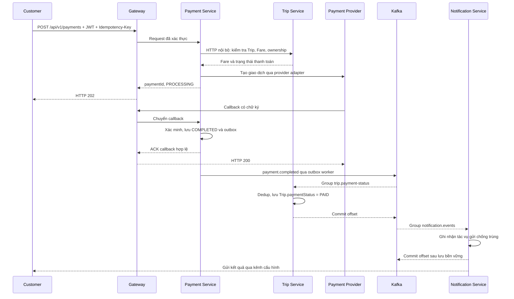

Sơ đồ thể hiện HTTP đồng bộ để lấy dữ liệu cần thiết và event bất đồng bộ để cập nhật các bên liên quan. Nếu Notification Service lỗi, Payment vẫn COMPLETED; tác vụ thông báo được tiếp tục theo chính sách retry.

## 9.4 Cấu hình, bí mật và health

`.gitignore` phải loại `.env`, `.env.*` chứa secret và cho phép `.env.example`. File mẫu chỉ có tên biến/placeholder: kết nối PostgreSQL cho Identity/Booking/Payment, MongoDB URI/database/authSource/replicaSet cho Customer/Driver/Trip/Notification, JWT issuer/audience/key reference, Kafka bootstrap servers, topic/group ID, SASL/TLS secret reference, Redis URL, provider secret, encryption key reference/version. Không đưa token/key thật vào source, Postman export hoặc ảnh minh chứng; kiểm tra cả Git history khi chuẩn bị nộp.

GPLX trong thiết kế vật lý dùng licenseNumberCiphertext + keyVersion, có thể dùng fingerprint có khóa để kiểm tra trùng thay UNIQUE plaintext. Password dùng hash có salt, không mã hóa có thể giải mã. OTP lưu digest/HMAC, phone, purpose, expiresAt, attempts, consumedAt; registrationToken một lần có TTL. Khóa mã hóa nằm ngoài DB và được mount/inject từ secret; đổi khóa theo version, có thể đọc dữ liệu cũ trong giai đoạn chuyển đổi, ghi mới bằng khóa mới. Khi demo truy cập DB, phải thấy ciphertext/hash; không đưa khóa vào DB hoặc log. Đây là yêu cầu thiết kế, chưa có bằng chứng đã triển khai.

| Endpoint Gateway | Auth | Thành công | Khi lỗi |
|---|---|---|---|
| GET /api/v1/health | Public, giới hạn thông tin | 200 `{status:"healthy"}` khi tiến trình hoạt động | Không dùng để khẳng định dependency sẵn sàng |
| GET /api/v1/ready | Public | 200 `{status:"ready"}` khi dependency bắt buộc sẵn sàng | 503 `{status:"not_ready"}` nếu DB/broker/Redis hoặc service bắt buộc lỗi |
| GET /api/v1/health/services | Admin JWT | 200 `{services:[{name,status}],status:"healthy"}` | 503 kèm danh sách degraded/unavailable; không lộ credential/stack trace |

Mỗi service có health/readiness nội bộ và kiểm tra database đúng engine/owner. MongoDB phải hỗ trợ transaction sau khi replica set sẵn sàng. Test dừng PostgreSQL, MongoDB, broker hoặc một service bắt buộc phải làm readiness phản ánh lỗi; khởi động lại phải phục hồi. Health không thay thế smoke test nghiệp vụ.

---

# X – Hợp đồng API phục vụ chấm

## 10.1 Quy ước chung

Các route dưới đây là hợp đồng đề xuất để triển khai. Base URL duy nhất là Gateway; không thêm prefix /api trong bộ test này. JWT dùng `Authorization: Bearer <token>`. JSON phản hồi lỗi: `{code,message,correlationId}`; không trả stack trace/secret. 400 input sai, 401 xác thực thất bại, 403 sai quyền, 404 không tồn tại, 409 xung đột nghiệp vụ, 429 rate limit, 503 dependency không sẵn sàng.

Danh sách trả `{items,page,limit,total}`; page bắt đầu 1, limit mặc định 10 và tối đa 100. Các ID lấy từ response/seed; `customerId` không thể dùng để giả mạo chủ sở hữu. Route `/api/v1/drivers` phải được ưu tiên trước `/api/v1/drivers/{id}`. Số tiền VND là số nguyên; client không được quyết định cước phải trả.

## 10.2 Danh mục endpoint

| TC / yêu cầu | Method và path | Actor / input chính | Output / thành công |
|---|---|---|---|
| TC09 / FR01 | POST /api/v1/customers/register | Public; fullName, phone/email, password | 201 customerId, userId; trùng định danh 409 |
| TC10 / FR02 | POST /api/v1/customers/login | Public; email hoặc phone, password | 200 accessToken, tokenType=Bearer, expiresIn |
| FR02 Driver | POST /api/v1/drivers/login | Public; email hoặc phone, password | 200 accessToken, tokenType=Bearer, expiresIn |
| FR02 Admin/Operator | POST /api/v1/admin/login | Public; email hoặc phone, password | 200 accessToken, tokenType=Bearer, expiresIn |
| TC11 / FR75 | GET /api/v1/customers/{id} | Customer chính chủ hoặc Admin/Operator | 200 hồ sơ đã lọc bí mật |
| TC12 / FR78 | GET /api/v1/drivers/{id} | JWT; phạm vi theo FR78 | 200 dữ liệu công khai hoặc hồ sơ theo quyền |
| TC13 / FR79 | GET /api/v1/drivers | JWT; lat,lng,radiusKm=1,page,limit,status tùy quyền | 200 danh sách và distanceKm |
| TC14 / FR80 | GET /api/v1/bookings?customerId={id} | Chính chủ/Admin/Operator; page,limit,status | 200 Booking mọi trạng thái theo bộ lọc |
| TC15 / FR08 | POST /api/v1/bookings | Customer; pickup,destination gồm lat/lng/address, vehicleTypeId | 201 bookingId,status=SEARCHING_DRIVER; matching/Offer bất đồng bộ |
| TC16 / FR17 | GET /api/v1/booking-offers | Driver; status=PENDING,page,limit | 200 Offer của mình, expiresAt và thông tin chuyến cần thiết |
| TC16 / FR21 | PATCH /api/v1/booking-offers/{id} | Driver được mời | 200 tripId,bookingId,driverId,status=ASSIGNED; Offer hết hạn/đã xử lý 409 |
| TC17 / FR23 | PATCH /api/v1/trips/{id} | Driver được gán; status | 200 trạng thái mới; transition sai 409 |
| TC17 / FR28 | POST /api/v1/trips/{id}/locations | Driver được gán; latitude,longitude,recordedAt | 201 locationId; tọa độ sai 400 |
| TC16–19 / FR29 | GET /api/v1/trips/{id} | Customer sở hữu, Driver được gán, Admin/Operator | 200 status,driver/vehicle,latestLocation,paymentStatus |
| TC18 / FR10,FR66 | PATCH /api/v1/bookings/{id} | Customer sở hữu; reason không rỗng | 200 Booking CANCELED, Trip CANCELED nếu đã có; hủy sau PICKED_UP 409 |
| TC19,30 / FR36,FR65 | POST /api/v1/payments | Customer sở hữu; tripId,method=ELECTRONIC; Idempotency-Key bắt buộc | 202 paymentId,status=PROCESSING; replay cùng khóa trả nguyên response đã lưu |
| TC19 / FR37 | POST /api/v1/payment-callbacks | Provider signature; paymentId,providerTransactionId,status,amount,currency | 200 ack nếu hợp lệ; callback sai chữ ký 401, sai amount/currency 400 |
| TC19 / FR55 | GET /api/v1/payments/{id} | Customer sở hữu/Admin/Operator | 200 status=COMPLETED khi callback thành công; amount,currency,tripId |
| TC20 / FR39 | POST /api/v1/trips/{id}/reviews | Customer sở hữu Trip COMPLETED; score 1–5,comment | 201 ratingId,tripId; trùng review 409 |
| TC21 / FR76 | POST /api/v1/driver-otp-challenges | Public; phone | 202 challengeId,expiresIn; giới hạn gửi 429, không trả mã |
| TC21 / FR76 | POST /api/v1/driver-otp-verifications | Public; challengeId,otp | 200 registrationToken; sai/hết hạn/đã dùng 400 |
| TC21 / FR76 | POST /api/v1/drivers/register | registrationToken; fullName,password,licenseNumber,vehicle | 201 driverId,approvalStatus=PENDING,availabilityStatus=OFFLINE |
| TC22 / FR77 | GET /api/v1/driver-applications | Admin; status=PENDING,page,limit | 200 danh sách hồ sơ |
| TC22 / FR77 | PATCH /api/v1/driver-applications/{id} | Admin; decision=APPROVED/REJECTED,reason khi từ chối | 200 approvalStatus,reviewedAt; không còn PENDING 409 |
| TC23,28 / FR54 | PATCH /api/v1/drivers/me | Driver; availabilityStatus=AVAILABLE/OFFLINE | 200 trạng thái; PENDING/REJECTED hoặc BUSY chuyển không hợp lệ 409; Customer 403 |
| TC18,22 / FR74 | GET /api/v1/notifications | Người nhận JWT; page,limit | 200 danh sách thông báo tối thiểu để xác nhận kết quả demo |

Lịch sử đầy đủ, số chưa đọc và đánh dấu đã đọc FR71 là Should; endpoint thông báo tối thiểu ở trên phục vụ xác minh giao nhận, không bắt buộc giao diện notification center. Có thể thay minh chứng bằng sandbox inbox/provider log đã che bí mật khi chọn kênh ngoài, nhưng phải ghi rõ adapter demo.

## 10.3 Ví dụ hợp đồng và callback

`POST /api/v1/payments` nhận `{tripId:"TRIP-DEMO-01",method:"ELECTRONIC"}` và `Idempotency-Key: pay-demo-01`; amount/currency lấy từ Fare phía server. Response gốc 202 được lưu cho replay; muốn biết kết quả mới nhất gọi GET /api/v1/payments/{id}. Callback mẫu `{paymentId:"PAY-01",providerTransactionId:"PROV-01",status:"COMPLETED",amount:50000,currency:"VND"}` phải có chữ ký hợp lệ. Không đưa endpoint tự tạo callback giả không xác thực vào production.

JWT giả mạo vẫn có thể decode, nhưng phải thất bại verification và trả 401. Payload XSS được coi là văn bản: API JSON không tự chứng minh script không chạy; cần thêm bằng chứng khi hiển thị tại client. Mã hóa at rest cần kiểm tra DB/khóa, không chỉ response Postman.

---

# XI – Tiêu chí bổ sung và kế hoạch nghiệm thu theo phiếu chấm

## 11.1 Acceptance Criteria bổ sung

| AC | Given / When | Then |
|---|---|---|
| AC01.3 | Đăng ký Driver bằng OTP hợp lệ và hồ sơ/xe hợp lệ | Tạo Driver PENDING/OFFLINE; token đăng ký đã dùng không dùng lại |
| AC01.4 | OTP sai/hết hạn/đã dùng hoặc vượt giới hạn | 400 hoặc 429 theo nguyên nhân; không tạo hồ sơ; không lộ OTP |
| AC03.3 | JWT hợp lệ và ID Customer/Driver | 200 chỉ dữ liệu đúng phạm vi FR75/FR78; sai quyền 403, ID không có 404 |
| AC04.3 | Customer có >=5 Booking, query page/limit | Chỉ Booking của đúng Customer, gồm mọi trạng thái; total đúng, thứ tự ổn định, phân trang không lặp |
| AC04.4 | Trip trước PICKED_UP, Customer nhập lý do hủy | Booking/Trip CANCELED, Offer còn chờ bị hủy, Driver release, các bên nhận thông báo |
| AC05.6 | Driver ở trong/ngoài biên 1 km và nhiều trạng thái | Chỉ trả trong bán kính và đúng quyền/filter; distanceKm, limit/page/total đúng; matching chỉ AVAILABLE/APPROVED |
| AC06.4 | Driver APPROVED không BUSY bật/tắt nhận chuyến | AVAILABLE/OFFLINE được lưu; Driver PENDING/REJECTED không được AVAILABLE |
| AC10.6 | Callback hợp lệ báo COMPLETED | Payment COMPLETED; Trip.paymentStatus=PAID trong tối đa 5 giây ở môi trường demo ổn định |
| AC10.7 | Replay cùng khóa/payload, cả khi gửi đồng thời | Chỉ một giao dịch logic/charge; response gốc được trả lại; khóa cũ payload khác trả 409 |
| AC10.8 | Callback sai chữ ký, amount/currency không khớp | 401 hoặc 400; không đổi Payment sang COMPLETED, không đặt Trip PAID |
| AC11.14 | OTP requested hoặc hồ sơ được duyệt/từ chối | Đúng phone/Driver nhận kết quả; OTP không xuất hiện trong log/Notification content lưu trữ |
| AC14.2 | Admin xét hồ sơ PENDING | APPROVED hoặc REJECTED có lý do, reviewedBy/reviewedAt và thông báo; availability vẫn OFFLINE |
| AC14.3 | Customer/Driver/Operator gọi API xét duyệt hoặc Admin duyệt lại | Sai vai trò 403; hồ sơ đã xử lý 409; không thay đổi dữ liệu |
| AC-S24 | Lưu password và GPLX rồi kiểm tra DB | Chỉ hash/ciphertext; không plaintext; DB không chứa khóa giải mã; chứng minh đọc hợp lệ và đổi keyVersion |
| AC-S25 | Login với email chứa `' OR 1=1 --` | 400/401, không token, không lộ dữ liệu/lỗi DB |
| AC-S26 | Nhập `<script>alert('hack')</script>` vào comment/tên rồi hiển thị | Không thực thi script; output được escape tại client; API không trả HTML thực thi |
| AC-S27 | Sửa sub/role JWT nhưng giữ chữ ký cũ | 401, không truy cập được API |
| AC-S28 | Customer JWT gọi PATCH /api/v1/drivers/me | 403, không dữ liệu Driver và không thay đổi trạng thái |
| AC-S29 | Vượt ngưỡng NFR-S12; thử >1000 request/giây trong môi trường test | Request vượt ngưỡng 429 + Retry-After, không tạo Booking tương ứng; Gateway/service không restart/crash, health còn phục vụ |
| AC-S30 | Replay request Payment cũ, cả khi Trip đã PAID và đổi khóa | Không double charge; cùng khóa trả response gốc, khóa khác trên Trip PAID trả 409 |
| AC-A01 | Kiểm tra thư mục, service, quyền sở hữu dữ liệu | Có 7 service nghiệp vụ và Gateway; 3 PostgreSQL DB + 4 MongoDB DB đúng bảng 9.1.1, user/quyền riêng, route/API owner đúng mục IX; tài khoản service không đọc/ghi được DB service khác |
| AC-A02 | Kiểm tra Git và cấu hình xuất ra | Không .env/secret thật trong tracked files/history; .env.example chỉ placeholder |
| AC-A03 | Gọi API qua Gateway và gọi trực tiếp service từ host | Qua Gateway theo hợp đồng; truy cập trực tiếp service bị chặn |
| AC-A04 | Theo dõi IPC đặt xe/thanh toán | Chứng minh HTTP nội bộ và event đúng producer/consumer/correlationId |
| AC-A05 | Compose up, ps, kiểm tra health | 8 container ứng dụng + 4 hạ tầng PostgreSQL/MongoDB/Kafka/Redis chạy healthy; MongoDB replica set hỗ trợ transaction; DB/broker có volume, Kafka topic/group truy vấn được |
| AC-A06 | Gọi 3 health API; lần lượt dừng/khởi động PostgreSQL, MongoDB, Kafka | /api/v1/health phản ánh process; /api/v1/ready và /api/v1/health/services phản ánh dependency bắt buộc, trả 503 khi lỗi và phục hồi khi sẵn sàng |
| AC-A07 | Publish/consume, crash/restart consumer và restart Kafka | Kiểm tra producer/consumer cả PostgreSQL và MongoDB: outbox/inbox nguyên tử với nghiệp vụ; commit offset sau DB commit, replay không tạo tác dụng trùng; retry/DLT đúng; quan sát lag/backlog, event/offset còn sau Kafka restart |
| AC-A08 | Đăng ký Customer timeout và nhận/hủy chuyến có crash/race | Retry cùng ID không tạo trùng Customer/Trip; cancel/PICKED_UP chỉ một nhánh thắng; workflow phục hồi, không release Driver còn Trip active |
| AC-A09 | Bootstrap/migration/model-index, thử ghi trùng và gây lỗi giữa transaction | 3 service SQL có migration riêng; 4 service MongoDB có model/index và script version hóa; Customer.userId, Trip.bookingId, Rating.tripId chống trùng; rollback không để nghiệp vụ thiếu outbox/inbox. Restart DB giữ dữ liệu |
| AC-S31 | Gửi object/toán tử NoSQL như {"$ne":null} vào field chỉ nhận string ở API dùng MongoDB | Trả 400, không bypass ownership/filter, không thay đổi dữ liệu ngoài quyền và không lộ lỗi DB |

Đây là tiêu chí cần thực thi, chưa có kết quả Pass/Fail. AC-S24–S30 liên kết lần lượt NFR-S07–S13; AC-S30 còn liên kết FR65/UC10. AC-A01–A07 liên kết NFR-A05–A07, NFR-R06, NFR-M02; AC-A08 liên kết FR01, FR22, FR66, NFR-R04–R06; AC-A09 liên kết NFR-A06–A07/NFR-R04–R06; AC-S31 bổ sung NFR-S08. Các ca bổ sung nằm trong nhóm kiểm thử hiện có, không tự tăng số tiêu chí của phiếu chấm.

## 11.2 Ma trận 30 tiêu chí → yêu cầu → kiểm thử → bằng chứng

| STT | FR/NFR | UC / AC | Test ID | Bằng chứng cần thu |
|---|---|---|---|---|
| 1 | NFR-A06 | AC-A01,AC-A09 | TC01 | Cây source, 3 PostgreSQL DB + 4 MongoDB DB, migration/model-index và quyền DB theo owner |
| 2 | NFR-A07 | AC-A02 | TC02 | git ls-files/history, .gitignore, .env.example đã che bí mật |
| 3 | NFR-A05 | AC-A03 | TC03 | Route Gateway, JWT/rate limit/correlationId |
| 4 | NFR-A06 | AC-A04 | TC04 | Trace HTTP/event giữa service |
| 5 | NFR-A07 | AC-A05,AC-A09 | TC05 | compose -f compose.yaml config/ps, 12 container demo, MongoDB replica set/transaction, DB volume/health |
| 6 | NFR-A07 | AC-A06 | TC06 | Postman 3 health endpoint, trường hợp dependency lỗi |
| 7 | NFR-A06, NFR-R06 | AC-A07 | TC07 | Topic/partition/group, publish/consume/offset, duplicate/retry/DLT, consumer/broker restart, lag/outbox backlog |
| 8 | NFR-A05 | AC-A03 | TC08 | Postman qua Gateway; kết nối trực tiếp service thất bại |
| 9 | FR01 | UC01 / AC01.1 | TC09 | Đăng ký Customer 201, sau đó đăng nhập |
| 10 | FR02, NFR-S10 | UC02 / AC02.1 | TC10 | JWT và request xác thực thành công |
| 11 | FR75 | UC03 / AC03.3 | TC11 | Customer ID + token, response đã lọc |
| 12 | FR78 | UC03 / AC03.3 | TC12 | Driver ID + token, phạm vi dữ liệu đúng |
| 13 | FR79 | UC05 / AC05.6 | TC13 | >=5 Driver, tọa độ/trạng thái, bán kính 1 km, paging |
| 14 | FR80 | UC04 / AC04.3 | TC14 | >=5 Booking, ownership, paging/limit/total |
| 15 | FR08, FR12, FR17 | UC04,UC05 / AC04.1 | TC15 | Booking SEARCHING_DRIVER và Offer được tạo |
| 16 | FR21, FR41 | UC05,UC06 / AC06.2 | TC16 | Offer accept, Trip assigned, Customer nhận Driver |
| 17 | FR23–FR28 | UC07 / AC07.1–AC07.3 | TC17 | Chuỗi state, location và Trip COMPLETED |
| 18 | FR10, FR66, FR70 | UC04,UC11 / AC04.4 | TC18 | Lý do, Trip CANCELED, release Driver, notification |
| 19 | FR36, FR37 | UC10 / AC10.6,AC10.8 | TC19 | Callback ký hợp lệ, Payment COMPLETED, Trip PAID |
| 20 | FR39 | UC12 / AC12.1 | TC20 | Review score/comment và liên kết tripId |
| 21 | FR76 | UC01 / AC01.3,AC01.4 | TC21 | OTP qua sandbox, hồ sơ PENDING/OFFLINE |
| 22 | FR77, FR74 | UC14,UC11 / AC14.2,AC14.3,AC11.14 | TC22 | Duyệt/từ chối, lý do, audit, thông báo |
| 23 | FR54 | UC06 / AC06.4 | TC23 | AVAILABLE/OFFLINE trước và sau request |
| 24 | NFR-S03, NFR-S07 | AC-S24 | TC24 | DB hash/ciphertext và quy trình quản lý khóa |
| 25 | NFR-S08 | AC-S25,AC-S31 | TC25 | SQL/NoSQL injection không bypass; input sai 400/401, không lộ lỗi DB |
| 26 | NFR-S09 | UC03,UC12 / AC-S26 | TC26 | Postman payload/response và client không execute |
| 27 | NFR-S10 | UC02 / AC-S27 | TC27 | JWT sửa payload trả 401 |
| 28 | NFR-S11 | UC06 / AC-S28 | TC28 | Customer gọi Driver action trả 403 |
| 29 | NFR-S12 | UC04 / AC-S29 | TC29 | 429 + Retry-After, báo cáo tải, health và số Booking |
| 30 | FR65, NFR-S13 | UC10 / AC10.7,AC-S30 | TC30 | Response replay, chỉ một charge/giao dịch logic |

TC01–TC30 là ID kế hoạch, chưa phải collection đã chạy. Postman dùng cho request/assertion API; TC24 cần DB/key evidence, TC26 cần client rendering, TC29 cần công cụ tạo tải như k6/JMeter vì một lần bấm Send không chứng minh >1000 request/giây. Không tự suy ra điểm số từ việc có dòng yêu cầu trong SRS.

## 11.3 Dữ liệu seed và thứ tự demo

| Bộ dữ liệu | Yêu cầu |
|---|---|
| Tài khoản | Customer A/B, Driver đã duyệt/chờ/từ chối, Admin, Operator; password giả lập, JWT lấy qua login, không commit token |
| Driver khu vực | Ít nhất 6 Driver: AVAILABLE tại 0.2 và 0.8 km, BUSY tại 0.4 km, OFFLINE tại 0.6 km, SUSPENDED tại 0.7 km, AVAILABLE tại 1.2 km; đều có vị trí và hồ sơ phù hợp. Thêm ca đúng biên 1 km; ghi tọa độ thật và khoảng cách tính được trong seed |
| Driver application | Ít nhất 2 hồ sơ PENDING độc lập để kiểm tra duyệt và từ chối; 1 REJECTED để nộp lại |
| Booking | >=5 Booking của Customer A ở nhiều trạng thái và >=1 của B để kiểm tra ownership; limit=2 phải có nhiều trang, không trộn B |
| Trip | Trip riêng cho hoàn thành/thanh toán, Trip trước PICKED_UP để hủy, Trip IN_PROGRESS để kiểm tra hủy bị từ chối |
| Fare/Payment | Giá/Fare xác định, Payment chưa trả để callback và replay; sandbox provider ghi nhận số lần charge |
| Review/Notification | Review hợp lệ và trùng; Offer/hủy/duyệt hồ sơ có recipient đúng; không seed OTP thật/secret |

Seed phải phân tách theo owner: Identity/Booking/Payment qua migration/seed PostgreSQL; Customer/Driver/Trip/Notification qua model/index và seed MongoDB. Bootstrap/script điều phối không làm service có quyền ghi DB của service khác; lưu ID liên kết nhất quán qua API/workflow.

Mỗi kịch bản thay đổi dữ liệu dùng ID riêng hoặc reset fixture để không phụ thuộc trạng thái do test trước gây ra. Thứ tự chạy: TC01–08 → TC09–14 → TC21–23 → TC15–20 → TC24–30. Lưu biến baseUrl, customerToken, driverToken, adminToken, customerId, driverId, bookingId, offerId, tripId, paymentId trong environment cục bộ; bản export chỉ placeholder.

Test driver khu vực chạy cả Customer (chỉ APPROVED/AVAILABLE) và Admin (các trạng thái), kiểm tra ngoài bán kính không xuất hiện. Test rate limit chạy môi trường cô lập, ghi máy/tài nguyên, thời lượng đề xuất 10 giây ở >1000 request/giây, tỷ lệ 429, lỗi, health trước/sau; đây là mục tiêu kiểm thử, chưa phải kết quả chịu tải.

## 11.4 Ưu tiên và kiểm soát phạm vi

Must: 30 tiêu chí phiếu chấm, nghiệp vụ bảo đảm tính nhất quán, thông báo Offer/hủy/payment/OTP/duyệt, chống trùng thanh toán, phân quyền. Should: lịch sử đã đọc FR71, delivery callback khi provider hỗ trợ, dashboard lỗi nâng cao, báo cáo Giám đốc, rating tổng hợp, ETA. Không bắt buộc đồng thời Push/SMS/Email hay giao diện mobile native. Các mục F/BR/FR/BP/UC/AC là các mức mô tả khác nhau, không cộng dồn thành số chức năng mới.

Giữ số lượng 19 UC và 13 BP bằng cách mở rộng nhánh UC01/03/04/05/10/11/14 và BP01/02/03/04/08/09/11/12. FR75–FR80 là 6 yêu cầu chi tiết mới; danh mục có FR01–FR80. Kiến trúc và bảng API là ràng buộc thiết kế phục vụ nghiệm thu; ma trận này không thay bằng chứng triển khai.
