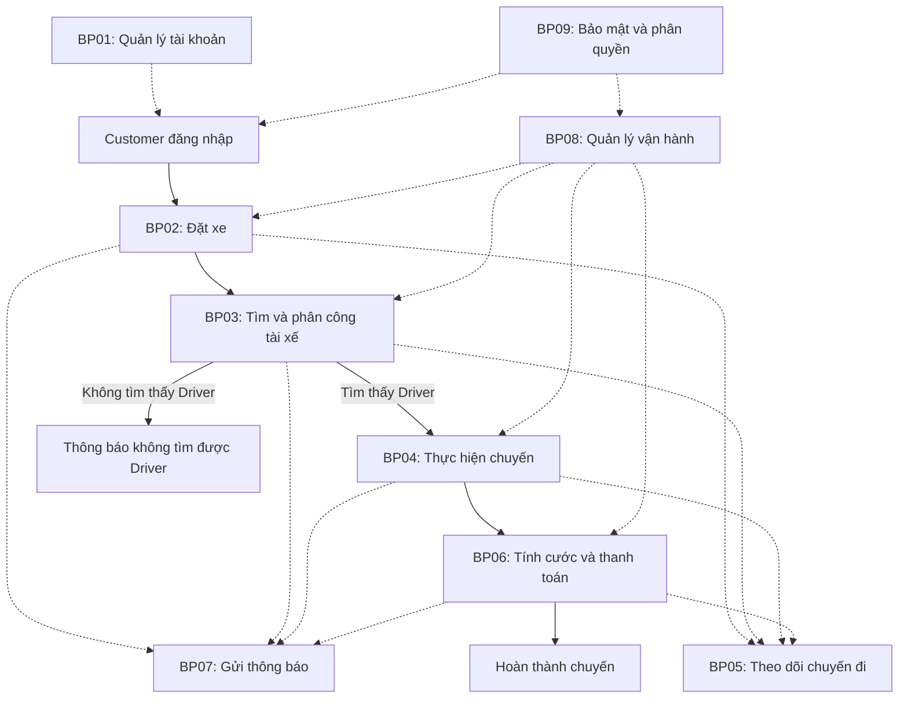
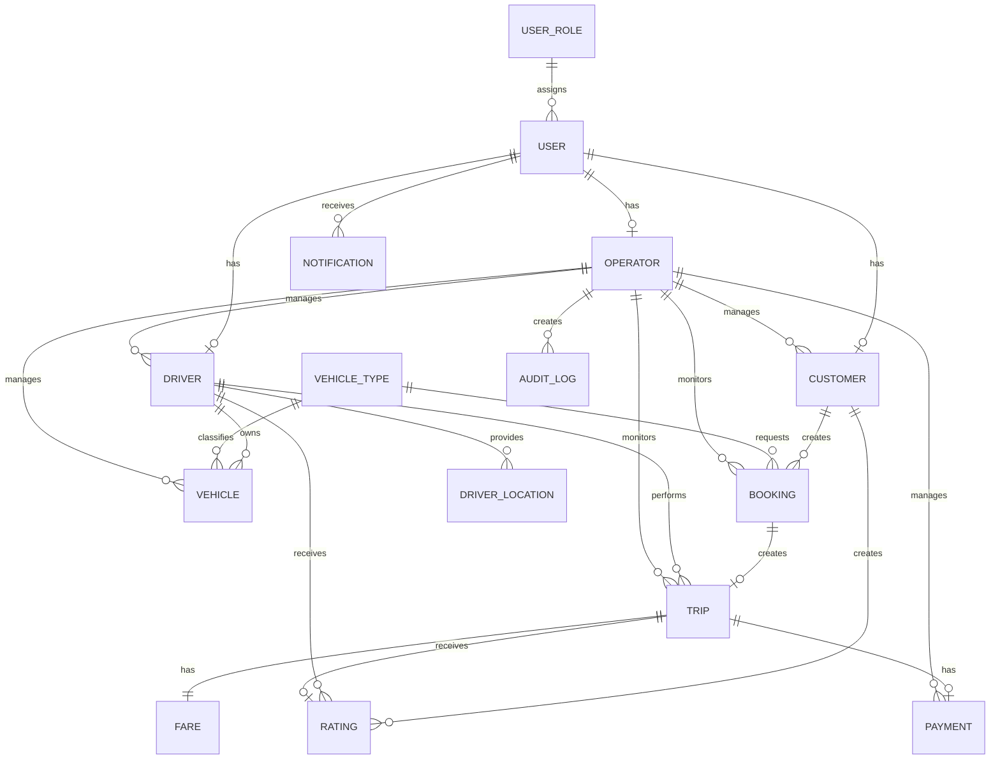
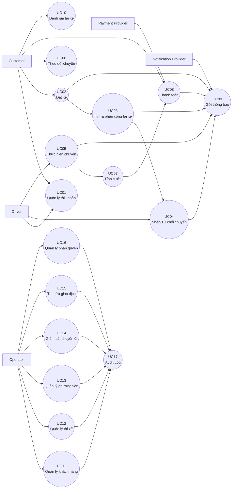

bước 1: xác định ngữ cảnh,
# 1. Xác định ngữ cảnh (Business Context)

**Công ty ABC** cung cấp dịch vụ đặt xe trực tuyến thông qua tổng đài và ứng dụng hiện tại. Tuy nhiên, hệ thống còn phụ thuộc nhiều vào xử lý thủ công, đặc biệt trong việc tiếp nhận yêu cầu, phân công tài xế, theo dõi chuyến đi và quản lý thanh toán.

Khi số lượng khách hàng, tài xế và chuyến đi tăng, hệ thống hiện tại gặp hạn chế về **tự động hóa, khả năng vận hành, theo dõi trạng thái và khả năng mở rộng**.

Do đó, ABC mong muốn xây dựng **CAB System – nền tảng đặt xe mới** nhằm tự động hóa quy trình từ **đặt xe → tìm tài xế → thực hiện chuyến → tính cước → thanh toán → đánh giá**, đồng thời hỗ trợ quản lý vận hành và có kiến trúc linh hoạt để mở rộng trong tương lai.

---

# 2. Business Problem

Hệ thống hiện tại tồn tại các vấn đề chính:

## 2.1. Phân công tài xế thủ công

Việc tìm và phân công tài xế mất nhiều thời gian, khó lựa chọn tài xế phù hợp và phải xử lý thủ công khi tài xế từ chối hoặc không phản hồi.

**Hệ thống cần:** tự động tìm tài xế phù hợp dựa trên vị trí, trạng thái và các tiêu chí vận hành.

---

## 2.2. Khó theo dõi chuyến đi

Khách hàng chưa thể theo dõi đầy đủ trạng thái đặt xe, tài xế và quá trình thực hiện chuyến.

**Hệ thống cần:** cung cấp trạng thái chuyến rõ ràng và cập nhật xuyên suốt quá trình.

---

## 2.3. Quản lý thanh toán chưa tập trung

Việc tính cước, thanh toán và tra cứu giao dịch chưa được quản lý thống nhất.

**Hệ thống cần:** hỗ trợ thanh toán tiền mặt, thanh toán điện tử, theo dõi giao dịch và xử lý thanh toán thất bại thông qua nhà cung cấp bên ngoài.

---

## 2.4. Khó khăn trong vận hành

Nhân viên vận hành khó theo dõi chuyến đang diễn ra, trạng thái tài xế, giao dịch và các trường hợp phát sinh.

**Hệ thống cần:** cung cấp giao diện quản trị tập trung và phân quyền theo vai trò.

---

## 2.5. Khả năng mở rộng và chịu lỗi hạn chế

Hệ thống hiện tại chưa đáp ứng tốt khi số lượng người dùng và chuyến đi tăng. Sự cố ở một chức năng có thể ảnh hưởng đến các chức năng khác.

**Hệ thống cần:** thiết kế các thành phần có khả năng mở rộng độc lập và hạn chế ảnh hưởng dây chuyền khi xảy ra lỗi.

---

## 2.6. Thông báo chưa linh hoạt

Hệ thống cần thông báo kịp thời cho khách hàng và tài xế nhưng phải có khả năng mở rộng thêm các kênh thông báo trong tương lai.

**Hệ thống cần:** thiết kế thành phần Notification có thể tích hợp thêm Push Notification, SMS, Email hoặc các nhà cung cấp khác.

---

## 2.7. Bảo mật và truy vết dữ liệu

Hệ thống xử lý nhiều loại dữ liệu quan trọng như thông tin cá nhân, vị trí, phương tiện và giao dịch.

**Hệ thống cần:**

- Xác thực người dùng.
- Phân quyền theo vai trò.
- Bảo vệ thông tin cá nhân và dữ liệu giao dịch.
- Kiểm soát quyền truy cập dữ liệu vị trí.
- Lưu audit log cho các thao tác quan trọng.
- Stakeholder Hệ thống:
  # Stakeholders – CAB System

| Stakeholder | Vai trò | Mối quan tâm / Mục tiêu |
|---|---|---|
| **Ban giám đốc ABC** | Sponsor / Decision Maker | Doanh thu, hiệu quả vận hành, khả năng mở rộng, ROI |
| **Khách hàng** | End User | Đặt xe nhanh, theo dõi chuyến, thanh toán thuận tiện, an toàn |
| **Tài xế** | End User | Nhận chuyến phù hợp, cập nhật trạng thái, quản lý hoạt động |
| **Nhân viên vận hành** | Operational User | Theo dõi chuyến, tài xế, xử lý sự cố |
| **Admin hệ thống** | System Administrator | Quản lý tài khoản, phân quyền, cấu hình hệ thống |
| **Nhà cung cấp thanh toán** | External System | Xử lý giao dịch thanh toán |
| **Nhà cung cấp dịch vụ bản đồ/GPS** | External System | Vị trí, khoảng cách, định tuyến, ETA |

- Vẽ ma trận stakeholder
# Stakeholder Power–Interest Matrix

| **QUYỀN LỰC / MỨC ĐỘ QUAN TÂM** | **Thấp** | **Cao** |
|---|---|---|
| **Cao** | **KEEP SATISFIED**  • IT Management | **MANAGE CLOSELY**  • Ban giám đốc ABC • Nhân viên vận hành • Admin hệ thống • Bộ phận tài chính/kế toán • Project Manager |
| **Thấp** | **MONITOR**  • Notification Provider | **KEEP INFORMED**  • Khách hàng • Tài xế • Bộ phận CSKH • Business Analyst • Developer • QA/Tester • Payment Provider • Map/GPS Provider |

Bước 3: xác định các Business Gold
## 3. Business Goals

- **BG1:** Tự động hóa quy trình đặt xe và phân công tài xế, giảm sự phụ thuộc vào nhân viên vận hành.

- **BG2:** Nâng cao trải nghiệm khách hàng thông qua khả năng theo dõi trạng thái chuyến đi và nhận thông báo kịp thời.

- **BG3:** Tập trung hóa việc tính cước, thanh toán và quản lý giao dịch.

- **BG4:** Nâng cao hiệu quả vận hành thông qua hệ thống quản trị tập trung, theo dõi chuyến đi, tài xế và giao dịch.

- **BG5:** Xây dựng nền tảng có khả năng mở rộng để đáp ứng số lượng lớn khách hàng, tài xế và chuyến đi.

- **BG6:** Đảm bảo hệ thống hoạt động ổn định và hạn chế ảnh hưởng của sự cố tại các thành phần như thanh toán hoặc thông báo.

- **BG7:** Đảm bảo an toàn dữ liệu và kiểm soát quyền truy cập đối với thông tin khách hàng, tài xế, vị trí và giao dịch.

- **BG8:** Xây dựng nền tảng linh hoạt, cho phép bổ sung dịch vụ, phương thức thanh toán và kênh thông báo mới trong tương lai.

  Bước 4: xác định Scope (Phạm vi)
  ## 4. Scope – Phạm vi MVP

### 4.1. In Scope

MVP tập trung xây dựng các chức năng cốt lõi phục vụ quy trình đặt xe:

#### 1. Quản lý tài khoản
- Đăng ký và đăng nhập Customer/Driver.
- Cập nhật thông tin cá nhân.
- Phân quyền theo vai trò: Customer, Driver, Operator/Admin.

#### 2. Đặt xe
- Customer nhập điểm đón và điểm đến.
- Lựa chọn loại xe.
- Tạo yêu cầu đặt xe.
- Theo dõi trạng thái yêu cầu và chuyến đi.
- Xem thông tin chuyến và lịch sử chuyến đi.

#### 3. Tìm và phân công tài xế
- Driver cập nhật trạng thái sẵn sàng/không sẵn sàng.
- Hệ thống xác định Driver phù hợp dựa trên vị trí và trạng thái.
- Gửi yêu cầu chuyến đến Driver.
- Driver chấp nhận hoặc từ chối chuyến.
- Tự động chuyển sang Driver khác khi Driver từ chối hoặc không phản hồi.
- Thông báo cho Customer khi không tìm được Driver.

#### 4. Quản lý chuyến đi
- Driver cập nhật trạng thái chuyến:
  - Đã nhận chuyến.
  - Đã đến điểm đón.
  - Đã đón khách.
  - Đang di chuyển.
  - Hoàn thành.
- Lưu thông tin vị trí hiện tại của Driver ở mức cơ bản.
- Customer theo dõi trạng thái chuyến.

#### 5. Tính cước và thanh toán
- Tính cước dựa trên loại dịch vụ và thông tin chuyến.
- Hỗ trợ thanh toán tiền mặt.
- Tích hợp một phương thức thanh toán điện tử.
- Lưu trạng thái giao dịch.
- Xử lý trạng thái thanh toán thành công/thất bại.

#### 6. Thông báo
- Thông báo các sự kiện chính:
  - Tạo yêu cầu đặt xe.
  - Driver nhận chuyến.
  - Driver đến điểm đón.
  - Chuyến hoàn thành.
  - Thanh toán thành công/thất bại.
- Thiết kế Notification theo hướng có thể bổ sung thêm kênh trong tương lai.

#### 7. Quản trị vận hành
- Quản lý Customer.
- Quản lý Driver.
- Quản lý Vehicle.
- Theo dõi các chuyến đang diễn ra.
- Tra cứu lịch sử chuyến đi và giao dịch.
- Phân quyền thao tác quản trị cơ bản.
- Ghi nhận audit log cho các thao tác quan trọng.

---

### 4.2. MVP Boundary

MVP đảm bảo hoàn thành được **một quy trình đặt xe end-to-end**:

Customer
→ Đăng nhập
→ Tạo yêu cầu
→ Hệ thống tìm Driver
→ Driver nhận chuyến
→ Thực hiện chuyến
→ Hoàn thành
→ Tính cước
→ Thanh toán
→ Lưu lịch sử
→ Đánh giá

Đồng thời, Operator/Admin có thể theo dõi và hỗ trợ các hoạt động chính của hệ thống.

Bước 5: gặp khách hàng và chuyển đổi thành nghiệp vụ để viết Business Requirement 
## 5. Business Requirements

| Mã | Tên Business Requirement | Diễn giải |
|---|---|---|
| **BR01** | Quản lý tài khoản khách hàng | Hệ thống hỗ trợ khách hàng đăng ký, đăng nhập và cập nhật thông tin cá nhân. |
| **BR02** | Đặt xe | Hệ thống hỗ trợ khách hàng nhập điểm đón, điểm đến, lựa chọn loại xe và gửi yêu cầu đặt xe. |
| **BR03** | Theo dõi chuyến đi | Hệ thống cho phép khách hàng theo dõi trạng thái yêu cầu và chuyến đi từ khi tìm tài xế đến khi hoàn thành. |
| **BR04** | Tìm và phân công tài xế | Hệ thống tự động tìm và phân công tài xế phù hợp dựa trên vị trí, trạng thái sẵn sàng và các tiêu chí vận hành. |
| **BR05** | Quản lý chuyến đi | Hệ thống hỗ trợ tài xế nhận/từ chối chuyến và cập nhật trạng thái chuyến trong quá trình thực hiện. |
| **BR06** | Quản lý vị trí tài xế | Hệ thống lưu và quản lý vị trí của tài xế để phục vụ việc tìm kiếm, phân công và theo dõi chuyến đi. |
| **BR07** | Tính cước và thanh toán | Hệ thống hỗ trợ tính cước sau chuyến và thanh toán bằng tiền mặt hoặc phương thức điện tử thông qua nhà cung cấp bên ngoài. |
| **BR08** | Quản lý thông báo | Hệ thống gửi thông báo đến khách hàng và tài xế về các sự kiện quan trọng trong quá trình đặt và thực hiện chuyến. |
| **BR09** | Quản lý vận hành | Hệ thống cung cấp cho nhân viên vận hành khả năng quản lý và theo dõi khách hàng, tài xế, phương tiện, chuyến đi và giao dịch. |
| **BR10** | Bảo mật và kiểm soát truy cập | Hệ thống hỗ trợ xác thực, phân quyền, bảo vệ dữ liệu và lưu vết các thao tác quan trọng. |

Bước 6: Business Process 
## 6. Business Process

| Mã | Business Process | Mô tả |
|---|---|---|
| **BP01** | Quản lý tài khoản | Quản lý đăng ký, đăng nhập và thông tin tài khoản của Customer và Driver. |
| **BP02** | Đặt xe | Customer nhập thông tin chuyến và gửi yêu cầu đặt xe. |
| **BP03** | Tìm và phân công tài xế | Hệ thống xác định Driver phù hợp và thực hiện phân công chuyến. |
| **BP04** | Thực hiện chuyến đi | Driver nhận chuyến, đón khách, thực hiện chuyến và cập nhật trạng thái đến khi hoàn thành. |
| **BP05** | Theo dõi chuyến đi | Customer và Operator theo dõi trạng thái và thông tin của chuyến trong quá trình thực hiện. |
| **BP06** | Tính cước và thanh toán | Hệ thống tính cước và xử lý thanh toán cho chuyến đi. |
| **BP07** | Gửi và quản lý thông báo | Hệ thống gửi thông báo đến Customer và Driver dựa trên các sự kiện nghiệp vụ. |
| **BP08** | Quản lý vận hành | Operator quản lý Customer, Driver, Vehicle, Trip và hỗ trợ xử lý các trường hợp phát sinh. |
| **BP09** | Quản lý bảo mật và phân quyền | Hệ thống xác thực người dùng, kiểm soát quyền truy cập và lưu vết các thao tác quan trọng. |

# 6. Business Process

## 6.1. Tổng quan quy trình nghiệp vụ

Bước 7: phân rã yêu cầu chức năng
# 7. Functional Requirements

## 7.1. Quản lý tài khoản

| Mã | Functional Requirement | Diễn giải |
|---|---|---|
| **FR01** | Đăng ký tài khoản | Cho phép Customer/Driver tạo tài khoản. |
| **FR02** | Đăng nhập | Cho phép người dùng đăng nhập vào hệ thống. |
| **FR03** | Cập nhật thông tin cá nhân | Cho phép Customer/Driver cập nhật thông tin cá nhân. |
| **FR04** | Phân quyền người dùng | Xác định quyền truy cập dựa trên vai trò Customer, Driver, Operator/Admin. |

---

## 7.2. Đặt xe

| Mã | Functional Requirement | Diễn giải |
|---|---|---|
| **FR05** | Xác định điểm đón | Cho phép Customer nhập hoặc chọn vị trí đón khách. |
| **FR06** | Xác định điểm đến | Cho phép Customer nhập hoặc chọn điểm đến. |
| **FR07** | Lựa chọn loại xe | Cho phép Customer lựa chọn loại xe phù hợp với nhu cầu. |
| **FR08** | Tạo yêu cầu đặt xe | Cho phép Customer gửi yêu cầu đặt xe sau khi nhập đầy đủ thông tin. |
| **FR09** | Kiểm tra thông tin đặt xe | Kiểm tra các thông tin cần thiết trước khi tạo yêu cầu. |
| **FR10** | Hủy yêu cầu đặt xe | Cho phép Customer hủy yêu cầu theo chính sách của doanh nghiệp. |

---

## 7.3. Tìm và phân công tài xế

| Mã | Functional Requirement | Diễn giải |
|---|---|---|
| **FR11** | Xác định vị trí tài xế | Xác định vị trí hiện tại của các tài xế đang hoạt động. |
| **FR12** | Tìm tài xế | Tìm các tài xế đang sẵn sàng nhận chuyến trong khu vực phù hợp. |
| **FR13** | Lọc theo loại xe | Chỉ lựa chọn tài xế có phương tiện phù hợp với loại xe khách hàng yêu cầu. |
| **FR14** | Lọc theo khoảng cách | Ưu tiên hoặc lọc tài xế dựa trên khoảng cách đến điểm đón. |
| **FR15** | Lọc theo trạng thái | Chỉ lựa chọn tài xế đang ở trạng thái sẵn sàng nhận chuyến. |
| **FR16** | Xếp hạng tài xế phù hợp | Xác định thứ tự ưu tiên của các tài xế dựa trên các tiêu chí vận hành. |
| **FR17** | Gửi yêu cầu nhận chuyến | Gửi thông tin chuyến đến tài xế được lựa chọn. |
| **FR18** | Xử lý tài xế từ chối | Khi tài xế từ chối, hệ thống tiếp tục tìm tài xế khác. |
| **FR19** | Xử lý tài xế không phản hồi | Khi tài xế không phản hồi trong thời gian quy định, hệ thống chuyển sang tài xế khác. |
| **FR20** | Thông báo không tìm được tài xế | Thông báo cho Customer khi hệ thống không tìm được tài xế phù hợp. |

---

## 7.4. Thực hiện chuyến đi

| Mã | Functional Requirement | Diễn giải |
|---|---|---|
| **FR21** | Nhận chuyến | Cho phép Driver chấp nhận yêu cầu chuyến. |
| **FR22** | Từ chối chuyến | Cho phép Driver từ chối yêu cầu chuyến. |
| **FR23** | Cập nhật trạng thái chuyến | Cho phép Driver cập nhật trạng thái chuyến trong quá trình thực hiện. |
| **FR24** | Cập nhật trạng thái "Đã đến" | Driver xác nhận đã đến điểm đón. |
| **FR25** | Cập nhật trạng thái "Đã đón khách" | Driver xác nhận đã đón khách. |
| **FR26** | Cập nhật trạng thái "Đang di chuyển" | Driver xác nhận chuyến đang được thực hiện. |
| **FR27** | Hoàn thành chuyến | Driver xác nhận chuyến đã hoàn thành. |
| **FR28** | Cập nhật vị trí Driver | Hệ thống ghi nhận vị trí hiện tại của Driver trong quá trình hoạt động. |

---

## 7.5. Theo dõi chuyến đi

| Mã | Functional Requirement | Diễn giải |
|---|---|---|
| **FR29** | Theo dõi trạng thái chuyến | Customer có thể xem trạng thái hiện tại của chuyến. |
| **FR30** | Xem thông tin Driver | Customer có thể xem thông tin Driver đã nhận chuyến. |
| **FR31** | Theo dõi vị trí Driver | Customer có thể xem vị trí hiện tại của Driver ở mức được hệ thống hỗ trợ. |
| **FR32** | Hiển thị thời gian dự kiến | Hệ thống hiển thị thời gian dự kiến Driver đến điểm đón. |
| **FR33** | Xem lịch sử chuyến | Customer có thể xem các chuyến đã thực hiện và thông tin liên quan. |

---

## 7.6. Tính cước và thanh toán

| Mã | Functional Requirement | Diễn giải |
|---|---|---|
| **FR34** | Tính cước chuyến đi | Hệ thống tính số tiền cần thanh toán dựa trên quy tắc tính cước. |
| **FR35** | Chọn phương thức thanh toán | Customer lựa chọn tiền mặt hoặc thanh toán điện tử. |
| **FR36** | Xử lý thanh toán điện tử | Hệ thống gửi yêu cầu thanh toán đến nhà cung cấp bên ngoài. |
| **FR37** | Ghi nhận kết quả thanh toán | Hệ thống ghi nhận trạng thái thành công hoặc thất bại của giao dịch. |
| **FR38** | Xử lý thanh toán thất bại | Hệ thống thông báo và hỗ trợ xử lý lại giao dịch theo chính sách doanh nghiệp. |
| **FR39** | Tra cứu giao dịch | Operator có thể tra cứu thông tin và trạng thái giao dịch. |

---

## 7.7. Thông báo

| Mã | Functional Requirement | Diễn giải |
|---|---|---|
| **FR40** | Thông báo tạo yêu cầu | Thông báo cho Customer khi yêu cầu đặt xe được tiếp nhận. |
| **FR41** | Thông báo Driver nhận chuyến | Thông báo cho Customer khi Driver nhận chuyến. |
| **FR42** | Thông báo Driver đến | Thông báo cho Customer khi Driver đến điểm đón. |
| **FR43** | Thông báo hoàn thành chuyến | Thông báo khi chuyến đi hoàn thành. |
| **FR44** | Thông báo kết quả thanh toán | Thông báo kết quả thanh toán cho Customer. |
| **FR45** | Thông báo chuyến mới cho Driver | Thông báo cho Driver khi có yêu cầu chuyến phù hợp. |

---

## 7.8. Quản lý vận hành

| Mã | Functional Requirement | Diễn giải |
|---|---|---|
| **FR46** | Xem danh sách khách hàng | Operator có thể xem danh sách khách hàng đã đăng ký trên hệ thống. |
| **FR47** | Xem thông tin khách hàng | Operator có thể xem thông tin cơ bản của khách hàng. |
| **FR48** | Cập nhật thông tin khách hàng | Operator có thể cập nhật các thông tin khách hàng theo quyền được cấp. |
| **FR49** | Khóa/Mở khóa tài khoản khách hàng | Operator có thể khóa hoặc mở khóa tài khoản khách hàng theo chính sách doanh nghiệp. |
| **FR50** | Quản lý tài xế | Operator có thể xem và quản lý thông tin tài xế. |
| **FR51** | Quản lý phương tiện | Operator có thể xem và quản lý thông tin phương tiện của tài xế. |
| **FR52** | Theo dõi chuyến đang diễn ra | Operator có thể xem các chuyến đang thực hiện và trạng thái hiện tại. |
| **FR53** | Hỗ trợ xử lý chuyến lỗi | Operator có thể kiểm tra và hỗ trợ các trường hợp chuyến phát sinh vấn đề. |
| **FR54** | Tra cứu lịch sử chuyến | Operator có thể tra cứu lịch sử các chuyến đi. |
| **FR55** | Tra cứu giao dịch | Operator có thể tra cứu thông tin và trạng thái các giao dịch thanh toán. |

---

## 7.9. Bảo mật và kiểm soát truy cập

| Mã | Functional Requirement | Diễn giải |
|---|---|---|
| **FR56** | Xác thực người dùng | Kiểm tra danh tính người dùng trước khi truy cập các chức năng yêu cầu đăng nhập. |
| **FR57** | Kiểm soát quyền truy cập | Chỉ cho phép người dùng thực hiện các chức năng phù hợp với vai trò. |
| **FR58** | Bảo vệ dữ liệu | Bảo vệ thông tin cá nhân, phương tiện, vị trí và giao dịch. |
| **FR59** | Ghi nhận Audit Log | Lưu lại các thao tác quan trọng của người dùng và nhân viên vận hành để phục vụ truy vết. |

Bước 8: Business Rules  & exceptions (Những quy tắc nghiệp vụ và ngoại lệ)
# 8. Business Rules & Exceptions

## 8.1. Business Rules

| Mã | Business Rule | Diễn giải |
|---|---|---|
| **BRL01** | Trạng thái tài xế | Chỉ tài xế ở trạng thái sẵn sàng mới được hệ thống đưa vào danh sách tìm kiếm và phân công chuyến. |
| **BRL02** | Loại xe phù hợp | Tài xế chỉ được đề xuất cho chuyến có loại xe phù hợp với phương tiện đang sử dụng. |
| **BRL03** | Ưu tiên tài xế | Hệ thống ưu tiên các tài xế phù hợp và có vị trí gần điểm đón. |
| **BRL04** | Phân công tài xế | Một chuyến chỉ được phân công cho một tài xế tại một thời điểm. |
| **BRL05** | Tài xế từ chối chuyến | Khi tài xế từ chối chuyến, hệ thống phải tiếp tục tìm tài xế phù hợp khác. |
| **BRL06** | Tài xế không phản hồi | Khi tài xế không phản hồi trong thời gian được doanh nghiệp quy định, hệ thống phải tiếp tục tìm tài xế khác. |
| **BRL07** | Không tìm được tài xế | Nếu không còn tài xế phù hợp, hệ thống phải thông báo cho khách hàng và cập nhật trạng thái yêu cầu. |
| **BRL08** | Trạng thái chuyến | Chuyến đi phải được cập nhật theo đúng trình tự trạng thái nghiệp vụ đã được doanh nghiệp quy định. |
| **BRL09** | Tính cước | Cước chuyến được tính dựa trên loại dịch vụ và các thông tin chuyến theo chính sách của doanh nghiệp. |
| **BRL10** | Thanh toán | Mỗi chuyến phải có phương thức và trạng thái thanh toán được ghi nhận trong hệ thống. |
| **BRL11** | Thanh toán điện tử | Thanh toán điện tử phải được thực hiện thông qua nhà cung cấp thanh toán bên ngoài. |
| **BRL12** | Dữ liệu thanh toán | Hệ thống CAB không được lưu trực tiếp thông tin nhạy cảm của thẻ hoặc tài khoản thanh toán. |
| **BRL13** | Thông báo | Các sự kiện nghiệp vụ quan trọng phải tạo thông báo tương ứng cho Customer hoặc Driver. |
| **BRL14** | Phân quyền | Người dùng chỉ được thực hiện các chức năng phù hợp với vai trò và quyền được cấp. |
| **BRL15** | Audit Log | Các thao tác quản trị và thao tác quan trọng phải được ghi nhận để phục vụ truy vết. |
| **BRL16** | Đánh giá tài xế | Customer chỉ được đánh giá Driver sau khi chuyến đi đã hoàn thành. |

---

## 8.2. Business Exceptions

| Mã | Exception | Cách xử lý |
|---|---|---|
| **EX01** | Không tìm thấy tài xế | Thông báo cho Customer rằng hiện chưa tìm được tài xế phù hợp. |
| **EX02** | Tài xế từ chối chuyến | Hệ thống tiếp tục tìm và đề xuất tài xế khác. |
| **EX03** | Tài xế không phản hồi | Hệ thống tiếp tục tìm tài xế khác sau khi hết thời gian phản hồi được quy định. |
| **EX04** | Tài xế mất kết nối | Hệ thống cập nhật trạng thái phù hợp và không tiếp tục phân công chuyến mới cho tài xế đó. |
| **EX05** | Customer hủy chuyến | Hệ thống kiểm tra điều kiện hủy theo chính sách doanh nghiệp và cập nhật trạng thái chuyến. |
| **EX06** | Driver hủy chuyến | Hệ thống ghi nhận việc hủy và thực hiện tìm tài xế khác nếu chính sách cho phép. |
| **EX07** | Thanh toán điện tử thất bại | Hệ thống ghi nhận giao dịch thất bại, thông báo cho Customer và cho phép xử lý lại theo chính sách doanh nghiệp. |
| **EX08** | Payment Provider không phản hồi | Hệ thống không coi giao dịch là thành công khi chưa nhận được kết quả xác nhận từ nhà cung cấp thanh toán. |
| **EX09** | Mất kết nối khi thực hiện chuyến | Hệ thống duy trì trạng thái chuyến và đồng bộ lại dữ liệu khi kết nối được khôi phục. |
| **EX10** | Dữ liệu không hợp lệ | Hệ thống từ chối yêu cầu và thông báo cho người dùng thông tin cần bổ sung hoặc điều chỉnh. |
| **EX11** | Người dùng không có quyền | Hệ thống từ chối thao tác và thông báo người dùng không có quyền thực hiện chức năng. |
| **EX12** | Lỗi dịch vụ thông báo | Lỗi Notification không được làm gián đoạn quy trình đặt và thực hiện chuyến. |

Bước 9: mô hình hóa hệ thống (Data Modeling)
# 9. Data Modeling

## 9.1. Các Entity chính

| Mã | Entity | Mô tả |
|---|---|---|
| **E01** | User | Lưu thông tin tài khoản và thông tin xác thực của người dùng trong hệ thống. |
| **E02** | UserRole | Quản lý vai trò và quyền truy cập của người dùng. |
| **E03** | Customer | Lưu thông tin nghiệp vụ của khách hàng. |
| **E04** | Driver | Lưu thông tin hồ sơ và trạng thái hoạt động của tài xế. |
| **E05** | Operator | Lưu thông tin nhân viên vận hành và thông tin phục vụ quản trị. |
| **E06** | Vehicle | Lưu thông tin phương tiện của tài xế. |
| **E07** | VehicleType | Lưu thông tin các loại xe được cung cấp. |
| **E08** | Booking | Lưu thông tin yêu cầu đặt xe của khách hàng. |
| **E09** | Trip | Lưu thông tin chuyến đi sau khi tài xế nhận chuyến. |
| **E10** | DriverLocation | Lưu vị trí hiện tại/lịch sử vị trí của tài xế. |
| **E11** | Fare | Lưu thông tin cước phí của chuyến đi. |
| **E12** | Payment | Lưu thông tin và trạng thái thanh toán. |
| **E13** | Notification | Lưu thông tin các thông báo được gửi đến Customer hoặc Driver. |
| **E14** | Rating | Lưu đánh giá của Customer đối với Driver sau chuyến đi. |
| **E15** | AuditLog | Lưu vết các thao tác quan trọng của người dùng và Operator. |

---

## 9.2. Mối quan hệ giữa các Entity

---

## 9.3. Vai trò của Operator trong Data Model

Operator không trực tiếp tham gia vào quy trình đặt xe như Customer hoặc Driver. Operator chủ yếu thực hiện các nghiệp vụ **quản lý và giám sát hệ thống**:

| Đối tượng | Chức năng của Operator |
|---|---|
| Customer | Xem, cập nhật, khóa/mở khóa tài khoản |
| Driver | Xem và quản lý thông tin tài xế |
| Vehicle | Quản lý thông tin phương tiện |
| Booking | Theo dõi và hỗ trợ yêu cầu đặt xe |
| Trip | Theo dõi các chuyến đang diễn ra và xử lý chuyến lỗi |
| Payment | Tra cứu trạng thái giao dịch |
| AuditLog | Theo dõi các thao tác quan trọng |

Bước 10: yêu cầu phi chức năng
# 10. Non-Functional Requirements

| Mã | Nhóm | Yêu cầu phi chức năng | Diễn giải |
|---|---|---|---|
| **NFR01** | Performance | Thời gian phản hồi | Các thao tác thông thường như đăng nhập, xem thông tin và tạo yêu cầu đặt xe cần có thời gian phản hồi phù hợp với nhu cầu sử dụng. |
| **NFR02** | Performance | Khả năng xử lý đồng thời | Hệ thống phải có khả năng phục vụ đồng thời nhiều Customer, Driver và Operator mà không làm ảnh hưởng đáng kể đến hoạt động của hệ thống. |
| **NFR03** | Availability | Tính sẵn sàng | Hệ thống cần duy trì hoạt động ổn định trong thời gian cung cấp dịch vụ, đặc biệt trong các thời điểm nhu cầu tăng cao. |
| **NFR04** | Reliability | Độc lập giữa các thành phần | Lỗi tại một thành phần như Payment hoặc Notification không được làm toàn bộ chức năng đặt xe ngừng hoạt động. |
| **NFR05** | Scalability | Khả năng mở rộng | Các thành phần của hệ thống cần có khả năng mở rộng độc lập khi số lượng Customer, Driver và Trip tăng. |
| **NFR06** | Security | Xác thực | Người dùng phải được xác thực trước khi sử dụng các chức năng yêu cầu tài khoản. |
| **NFR07** | Security | Phân quyền | Hệ thống phải kiểm soát quyền truy cập dựa trên vai trò Customer, Driver, Operator và các quyền quản trị được cấp. |
| **NFR08** | Security | Bảo vệ dữ liệu | Thông tin cá nhân, thông tin phương tiện, dữ liệu vị trí và dữ liệu giao dịch phải được bảo vệ khỏi truy cập trái phép. |
| **NFR09** | Security | Bảo vệ dữ liệu thanh toán | Hệ thống không được lưu trực tiếp thông tin nhạy cảm của thẻ hoặc tài khoản thanh toán. |
| **NFR10** | Auditability | Truy vết thao tác | Các thao tác quan trọng của Operator và người dùng phải được ghi nhận để phục vụ kiểm tra và xử lý sự cố. |
| **NFR11** | Maintainability | Khả năng bảo trì | Hệ thống cần được thiết kế theo các thành phần có trách nhiệm rõ ràng để dễ sửa lỗi và bảo trì. |
| **NFR12** | Extensibility | Khả năng mở rộng chức năng | Hệ thống phải cho phép bổ sung loại dịch vụ, phương thức thanh toán và các chức năng mới mà hạn chế ảnh hưởng đến chức năng hiện tại. |
| **NFR13** | Extensibility | Mở rộng kênh thông báo | Có thể bổ sung hoặc thay đổi nhà cung cấp/kênh thông báo mà không phải thay đổi toàn bộ hệ thống. |
| **NFR14** | Reliability | Khả năng phục hồi | Hệ thống cần có cơ chế xử lý và phục hồi phù hợp khi xảy ra lỗi kết nối hoặc lỗi tại các dịch vụ bên ngoài. |
| **NFR15** | Usability | Dễ sử dụng | Giao diện Customer, Driver và Operator phải rõ ràng, dễ hiểu và phù hợp với từng nhóm người dùng. |

Bước 11: tiến hành thiết kế các Use Case 

Bước 12: đặc tả Use Case 
## UC01 – Quản lý tài khoản

| Thành phần | Nội dung |
|---|---|
| **Use Case ID** | UC01 |
| **Tên** | Quản lý tài khoản |
| **Actor** | Customer, Driver |
| **Mục tiêu** | Cho phép người dùng đăng ký, đăng nhập và cập nhật thông tin tài khoản. |
| **Tiền điều kiện** | Người dùng chưa đăng nhập đối với đăng ký/đăng nhập; đã đăng nhập đối với cập nhật thông tin. |
| **Hậu điều kiện** | Tài khoản được tạo/cập nhật hoặc người dùng đăng nhập thành công. |

### Luồng chính

1. Người dùng mở chức năng tài khoản.
2. Người dùng chọn đăng ký, đăng nhập hoặc cập nhật thông tin.
3. Người dùng nhập thông tin yêu cầu.
4. Hệ thống kiểm tra tính hợp lệ của thông tin.
5. Hệ thống thực hiện thao tác tương ứng.
6. Hệ thống thông báo kết quả cho người dùng.

### Ngoại lệ

- **E1:** Thông tin đăng nhập không chính xác → Hệ thống thông báo lỗi.
- **E2:** Số điện thoại/email đã tồn tại → Hệ thống yêu cầu sử dụng thông tin khác.
- **E3:** Thông tin không hợp lệ → Hệ thống yêu cầu người dùng điều chỉnh.
## UC02 – Đặt xe

| Thành phần | Nội dung |
|---|---|
| **Use Case ID** | UC02 |
| **Tên** | Đặt xe |
| **Actor** | Customer |
| **Mục tiêu** | Cho phép Customer tạo yêu cầu đặt xe. |
| **Tiền điều kiện** | Customer đã đăng nhập. |
| **Hậu điều kiện** | Booking được tạo và chuyển sang quá trình tìm tài xế. |

### Luồng chính

1. Customer chọn chức năng **Đặt xe**.
2. Customer nhập hoặc chọn điểm đón.
3. Customer nhập hoặc chọn điểm đến.
4. Customer chọn loại xe.
5. Hệ thống kiểm tra thông tin đặt xe.
6. Customer xác nhận yêu cầu.
7. Hệ thống tạo Booking.
8. Hệ thống chuyển Booking sang trạng thái tìm tài xế.
9. Hệ thống bắt đầu quá trình tìm và phân công tài xế.

### Ngoại lệ

- **E1:** Thiếu điểm đón hoặc điểm đến → Yêu cầu Customer bổ sung.
- **E2:** Thông tin vị trí không hợp lệ → Yêu cầu nhập lại.
- **E3:** Không có loại xe phù hợp → Thông báo cho Customer.
- **E4:** Customer hủy trước khi xác nhận → Không tạo Booking.
## UC03 – Tìm và phân công tài xế

| Thành phần | Nội dung |
|---|---|
| **Use Case ID** | UC03 |
| **Tên** | Tìm và phân công tài xế |
| **Actor** | System |
| **Actor liên quan** | Driver |
| **Mục tiêu** | Tìm và phân công Driver phù hợp cho Booking. |
| **Tiền điều kiện** | Booking đã được tạo và ở trạng thái cần tìm Driver. |
| **Hậu điều kiện** | Driver được phân công hoặc Booking chuyển sang trạng thái không tìm được Driver. |

### Luồng chính

1. Hệ thống nhận Booking.
2. Hệ thống xác định các Driver đang sẵn sàng.
3. Hệ thống lọc Driver theo loại xe.
4. Hệ thống lọc và ưu tiên Driver theo khoảng cách.
5. Hệ thống áp dụng các tiêu chí vận hành.
6. Hệ thống xác định Driver phù hợp.
7. Hệ thống gửi yêu cầu nhận chuyến cho Driver.
8. Driver chấp nhận chuyến.
9. Hệ thống gán Driver cho Booking.
10. Hệ thống tạo Trip.
11. Hệ thống thông báo cho Customer.

### Ngoại lệ

- **E1:** Driver từ chối → Hệ thống tìm Driver tiếp theo.
- **E2:** Driver không phản hồi → Hệ thống tìm Driver khác.
- **E3:** Không còn Driver phù hợp → Hệ thống cập nhật Booking và thông báo cho Customer.
- **E4:** Driver mất kết nối → Hệ thống loại Driver khỏi danh sách có thể phân công.
## UC04 – Nhận/Từ chối chuyến

| Thành phần | Nội dung |
|---|---|
| **Use Case ID** | UC04 |
| **Tên** | Nhận/Từ chối chuyến |
| **Actor** | Driver |
| **Mục tiêu** | Cho phép Driver phản hồi yêu cầu chuyến được hệ thống gửi đến. |
| **Tiền điều kiện** | Driver đang ở trạng thái sẵn sàng và nhận được yêu cầu chuyến. |
| **Hậu điều kiện** | Chuyến được Driver nhận hoặc hệ thống chuyển sang tìm Driver khác. |

### Luồng chính

1. Driver nhận thông báo chuyến mới.
2. Driver xem thông tin chuyến.
3. Driver chọn **Nhận chuyến**.
4. Hệ thống kiểm tra yêu cầu còn hiệu lực.
5. Hệ thống xác nhận Driver.
6. Hệ thống cập nhật trạng thái Driver.
7. Hệ thống cập nhật Trip.
8. Hệ thống thông báo cho Customer.

### Ngoại lệ

- **E1:** Driver từ chối → Hệ thống tiếp tục tìm Driver khác.
- **E2:** Driver phản hồi quá thời gian → Hệ thống coi yêu cầu không được chấp nhận.
- **E3:** Chuyến đã được Driver khác nhận → Hệ thống thông báo chuyến không còn khả dụng.
## UC05 – Thực hiện chuyến

| Thành phần | Nội dung |
|---|---|
| **Use Case ID** | UC05 |
| **Tên** | Thực hiện chuyến |
| **Actor** | Driver |
| **Mục tiêu** | Cho phép Driver cập nhật trạng thái chuyến trong quá trình thực hiện. |
| **Tiền điều kiện** | Driver đã nhận Trip. |
| **Hậu điều kiện** | Trip được hoàn thành hoặc chuyển sang trạng thái xử lý ngoại lệ. |

### Luồng chính

1. Driver bắt đầu di chuyển đến điểm đón.
2. Driver cập nhật trạng thái **Đã đến**.
3. Hệ thống cập nhật trạng thái Trip.
4. Driver đón khách.
5. Driver cập nhật trạng thái **Đã đón khách**.
6. Driver thực hiện chuyến.
7. Hệ thống cập nhật vị trí Driver.
8. Driver cập nhật trạng thái **Đang di chuyển**.
9. Driver đến điểm đến.
10. Driver chọn **Hoàn thành chuyến**.
11. Hệ thống cập nhật Trip thành **Hoàn thành**.
12. Hệ thống chuyển sang tính cước.

### Ngoại lệ

- **E1:** Mất kết nối mạng → Hệ thống đồng bộ trạng thái khi kết nối được khôi phục.
- **E2:** Customer hủy chuyến → Hệ thống kiểm tra chính sách hủy và cập nhật Trip.
- **E3:** Driver gặp sự cố → Operator tiếp nhận và hỗ trợ xử lý.
## UC06 – Theo dõi chuyến đi

| Thành phần | Nội dung |
|---|---|
| **Use Case ID** | UC06 |
| **Tên** | Theo dõi chuyến đi |
| **Actor** | Customer |
| **Mục tiêu** | Cho phép Customer theo dõi trạng thái và vị trí Driver. |
| **Tiền điều kiện** | Customer có Booking/Trip hợp lệ. |
| **Hậu điều kiện** | Customer nhận được thông tin trạng thái mới nhất của chuyến. |

### Luồng chính

1. Customer mở chuyến đang thực hiện.
2. Hệ thống lấy trạng thái Trip.
3. Hệ thống lấy thông tin Driver.
4. Hệ thống lấy vị trí Driver mới nhất.
5. Hệ thống hiển thị trạng thái chuyến.
6. Hệ thống hiển thị vị trí Driver.
7. Hệ thống hiển thị thời gian dự kiến đến nếu có.
8. Hệ thống cập nhật thông tin trong quá trình chuyến diễn ra.

### Ngoại lệ

- **E1:** Không nhận được vị trí Driver → Hiển thị vị trí gần nhất hoặc trạng thái không khả dụng.
- **E2:** Trip đã hoàn thành → Hiển thị thông tin kết thúc chuyến.
## UC07 – Tính cước

| Thành phần | Nội dung |
|---|---|
| **Use Case ID** | UC07 |
| **Tên** | Tính cước |
| **Actor** | System |
| **Mục tiêu** | Xác định số tiền Customer phải thanh toán. |
| **Tiền điều kiện** | Trip đã hoàn thành. |
| **Hậu điều kiện** | Fare được tạo và gắn với Trip. |

### Luồng chính

1. Hệ thống nhận sự kiện Trip hoàn thành.
2. Hệ thống lấy thông tin loại dịch vụ.
3. Hệ thống lấy thông tin chuyến đi.
4. Hệ thống áp dụng quy tắc tính cước.
5. Hệ thống tính tổng tiền.
6. Hệ thống tạo Fare.
7. Hệ thống hiển thị số tiền cần thanh toán cho Customer.

### Ngoại lệ

- **E1:** Thiếu dữ liệu chuyến → Không thực hiện tính cước và ghi nhận lỗi.
- **E2:** Không xác định được quy tắc tính cước → Ghi nhận lỗi và yêu cầu Operator xử lý.
## UC08 – Thanh toán

| Thành phần | Nội dung |
|---|---|
| **Use Case ID** | UC08 |
| **Tên** | Thanh toán |
| **Actor** | Customer |
| **Actor liên quan** | Payment Provider |
| **Mục tiêu** | Cho phép Customer thanh toán cước chuyến. |
| **Tiền điều kiện** | Trip đã hoàn thành và Fare đã được tính. |
| **Hậu điều kiện** | Payment được ghi nhận thành công hoặc thất bại. |

### Luồng chính

1. Customer xem số tiền cần thanh toán.
2. Customer chọn phương thức thanh toán.
3. Nếu chọn tiền mặt → Hệ thống ghi nhận phương thức tiền mặt.
4. Nếu chọn thanh toán điện tử → Hệ thống chuyển yêu cầu đến Payment Provider.
5. Payment Provider xử lý giao dịch.
6. Payment Provider trả kết quả.
7. Hệ thống cập nhật trạng thái Payment.
8. Hệ thống thông báo kết quả cho Customer.

### Ngoại lệ

- **E1:** Thanh toán điện tử thất bại → Ghi nhận FAILED và thông báo cho Customer.
- **E2:** Payment Provider không phản hồi → Không xác nhận giao dịch là thành công.
- **E3:** Customer thanh toán lại → Hệ thống xử lý lại theo chính sách doanh nghiệp.
## UC09 – Gửi thông báo

| Thành phần | Nội dung |
|---|---|
| **Use Case ID** | UC09 |
| **Tên** | Gửi thông báo |
| **Actor** | System |
| **Actor liên quan** | Notification Provider |
| **Mục tiêu** | Gửi thông báo đến Customer hoặc Driver khi xảy ra sự kiện nghiệp vụ. |
| **Tiền điều kiện** | Có sự kiện nghiệp vụ cần gửi thông báo. |
| **Hậu điều kiện** | Thông báo được gửi thành công hoặc ghi nhận trạng thái gửi thất bại. |

### Luồng chính

1. Hệ thống phát sinh sự kiện nghiệp vụ.
2. Hệ thống xác định người nhận.
3. Hệ thống xác định loại thông báo.
4. Hệ thống tạo nội dung thông báo.
5. Hệ thống gửi thông báo thông qua Notification Provider.
6. Hệ thống ghi nhận kết quả gửi.

### Các sự kiện gửi thông báo

- Booking được tiếp nhận.
- Driver nhận chuyến.
- Driver đến điểm đón.
- Trip hoàn thành.
- Payment thành công/thất bại.
- Có chuyến mới dành cho Driver.

### Ngoại lệ

- **E1:** Notification Provider lỗi → Ghi nhận trạng thái gửi thất bại.
- **E2:** Người nhận không khả dụng → Ghi nhận thông báo chưa gửi thành công.
## UC10 – Đánh giá tài xế

| Thành phần | Nội dung |
|---|---|
| **Use Case ID** | UC10 |
| **Tên** | Đánh giá tài xế |
| **Actor** | Customer |
| **Mục tiêu** | Cho phép Customer đánh giá Driver sau chuyến đi. |
| **Tiền điều kiện** | Trip đã hoàn thành và Customer là người đặt chuyến. |
| **Hậu điều kiện** | Rating được lưu vào hệ thống. |

### Luồng chính

1. Customer mở lịch sử chuyến.
2. Customer chọn Trip đã hoàn thành.
3. Customer chọn chức năng **Đánh giá**.
4. Customer nhập điểm đánh giá và nhận xét.
5. Hệ thống kiểm tra điều kiện đánh giá.
6. Hệ thống lưu Rating.
7. Hệ thống thông báo đánh giá thành công.

### Ngoại lệ

- **E1:** Trip chưa hoàn thành → Không cho phép đánh giá.
- **E2:** Customer đã đánh giá Trip → Không cho phép đánh giá lại nếu chính sách không cho phép.
- **E3:** Điểm đánh giá không hợp lệ → Yêu cầu Customer nhập lại.
## UC11 – Quản lý khách hàng

| Thành phần | Nội dung |
|---|---|
| **Use Case ID** | UC11 |
| **Tên** | Quản lý khách hàng |
| **Actor** | Operator |
| **Mục tiêu** | Cho phép Operator tra cứu và quản lý tài khoản Customer. |
| **Tiền điều kiện** | Operator đã đăng nhập và có quyền quản lý Customer. |
| **Hậu điều kiện** | Thông tin Customer được cập nhật hoặc trạng thái tài khoản được thay đổi. |

### Luồng chính

1. Operator mở chức năng quản lý khách hàng.
2. Hệ thống hiển thị danh sách Customer.
3. Operator tìm kiếm hoặc chọn Customer.
4. Hệ thống hiển thị thông tin Customer.
5. Operator thực hiện thao tác quản lý.
6. Hệ thống kiểm tra quyền và dữ liệu.
7. Hệ thống cập nhật thông tin.
8. Hệ thống ghi Audit Log.
9. Hệ thống thông báo kết quả.

### Ngoại lệ

- **E1:** Operator không có quyền → Từ chối thao tác.
- **E2:** Customer không tồn tại → Thông báo không tìm thấy.
- **E3:** Dữ liệu cập nhật không hợp lệ → Yêu cầu nhập lại.
## UC12 – Quản lý tài xế

| Thành phần | Nội dung |
|---|---|
| **Use Case ID** | UC12 |
| **Tên** | Quản lý tài xế |
| **Actor** | Operator |
| **Mục tiêu** | Cho phép Operator quản lý thông tin và trạng thái Driver. |
| **Tiền điều kiện** | Operator đã đăng nhập và có quyền quản lý Driver. |
| **Hậu điều kiện** | Thông tin hoặc trạng thái Driver được cập nhật. |

### Luồng chính

1. Operator mở chức năng quản lý Driver.
2. Hệ thống hiển thị danh sách Driver.
3. Operator tìm kiếm hoặc chọn Driver.
4. Hệ thống hiển thị thông tin Driver.
5. Operator cập nhật thông tin hoặc trạng thái.
6. Hệ thống kiểm tra dữ liệu.
7. Hệ thống lưu thay đổi.
8. Hệ thống ghi Audit Log.

### Ngoại lệ

- **E1:** Driver không tồn tại → Thông báo lỗi.
- **E2:** Dữ liệu không hợp lệ → Yêu cầu nhập lại.
- **E3:** Operator không có quyền → Từ chối thao tác.
## UC13 – Quản lý phương tiện

| Thành phần | Nội dung |
|---|---|
| **Use Case ID** | UC13 |
| **Tên** | Quản lý phương tiện |
| **Actor** | Operator |
| **Mục tiêu** | Quản lý thông tin phương tiện và loại xe. |
| **Tiền điều kiện** | Operator đã đăng nhập và có quyền quản lý phương tiện. |
| **Hậu điều kiện** | Thông tin phương tiện được tạo, cập nhật hoặc thay đổi trạng thái. |

### Luồng chính

1. Operator mở chức năng quản lý phương tiện.
2. Hệ thống hiển thị danh sách phương tiện.
3. Operator thêm mới hoặc chọn phương tiện.
4. Operator nhập/cập nhật thông tin.
5. Hệ thống kiểm tra dữ liệu.
6. Hệ thống lưu thông tin.
7. Hệ thống ghi Audit Log.

### Ngoại lệ

- **E1:** Biển số xe đã tồn tại → Từ chối tạo mới.
- **E2:** Thông tin phương tiện không hợp lệ → Yêu cầu nhập lại.
- **E3:** Operator không có quyền → Từ chối thao tác.
## UC14 – Giám sát chuyến đi

| Thành phần | Nội dung |
|---|---|
| **Use Case ID** | UC14 |
| **Tên** | Giám sát chuyến đi |
| **Actor** | Operator |
| **Mục tiêu** | Cho phép Operator theo dõi và hỗ trợ xử lý các Trip đang diễn ra. |
| **Tiền điều kiện** | Operator đã đăng nhập. |
| **Hậu điều kiện** | Operator có thông tin cần thiết để giám sát hoặc xử lý Trip. |

### Luồng chính

1. Operator mở chức năng giám sát chuyến.
2. Hệ thống hiển thị các Trip đang diễn ra.
3. Operator chọn Trip cần xem.
4. Hệ thống hiển thị Customer, Driver, trạng thái và thông tin chuyến.
5. Operator theo dõi hoặc thực hiện thao tác hỗ trợ nếu có quyền.
6. Hệ thống ghi nhận thao tác quan trọng vào Audit Log.

### Ngoại lệ

- **E1:** Trip không tồn tại → Thông báo lỗi.
- **E2:** Không có quyền thao tác → Chỉ cho phép xem.
- **E3:** Dữ liệu vị trí không khả dụng → Hiển thị trạng thái vị trí không khả dụng.
## UC15 – Tra cứu giao dịch

| Thành phần | Nội dung |
|---|---|
| **Use Case ID** | UC15 |
| **Tên** | Tra cứu giao dịch |
| **Actor** | Operator |
| **Mục tiêu** | Cho phép Operator tra cứu lịch sử và trạng thái thanh toán. |
| **Tiền điều kiện** | Operator đã đăng nhập và có quyền tra cứu giao dịch. |
| **Hậu điều kiện** | Thông tin giao dịch được hiển thị. |

### Luồng chính

1. Operator mở chức năng giao dịch.
2. Hệ thống hiển thị danh sách Payment.
3. Operator nhập điều kiện tìm kiếm.
4. Hệ thống tìm kiếm giao dịch.
5. Hệ thống hiển thị kết quả.
6. Operator chọn giao dịch để xem chi tiết.

### Ngoại lệ

- **E1:** Không tìm thấy giao dịch → Thông báo không có dữ liệu.
- **E2:** Operator không có quyền → Từ chối truy cập.
## UC16 – Quản lý phân quyền

| Thành phần | Nội dung |
|---|---|
| **Use Case ID** | UC16 |
| **Tên** | Quản lý phân quyền |
| **Actor** | Operator/Admin |
| **Mục tiêu** | Kiểm soát quyền truy cập các chức năng quản trị. |
| **Tiền điều kiện** | Người thực hiện đã đăng nhập và có quyền quản lý phân quyền. |
| **Hậu điều kiện** | Quyền của tài khoản được cập nhật. |

### Luồng chính

1. Operator/Admin mở chức năng phân quyền.
2. Hệ thống hiển thị danh sách tài khoản và vai trò.
3. Operator/Admin chọn tài khoản.
4. Operator/Admin thay đổi vai trò hoặc quyền.
5. Hệ thống kiểm tra quyền thực hiện.
6. Hệ thống cập nhật phân quyền.
7. Hệ thống ghi Audit Log.

### Ngoại lệ

- **E1:** Không có quyền quản lý phân quyền → Từ chối thao tác.
- **E2:** Vai trò không hợp lệ → Không cho phép cập nhật.
## UC17 – Ghi nhận Audit Log

| Thành phần | Nội dung |
|---|---|
| **Use Case ID** | UC17 |
| **Tên** | Ghi nhận Audit Log |
| **Actor** | System |
| **Actor liên quan** | Operator, Admin |
| **Mục tiêu** | Ghi nhận các thao tác quan trọng để phục vụ truy vết và kiểm tra sự cố. |
| **Tiền điều kiện** | Có thao tác thuộc nhóm cần ghi nhận. |
| **Hậu điều kiện** | Thao tác được lưu vào Audit Log. |

### Luồng chính

1. Người dùng thực hiện thao tác quan trọng.
2. Hệ thống xác định người thực hiện.
3. Hệ thống xác định loại thao tác.
4. Hệ thống xác định đối tượng bị tác động.
5. Hệ thống ghi nhận Audit Log.
6. Hệ thống lưu thời gian thực hiện và thông tin liên quan.

### Ngoại lệ

- **E1:** Không thể ghi Audit Log → Hệ thống ghi nhận lỗi để xử lý.
- **E2:** Dữ liệu Audit Log không hợp lệ → Không ghi nhận bản ghi và báo lỗi hệ thống.

Bước 13: Acceptance Criteria (Tiêu chí chấp nhận) AC
## AC01 – Quản lý tài khoản

| Mã | Tiêu chí chấp nhận |
|---|---|
| AC01.1 | Customer/Driver có thể đăng ký tài khoản với thông tin hợp lệ. |
| AC01.2 | Hệ thống không cho phép tạo tài khoản với số điện thoại/email đã tồn tại. |
| AC01.3 | Người dùng có thông tin đăng nhập hợp lệ có thể đăng nhập thành công. |
| AC01.4 | Người dùng không thể đăng nhập khi thông tin xác thực không hợp lệ. |
| AC01.5 | Người dùng đã đăng nhập có thể cập nhật thông tin cá nhân theo quyền được cấp. |
## AC02 – Đặt xe

| Mã | Tiêu chí chấp nhận |
|---|---|
| AC02.1 | Customer đã đăng nhập có thể nhập điểm đón và điểm đến. |
| AC02.2 | Customer có thể lựa chọn loại xe được hệ thống cung cấp. |
| AC02.3 | Hệ thống không cho phép tạo Booking khi thiếu thông tin bắt buộc. |
| AC02.4 | Khi Customer xác nhận đặt xe, hệ thống tạo một Booking mới. |
| AC02.5 | Booking mới được chuyển sang trạng thái tìm tài xế. |
| AC02.6 | Customer nhận được thông báo khi yêu cầu đặt xe được tiếp nhận. |
## AC03 – Tìm và phân công tài xế

| Mã | Tiêu chí chấp nhận |
|---|---|
| AC03.1 | Hệ thống chỉ xem xét Driver đang ở trạng thái sẵn sàng nhận chuyến. |
| AC03.2 | Hệ thống lọc Driver phù hợp với loại xe mà Customer yêu cầu. |
| AC03.3 | Hệ thống ưu tiên Driver phù hợp và gần điểm đón theo quy tắc nghiệp vụ. |
| AC03.4 | Hệ thống gửi yêu cầu nhận chuyến đến Driver được lựa chọn. |
| AC03.5 | Nếu Driver từ chối, hệ thống tiếp tục tìm Driver khác. |
| AC03.6 | Nếu Driver không phản hồi theo thời gian quy định, hệ thống tiếp tục tìm Driver khác. |
| AC03.7 | Nếu không còn Driver phù hợp, Booking được cập nhật trạng thái không tìm được Driver. |
| AC03.8 | Customer được thông báo khi hệ thống không tìm được Driver. |
## AC04 – Nhận/Từ chối chuyến

| Mã | Tiêu chí chấp nhận |
|---|---|
| AC04.1 | Driver đang sẵn sàng có thể nhận được thông báo chuyến mới phù hợp. |
| AC04.2 | Driver có thể xem thông tin cơ bản của chuyến trước khi quyết định. |
| AC04.3 | Driver có thể chấp nhận chuyến còn hiệu lực. |
| AC04.4 | Driver có thể từ chối chuyến. |
| AC04.5 | Khi Driver chấp nhận, hệ thống gán Driver vào Trip. |
| AC04.6 | Khi Driver từ chối, hệ thống tiếp tục tìm Driver khác. |
| AC04.7 | Một chuyến không được đồng thời gán cho nhiều Driver. |
## AC05 – Thực hiện chuyến

| Mã | Tiêu chí chấp nhận |
|---|---|
| AC05.1 | Driver đã nhận chuyến có thể bắt đầu thực hiện Trip. |
| AC05.2 | Driver có thể cập nhật trạng thái "Đã đến". |
| AC05.3 | Driver có thể cập nhật trạng thái "Đã đón khách". |
| AC05.4 | Driver có thể cập nhật trạng thái "Đang di chuyển". |
| AC05.5 | Driver có thể cập nhật trạng thái "Hoàn thành". |
| AC05.6 | Hệ thống không cho phép cập nhật trạng thái không phù hợp với trạng thái hiện tại của Trip. |
| AC05.7 | Khi Trip hoàn thành, hệ thống chuyển sang bước tính cước. |
## AC06 – Theo dõi chuyến đi

| Mã | Tiêu chí chấp nhận |
|---|---|
| AC06.1 | Customer có thể xem trạng thái hiện tại của Trip. |
| AC06.2 | Customer có thể xem thông tin Driver đã nhận chuyến. |
| AC06.3 | Customer có thể xem vị trí gần nhất của Driver khi dữ liệu vị trí khả dụng. |
| AC06.4 | Customer nhận được thông tin cập nhật khi trạng thái Trip thay đổi. |
| AC06.5 | Khi Trip hoàn thành, Customer có thể xem thông tin kết quả chuyến đi. |
## AC07 – Tính cước

| Mã | Tiêu chí chấp nhận |
|---|---|
| AC07.1 | Hệ thống chỉ tính cước khi Trip đã hoàn thành. |
| AC07.2 | Hệ thống sử dụng thông tin Trip và loại dịch vụ để tính cước. |
| AC07.3 | Hệ thống tạo thông tin Fare cho Trip. |
| AC07.4 | Tổng tiền phải thanh toán được hiển thị cho Customer. |
| AC07.5 | Mỗi Trip chỉ có một kết quả cước hiện hành. |
## AC08 – Thanh toán

| Mã | Tiêu chí chấp nhận |
|---|---|
| AC08.1 | Customer có thể lựa chọn phương thức thanh toán được hỗ trợ. |
| AC08.2 | Hệ thống ghi nhận thanh toán tiền mặt theo quy trình nghiệp vụ. |
| AC08.3 | Thanh toán điện tử được xử lý thông qua Payment Provider. |
| AC08.4 | Hệ thống cập nhật trạng thái Payment theo kết quả giao dịch. |
| AC08.5 | Khi thanh toán thành công, Customer nhận được thông báo kết quả. |
| AC08.6 | Khi thanh toán thất bại, Customer được thông báo và có thể thực hiện lại theo chính sách doanh nghiệp. |
| AC08.7 | Hệ thống không lưu trực tiếp thông tin nhạy cảm của thẻ/tài khoản thanh toán. |
## AC09 – Gửi thông báo

| Mã | Tiêu chí chấp nhận |
|---|---|
| AC09.1 | Hệ thống gửi thông báo khi Booking được tiếp nhận. |
| AC09.2 | Hệ thống gửi thông báo khi Driver nhận chuyến. |
| AC09.3 | Hệ thống gửi thông báo khi Driver đến điểm đón. |
| AC09.4 | Hệ thống gửi thông báo khi Trip hoàn thành. |
| AC09.5 | Hệ thống gửi thông báo khi Payment thành công hoặc thất bại. |
| AC09.6 | Driver nhận được thông báo về chuyến mới phù hợp. |
| AC09.7 | Lỗi Notification Provider không làm dừng quy trình đặt và thực hiện chuyến. |
## AC10 – Đánh giá tài xế

| Mã | Tiêu chí chấp nhận |
|---|---|
| AC10.1 | Customer chỉ có thể đánh giá Trip đã hoàn thành. |
| AC10.2 | Customer có thể nhập điểm đánh giá và nhận xét. |
| AC10.3 | Hệ thống kiểm tra điểm đánh giá hợp lệ trước khi lưu. |
| AC10.4 | Customer không thể đánh giá cùng một Trip nhiều lần nếu chính sách không cho phép. |
| AC10.5 | Đánh giá được lưu và liên kết với Customer, Driver và Trip. |
## AC11 – Quản trị vận hành

| Mã | Tiêu chí chấp nhận |
|---|---|
| AC11.1 | Operator có thể xem danh sách Customer theo quyền được cấp. |
| AC11.2 | Operator có thể xem và quản lý thông tin Driver theo quyền được cấp. |
| AC11.3 | Operator có thể quản lý thông tin Vehicle. |
| AC11.4 | Operator có thể theo dõi các Trip đang diễn ra. |
| AC11.5 | Operator có thể tra cứu lịch sử Payment. |
| AC11.6 | Người dùng không có quyền không thể thực hiện các thao tác quản trị bị hạn chế. |
| AC11.7 | Các thao tác quản trị quan trọng được ghi nhận vào Audit Log. |

Bước 14: Truy xuất nguồn gốc yêu cầu (Table ma trận truy xuất) RTM
# 14. Requirement Traceability Matrix (RTM)

| BR | Business Requirement | FR | Use Case | AC |
|---|---|---|---|---|
| BR01 | Customer có thể đăng ký, đăng nhập và quản lý thông tin tài khoản. | FR01, FR02, FR03 | UC01 – Quản lý tài khoản | AC01.1 – AC01.5 |
| BR02 | Customer có thể nhập điểm đón, điểm đến và lựa chọn loại xe để đặt xe. | FR04, FR05, FR06 | UC02 – Đặt xe | AC02.1 – AC02.6 |
| BR03 | Hệ thống tự động tìm và phân công Driver phù hợp. | FR07, FR08, FR09, FR10 | UC03 – Tìm và phân công tài xế | AC03.1 – AC03.8 |
| BR04 | Driver có thể nhận hoặc từ chối chuyến được hệ thống đề xuất. | FR11, FR12 | UC04 – Nhận/Từ chối chuyến | AC04.1 – AC04.7 |
| BR05 | Driver có thể cập nhật trạng thái trong quá trình thực hiện Trip. | FR13, FR14, FR15, FR16 | UC05 – Thực hiện chuyến | AC05.1 – AC05.7 |
| BR06 | Customer có thể theo dõi trạng thái và vị trí Driver trong chuyến đi. | FR17, FR18, FR19 | UC06 – Theo dõi chuyến đi | AC06.1 – AC06.5 |
| BR07 | Hệ thống tính cước dựa trên thông tin chuyến và loại dịch vụ. | FR20, FR21 | UC07 – Tính cước | AC07.1 – AC07.5 |
| BR08 | Customer có thể thanh toán bằng tiền mặt hoặc phương thức điện tử. | FR22, FR23, FR24, FR25 | UC08 – Thanh toán | AC08.1 – AC08.7 |
| BR09 | Hệ thống gửi thông báo cho Customer và Driver theo các sự kiện nghiệp vụ. | FR26, FR27, FR28 | UC09 – Gửi thông báo | AC09.1 – AC09.7 |
| BR10 | Customer có thể đánh giá Driver sau khi Trip hoàn thành. | FR29, FR30 | UC10 – Đánh giá tài xế | AC10.1 – AC10.5 |
| BR11 | Operator có thể quản lý Customer, Driver và Vehicle. | FR31, FR32, FR33 | UC11, UC12, UC13 | AC11.1 – AC11.3 |
| BR12 | Operator có thể giám sát Trip đang diễn ra và hỗ trợ xử lý sự cố. | FR34, FR35 | UC14 – Giám sát chuyến đi | AC11.4 |
| BR13 | Operator có thể tra cứu lịch sử giao dịch. | FR36 | UC15 – Tra cứu giao dịch | AC11.5 |
| BR14 | Hệ thống kiểm soát quyền truy cập đối với các chức năng quản trị. | FR37, FR38 | UC16 – Quản lý phân quyền | AC11.6 |
| BR15 | Hệ thống lưu vết các thao tác quan trọng. | FR39 | UC17 – Ghi nhận Audit Log | AC11.7 |
