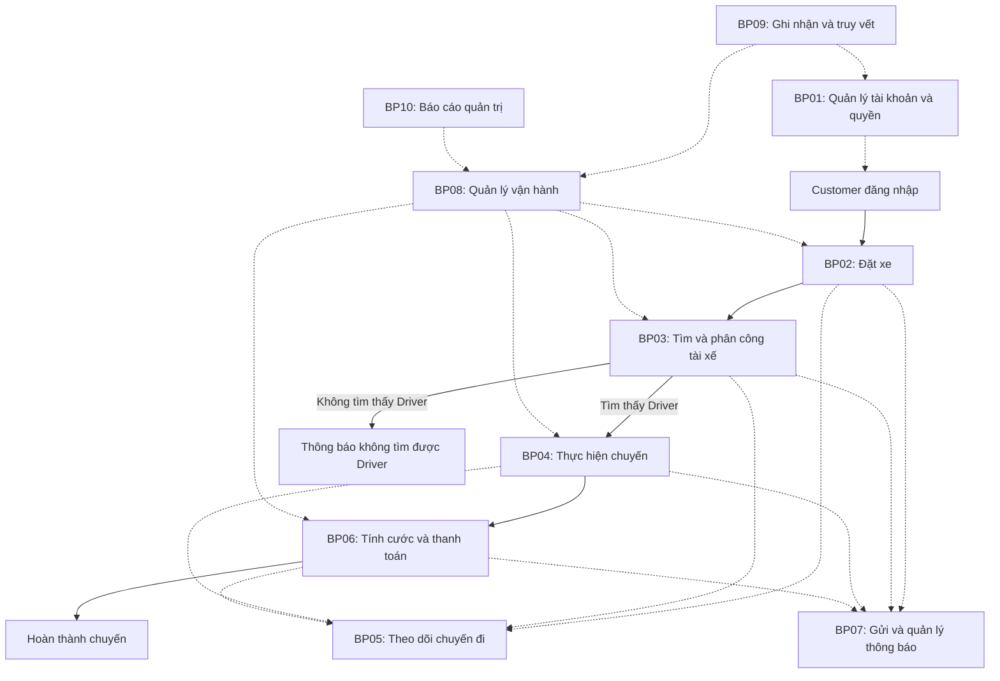
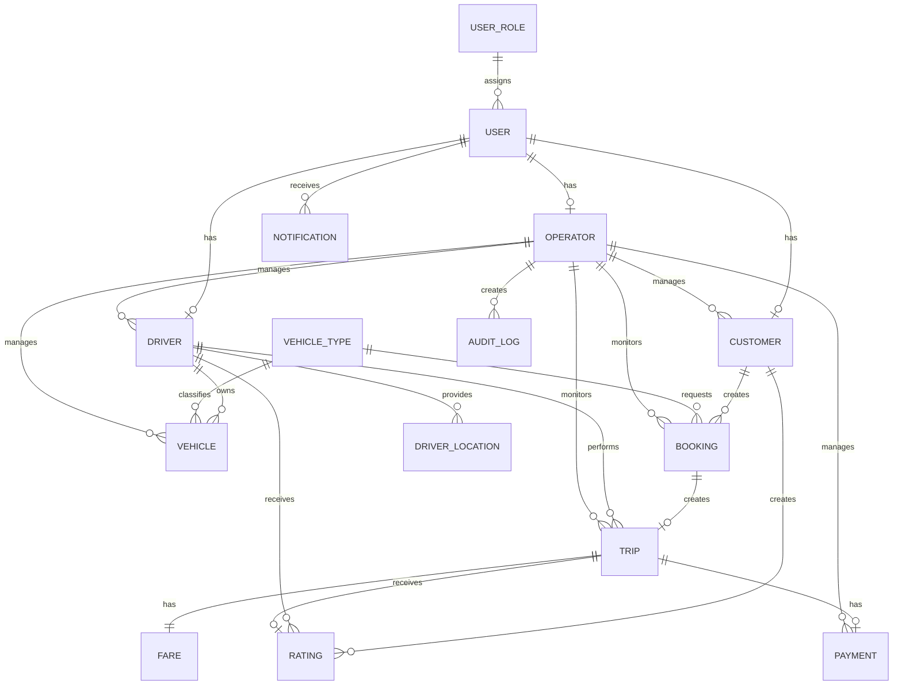
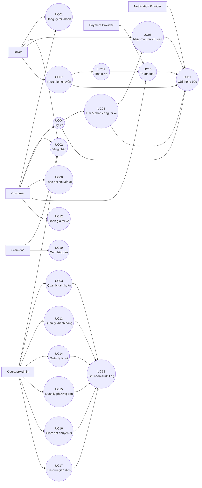

bước 1: xác định ngữ cảnh,
# 1. Xác định ngữ cảnh (Business Context)

**Công ty ABC** cung cấp dịch vụ đặt xe trực tuyến thông qua tổng đài và ứng dụng hiện tại. Tuy nhiên, hệ thống còn phụ thuộc nhiều vào xử lý thủ công, đặc biệt trong việc tiếp nhận yêu cầu, phân công tài xế, theo dõi chuyến đi và quản lý thanh toán.

Khi số lượng khách hàng, tài xế và chuyến đi tăng, hệ thống hiện tại gặp hạn chế về **tự động hóa, khả năng vận hành, theo dõi trạng thái và khả năng mở rộng**.

Do đó, ABC mong muốn xây dựng **CAB System – nền tảng đặt xe mới** nhằm tự động hóa quy trình từ **đặt xe → tìm tài xế → thực hiện chuyến → tính cước → thanh toán → đánh giá**, đồng thời hỗ trợ quản lý vận hành và có kiến trúc linh hoạt để mở rộng trong tương lai.

---

# 2. Business Problem

Hệ thống hiện tại tồn tại các vấn đề chính:

## 2.1. Phân công tài xế thủ công

Việc tìm và phân công tài xế mất nhiều thời gian, khó lựa chọn tài xế phù hợp và phải xử lý thủ công khi tài xế từ chối hoặc không phản hồi.

**Hệ thống cần:** tự động tìm tài xế phù hợp dựa trên vị trí, trạng thái và các tiêu chí vận hành.

---

## 2.2. Khó theo dõi chuyến đi

Khách hàng chưa thể theo dõi đầy đủ trạng thái đặt xe, tài xế và quá trình thực hiện chuyến.

**Hệ thống cần:** cung cấp trạng thái chuyến rõ ràng và cập nhật xuyên suốt quá trình.

---

## 2.3. Quản lý thanh toán chưa tập trung

Việc tính cước, thanh toán và tra cứu giao dịch chưa được quản lý thống nhất.

**Hệ thống cần:** hỗ trợ thanh toán tiền mặt, thanh toán điện tử, theo dõi giao dịch và xử lý thanh toán thất bại thông qua nhà cung cấp bên ngoài.

---

## 2.4. Khó khăn trong vận hành

Nhân viên vận hành khó theo dõi chuyến đang diễn ra, trạng thái tài xế, giao dịch và các trường hợp phát sinh.

**Hệ thống cần:** cung cấp giao diện quản trị tập trung và phân quyền theo vai trò.

---

## 2.5. Khả năng mở rộng và chịu lỗi hạn chế

Hệ thống hiện tại chưa đáp ứng tốt khi số lượng người dùng và chuyến đi tăng. Sự cố ở một chức năng có thể ảnh hưởng đến các chức năng khác.

**Hệ thống cần:** thiết kế các thành phần có khả năng mở rộng độc lập và hạn chế ảnh hưởng dây chuyền khi xảy ra lỗi.

---

## 2.6. Thông báo chưa linh hoạt

Hệ thống cần thông báo kịp thời cho khách hàng và tài xế nhưng phải có khả năng mở rộng thêm các kênh thông báo trong tương lai.

**Hệ thống cần:** thiết kế thành phần Notification có thể tích hợp thêm Push Notification, SMS, Email hoặc các nhà cung cấp khác.

---

## 2.7. Bảo mật và truy vết dữ liệu

Hệ thống xử lý nhiều loại dữ liệu quan trọng như thông tin cá nhân, vị trí, phương tiện và giao dịch.

**Hệ thống cần:**

- Xác thực người dùng.
- Phân quyền theo vai trò.
- Bảo vệ thông tin cá nhân và dữ liệu giao dịch.
- Kiểm soát quyền truy cập dữ liệu vị trí.
- Lưu audit log cho các thao tác quan trọng.
- Stakeholder Hệ thống:
  # Stakeholders – CAB System

| Stakeholder | Vai trò | Mối quan tâm / Mục tiêu |
|---|---|---|
| **Ban giám đốc ABC** | Sponsor / Decision Maker | Doanh thu, hiệu quả vận hành, khả năng mở rộng, ROI |
| **Khách hàng** | End User | Đặt xe nhanh, theo dõi chuyến, thanh toán thuận tiện, an toàn |
| **Tài xế** | End User | Nhận chuyến phù hợp, cập nhật trạng thái, quản lý hoạt động |
| **Nhân viên vận hành** | Operational User | Theo dõi chuyến, tài xế, xử lý sự cố |
| **Admin hệ thống** | System Administrator | Quản lý tài khoản, phân quyền, cấu hình hệ thống |
| **Nhà cung cấp thanh toán** | External System | Xử lý giao dịch thanh toán |
| **Nhà cung cấp dịch vụ bản đồ/GPS** | External System | Vị trí, khoảng cách, định tuyến, ETA |

- Vẽ ma trận stakeholder
# Stakeholder Power–Interest Matrix

| **QUYỀN LỰC / MỨC ĐỘ QUAN TÂM** | **Thấp** | **Cao** |
|---|---|---|
| **Cao** | **KEEP SATISFIED**  • IT Management | **MANAGE CLOSELY**  • Ban giám đốc ABC • Nhân viên vận hành • Admin hệ thống • Bộ phận tài chính/kế toán • Project Manager |
| **Thấp** | **MONITOR**  • Notification Provider | **KEEP INFORMED**  • Khách hàng • Tài xế • Bộ phận CSKH • Business Analyst • Developer • QA/Tester • Payment Provider • Map/GPS Provider |

Bước 3: xác định các Business Gold
## 3. Business Goals

- **BG1:** Tự động hóa quy trình đặt xe và phân công tài xế, giảm sự phụ thuộc vào nhân viên vận hành.

- **BG2:** Nâng cao trải nghiệm khách hàng thông qua khả năng theo dõi trạng thái chuyến đi và nhận thông báo kịp thời.

- **BG3:** Tập trung hóa việc tính cước, thanh toán và quản lý giao dịch.

- **BG4:** Nâng cao hiệu quả vận hành thông qua hệ thống quản trị tập trung, theo dõi chuyến đi, tài xế và giao dịch.

- **BG5:** Xây dựng nền tảng có khả năng mở rộng để đáp ứng số lượng lớn khách hàng, tài xế và chuyến đi.

- **BG6:** Đảm bảo hệ thống hoạt động ổn định và hạn chế ảnh hưởng của sự cố tại các thành phần như thanh toán hoặc thông báo.

- **BG7:** Đảm bảo an toàn dữ liệu và kiểm soát quyền truy cập đối với thông tin khách hàng, tài xế, vị trí và giao dịch.

- **BG8:** Xây dựng nền tảng linh hoạt, cho phép bổ sung dịch vụ, phương thức thanh toán và kênh thông báo mới trong tương lai.

  Bước 4: xác định Scope (Phạm vi)
  ## 4. Scope – Phạm vi MVP

### 4.1. In Scope

MVP tập trung xây dựng các chức năng cốt lõi phục vụ quy trình đặt xe:

#### 1. Quản lý tài khoản
- Đăng ký và đăng nhập Customer/Driver.
- Cập nhật thông tin cá nhân.
- Phân quyền theo vai trò: Customer, Driver, Operator/Admin.

#### 2. Đặt xe
- Customer nhập điểm đón và điểm đến.
- Lựa chọn loại xe.
- Tạo yêu cầu đặt xe.
- Theo dõi trạng thái yêu cầu và chuyến đi.
- Xem thông tin chuyến và lịch sử chuyến đi.

#### 3. Tìm và phân công tài xế
- Driver cập nhật trạng thái sẵn sàng/không sẵn sàng.
- Hệ thống xác định Driver phù hợp dựa trên vị trí và trạng thái.
- Gửi yêu cầu chuyến đến Driver.
- Driver chấp nhận hoặc từ chối chuyến.
- Tự động chuyển sang Driver khác khi Driver từ chối hoặc không phản hồi.
- Thông báo cho Customer khi không tìm được Driver.

#### 4. Quản lý chuyến đi
- Driver cập nhật trạng thái chuyến:
  - Đã nhận chuyến.
  - Đã đến điểm đón.
  - Đã đón khách.
  - Đang di chuyển.
  - Hoàn thành.
- Lưu thông tin vị trí hiện tại của Driver ở mức cơ bản.
- Customer theo dõi trạng thái chuyến.

#### 5. Tính cước và thanh toán
- Tính cước dựa trên loại dịch vụ và thông tin chuyến.
- Hỗ trợ thanh toán tiền mặt.
- Tích hợp một phương thức thanh toán điện tử.
- Lưu trạng thái giao dịch.
- Xử lý trạng thái thanh toán thành công/thất bại.

#### 6. Thông báo
- Thông báo các sự kiện chính:
  - Tạo yêu cầu đặt xe.
  - Driver nhận chuyến.
  - Driver đến điểm đón.
  - Chuyến hoàn thành.
  - Thanh toán thành công/thất bại.
- Thiết kế Notification theo hướng có thể bổ sung thêm kênh trong tương lai.

#### 7. Quản trị vận hành
- Quản lý Customer.
- Quản lý Driver.
- Quản lý Vehicle.
- Theo dõi các chuyến đang diễn ra.
- Tra cứu lịch sử chuyến đi và giao dịch.
- Phân quyền thao tác quản trị cơ bản.
- Ghi nhận audit log cho các thao tác quan trọng.

---

### 4.2. MVP Boundary

MVP đảm bảo hoàn thành được **một quy trình đặt xe end-to-end**:

Customer
→ Đăng nhập
→ Tạo yêu cầu
→ Hệ thống tìm Driver
→ Driver nhận chuyến
→ Thực hiện chuyến
→ Hoàn thành
→ Tính cước
→ Thanh toán
→ Lưu lịch sử
→ Đánh giá

Đồng thời, Operator/Admin có thể theo dõi và hỗ trợ các hoạt động chính của hệ thống.

Bước 5: gặp khách hàng và chuyển đổi thành nghiệp vụ để viết Business Requirement
# 5. Business Requirements

| Mã | Tên Business Requirement | Diễn giải |
|---|---|---|
| **BR01** | Quản lý tài khoản và quyền | Hệ thống hỗ trợ người dùng đăng ký, đăng nhập, cập nhật thông tin tài khoản và quản lý quyền truy cập theo vai trò được cấp. |
| **BR02** | Đặt xe | Hệ thống hỗ trợ Customer nhập điểm đón, điểm đến, lựa chọn loại xe và gửi yêu cầu đặt xe. |
| **BR03** | Theo dõi chuyến đi | Hệ thống cho phép Customer theo dõi trạng thái, vị trí Driver và thông tin chuyến đi trong quá trình thực hiện. |
| **BR04** | Tìm và phân công tài xế | Hệ thống tự động tìm và phân công Driver phù hợp dựa trên vị trí, trạng thái, loại xe và các tiêu chí vận hành. |
| **BR05** | Quản lý chuyến đi | Hệ thống hỗ trợ Driver nhận/từ chối chuyến và cập nhật trạng thái chuyến trong quá trình thực hiện. |
| **BR06** | Quản lý vị trí tài xế | Hệ thống lưu và quản lý vị trí của Driver để phục vụ tìm kiếm, phân công và theo dõi chuyến đi. |
| **BR07** | Tính cước và thanh toán | Hệ thống hỗ trợ tính cước và thanh toán bằng tiền mặt hoặc phương thức điện tử thông qua Payment Provider. |
| **BR08** | Quản lý thông báo | Hệ thống gửi thông báo đến Customer và Driver khi xảy ra các sự kiện nghiệp vụ quan trọng. |
| **BR09** | Quản lý vận hành | Hệ thống cung cấp cho Operator khả năng quản lý Customer, Driver, Vehicle, Trip và giao dịch. |
| **BR10** | Bảo mật và truy vết | Hệ thống xác thực người dùng, kiểm soát quyền truy cập, bảo vệ dữ liệu và ghi nhận Audit Log cho các thao tác quan trọng. |
| **BR11** | Báo cáo quản trị | Hệ thống cung cấp cho Giám đốc các báo cáo tổng hợp về hoạt động kinh doanh và vận hành để phục vụ theo dõi và ra quyết định. |

Bước 6: Business Process
# 6. Business Process

| Mã | Business Process | Mô tả |
|---|---|---|
| **BP01** | Quản lý tài khoản và quyền | Người dùng đăng ký, đăng nhập, cập nhật tài khoản; Operator/Admin quản lý quyền truy cập theo vai trò. |
| **BP02** | Đặt xe | Customer nhập thông tin chuyến và gửi yêu cầu đặt xe. |
| **BP03** | Tìm và phân công tài xế | Hệ thống tìm Driver phù hợp và thực hiện phân công chuyến. |
| **BP04** | Thực hiện chuyến đi | Driver nhận chuyến, đến điểm đón, đón khách, thực hiện chuyến và hoàn thành chuyến. |
| **BP05** | Theo dõi chuyến đi | Customer theo dõi trạng thái, vị trí Driver và thông tin chuyến. |
| **BP06** | Tính cước và thanh toán | Hệ thống tính cước và xử lý thanh toán cho chuyến đi. |
| **BP07** | Gửi và quản lý thông báo | Hệ thống tạo và gửi thông báo dựa trên các sự kiện nghiệp vụ. |
| **BP08** | Quản lý vận hành | Operator quản lý Customer, Driver, Vehicle, theo dõi Trip và tra cứu Payment. |
| **BP09** | Ghi nhận và truy vết | Hệ thống lưu Audit Log đối với các thao tác quan trọng để phục vụ truy vết. |
| **BP10** | Báo cáo quản trị | Hệ thống tổng hợp dữ liệu hoạt động và cung cấp báo cáo cho Giám đốc. |

## 6.1. Tổng quan quy trình nghiệp vụ

Bước 7: phân rã yêu cầu chức năng
# 7. Functional Requirements

## 7.1. Đăng ký tài khoản – UC01

| Mã | Functional Requirement | Diễn giải |
|---|---|---|
| **FR01** | Đăng ký tài khoản | Cho phép Customer hoặc Driver tạo tài khoản mới bằng cách cung cấp các thông tin bắt buộc. |

---

## 7.2. Đăng nhập – UC02

| Mã | Functional Requirement | Diễn giải |
|---|---|---|
| **FR02** | Đăng nhập | Cho phép Customer, Driver, Operator, Admin và Giám đốc đăng nhập vào hệ thống bằng thông tin xác thực hợp lệ. |
| **FR56** | Xác thực người dùng | Hệ thống phải xác thực danh tính người dùng trước khi cho phép truy cập các chức năng yêu cầu đăng nhập. |

---

## 7.3. Quản lý tài khoản – UC03

| Mã | Functional Requirement | Diễn giải |
|---|---|---|
| **FR03** | Cập nhật thông tin cá nhân | Cho phép Customer và Driver cập nhật các thông tin cá nhân theo quyền được cấp. |
| **FR04** | Quản lý phân quyền tài khoản | Cho phép Admin/Operator có quyền quản lý thay đổi vai trò và quyền truy cập của tài khoản theo chính sách hệ thống. |
| **FR57** | Kiểm soát quyền truy cập | Hệ thống chỉ cho phép người dùng thực hiện các chức năng phù hợp với vai trò và quyền được cấp. |
| **FR58** | Bảo vệ dữ liệu | Hệ thống phải bảo vệ thông tin cá nhân, thông tin phương tiện, vị trí và dữ liệu giao dịch khỏi truy cập trái phép. |

---

## 7.4. Đặt xe – UC04

| Mã | Functional Requirement | Diễn giải |
|---|---|---|
| **FR05** | Xác định điểm đón | Cho phép Customer nhập hoặc chọn vị trí đón khách. |
| **FR06** | Xác định điểm đến | Cho phép Customer nhập hoặc chọn điểm đến. |
| **FR07** | Lựa chọn loại xe | Cho phép Customer lựa chọn loại xe phù hợp với nhu cầu. |
| **FR08** | Tạo yêu cầu đặt xe | Cho phép Customer gửi yêu cầu đặt xe sau khi nhập đầy đủ thông tin. |
| **FR09** | Kiểm tra thông tin đặt xe | Hệ thống kiểm tra các thông tin cần thiết trước khi tạo yêu cầu đặt xe. |
| **FR10** | Hủy yêu cầu đặt xe | Cho phép Customer hủy yêu cầu đặt xe theo chính sách doanh nghiệp. |

---

## 7.5. Tìm và phân công tài xế – UC05

| Mã | Functional Requirement | Diễn giải |
|---|---|---|
| **FR11** | Xác định vị trí tài xế | Xác định vị trí hiện tại của các Driver đang hoạt động. |
| **FR12** | Tìm tài xế | Tìm các Driver đang sẵn sàng nhận chuyến trong khu vực phù hợp. |
| **FR13** | Lọc theo loại xe | Chỉ lựa chọn Driver có phương tiện phù hợp với loại xe Customer yêu cầu. |
| **FR14** | Lọc theo khoảng cách | Ưu tiên hoặc lọc Driver dựa trên khoảng cách đến điểm đón. |
| **FR15** | Lọc theo trạng thái | Chỉ lựa chọn Driver đang ở trạng thái sẵn sàng nhận chuyến. |
| **FR16** | Xếp hạng tài xế phù hợp | Xác định thứ tự ưu tiên của các Driver dựa trên các tiêu chí vận hành. |
| **FR17** | Gửi yêu cầu nhận chuyến | Gửi thông tin chuyến đến Driver được lựa chọn. |
| **FR18** | Xử lý tài xế từ chối | Khi Driver từ chối, hệ thống tiếp tục tìm Driver khác. |
| **FR19** | Xử lý tài xế không phản hồi | Khi Driver không phản hồi trong thời gian quy định, hệ thống chuyển sang Driver khác. |
| **FR20** | Thông báo không tìm được tài xế | Thông báo cho Customer khi hệ thống không tìm được Driver phù hợp. |

---

## 7.6. Nhận/Từ chối chuyến – UC06

| Mã | Functional Requirement | Diễn giải |
|---|---|---|
| **FR21** | Nhận chuyến | Cho phép Driver chấp nhận yêu cầu chuyến còn hiệu lực. |
| **FR22** | Từ chối chuyến | Cho phép Driver từ chối yêu cầu chuyến còn hiệu lực. |

---

## 7.7. Thực hiện chuyến – UC07

| Mã | Functional Requirement | Diễn giải |
|---|---|---|
| **FR23** | Cập nhật trạng thái chuyến | Cho phép Driver cập nhật trạng thái Trip trong quá trình thực hiện. |
| **FR24** | Cập nhật trạng thái "Đã đến" | Driver xác nhận đã đến điểm đón. |
| **FR25** | Cập nhật trạng thái "Đã đón khách" | Driver xác nhận đã đón Customer. |
| **FR26** | Cập nhật trạng thái "Đang di chuyển" | Driver xác nhận chuyến đang được thực hiện. |
| **FR27** | Hoàn thành chuyến | Driver xác nhận Trip đã hoàn thành. |
| **FR28** | Cập nhật vị trí Driver | Hệ thống ghi nhận vị trí hiện tại của Driver trong quá trình thực hiện Trip. |

---

## 7.8. Theo dõi chuyến đi – UC08

| Mã | Functional Requirement | Diễn giải |
|---|---|---|
| **FR29** | Theo dõi trạng thái chuyến | Customer có thể xem trạng thái hiện tại của Trip. |
| **FR30** | Xem thông tin Driver | Customer có thể xem thông tin Driver đã nhận chuyến. |
| **FR31** | Theo dõi vị trí Driver | Customer có thể xem vị trí hiện tại của Driver ở mức hệ thống hỗ trợ. |
| **FR32** | Hiển thị thời gian dự kiến | Hệ thống hiển thị thời gian dự kiến Driver đến điểm đón/đích theo dữ liệu hiện có. |
| **FR33** | Xem lịch sử chuyến | Customer có thể xem các Trip đã thực hiện và thông tin liên quan. |

---

## 7.9. Tính cước – UC09

| Mã | Functional Requirement | Diễn giải |
|---|---|---|
| **FR34** | Tính cước chuyến đi | Hệ thống tính số tiền cần thanh toán dựa trên quy tắc tính cước và thông tin Trip. |

---

## 7.10. Thanh toán – UC10

| Mã | Functional Requirement | Diễn giải |
|---|---|---|
| **FR35** | Chọn phương thức thanh toán | Customer lựa chọn tiền mặt hoặc thanh toán điện tử. |
| **FR36** | Xử lý thanh toán điện tử | Hệ thống gửi yêu cầu thanh toán đến Payment Provider. |
| **FR37** | Ghi nhận kết quả thanh toán | Hệ thống ghi nhận trạng thái thành công, thất bại hoặc đang xử lý của giao dịch. |
| **FR38** | Xử lý thanh toán thất bại | Hệ thống thông báo và hỗ trợ xử lý lại giao dịch theo chính sách doanh nghiệp. |

---

## 7.11. Gửi thông báo – UC11

| Mã | Functional Requirement | Diễn giải |
|---|---|---|
| **FR40** | Thông báo tạo yêu cầu | Thông báo cho Customer khi yêu cầu đặt xe được tiếp nhận. |
| **FR41** | Thông báo Driver nhận chuyến | Thông báo cho Customer khi Driver nhận chuyến. |
| **FR42** | Thông báo Driver đến | Thông báo cho Customer khi Driver đến điểm đón. |
| **FR43** | Thông báo hoàn thành chuyến | Thông báo khi Trip hoàn thành. |
| **FR44** | Thông báo kết quả thanh toán | Thông báo kết quả thanh toán cho Customer. |
| **FR45** | Thông báo chuyến mới cho Driver | Thông báo cho Driver khi có yêu cầu chuyến phù hợp. |

---

## 7.12. Đánh giá tài xế – UC12

| Mã | Functional Requirement | Diễn giải |
|---|---|---|
| **FR39** | Tạo đánh giá tài xế | Cho phép Customer đánh giá Driver sau khi Trip hoàn thành. |

---

## 7.13. Quản lý khách hàng – UC13

| Mã | Functional Requirement | Diễn giải |
|---|---|---|
| **FR46** | Xem danh sách khách hàng | Operator có thể xem danh sách Customer đã đăng ký. |
| **FR47** | Xem thông tin khách hàng | Operator có thể xem thông tin cơ bản của Customer. |
| **FR48** | Cập nhật thông tin khách hàng | Operator có quyền có thể cập nhật thông tin Customer. |
| **FR49** | Khóa/Mở khóa tài khoản khách hàng | Operator có quyền có thể khóa hoặc mở khóa tài khoản Customer theo chính sách. |

---

## 7.14. Quản lý tài xế – UC14

| Mã | Functional Requirement | Diễn giải |
|---|---|---|
| **FR50** | Quản lý tài xế | Operator có thể xem và quản lý thông tin và trạng thái hoạt động của Driver. |

---

## 7.15. Quản lý phương tiện – UC15

| Mã | Functional Requirement | Diễn giải |
|---|---|---|
| **FR51** | Quản lý phương tiện | Operator có thể xem, thêm, cập nhật và quản lý thông tin Vehicle của Driver. |

---

## 7.16. Giám sát chuyến đi – UC16

| Mã | Functional Requirement | Diễn giải |
|---|---|---|
| **FR52** | Theo dõi chuyến đang diễn ra | Operator có thể xem các Trip đang thực hiện và trạng thái hiện tại. |
| **FR53** | Hỗ trợ xử lý chuyến lỗi | Operator có thể kiểm tra và hỗ trợ các Trip phát sinh vấn đề. |

---

## 7.17. Tra cứu giao dịch – UC17

| Mã | Functional Requirement | Diễn giải |
|---|---|---|
| **FR55** | Tra cứu giao dịch | Operator có thể tra cứu thông tin và trạng thái các giao dịch thanh toán theo các điều kiện hỗ trợ. |

---

## 7.18. Ghi nhận Audit Log – UC18

| Mã | Functional Requirement | Diễn giải |
|---|---|---|
| **FR59** | Ghi nhận Audit Log | Hệ thống lưu lại các thao tác quan trọng của người dùng, Operator và Admin để phục vụ truy vết. |

---

## 7.19. Xem báo cáo – UC19

| Mã | Functional Requirement | Diễn giải |
|---|---|---|
| **FR60** | Xem báo cáo | Cho phép Giám đốc xem các báo cáo tổng hợp về hoạt động kinh doanh và vận hành của hệ thống. |
| **FR61** | Lọc báo cáo | Cho phép Giám đốc lựa chọn khoảng thời gian và các điều kiện lọc được hệ thống hỗ trợ. |
| **FR62** | Xem chỉ số báo cáo | Hệ thống hiển thị các chỉ số tổng hợp như doanh thu, số chuyến, giao dịch, khách hàng và Driver theo phạm vi được chọn. |

---

## 7.20. Ma trận FR → UC

| UC | FR |
|---|---|
| **UC01 – Đăng ký tài khoản** | FR01 |
| **UC02 – Đăng nhập** | FR02, FR56 |
| **UC03 – Quản lý tài khoản** | FR03, FR04, FR57, FR58 |
| **UC04 – Đặt xe** | FR05–FR10 |
| **UC05 – Tìm và phân công tài xế** | FR11–FR20 |
| **UC06 – Nhận/Từ chối chuyến** | FR21–FR22 |
| **UC07 – Thực hiện chuyến** | FR23–FR28 |
| **UC08 – Theo dõi chuyến đi** | FR29–FR33 |
| **UC09 – Tính cước** | FR34 |
| **UC10 – Thanh toán** | FR35–FR38 |
| **UC11 – Gửi thông báo** | FR40–FR45 |
| **UC12 – Đánh giá tài xế** | FR39 |
| **UC13 – Quản lý khách hàng** | FR46–FR49 |
| **UC14 – Quản lý tài xế** | FR50 |
| **UC15 – Quản lý phương tiện** | FR51 |
| **UC16 – Giám sát chuyến đi** | FR52–FR53 |
| **UC17 – Tra cứu giao dịch** | FR55 |
| **UC18 – Ghi nhận Audit Log** | FR59 |
| **UC19 – Xem báo cáo** | FR60–FR62 |
| **Bảo mật dùng chung** | FR56–FR58 |

---

## 7.21. Các FR loại bỏ/tránh trùng

| FR cũ | Vấn đề | Cách sửa |
|---|---|---|
| FR39 cũ | "Tra cứu giao dịch" bị trùng với FR55 | Chuyển FR39 sang "Tạo đánh giá tài xế" |
| FR54 | "Tra cứu lịch sử chuyến" Operator | Không bỏ; giữ cho chức năng quản trị nếu hệ thống vẫn cần Operator tra cứu lịch sử. |
| FR55 | "Tra cứu giao dịch" | Giữ và gắn cho UC17 |
| FR56 | Xác thực người dùng | Dùng chung cho UC02 và các UC yêu cầu đăng nhập |
| FR57 | Kiểm soát quyền | Đưa vào UC03 và dùng chung cho các UC có phân quyền |
| FR58 | Bảo vệ dữ liệu | Yêu cầu dùng chung |
| FR59 | Audit Log | Gắn riêng UC18 |
| FR60–62 | Mới | Dùng cho UC19 – Xem báo cáo |

Bước 8: Business Rules & exceptions (Những quy tắc nghiệp vụ và ngoại lệ)
# 8. Business Rules & Exceptions

## 8.1. Business Rules

| Mã | Business Rule | Diễn giải |
|---|---|---|
| **BRL01** | Trạng thái tài xế | Chỉ Driver ở trạng thái sẵn sàng mới được đưa vào danh sách tìm kiếm và phân công. |
| **BRL02** | Loại xe phù hợp | Driver chỉ được đề xuất cho chuyến có loại xe phù hợp với phương tiện đang sử dụng. |
| **BRL03** | Ưu tiên tài xế | Hệ thống ưu tiên Driver phù hợp và có vị trí gần điểm đón theo tiêu chí vận hành. |
| **BRL04** | Phân công tài xế | Một Booking chỉ được phân công cho một Driver tại một thời điểm. |
| **BRL05** | Tài xế từ chối chuyến | Khi Driver từ chối chuyến, hệ thống tiếp tục tìm Driver phù hợp khác. |
| **BRL06** | Tài xế không phản hồi | Khi Driver không phản hồi trong thời gian quy định, hệ thống chuyển sang Driver khác. |
| **BRL07** | Không tìm được tài xế | Nếu không còn Driver phù hợp, hệ thống cập nhật trạng thái Booking và thông báo Customer. |
| **BRL08** | Trạng thái chuyến | Trip phải được cập nhật theo đúng trình tự trạng thái nghiệp vụ. |
| **BRL09** | Tính cước | Fare được tính dựa trên loại dịch vụ và thông tin chuyến theo chính sách doanh nghiệp. |
| **BRL10** | Thanh toán | Mỗi Trip phải có phương thức và trạng thái thanh toán được ghi nhận. |
| **BRL11** | Thanh toán điện tử | Thanh toán điện tử phải thực hiện thông qua Payment Provider bên ngoài. |
| **BRL12** | Dữ liệu thanh toán | CAB System không lưu trực tiếp dữ liệu nhạy cảm của thẻ hoặc tài khoản thanh toán. |
| **BRL13** | Thông báo | Các sự kiện nghiệp vụ quan trọng phải tạo thông báo tương ứng. |
| **BRL14** | Phân quyền tài khoản | Người dùng chỉ được thực hiện chức năng phù hợp với vai trò và quyền được cấp. |
| **BRL15** | Quản lý vai trò | Chỉ tài khoản có quyền quản lý tài khoản/phân quyền mới được thay đổi vai trò hoặc quyền của tài khoản khác. |
| **BRL16** | Audit Log | Các thao tác quản trị và thao tác quan trọng phải được ghi nhận để phục vụ truy vết. |
| **BRL17** | Báo cáo quản trị | Chỉ Giám đốc hoặc tài khoản được cấp quyền báo cáo mới được xem báo cáo quản trị. |
| **BRL18** | Dữ liệu báo cáo | Báo cáo chỉ được tổng hợp từ dữ liệu đã được ghi nhận hợp lệ trong hệ thống. |
| **BRL19** | Phạm vi báo cáo | Giám đốc chỉ xem được các báo cáo và phạm vi dữ liệu mà hệ thống cấp quyền. |

---

## 8.2. Các ngoại lệ chính

* **E01:** Thông tin đăng ký không hợp lệ → yêu cầu nhập lại.
* **E02:** Thông tin đăng nhập không chính xác → từ chối đăng nhập.
* **E03:** Tài khoản chưa được phép hoặc bị khóa → từ chối truy cập.
* **E04:** Người dùng không có quyền quản lý tài khoản/phân quyền → từ chối thao tác.
* **E05:** Driver từ chối chuyến → tìm Driver tiếp theo.
* **E06:** Driver không phản hồi → tìm Driver khác.
* **E07:** Không tìm được Driver → thông báo Customer.
* **E08:** Payment thất bại → ghi nhận trạng thái FAILED.
* **E09:** Notification Provider lỗi → ghi nhận trạng thái gửi thất bại.
* **E10:** Không tìm thấy dữ liệu báo cáo → hiển thị báo cáo rỗng hoặc thông báo không có dữ liệu.
* **E11:** Giám đốc không có quyền xem báo cáo → từ chối truy cập.
* **E12:** Dữ liệu báo cáo không đủ hoặc không hợp lệ → không tính/tổng hợp sai dữ liệu và thông báo lỗi.

Bước 9: mô hình hóa hệ thống (Data Modeling)
# 9. Data Modeling

## 9.1. Các Entity chính

| Mã | Entity | Mô tả |
|---|---|---|
| **E01** | User | Lưu thông tin tài khoản và thông tin xác thực của người dùng trong hệ thống. |
| **E02** | UserRole | Quản lý vai trò và quyền truy cập của người dùng. |
| **E03** | Customer | Lưu thông tin nghiệp vụ của khách hàng. |
| **E04** | Driver | Lưu thông tin hồ sơ và trạng thái hoạt động của tài xế. |
| **E05** | Operator | Lưu thông tin nhân viên vận hành và thông tin phục vụ quản trị. |
| **E06** | Vehicle | Lưu thông tin phương tiện của tài xế. |
| **E07** | VehicleType | Lưu thông tin các loại xe được cung cấp. |
| **E08** | Booking | Lưu thông tin yêu cầu đặt xe của khách hàng. |
| **E09** | Trip | Lưu thông tin chuyến đi sau khi tài xế nhận chuyến. |
| **E10** | DriverLocation | Lưu vị trí hiện tại/lịch sử vị trí của tài xế. |
| **E11** | Fare | Lưu thông tin cước phí của chuyến đi. |
| **E12** | Payment | Lưu thông tin và trạng thái thanh toán. |
| **E13** | Notification | Lưu thông tin các thông báo được gửi đến Customer hoặc Driver. |
| **E14** | Rating | Lưu đánh giá của Customer đối với Driver sau chuyến đi. |
| **E15** | AuditLog | Lưu vết các thao tác quan trọng của người dùng và Operator. |

---

## 9.2. Mối quan hệ giữa các Entity

---

## 9.3. Vai trò của Operator trong Data Model

Operator không trực tiếp tham gia vào quy trình đặt xe như Customer hoặc Driver. Operator chủ yếu thực hiện các nghiệp vụ **quản lý và giám sát hệ thống**:

| Đối tượng | Chức năng của Operator |
|---|---|
| Customer | Xem, cập nhật, khóa/mở khóa tài khoản |
| Driver | Xem và quản lý thông tin tài xế |
| Vehicle | Quản lý thông tin phương tiện |
| Booking | Theo dõi và hỗ trợ yêu cầu đặt xe |
| Trip | Theo dõi các chuyến đang diễn ra và xử lý chuyến lỗi |
| Payment | Tra cứu trạng thái giao dịch |
| AuditLog | Theo dõi các thao tác quan trọng |

Bước 10: yêu cầu phi chức năng
# 10. Non-Functional Requirements

| Mã | Nhóm | Yêu cầu phi chức năng | Diễn giải |
|---|---|---|---|
| **NFR01** | Performance | Thời gian phản hồi | Các thao tác thông thường như đăng nhập, xem thông tin và tạo yêu cầu đặt xe cần có thời gian phản hồi phù hợp với nhu cầu sử dụng. |
| **NFR02** | Performance | Khả năng xử lý đồng thời | Hệ thống phải có khả năng phục vụ đồng thời nhiều Customer, Driver và Operator mà không làm ảnh hưởng đáng kể đến hoạt động của hệ thống. |
| **NFR03** | Availability | Tính sẵn sàng | Hệ thống cần duy trì hoạt động ổn định trong thời gian cung cấp dịch vụ, đặc biệt trong các thời điểm nhu cầu tăng cao. |
| **NFR04** | Reliability | Độc lập giữa các thành phần | Lỗi tại một thành phần như Payment hoặc Notification không được làm toàn bộ chức năng đặt xe ngừng hoạt động. |
| **NFR05** | Scalability | Khả năng mở rộng | Các thành phần của hệ thống cần có khả năng mở rộng độc lập khi số lượng Customer, Driver và Trip tăng. |
| **NFR06** | Security | Xác thực | Người dùng phải được xác thực trước khi sử dụng các chức năng yêu cầu tài khoản. |
| **NFR07** | Security | Phân quyền | Hệ thống phải kiểm soát quyền truy cập dựa trên vai trò Customer, Driver, Operator và các quyền quản trị được cấp. |
| **NFR08** | Security | Bảo vệ dữ liệu | Thông tin cá nhân, thông tin phương tiện, dữ liệu vị trí và dữ liệu giao dịch phải được bảo vệ khỏi truy cập trái phép. |
| **NFR09** | Security | Bảo vệ dữ liệu thanh toán | Hệ thống không được lưu trực tiếp thông tin nhạy cảm của thẻ hoặc tài khoản thanh toán. |
| **NFR10** | Auditability | Truy vết thao tác | Các thao tác quan trọng của Operator và người dùng phải được ghi nhận để phục vụ kiểm tra và xử lý sự cố. |
| **NFR11** | Maintainability | Khả năng bảo trì | Hệ thống cần được thiết kế theo các thành phần có trách nhiệm rõ ràng để dễ sửa lỗi và bảo trì. |
| **NFR12** | Extensibility | Khả năng mở rộng chức năng | Hệ thống phải cho phép bổ sung loại dịch vụ, phương thức thanh toán và các chức năng mới mà hạn chế ảnh hưởng đến chức năng hiện tại. |
| **NFR13** | Extensibility | Mở rộng kênh thông báo | Có thể bổ sung hoặc thay đổi nhà cung cấp/kênh thông báo mà không phải thay đổi toàn bộ hệ thống. |
| **NFR14** | Reliability | Khả năng phục hồi | Hệ thống cần có cơ chế xử lý và phục hồi phù hợp khi xảy ra lỗi kết nối hoặc lỗi tại các dịch vụ bên ngoài. |
| **NFR15** | Usability | Dễ sử dụng | Giao diện Customer, Driver và Operator phải rõ ràng, dễ hiểu và phù hợp với từng nhóm người dùng. |

Bước 11: tiến hành thiết kế các Use Case

Bước 12: đặc tả Use Case
## UC01 – Đăng ký tài khoản

| Thành phần | Nội dung |
|---|---|
| **Use Case ID** | UC01 |
| **Tên** | Đăng ký tài khoản |
| **Actor** | Customer, Driver |
| **Mục tiêu** | Cho phép Customer/Driver tạo tài khoản mới. |
| **Tiền điều kiện** | Người dùng chưa có tài khoản. |
| **Hậu điều kiện** | Tài khoản được tạo thành công. |

### Luồng chính

1. Người dùng mở chức năng Đăng ký.
2. Người dùng chọn vai trò Customer hoặc Driver.
3. Người dùng nhập thông tin tài khoản.
4. Hệ thống kiểm tra dữ liệu.
5. Hệ thống kiểm tra phone/email chưa tồn tại.
6. Hệ thống tạo tài khoản.
7. Hệ thống thông báo đăng ký thành công.

### Ngoại lệ

- **E1:** Thiếu hoặc sai thông tin → yêu cầu nhập lại.
- **E2:** Phone/email đã tồn tại → yêu cầu sử dụng thông tin khác.

## UC02 – Đăng nhập

| Thành phần | Nội dung |
|---|---|
| **Use Case ID** | UC02 |
| **Tên** | Đăng nhập |
| **Actor** | Customer, Driver, Operator, Admin, Giám đốc |
| **Mục tiêu** | Xác thực người dùng và cấp quyền truy cập phù hợp. |
| **Tiền điều kiện** | Người dùng đã có tài khoản. |
| **Hậu điều kiện** | Người dùng đăng nhập thành công và được cấp phiên/token. |

### Luồng chính

1. Người dùng mở màn hình đăng nhập.
2. Nhập thông tin đăng nhập.
3. Hệ thống xác thực.
4. Hệ thống kiểm tra trạng thái tài khoản.
5. Hệ thống xác định vai trò/quyền.
6. Hệ thống cấp phiên/token.
7. Hệ thống chuyển người dùng vào chức năng phù hợp.

### Ngoại lệ

- **E1:** Sai thông tin đăng nhập → từ chối.
- **E2:** Tài khoản bị khóa → từ chối.
- **E3:** Tài khoản không có quyền truy cập → từ chối.

## UC03 – Quản lý tài khoản

| Thành phần | Nội dung |
|---|---|
| **Use Case ID** | UC03 |
| **Tên** | Quản lý tài khoản |
| **Actor** | Customer, Driver, Operator, Admin |
| **Mục tiêu** | Cập nhật thông tin tài khoản và quản lý quyền của tài khoản. |
| **Tiền điều kiện** | Người dùng đã đăng nhập. |
| **Hậu điều kiện** | Thông tin hoặc quyền tài khoản được cập nhật. |

### Luồng chính

1. Người dùng mở chức năng Quản lý tài khoản.
2. Hệ thống hiển thị thông tin tài khoản.
3. Customer/Driver có thể cập nhật thông tin cá nhân.
4. Operator/Admin có quyền quản lý vai trò và quyền tài khoản theo chính sách.
5. Hệ thống kiểm tra dữ liệu và quyền thực hiện.
6. Hệ thống lưu thay đổi.
7. Hệ thống ghi Audit Log đối với thao tác quản trị.
8. Hệ thống thông báo kết quả.

### Ngoại lệ

- **E1:** Dữ liệu cập nhật không hợp lệ → yêu cầu nhập lại.
- **E2:** Không có quyền quản lý tài khoản → từ chối.
- **E3:** Vai trò/quyền không hợp lệ → từ chối.
- **E4:** Tài khoản không tồn tại → thông báo lỗi.

## UC04 – Đặt xe

| Thành phần | Nội dung |
|---|---|
| **Use Case ID** | UC04 |
| **Tên** | Đặt xe |
| **Actor** | Customer |
| **Mục tiêu** | Tạo yêu cầu đặt xe. |
| **Tiền điều kiện** | Customer đã đăng nhập. |
| **Hậu điều kiện** | Booking được tạo và chuyển sang tìm Driver. |

### Luồng chính

1. Customer chọn Đặt xe.
2. Nhập điểm đón.
3. Nhập điểm đến.
4. Chọn loại xe.
5. Hệ thống kiểm tra thông tin.
6. Customer xác nhận.
7. Hệ thống tạo Booking.
8. Hệ thống chuyển Booking sang trạng thái tìm Driver.

### Ngoại lệ

- **E1:** Thiếu điểm đón/điểm đến.
- **E2:** Tọa độ không hợp lệ.
- **E3:** Không có loại xe phù hợp.
- **E4:** Customer hủy trước khi xác nhận.

## UC05 – Tìm và phân công tài xế

| Thành phần | Nội dung |
|---|---|
| **Use Case ID** | UC05 |
| **Tên** | Tìm và phân công tài xế |
| **Actor** | System |
| **Actor liên quan** | Driver |
| **Mục tiêu** | Tìm và phân công Driver phù hợp cho Booking. |
| **Tiền điều kiện** | Booking đã được tạo và ở trạng thái cần tìm Driver. |
| **Hậu điều kiện** | Driver được phân công hoặc Booking chuyển sang trạng thái không tìm được Driver. |

### Luồng chính

1. Hệ thống nhận Booking.
2. Xác định Driver đang sẵn sàng.
3. Lọc theo loại xe.
4. Lọc/ưu tiên theo vị trí.
5. Áp dụng tiêu chí vận hành.
6. Gửi yêu cầu nhận chuyến.
7. Driver chấp nhận.
8. Gán Driver cho Booking.
9. Tạo Trip.
10. Thông báo Customer.

### Ngoại lệ

- **E1:** Driver từ chối → Hệ thống tìm Driver tiếp theo.
- **E2:** Driver không phản hồi → Hệ thống tìm Driver khác.
- **E3:** Không còn Driver phù hợp → Hệ thống cập nhật Booking và thông báo cho Customer.
- **E4:** Driver mất kết nối → Hệ thống loại Driver khỏi danh sách có thể phân công.

## UC06 – Nhận/Từ chối chuyến

| Thành phần | Nội dung |
|---|---|
| **Use Case ID** | UC06 |
| **Tên** | Nhận/Từ chối chuyến |
| **Actor** | Driver |
| **Mục tiêu** | Cho phép Driver phản hồi yêu cầu chuyến được hệ thống gửi đến. |
| **Tiền điều kiện** | Driver đang ở trạng thái sẵn sàng và nhận được yêu cầu chuyến. |
| **Hậu điều kiện** | Chuyến được Driver nhận hoặc hệ thống chuyển sang tìm Driver khác. |

### Luồng chính

1. Driver mở danh sách yêu cầu.
2. Hệ thống hiển thị thông tin chuyến.
3. Driver chọn Nhận hoặc Từ chối.
4. Hệ thống cập nhật kết quả.
5. Nếu nhận → gán chuyến và tạo Trip.
6. Nếu từ chối → tiếp tục tìm Driver khác.

### Ngoại lệ

- **E1:** Yêu cầu hết hạn.
- **E2:** Chuyến đã được Driver khác nhận.
- **E3:** Request không hợp lệ.

## UC07 – Thực hiện chuyến

| Thành phần | Nội dung |
|---|---|
| **Use Case ID** | UC07 |
| **Tên** | Thực hiện chuyến |
| **Actor** | Driver |
| **Mục tiêu** | Cho phép Driver cập nhật trạng thái chuyến trong quá trình thực hiện. |
| **Tiền điều kiện** | Driver đã nhận Trip. |
| **Hậu điều kiện** | Trip được hoàn thành hoặc chuyển sang trạng thái xử lý ngoại lệ. |

### Luồng chính

1. Driver nhận Trip.
2. Cập nhật ARRIVED.
3. Cập nhật PICKED_UP.
4. Cập nhật IN_PROGRESS.
5. Cập nhật vị trí.
6. Cập nhật COMPLETED.
7. Hệ thống chuyển sang tính cước.

### Ngoại lệ

- **E1:** Chuyển trạng thái sai trình tự.
- **E2:** Tọa độ không hợp lệ.
- **E3:** Mất kết nối.
- **E4:** Có sự cố trong chuyến.

## UC08 – Theo dõi chuyến đi

| Thành phần | Nội dung |
|---|---|
| **Use Case ID** | UC08 |
| **Tên** | Theo dõi chuyến đi |
| **Actor** | Customer |
| **Mục tiêu** | Cho phép Customer theo dõi trạng thái và vị trí Driver. |
| **Tiền điều kiện** | Customer có Booking/Trip hợp lệ. |
| **Hậu điều kiện** | Customer nhận được thông tin trạng thái mới nhất của chuyến. |

### Luồng chính

1. Customer mở Trip.
2. Hệ thống lấy trạng thái.
3. Lấy thông tin Driver.
4. Lấy vị trí Driver.
5. Tính/hiển thị ETA nếu có.
6. Cập nhật thông tin theo trạng thái mới nhất.

### Ngoại lệ

- **E1:** Không nhận được GPS → hiển thị vị trí gần nhất/trạng thái không khả dụng.
- **E2:** Trip đã hoàn thành → hiển thị thông tin kết thúc.

## UC09 – Tính cước

| Thành phần | Nội dung |
|---|---|
| **Use Case ID** | UC09 |
| **Tên** | Tính cước |
| **Actor** | System |
| **Mục tiêu** | Xác định số tiền Customer phải thanh toán. |
| **Tiền điều kiện** | Trip đã hoàn thành. |
| **Hậu điều kiện** | Fare được tạo và gắn với Trip. |

### Luồng chính

1. Nhận sự kiện Trip COMPLETED.
2. Lấy loại dịch vụ.
3. Lấy thông tin Trip.
4. Áp dụng quy tắc giá.
5. Tính tổng tiền.
6. Tạo Fare.
7. Hiển thị số tiền cho Customer.

### Ngoại lệ

- **E1:** Thiếu dữ liệu chuyến → Không thực hiện tính cước và ghi nhận lỗi.
- **E2:** Không xác định được quy tắc tính cước → Ghi nhận lỗi và yêu cầu Operator xử lý.

## UC10 – Thanh toán

| Thành phần | Nội dung |
|---|---|
| **Use Case ID** | UC10 |
| **Tên** | Thanh toán |
| **Actor** | Customer |
| **Actor liên quan** | Payment Provider |
| **Mục tiêu** | Cho phép Customer thanh toán cước chuyến. |
| **Tiền điều kiện** | Trip đã hoàn thành và Fare đã được tính. |
| **Hậu điều kiện** | Payment được ghi nhận thành công hoặc thất bại. |

### Luồng chính

1. Customer xem số tiền.
2. Chọn phương thức.
3. Nếu CASH → ghi nhận tiền mặt.
4. Nếu ELECTRONIC → gửi Payment Provider.
5. Provider xử lý.
6. Nhận kết quả.
7. Cập nhật Payment.
8. Thông báo Customer.

### Ngoại lệ

- **E1:** Payment thất bại → Ghi nhận FAILED và thông báo cho Customer.
- **E2:** Provider timeout → Không xác nhận giao dịch là thành công.
- **E3:** Customer thanh toán lại → Hệ thống xử lý lại theo chính sách doanh nghiệp.

## UC11 – Gửi thông báo

| Thành phần | Nội dung |
|---|---|
| **Use Case ID** | UC11 |
| **Tên** | Gửi thông báo |
| **Actor** | System |
| **Actor liên quan** | Notification Provider |
| **Mục tiêu** | Gửi thông báo đến Customer hoặc Driver khi xảy ra sự kiện nghiệp vụ. |
| **Tiền điều kiện** | Có sự kiện nghiệp vụ cần gửi thông báo. |
| **Hậu điều kiện** | Thông báo được gửi thành công hoặc ghi nhận trạng thái gửi thất bại. |

### Luồng chính

1. Phát sinh sự kiện.
2. Xác định người nhận.
3. Xác định loại thông báo.
4. Tạo nội dung.
5. Gửi Provider.
6. Ghi nhận trạng thái gửi.

### Các sự kiện gửi thông báo

- Booking tiếp nhận.
- Driver nhận chuyến.
- Driver đến.
- Trip hoàn thành.
- Payment thành công/thất bại.
- Có chuyến mới.

### Ngoại lệ

- **E1:** Notification Provider lỗi → Ghi nhận trạng thái gửi thất bại.
- **E2:** Người nhận không khả dụng → Ghi nhận thông báo chưa gửi thành công.

## UC12 – Đánh giá tài xế

| Thành phần | Nội dung |
|---|---|
| **Use Case ID** | UC12 |
| **Tên** | Đánh giá tài xế |
| **Actor** | Customer |
| **Mục tiêu** | Cho phép Customer đánh giá Driver sau chuyến đi. |
| **Tiền điều kiện** | Trip đã hoàn thành và Customer là người đặt chuyến. |
| **Hậu điều kiện** | Rating được lưu vào hệ thống. |

### Luồng chính

1. Customer chọn Trip đã hoàn thành.
2. Hệ thống kiểm tra Customer có quyền đánh giá.
3. Customer nhập score/comment.
4. Hệ thống kiểm tra dữ liệu.
5. Lưu Rating.
6. Thông báo kết quả.

### Ngoại lệ

- **E1:** Trip chưa hoàn thành → Không cho phép đánh giá.
- **E2:** Customer không phải chủ Booking → Không cho phép đánh giá.
- **E3:** Trip đã được đánh giá → Không cho phép đánh giá lại nếu chính sách không cho phép.
- **E4:** Score không hợp lệ → Yêu cầu nhập lại.

## UC13 – Quản lý khách hàng

| Thành phần | Nội dung |
|---|---|
| **Use Case ID** | UC13 |
| **Tên** | Quản lý khách hàng |
| **Actor** | Operator |
| **Mục tiêu** | Cho phép Operator tra cứu và quản lý tài khoản Customer. |
| **Tiền điều kiện** | Operator đã đăng nhập và có quyền quản lý Customer. |
| **Hậu điều kiện** | Thông tin Customer được cập nhật hoặc trạng thái tài khoản được thay đổi. |

### Luồng chính

1. Operator mở danh sách Customer.
2. Chọn Customer.
3. Xem thông tin.
4. Cập nhật hoặc khóa/mở khóa.
5. Hệ thống kiểm tra quyền.
6. Lưu thay đổi.
7. Ghi Audit Log.

### Ngoại lệ

- **E1:** Không có quyền → Từ chối thao tác.
- **E2:** Customer không tồn tại → Thông báo không tìm thấy.
- **E3:** Dữ liệu không hợp lệ → Yêu cầu nhập lại.

## UC14 – Quản lý tài xế

| Thành phần | Nội dung |
|---|---|
| **Use Case ID** | UC14 |
| **Tên** | Quản lý tài xế |
| **Actor** | Operator |
| **Mục tiêu** | Cho phép Operator quản lý thông tin và trạng thái Driver. |
| **Tiền điều kiện** | Operator đã đăng nhập và có quyền quản lý Driver. |
| **Hậu điều kiện** | Thông tin hoặc trạng thái Driver được cập nhật. |

### Luồng chính

1. Operator mở danh sách Driver.
2. Chọn Driver.
3. Xem thông tin.
4. Cập nhật thông tin/trạng thái.
5. Kiểm tra dữ liệu.
6. Lưu thay đổi.
7. Ghi Audit Log.

### Ngoại lệ

- **E1:** Driver không tồn tại → Thông báo lỗi.
- **E2:** Dữ liệu không hợp lệ → Yêu cầu nhập lại.
- **E3:** Không có quyền → Từ chối thao tác.

## UC15 – Quản lý phương tiện

| Thành phần | Nội dung |
|---|---|
| **Use Case ID** | UC15 |
| **Tên** | Quản lý phương tiện |
| **Actor** | Operator |
| **Mục tiêu** | Quản lý thông tin phương tiện và loại xe. |
| **Tiền điều kiện** | Operator đã đăng nhập và có quyền quản lý phương tiện. |
| **Hậu điều kiện** | Thông tin phương tiện được tạo, cập nhật hoặc thay đổi trạng thái. |

### Luồng chính

1. Operator mở danh sách Vehicle.
2. Thêm mới hoặc chọn Vehicle.
3. Nhập/cập nhật thông tin.
4. Kiểm tra dữ liệu.
5. Lưu thông tin.
6. Ghi Audit Log.

### Ngoại lệ

- **E1:** Biển số đã tồn tại → Từ chối tạo mới.
- **E2:** VehicleType/Driver không hợp lệ → Yêu cầu nhập lại.
- **E3:** Không có quyền → Từ chối thao tác.

## UC16 – Giám sát chuyến đi

| Thành phần | Nội dung |
|---|---|
| **Use Case ID** | UC16 |
| **Tên** | Giám sát chuyến đi |
| **Actor** | Operator |
| **Mục tiêu** | Cho phép Operator theo dõi và hỗ trợ xử lý các Trip đang diễn ra. |
| **Tiền điều kiện** | Operator đã đăng nhập. |
| **Hậu điều kiện** | Operator có thông tin cần thiết để giám sát hoặc xử lý Trip. |

### Luồng chính

1. Operator mở chức năng giám sát.
2. Hệ thống hiển thị Trip đang diễn ra.
3. Operator chọn Trip.
4. Hệ thống hiển thị Customer, Driver, trạng thái và thông tin chuyến.
5. Operator theo dõi hoặc hỗ trợ nếu có quyền.
6. Ghi Audit Log.

### Ngoại lệ

- **E1:** Trip không tồn tại → Thông báo lỗi.
- **E2:** Không có quyền thao tác → Chỉ cho phép xem.
- **E3:** Vị trí Driver không khả dụng → Hiển thị trạng thái vị trí không khả dụng.

## UC17 – Tra cứu giao dịch

| Thành phần | Nội dung |
|---|---|
| **Use Case ID** | UC17 |
| **Tên** | Tra cứu giao dịch |
| **Actor** | Operator |
| **Mục tiêu** | Cho phép Operator tra cứu lịch sử và trạng thái thanh toán. |
| **Tiền điều kiện** | Operator đã đăng nhập và có quyền tra cứu giao dịch. |
| **Hậu điều kiện** | Thông tin giao dịch được hiển thị. |

### Luồng chính

1. Operator mở chức năng giao dịch.
2. Hệ thống hiển thị Payment.
3. Operator nhập điều kiện tìm kiếm.
4. Hệ thống truy vấn.
5. Hiển thị kết quả.
6. Operator có thể xem chi tiết giao dịch.

### Ngoại lệ

- **E1:** Không tìm thấy giao dịch → Thông báo không có dữ liệu.
- **E2:** Không có quyền → Từ chối truy cập.

## UC18 – Ghi nhận Audit Log

| Thành phần | Nội dung |
|---|---|
| **Use Case ID** | UC18 |
| **Tên** | Ghi nhận Audit Log |
| **Actor** | System |
| **Actor liên quan** | Operator, Admin |
| **Mục tiêu** | Ghi nhận các thao tác quan trọng để phục vụ truy vết và kiểm tra sự cố. |
| **Tiền điều kiện** | Có thao tác thuộc nhóm cần ghi nhận. |
| **Hậu điều kiện** | Thao tác được lưu vào Audit Log. |

### Luồng chính

1. Một thao tác quan trọng được thực hiện.
2. Hệ thống xác định người thực hiện.
3. Xác định loại thao tác.
4. Xác định đối tượng bị tác động.
5. Ghi Audit Log.
6. Lưu thời gian và thông tin liên quan.

### Ngoại lệ

- **E1:** Không thể ghi Log → ghi nhận lỗi để xử lý.
- **E2:** Dữ liệu Log không hợp lệ → không ghi bản ghi.

## UC19 – Xem báo cáo

| Thành phần | Nội dung |
|---|---|
| **Use Case ID** | UC19 |
| **Tên** | Xem báo cáo |
| **Actor** | Giám đốc |
| **Actor liên quan** | System |
| **Mục tiêu** | Cung cấp thông tin tổng hợp về hoạt động kinh doanh và vận hành. |
| **Tiền điều kiện** | Giám đốc đã đăng nhập và có quyền xem báo cáo. |
| **Hậu điều kiện** | Báo cáo được hiển thị theo điều kiện yêu cầu. |

### Luồng chính

1. Giám đốc đăng nhập hệ thống.
2. Chọn chức năng Xem báo cáo.
3. Hệ thống hiển thị các loại báo cáo được phép xem.
4. Giám đốc chọn loại báo cáo.
5. Giám đốc chọn khoảng thời gian/bộ lọc nếu có.
6. Hệ thống truy xuất dữ liệu.
7. Hệ thống tổng hợp dữ liệu.
8. Hệ thống hiển thị báo cáo.
9. Giám đốc xem các chỉ số và chi tiết tương ứng.

### Các báo cáo có thể hỗ trợ

- Báo cáo doanh thu theo ngày/tháng.
- Báo cáo số lượng chuyến.
- Báo cáo thanh toán theo trạng thái.
- Báo cáo số lượng Customer.
- Báo cáo số lượng Driver.
- Báo cáo hoạt động vận hành.
- Báo cáo tổng hợp theo khoảng thời gian.

### Ngoại lệ

- **E1:** Giám đốc không có quyền xem báo cáo → từ chối truy cập.
- **E2:** Không có dữ liệu trong khoảng thời gian chọn → hiển thị báo cáo rỗng/thông báo không có dữ liệu.
- **E3:** Bộ lọc không hợp lệ → yêu cầu chọn lại.
- **E4:** Hệ thống không truy xuất được dữ liệu → thông báo lỗi và không hiển thị số liệu không chính xác.
- **E5:** Dữ liệu tổng hợp chưa đầy đủ → thông báo trạng thái dữ liệu cho người xem.

Bước 13: Acceptance Criteria (Tiêu chí chấp nhận) AC

## AC01 – Đăng ký tài khoản

| Mã | Tiêu chí chấp nhận |
|---|---|
| AC01.1 | Customer/Driver có thể đăng ký tài khoản với thông tin hợp lệ. |
| AC01.2 | Hệ thống không cho phép tạo tài khoản với số điện thoại/email đã tồn tại. |
| AC01.3 | Hệ thống yêu cầu nhập lại khi thông tin đăng ký không hợp lệ. |

## AC02 – Đăng nhập

| Mã | Tiêu chí chấp nhận |
|---|---|
| AC02.1 | Người dùng có thông tin đăng nhập hợp lệ có thể đăng nhập thành công. |
| AC02.2 | Người dùng không thể đăng nhập khi thông tin xác thực không hợp lệ. |
| AC02.3 | Tài khoản bị khóa không thể đăng nhập. |
| AC02.4 | Hệ thống xác định vai trò/quyền và chuyển người dùng vào chức năng phù hợp sau khi đăng nhập. |
| AC02.5 | Giám đốc có thể đăng nhập và được chuyển đến chức năng phù hợp. |

## AC03 – Quản lý tài khoản

| Mã | Tiêu chí chấp nhận |
|---|---|
| AC03.1 | Người dùng đã đăng nhập có thể cập nhật thông tin cá nhân theo quyền được cấp. |
| AC03.2 | Operator/Admin có quyền có thể thay đổi vai trò và quyền tài khoản theo chính sách. |
| AC03.3 | Người dùng không có quyền không thể thay đổi vai trò/quyền tài khoản. |
| AC03.4 | Hệ thống ghi Audit Log đối với thao tác quản trị vai trò/quyền. |
| AC03.5 | Dữ liệu cập nhật không hợp lệ bị từ chối. |

## AC04 – Đặt xe

| Mã | Tiêu chí chấp nhận |
|---|---|
| AC04.1 | Customer đã đăng nhập có thể nhập điểm đón và điểm đến. |
| AC04.2 | Customer có thể lựa chọn loại xe được hệ thống cung cấp. |
| AC04.3 | Hệ thống không cho phép tạo Booking khi thiếu thông tin bắt buộc. |
| AC04.4 | Khi Customer xác nhận đặt xe, hệ thống tạo một Booking mới. |
| AC04.5 | Booking mới được chuyển sang trạng thái tìm tài xế. |
| AC04.6 | Customer nhận được thông báo khi yêu cầu đặt xe được tiếp nhận. |

## AC05 – Tìm và phân công tài xế

| Mã | Tiêu chí chấp nhận |
|---|---|
| AC05.1 | Hệ thống chỉ xem xét Driver đang ở trạng thái sẵn sàng nhận chuyến. |
| AC05.2 | Hệ thống lọc Driver phù hợp với loại xe mà Customer yêu cầu. |
| AC05.3 | Hệ thống ưu tiên Driver phù hợp và gần điểm đón theo quy tắc nghiệp vụ. |
| AC05.4 | Hệ thống gửi yêu cầu nhận chuyến đến Driver được lựa chọn. |
| AC05.5 | Nếu Driver từ chối, hệ thống tiếp tục tìm Driver khác. |
| AC05.6 | Nếu Driver không phản hồi theo thời gian quy định, hệ thống tiếp tục tìm Driver khác. |
| AC05.7 | Nếu không còn Driver phù hợp, Booking được cập nhật trạng thái không tìm được Driver. |
| AC05.8 | Customer được thông báo khi hệ thống không tìm được Driver. |

## AC06 – Nhận/Từ chối chuyến

| Mã | Tiêu chí chấp nhận |
|---|---|
| AC06.1 | Driver đang sẵn sàng có thể nhận được thông báo chuyến mới phù hợp. |
| AC06.2 | Driver có thể xem thông tin cơ bản của chuyến trước khi quyết định. |
| AC06.3 | Driver có thể chấp nhận chuyến còn hiệu lực. |
| AC06.4 | Driver có thể từ chối chuyến. |
| AC06.5 | Khi Driver chấp nhận, hệ thống gán Driver vào Trip. |
| AC06.6 | Khi Driver từ chối, hệ thống tiếp tục tìm Driver khác. |
| AC06.7 | Một chuyến không được đồng thời gán cho nhiều Driver. |

## AC07 – Thực hiện chuyến

| Mã | Tiêu chí chấp nhận |
|---|---|
| AC07.1 | Driver đã nhận chuyến có thể bắt đầu thực hiện Trip. |
| AC07.2 | Driver có thể cập nhật trạng thái "Đã đến". |
| AC07.3 | Driver có thể cập nhật trạng thái "Đã đón khách". |
| AC07.4 | Driver có thể cập nhật trạng thái "Đang di chuyển". |
| AC07.5 | Driver có thể cập nhật trạng thái "Hoàn thành". |
| AC07.6 | Hệ thống không cho phép cập nhật trạng thái không phù hợp với trạng thái hiện tại của Trip. |
| AC07.7 | Khi Trip hoàn thành, hệ thống chuyển sang bước tính cước. |

## AC08 – Theo dõi chuyến đi

| Mã | Tiêu chí chấp nhận |
|---|---|
| AC08.1 | Customer có thể xem trạng thái hiện tại của Trip. |
| AC08.2 | Customer có thể xem thông tin Driver đã nhận chuyến. |
| AC08.3 | Customer có thể xem vị trí gần nhất của Driver khi dữ liệu vị trí khả dụng. |
| AC08.4 | Customer nhận được thông tin cập nhật khi trạng thái Trip thay đổi. |
| AC08.5 | Khi Trip hoàn thành, Customer có thể xem thông tin kết quả chuyến đi. |

## AC09 – Tính cước

| Mã | Tiêu chí chấp nhận |
|---|---|
| AC09.1 | Hệ thống chỉ tính cước khi Trip đã hoàn thành. |
| AC09.2 | Hệ thống sử dụng thông tin Trip và loại dịch vụ để tính cước. |
| AC09.3 | Hệ thống tạo thông tin Fare cho Trip. |
| AC09.4 | Tổng tiền phải thanh toán được hiển thị cho Customer. |
| AC09.5 | Mỗi Trip chỉ có một kết quả cước hiện hành. |

## AC10 – Thanh toán

| Mã | Tiêu chí chấp nhận |
|---|---|
| AC10.1 | Customer có thể lựa chọn phương thức thanh toán được hỗ trợ. |
| AC10.2 | Hệ thống ghi nhận thanh toán tiền mặt theo quy trình nghiệp vụ. |
| AC10.3 | Thanh toán điện tử được xử lý thông qua Payment Provider. |
| AC10.4 | Hệ thống cập nhật trạng thái Payment theo kết quả giao dịch. |
| AC10.5 | Khi thanh toán thành công, Customer nhận được thông báo kết quả. |
| AC10.6 | Khi thanh toán thất bại, Customer được thông báo và có thể thực hiện lại theo chính sách doanh nghiệp. |
| AC10.7 | Hệ thống không lưu trực tiếp thông tin nhạy cảm của thẻ/tài khoản thanh toán. |

## AC11 – Gửi thông báo

| Mã | Tiêu chí chấp nhận |
|---|---|
| AC11.1 | Hệ thống gửi thông báo khi Booking được tiếp nhận. |
| AC11.2 | Hệ thống gửi thông báo khi Driver nhận chuyến. |
| AC11.3 | Hệ thống gửi thông báo khi Driver đến điểm đón. |
| AC11.4 | Hệ thống gửi thông báo khi Trip hoàn thành. |
| AC11.5 | Hệ thống gửi thông báo khi Payment thành công hoặc thất bại. |
| AC11.6 | Driver nhận được thông báo về chuyến mới phù hợp. |
| AC11.7 | Lỗi Notification Provider không làm dừng quy trình đặt và thực hiện chuyến. |

## AC12 – Đánh giá tài xế

| Mã | Tiêu chí chấp nhận |
|---|---|
| AC12.1 | Customer chỉ có thể đánh giá Trip đã hoàn thành. |
| AC12.2 | Customer có thể nhập điểm đánh giá và nhận xét. |
| AC12.3 | Hệ thống kiểm tra điểm đánh giá hợp lệ trước khi lưu. |
| AC12.4 | Customer không thể đánh giá cùng một Trip nhiều lần nếu chính sách không cho phép. |
| AC12.5 | Đánh giá được lưu và liên kết với Customer, Driver và Trip. |

## AC13 – Quản lý khách hàng

| Mã | Tiêu chí chấp nhận |
|---|---|
| AC13.1 | Operator có thể xem danh sách Customer theo quyền được cấp. |
| AC13.2 | Operator có thể xem và cập nhật thông tin Customer theo quyền. |
| AC13.3 | Operator có thể khóa/mở khóa tài khoản Customer theo chính sách. |
| AC13.4 | Thao tác quản lý Customer được ghi nhận vào Audit Log. |

## AC14 – Quản lý tài xế

| Mã | Tiêu chí chấp nhận |
|---|---|
| AC14.1 | Operator có thể xem danh sách và thông tin Driver. |
| AC14.2 | Operator có thể cập nhật thông tin và trạng thái Driver theo quyền. |
| AC14.3 | Thao tác quản lý Driver được ghi nhận vào Audit Log. |

## AC15 – Quản lý phương tiện

| Mã | Tiêu chí chấp nhận |
|---|---|
| AC15.1 | Operator có thể xem, thêm và cập nhật thông tin Vehicle. |
| AC15.2 | Hệ thống không cho phép tạo Vehicle với biển số đã tồn tại. |
| AC15.3 | Thao tác quản lý Vehicle được ghi nhận vào Audit Log. |

## AC16 – Giám sát chuyến đi

| Mã | Tiêu chí chấp nhận |
|---|---|
| AC16.1 | Operator có thể xem các Trip đang diễn ra và trạng thái hiện tại. |
| AC16.2 | Operator có thể xem thông tin Customer, Driver và chi tiết chuyến. |
| AC16.3 | Operator có thể hỗ trợ xử lý Trip có vấn đề nếu có quyền. |
| AC16.4 | Thao tác giám sát quan trọng được ghi nhận vào Audit Log. |

## AC17 – Tra cứu giao dịch

| Mã | Tiêu chí chấp nhận |
|---|---|
| AC17.1 | Operator có thể tra cứu Payment theo các điều kiện hỗ trợ. |
| AC17.2 | Operator có thể xem chi tiết giao dịch. |
| AC17.3 | Operator không có quyền không thể truy cập chức năng tra cứu giao dịch. |

## AC18 – Ghi nhận Audit Log

| Mã | Tiêu chí chấp nhận |
|---|---|
| AC18.1 | Các thao tác quản trị quan trọng được ghi nhận vào Audit Log. |
| AC18.2 | Audit Log lưu thông tin người thực hiện, loại thao tác, đối tượng bị tác động và thời gian. |
| AC18.3 | Lỗi ghi Audit Log không làm gián đoạn quy trình nghiệp vụ chính. |

## AC19 – Xem báo cáo

| Mã | Tiêu chí chấp nhận |
|---|---|
| AC19.1 | Giám đốc đã đăng nhập và có quyền có thể truy cập chức năng Xem báo cáo. |
| AC19.2 | Giám đốc có thể chọn loại báo cáo từ danh sách được hệ thống hỗ trợ. |
| AC19.3 | Giám đốc có thể chọn khoảng thời gian và bộ lọc phù hợp. |
| AC19.4 | Hệ thống hiển thị các chỉ số tổng hợp theo phạm vi đã chọn. |
| AC19.5 | Giám đốc không có quyền không thể xem báo cáo. |
| AC19.6 | Khi không có dữ liệu, hệ thống hiển thị báo cáo rỗng hoặc thông báo không có dữ liệu. |
| AC19.7 | Hệ thống không hiển thị số liệu không chính xác khi dữ liệu chưa đầy đủ. |

Bước 14: Truy xuất nguồn gốc yêu cầu (Table ma trận truy xuất) RTM
# 14. Requirement Traceability Matrix (RTM)

| BR | Business Requirement | FR | Use Case | AC |
|---|---|---|---|---|
| BR01 | Quản lý tài khoản và quyền | FR01 | UC01 – Đăng ký tài khoản | AC01.1 – AC01.3 |
| BR01 | Quản lý tài khoản và quyền | FR02, FR56 | UC02 – Đăng nhập | AC02.1 – AC02.5 |
| BR01 | Quản lý tài khoản và quyền | FR03, FR04, FR57, FR58 | UC03 – Quản lý tài khoản | AC03.1 – AC03.5 |
| BR02 | Đặt xe | FR05–FR10 | UC04 – Đặt xe | AC04.1 – AC04.6 |
| BR04 | Tìm và phân công tài xế | FR11–FR20 | UC05 – Tìm và phân công tài xế | AC05.1 – AC05.8 |
| BR05 | Quản lý chuyến đi | FR21–FR22 | UC06 – Nhận/Từ chối chuyến | AC06.1 – AC06.7 |
| BR05 | Quản lý chuyến đi | FR23–FR28 | UC07 – Thực hiện chuyến | AC07.1 – AC07.7 |
| BR03 | Theo dõi chuyến đi | FR29–FR33 | UC08 – Theo dõi chuyến đi | AC08.1 – AC08.5 |
| BR07 | Tính cước và thanh toán | FR34 | UC09 – Tính cước | AC09.1 – AC09.5 |
| BR07 | Tính cước và thanh toán | FR35–FR38 | UC10 – Thanh toán | AC10.1 – AC10.7 |
| BR08 | Quản lý thông báo | FR40–FR45 | UC11 – Gửi thông báo | AC11.1 – AC11.7 |
| BR05 | Quản lý chuyến đi | FR39 | UC12 – Đánh giá tài xế | AC12.1 – AC12.5 |
| BR09 | Quản lý vận hành | FR46–FR49 | UC13 – Quản lý khách hàng | AC13.1 – AC13.4 |
| BR09 | Quản lý vận hành | FR50 | UC14 – Quản lý tài xế | AC14.1 – AC14.3 |
| BR09 | Quản lý vận hành | FR51 | UC15 – Quản lý phương tiện | AC15.1 – AC15.3 |
| BR09 | Quản lý vận hành | FR52–FR53 | UC16 – Giám sát chuyến đi | AC16.1 – AC16.4 |
| BR09 | Quản lý vận hành | FR55 | UC17 – Tra cứu giao dịch | AC17.1 – AC17.3 |
| BR10 | Bảo mật và truy vết | FR59 | UC18 – Ghi nhận Audit Log | AC18.1 – AC18.3 |
| BR11 | Báo cáo quản trị | FR60–FR62 | UC19 – Xem báo cáo | AC19.1 – AC19.7 |
