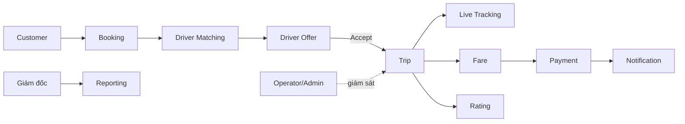
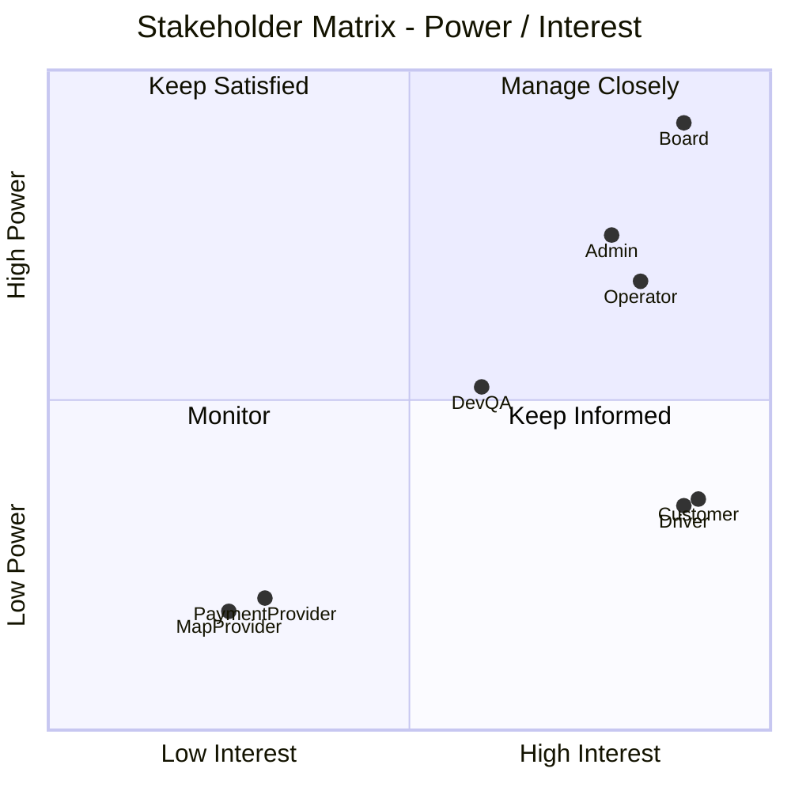
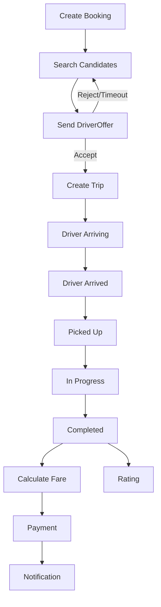
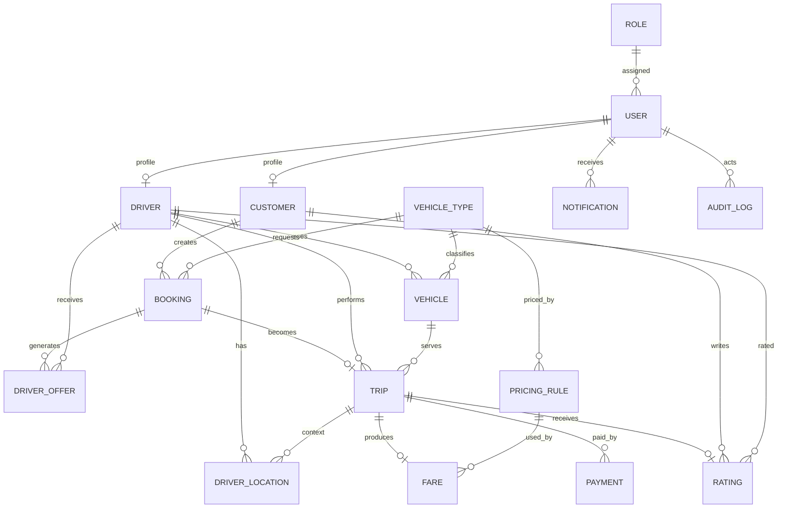
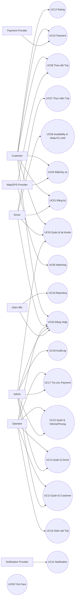
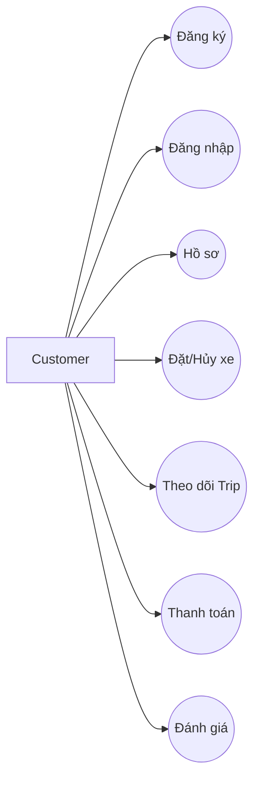
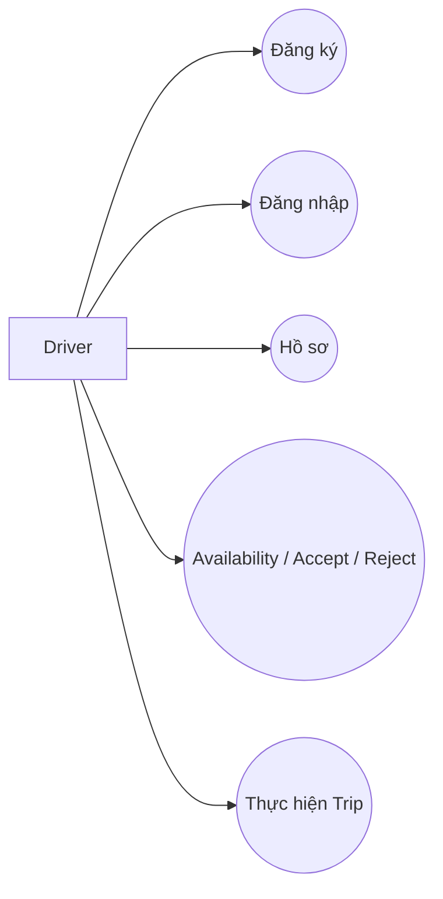
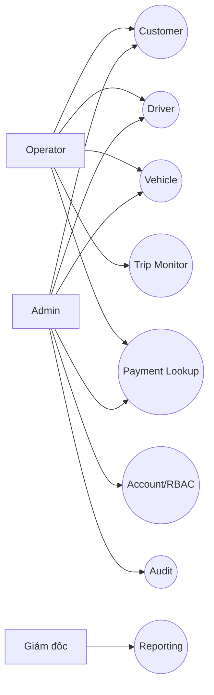

# Software Requirements Specification (SRS)

## CAB System – Nền tảng đặt xe trực tuyến

**Document Version:** 3.0  
**Date:** 2026-09-29  
**Author:** Nguyễn Đình Trọng – 23669941  
**Project Timeline:** 7 tuần  
**Client:** Công ty ABC  

---

## Mục lục

1. [Giai đoạn 1 – Phân tích yêu cầu sơ khởi](#giai-đoạn-1--phân-tích-yêu-cầu-sơ-khởi)
   - 1.1 [Business Context (Ngữ cảnh nghiệp vụ)](#11-business-context-ngữ-cảnh-nghiệp-vụ)
   - 1.2 [Business Problem (Vấn đề nghiệp vụ)](#12-business-problem-vấn-đề-nghiệp-vụ)
   - 1.3 [Stakeholders (Các bên liên quan)](#13-stakeholders-các-bên-liên-quan)
   - 1.4 [Business Goals (Mục tiêu nghiệp vụ)](#14-business-goals-mục-tiêu-nghiệp-vụ)
   - 1.5 [Phạm vi hệ thống (Scope)](#15-phạm-vi-hệ-thống-scope)
   - 1.6 [Business Requirements (Yêu cầu nghiệp vụ)](#16-business-requirements-yêu-cầu-nghiệp-vụ)
   - 1.7 [Business Processes (Quy trình nghiệp vụ)](#17-business-processes-quy-trình-nghiệp-vụ)
   - 1.8 [Các điểm chưa rõ cần xác nhận](#18-các-điểm-chưa-rõ-cần-xác-nhận)
2. [Giai đoạn 2 – Phân rã yêu cầu chức năng](#giai-đoạn-2--phân-rã-yêu-cầu-chức-năng-functional-requirements-decomposition)
   - 2.1 [Cây phân rã chức năng](#21-cây-phân-rã-chức-năng-functional-decomposition-tree)
   - 2.2 [Bảng phân rã chi tiết yêu cầu chức năng theo từng phân hệ](#22-bảng-phân-rã-chi-tiết-yêu-cầu-chức-năng-theo-từng-phân-hệ)
   - 2.3 [Ma trận liên kết chức năng và tác nhân](#23-ma-trận-liên-kết-chức-năng-và-tác-nhân-function-actor-matrix)
3. [Giai đoạn 3 – Quy tắc nghiệp vụ & Xử lý ngoại lệ](#giai-đoạn-3--quy-tắc-nghiệp-vụ-business-rules--xử-lý-ngoại-lệ-exception-handling)
   - 3.1 [Danh mục Quy tắc nghiệp vụ](#31-danh-mục-quy-tắc-nghiệp-vụ-business-rules-catalog)
   - 3.2 [Danh mục Trường hợp ngoại lệ & Cơ chế xử lý](#32-danh-mục-trường-hợp-ngoại-lệ--cơ-chế-xử-lý-exception-handling--edge-cases)
   - 3.3 [Ma trận Rule–Exception](#33-ma-trận-liên-kết-quy-tắc-nghiệp-vụ--trường-hợp-ngoại-lệ-rule-exception-traceability-matrix)
4. [Giai đoạn 4 – Mô hình hóa dữ liệu](#giai-đoạn-4--mô-hình-hóa-dữ-liệu-data-modeling--database-design)
   - 4.1 [ERD](#41-sơ-đồ-thực-thể-liên-kết-entity-relationship-diagram---erd)
   - 4.2 [Data Dictionary](#42-từ-điển-dữ-liệu-chi-tiết-data-dictionary--schema-specification)
   - 4.3 [Indexes & Geospatial Strategy](#43-chiến-lược-chỉ-mục--tối-ưu-hóa-truy-vấn-địa-không-gian-indexes--geospatial-strategy)
5. [Giai đoạn 5 – Yêu cầu phi chức năng](#giai-đoạn-5--yêu-cầu-phi-chức-năng-non-functional-requirements---nfrs)
   - 5.1 [Performance & Latency](#51-hiệu-năng--khả-năng-đáp-ứng-performance--latency)
   - 5.2 [Security & Privacy](#52-bảo-mật--quyền-riêng-tư-security--privacy)
   - 5.3 [Reliability & Availability](#53-độ-tin-cậy--tính-sẵn-sàng-reliability--availability)
   - 5.4 [Scalability & Architecture](#54-khả-năng-mở-rộng--kiến-trúc-scalability--architecture)
   - 5.5 [Usability & User Experience](#55-khả-năng-sử-dụng--trải-nghiệm-usability--user-experience)
   - 5.6 [Maintainability & Observability](#56-khả-năng-bảo-trì--giám-sát-maintainability--observability)
   - 5.7 [NFR–BG Traceability Matrix](#57-ma-trận-truy-xuất-nfrs-với-business-goals-nfr-bg-traceability-matrix)
6. [Giai đoạn 6 – Mô hình hóa Use Case](#giai-đoạn-6--mô-hình-hóa-use-case-use-case-modeling--diagrams)
   - 6.1 [Actor Catalog](#61-danh-mục-tác-nhân-actor-catalog)
   - 6.2 [System-Level Use Case Diagram](#62-sơ-đồ-use-case-tổng-thể-system-level-use-case-diagram)
   - 6.3 [Use Case theo nhóm tác nhân](#63-sơ-đồ-use-case-theo-từng-nhóm-tác-nhân)
   - 6.4 [Use Case Specifications](#64-bảng-đặc-tả-chi-tiết-các-use-case-use-case-specifications)
7. [Giai đoạn 7 – Tiêu chí chấp nhận](#giai-đoạn-7--tiêu-chí-chấp-nhận-acceptance-criteria---ac)
   - 7.1 [Nguyên tắc & định dạng AC](#71-nguyên-tắc--định-dạng-tiêu-chí-chấp-nhận-given-when-then--rule-based-ac)
   - 7.2 [Acceptance Criteria theo phân hệ](#72-bảng-tổng-hợp-tiêu-chí-chấp-nhận-chi-tiết-theo-từng-phân-hệ-chức-năng)
   - 7.3 [AC–FR Matrix](#73-ma-trận-đối-soát-acceptance-criteria-với-functional-requirements-ac-fr-matrix)
8. [Giai đoạn 8 – Requirements Traceability Matrix](#giai-đoạn-8--ma-trận-truy-xuất-yêu-cầu-requirements-traceability-matrix---rtm)
   - 8.1 [Mục đích & cấu trúc RTM](#81-mục-đích--cấu-trúc-ma-trận-rtm)
   - 8.2 [RTM toàn diện](#82-bảng-ma-trận-truy-xuất-yêu-cầu-toàn-diện-rtm-table)

---

# Giai đoạn 1 – Phân tích yêu cầu sơ khởi

## 1.1 Business Context (Ngữ cảnh nghiệp vụ)

### 1.1.1 Giới thiệu doanh nghiệp

Công ty ABC cung cấp dịch vụ đặt xe cho khách hàng thông qua tổng đài và một ứng dụng đơn giản. Công ty có đội ngũ tài xế, phương tiện và bộ phận vận hành thực hiện tiếp nhận – điều phối – theo dõi chuyến.

Khi số lượng khách hàng và chuyến tăng, quy trình thủ công gây khó khăn trong phân công tài xế, giám sát trạng thái chuyến, tính cước, thanh toán, truy vết và báo cáo. Vì vậy CAB System được xây dựng để số hóa toàn bộ vòng đời đặt xe.

### 1.1.2 Hiện trạng hệ thống (AS-IS)

```text
Khách hàng
   │
   ├── Gọi tổng đài / dùng ứng dụng đơn giản
   ▼
Bộ phận tiếp nhận
   │
   ├── Chuyển yêu cầu
   ▼
Nhân viên vận hành
   │
   ├── Tìm tài xế thủ công
   ├── Gọi / liên hệ tài xế
   ▼
Tài xế
   │
   ├── Nhận chuyến
   ├── Thực hiện chuyến
   ▼
Thanh toán / ghi nhận thủ công
```

**Đặc điểm chính của AS-IS:**
- Tiếp nhận yêu cầu từ nhiều kênh nhưng dữ liệu chưa tập trung hoàn toàn.
- Phân công tài xế phụ thuộc Operator.
- Trạng thái tài xế và vị trí chưa chuẩn hóa.
- Khách hàng khó theo dõi tài xế theo thời gian thực.
- Thanh toán và đối soát còn rời rạc.
- Báo cáo cần tổng hợp thủ công.
- Chưa có audit log đầy đủ.

### 1.1.3 Bối cảnh và định hướng TO-BE


```mermaid
flowchart LR
    C[Customer] --> B[Booking]
    B --> M[Driver Matching]
    M --> O[Driver Offer]
    O -->|Accept| T[Trip]
    T --> L[Live Tracking]
    T --> F[Fare]
    F --> P[Payment]
    P --> N[Notification]
    T --> R[Rating]
    OP[Operator/Admin] -.giám sát.-> T
    G[Giám đốc] --> RP[Reporting]
```

Hệ thống TO-BE hướng tới:
- Customer tự đặt xe.
- Driver tự bật/tắt khả năng nhận chuyến.
- Hệ thống tự tìm Driver theo vị trí, loại xe và trạng thái.
- Driver nhận/từ chối Offer.
- Trip được tạo sau khi Driver chấp nhận.
- Customer theo dõi Driver/Trip/ETA.
- Fare được tính từ PricingRule.
- Thanh toán được ghi nhận tập trung.
- Các sự kiện chính phát Notification.
- Operator/Admin có dashboard vận hành.
- Giám đốc có báo cáo tổng hợp.

---

## 1.2 Business Problem (Vấn đề nghiệp vụ)

### Vấn đề 1 – Phân công tài xế thủ công

| Khía cạnh | Mô tả |
|---|---|
| **Hiện trạng** | Operator phải tự tìm tài xế phù hợp |
| **Hậu quả** | Thời gian chờ kéo dài, dễ bỏ sót Driver gần |
| **Tác động** | Trải nghiệm khách hàng kém, khó mở rộng |
| **Kỳ vọng** | Matching tự động theo Availability, VehicleType, vị trí |

### Vấn đề 2 – Khách hàng khó theo dõi chuyến

| Khía cạnh | Mô tả |
|---|---|
| **Hiện trạng** | Customer không biết Driver ở đâu hoặc Trip đang ở bước nào |
| **Hậu quả** | Phải liên hệ Operator/tổng đài |
| **Tác động** | Tăng chi phí vận hành, giảm trải nghiệm |
| **Kỳ vọng** | Theo dõi Driver, Trip Status và ETA |

### Vấn đề 3 – Thanh toán chưa quản lý tập trung

| Khía cạnh | Mô tả |
|---|---|
| **Hiện trạng** | Tiền mặt và giao dịch điện tử chưa có một nguồn dữ liệu thống nhất |
| **Hậu quả** | Khó tra cứu, đối soát |
| **Tác động** | Rủi ro sai lệch doanh thu |
| **Kỳ vọng** | Payment tập trung, trạng thái rõ ràng, idempotency |

### Vấn đề 4 – Trạng thái tài xế không chuẩn hóa

| Khía cạnh | Mô tả |
|---|---|
| **Hiện trạng** | Chưa có cơ chế rõ ràng OFFLINE/AVAILABLE/BUSY |
| **Hậu quả** | Matching có thể chọn Driver không thực sự sẵn sàng |
| **Tác động** | Tăng thất bại matching |
| **Kỳ vọng** | Driver Availability được quản lý tập trung |

### Vấn đề 5 – Thiếu cấu hình giá tập trung

| Khía cạnh | Mô tả |
|---|---|
| **Hiện trạng** | Quy tắc cước chưa được mô hình hóa thành dữ liệu |
| **Hậu quả** | Khó đổi giá, khó truy vết |
| **Tác động** | Rủi ro sai cước |
| **Kỳ vọng** | PricingRule có version và thời gian hiệu lực |

### Vấn đề 6 – Khó truy vết thao tác

| Khía cạnh | Mô tả |
|---|---|
| **Hiện trạng** | Chưa có AuditLog chuẩn cho thao tác quan trọng |
| **Hậu quả** | Khó xác định người thay đổi dữ liệu |
| **Tác động** | Tăng rủi ro vận hành/bảo mật |
| **Kỳ vọng** | Audit actor/action/target/time |

### Vấn đề 7 – Báo cáo chưa tập trung

| Khía cạnh | Mô tả |
|---|---|
| **Hiện trạng** | Tổng hợp thủ công |
| **Hậu quả** | Báo cáo chậm, khó thống nhất |
| **Tác động** | Ban lãnh đạo thiếu thông tin |
| **Kỳ vọng** | Dashboard số chuyến, Fare, Payment, Customer, Driver |

---

## 1.3 Stakeholders (Các bên liên quan)

### 1.3.1 Stakeholders Table

| # | Stakeholder | Vai trò & trách nhiệm | Mức độ quan trọng |
|---|---|---|---|
| 1 | **Ban giám đốc** | Sponsor, phê duyệt dự án, xem báo cáo, quyết định chính sách | Rất cao |
| 2 | **Customer** | Đăng ký, đặt/hủy xe, theo dõi, thanh toán, đánh giá | Rất cao |
| 3 | **Driver** | Quản lý Availability, nhận/từ chối Offer, thực hiện Trip, cập nhật vị trí | Rất cao |
| 4 | **Operator** | Quản lý Customer/Driver/Vehicle, giám sát Trip, tra cứu Payment | Cao |
| 5 | **Admin** | Quản trị tài khoản/quyền/cấu hình/audit | Cao |
| 6 | **Bộ phận tài chính** | Đối soát giao dịch và doanh thu | Trung bình |
| 7 | **BA/Dev/QA** | Phân tích, phát triển, kiểm thử | Trung bình |
| 8 | **Payment Provider** | Xử lý thanh toán điện tử | Bên ngoài |
| 9 | **Map/GPS Provider** | Geocoding, distance, route, ETA | Bên ngoài |
| 10 | **Notification Provider** | Push/SMS/Email tùy cấu hình | Bên ngoài |

### 1.3.2 Stakeholder Matrix


```mermaid
quadrantChart
    title Stakeholder Matrix - Power / Interest
    x-axis Low Interest --> High Interest
    y-axis Low Power --> High Power
    quadrant-1 Manage Closely
    quadrant-2 Keep Satisfied
    quadrant-3 Monitor
    quadrant-4 Keep Informed
    Board: [0.88, 0.92]
    Admin: [0.78, 0.75]
    Operator: [0.82, 0.68]
    Customer: [0.90, 0.35]
    Driver: [0.88, 0.34]
    DevQA: [0.60, 0.52]
    PaymentProvider: [0.30, 0.20]
    MapProvider: [0.25, 0.18]
```

| Nhóm | Stakeholder | Chiến lược |
|---|---|---|
| Manage Closely | Ban giám đốc, Admin, Operator | Review yêu cầu/tiến độ định kỳ |
| Keep Informed | Customer, Driver, Dev/QA | Thu thập feedback và cập nhật thay đổi |
| Keep Satisfied | Finance/IT Management | Cập nhật quyết định ảnh hưởng lớn |
| Monitor | External Providers | Theo dõi SLA/API và tích hợp |

---

## 1.4 Business Goals (Mục tiêu nghiệp vụ)

> KPI định lượng dưới đây là **mục tiêu đề xuất cho MVP**. Nếu Sponsor chưa xác nhận thì không xem là SLA chính thức.

### 1.4.1 Mục tiêu chiến lược

| ID | Mục tiêu | Mô tả | KPI đề xuất |
|---|---|---|---|
| BG-01 | Chuyển đổi số quy trình đặt xe | Từ Booking đến Payment được quản lý tập trung | ≥ 85% Booking hợp lệ xử lý không cần Operator phân công tay |
| BG-02 | Mở rộng quy mô | Giảm phụ thuộc nhân lực điều phối | Core API 95% ≤ 2 giây ở tải MVP chuẩn |
| BG-03 | Kiểm soát tài chính | Tập trung Fare/Payment | 100% Payment được lưu trạng thái |

### 1.4.2 Mục tiêu vận hành

| ID | Mục tiêu | KPI đề xuất |
|---|---|---|
| BG-04 | Matching tự động | Có Driver phù hợp → mục tiêu tìm trong ≤ 2 phút |
| BG-05 | Tracking minh bạch | Trip active có state; location update mục tiêu 5–10 giây |
| BG-06 | Tính cước tự động | 100% Trip COMPLETED có Fare hợp lệ |
| BG-07 | Quản lý Driver/Vehicle | Driver active có profile + Vehicle hợp lệ |
| BG-08 | Notification theo sự kiện | Sự kiện chính tạo Notification |

### 1.4.3 Mục tiêu quản lý

| ID | Mục tiêu | KPI đề xuất |
|---|---|---|
| BG-09 | Dashboard vận hành | Các nghiệp vụ chính thực hiện trên hệ thống |
| BG-10 | Báo cáo | Có số chuyến, Fare/Revenue, Payment, Customer, Driver |

### 1.4.4 Mục tiêu kỹ thuật & bảo mật

| ID | Mục tiêu | KPI đề xuất |
|---|---|---|
| BG-11 | Kiến trúc linh hoạt | Payment/Notification lỗi không làm mất Booking/Trip lõi |
| BG-12 | Bảo mật & truy vết | 100% thao tác quản trị quan trọng có AuditLog |

---

## 1.5 Phạm vi hệ thống (Scope)

### 1.5.1 In Scope – MVP

**Customer**
- Đăng ký/đăng nhập.
- Quản lý hồ sơ.
- Đặt xe/hủy Booking.
- Xem Driver/Vehicle/Trip/ETA.
- Thanh toán.
- Xem lịch sử Trip.
- Rating.

**Driver**
- Đăng ký/đăng nhập.
- Quản lý hồ sơ.
- Bật/tắt Availability.
- Nhận/từ chối DriverOffer.
- Cập nhật Trip State.
- Cập nhật GPS.

**Operator/Admin**
- Quản lý Customer.
- Quản lý Driver.
- Quản lý Vehicle/VehicleType.
- Quản lý PricingRule theo quyền.
- Giám sát Trip.
- Tra cứu Payment.
- Audit.

**Giám đốc**
- Xem báo cáo tổng hợp.

**External**
- Map/GPS.
- Payment Provider.
- Notification Provider.

### 1.5.2 End-to-End Scope

```text
Đăng nhập
→ Tạo Booking
→ Matching
→ DriverOffer
→ Driver Accept
→ Tạo Trip
→ Driver Arriving
→ Driver Arrived
→ Picked Up
→ In Progress
→ Completed
→ Fare
→ Payment
→ Notification
→ Rating
→ Reporting
```

### 1.5.3 Out of Scope – MVP

- Ride sharing/carpool.
- Multi-stop.
- Scheduled ride nâng cao.
- Surge pricing AI.
- Wallet/loyalty.
- Driver payout/commission đầy đủ.
- Refund/chargeback automation toàn diện.
- SOS integration chuyên dụng.
- Fraud detection ML.
- Multi-country tax/currency.

---

## 1.6 Business Requirements (Yêu cầu nghiệp vụ)

| ID | Business Requirement | Mô tả |
|---|---|---|
| BR-01 | Account & Access | Đăng ký, đăng nhập, hồ sơ, RBAC |
| BR-02 | Driver Availability | OFFLINE/AVAILABLE/BUSY/SUSPENDED |
| BR-03 | Booking | Tạo và hủy Booking |
| BR-04 | Matching | Tìm/lọc/xếp hạng Driver và DriverOffer |
| BR-05 | Trip | Lifecycle chuyến |
| BR-06 | Driver Location | Location phục vụ matching/tracking |
| BR-07 | Tracking | Status + Driver + Vehicle + ETA |
| BR-08 | Pricing & Fare | PricingRule + Fare |
| BR-09 | Payment | Cash/electronic + idempotency |
| BR-10 | Notification | Event-driven notification |
| BR-11 | Rating | Customer đánh giá Driver |
| BR-12 | Operations | Quản lý Customer/Driver/Vehicle/Trip/Payment |
| BR-13 | Security & Audit | AuthN/AuthZ/privacy/audit |
| BR-14 | Reporting | Dashboard và báo cáo |

---

## 1.7 Business Processes (Quy trình nghiệp vụ)

| ID | Business Process | BR liên quan |
|---|---|---|
| BP-01 | Account & Access | BR-01, BR-13 |
| BP-02 | Driver Availability | BR-02 |
| BP-03 | Booking | BR-03 |
| BP-04 | Driver Matching | BR-04, BR-06 |
| BP-05 | Trip Execution | BR-05 |
| BP-06 | Tracking | BR-06, BR-07 |
| BP-07 | Pricing & Fare | BR-08 |
| BP-08 | Payment | BR-09 |
| BP-09 | Notification | BR-10 |
| BP-10 | Rating | BR-11 |
| BP-11 | Operations | BR-12 |
| BP-12 | Security & Audit | BR-13 |
| BP-13 | Reporting | BR-14 |

### BP-03 → BP-08: Quy trình nghiệp vụ cốt lõi


```mermaid
flowchart TD
    B[Create Booking] --> M[Search Candidates]
    M --> O[Send DriverOffer]
    O -->|Reject/Timeout| M
    O -->|Accept| T[Create Trip]
    T --> A[Driver Arriving]
    A --> AR[Driver Arrived]
    AR --> PU[Picked Up]
    PU --> IP[In Progress]
    IP --> C[Completed]
    C --> F[Calculate Fare]
    F --> P[Payment]
    P --> N[Notification]
    C --> R[Rating]
```

---

## 1.8 Các điểm chưa rõ cần xác nhận

| ID | Điểm cần xác nhận | Giả định hiện tại trong SRS |
|---|---|---|
| CL-01 | Customer được hủy Trip đến giai đoạn nào? | Cho hủy khi policy/state cho phép; không cho hủy sau mốc nghiệp vụ do Sponsor quy định |
| CL-02 | Có phí hủy không? | Chưa áp dụng trong MVP |
| CL-03 | Bán kính tìm Driver mặc định? | Cấu hình hệ thống |
| CL-04 | Timeout DriverOffer bao nhiêu giây? | Cấu hình hệ thống |
| CL-05 | Driver có thể có nhiều Vehicle active? | Có thể lưu nhiều, nhưng một Trip dùng một Vehicle |
| CL-06 | Fare dùng thời điểm Booking hay Trip complete để chọn PricingRule? | Khuyến nghị snapshot rule khi Booking/Trip được xác nhận |
| CL-07 | Cash Payment do ai xác nhận? | Quy trình MVP cần Sponsor chốt |
| CL-08 | Có refund không? | Ngoài MVP |
| CL-09 | Operator có quyền sửa Trip state không? | Chỉ action hỗ trợ được định nghĩa, phải audit |
| CL-10 | KPI/NFR định lượng chính thức? | Các số hiện tại chỉ là target đề xuất |

---

# Giai đoạn 2 – Phân rã yêu cầu chức năng (Functional Requirements Decomposition)

## 2.1 Cây phân rã chức năng (Functional Decomposition Tree)


```mermaid
graph TD
    SYS[CAB System]

    SYS --> A[1. Account & Security]
    SYS --> B[2. Driver & Vehicle]
    SYS --> C[3. Booking]
    SYS --> D[4. Matching]
    SYS --> E[5. Trip & Tracking]
    SYS --> F[6. Pricing & Fare]
    SYS --> G[7. Payment]
    SYS --> H[8. Notification & Rating]
    SYS --> I[9. Operations]
    SYS --> J[10. Reporting & Audit]

    A --> A1[Register]
    A --> A2[Login]
    A --> A3[Profile]
    A --> A4[RBAC]

    B --> B1[Availability]
    B --> B2[Driver Profile]
    B --> B3[Vehicle]
    B --> B4[VehicleType]

    C --> C1[Pickup/Destination]
    C --> C2[Create Booking]
    C --> C3[Cancel Booking]

    D --> D1[Find Candidates]
    D --> D2[Filter & Rank]
    D --> D3[DriverOffer]
    D --> D4[Accept/Reject/Timeout]

    E --> E1[Trip Lifecycle]
    E --> E2[Driver Location]
    E --> E3[ETA/Tracking]
    E --> E4[Trip History]

    F --> F1[PricingRule]
    F --> F2[Calculate Fare]

    G --> G1[Cash]
    G --> G2[Electronic]
    G --> G3[Idempotency]
    G --> G4[Reconcile]

    H --> H1[Notification]
    H --> H2[Rating]

    I --> I1[Customer Management]
    I --> I2[Driver Management]
    I --> I3[Vehicle Management]
    I --> I4[Trip Monitoring]
    I --> I5[Payment Lookup]

    J --> J1[AuditLog]
    J --> J2[Reporting]
```

---

## 2.2 Bảng phân rã chi tiết yêu cầu chức năng theo từng phân hệ

### 2.2.1 Account & Access

| FR | Tên chức năng | Input | Processing | Output | Priority |
|---|---|---|---|---|---|
| FR01 | Đăng ký | Thông tin User | Validate, duplicate check, tạo User/Profile | Account | Must |
| FR02 | Đăng nhập | Credential | Authenticate + status check | Session/Token | Must |
| FR03 | Cập nhật hồ sơ | Profile fields | Validate + authorize | Updated profile | Must |
| FR04 | Quản lý quyền | User/Role/Permission | Authorization + audit | Updated access | Must |
| FR56 | Authentication enforcement | Request | Verify identity | Allow/deny | Must |
| FR57 | Authorization/RBAC | Actor/action/resource | Evaluate permission | Allow/deny | Must |
| FR58 | Data protection | PII/location/payment data | Mask/restrict | Protected view | Must |
| FR59 | Audit Log | Action context | Sanitize + persist | Audit record | Must |

### 2.2.2 Booking

| FR | Tên | Input | Processing | Output | Priority |
|---|---|---|---|---|---|
| FR05 | Pickup | Address/coordinate | Geocode/validate | Pickup | Must |
| FR06 | Destination | Address/coordinate | Geocode/validate | Destination | Must |
| FR07 | VehicleType | Type selection | Check active | VehicleType | Must |
| FR08 | Create Booking | Booking request | Validate + persist | Booking CREATED | Must |
| FR09 | Validate Booking | Booking data | Rule validation | Valid/invalid | Must |
| FR10 | Cancel Booking | Booking + reason | State/policy check | CANCELLED | Must |
| FR66 | Cancellation consistency | Booking/Trip/Driver | Atomic/consistent update | Released resources | Must |
| FR67 | Map/GPS integration | Location request | Provider adapter | Geo/distance/ETA | Must |

### 2.2.3 Driver Availability & Matching

| FR | Tên | Input | Processing | Output | Priority |
|---|---|---|---|---|---|
| FR11 | Driver Location | Driver | Read latest location | Position | Must |
| FR12 | Find Driver | Booking | Search AVAILABLE | Candidates | Must |
| FR13 | Vehicle filter | Candidates | Filter VehicleType | Candidates | Must |
| FR14 | Distance filter | Coordinates | Distance calculation | Candidates | Must |
| FR15 | Status filter | Driver status | AVAILABLE only | Candidates | Must |
| FR16 | Rank | Candidate features | Sort/rank | Ordered list | Must |
| FR17 | Send Offer | Candidate | Create DriverOffer | PENDING Offer | Must |
| FR18 | Reject handling | Offer response | Mark REJECTED | Continue search | Must |
| FR19 | Timeout handling | Offer expiry | Mark TIMEOUT | Continue search | Must |
| FR20 | No Driver | Candidate exhaustion | Update Booking | NO_DRIVER_FOUND | Must |
| FR21 | Driver Accept | Offer | Atomic accept | Assigned Driver | Must |
| FR22 | Driver Reject | Offer | Reject | Matching continues | Must |
| FR54 | Availability | Driver action/system | Transition state | OFFLINE/AVAILABLE/BUSY | Must |
| FR64 | Offer history | Offer lifecycle | Persist events | Traceable history | Must |

### 2.2.4 Trip & Tracking

| FR | Tên | Input | Processing | Output | Priority |
|---|---|---|---|---|---|
| FR23 | Update Trip State | Trip + target state | Validate transition | New state | Must |
| FR24 | Driver Arrived | Trip | ASSIGNED/ARRIVING → ARRIVED | Status | Must |
| FR25 | Picked Up | Trip | ARRIVED → PICKED_UP | Status | Must |
| FR26 | In Progress | Trip | PICKED_UP → IN_PROGRESS | Status | Must |
| FR27 | Complete Trip | Trip | IN_PROGRESS → COMPLETED | Event/Fare trigger | Must |
| FR28 | Update Location | GPS sample | Validate/store latest | DriverLocation | Must |
| FR29 | Track Trip State | Trip | Read current state | Status | Must |
| FR30 | View Driver/Vehicle | Trip | Access check | Driver/Vehicle | Must |
| FR31 | Track Driver Location | Trip | Read latest | Map position | Must |
| FR32 | ETA | Trip/location | Provider calculation | ETA | Should |
| FR33 | Trip History | Customer | Query completed/cancelled trips | List | Should |

### 2.2.5 Pricing & Fare

| FR | Tên | Input | Processing | Output | Priority |
|---|---|---|---|---|---|
| FR34 | Calculate Fare | Trip + PricingRule | Formula | Fare | Must |
| FR63 | PricingRule Management | Price configuration | Validate effective range/version | PricingRule | Must |
| FR68 | Pricing consistency | Fare calculation context | Snapshot/version | Traceable Fare | Must |

### 2.2.6 Payment

| FR | Tên | Input | Processing | Output | Priority |
|---|---|---|---|---|---|
| FR35 | Payment Method | Method | Validate | Selected method | Must |
| FR36 | Electronic Payment | Fare/payment request | Call Provider | Transaction | Must |
| FR37 | Record Result | Provider/cash result | Validate transition | Payment state | Must |
| FR38 | Failure Handling | Failed/timeout Payment | Retry/reconcile | Final/pending state | Must |
| FR55 | Payment Lookup | Search criteria | Query | Payment data | Should |
| FR65 | Idempotency | Idempotency key/callback | Detect duplicate | One logical result | Must |

### 2.2.7 Notification & Rating

| FR | Tên | Mô tả |
|---|---|---|
| FR39 | Rating | Customer đánh giá Driver sau Trip |
| FR40 | Booking Notification | Booking created |
| FR41 | Driver Accepted Notification | Customer được báo Driver đã nhận |
| FR42 | Driver Arrived Notification | Customer được báo Driver đã đến |
| FR43 | Trip Completed Notification | Thông báo hoàn thành |
| FR44 | Payment Notification | Kết quả Payment |
| FR45 | Driver Offer Notification | Driver nhận Offer |

### 2.2.8 Operations & Reporting

| FR | Tên |
|---|---|
| FR46 | Xem danh sách Customer |
| FR47 | Customer Detail |
| FR48 | Cập nhật Customer |
| FR49 | Lock/Unlock Customer |
| FR50 | Quản lý Driver |
| FR51 | Quản lý Vehicle |
| FR52 | Theo dõi Trip active |
| FR53 | Hỗ trợ Trip lỗi |
| FR60 | Xem báo cáo |
| FR61 | Lọc báo cáo |
| FR62 | KPI báo cáo |
| FR69 | Report Data Integrity |

---

## 2.3 Ma trận liên kết chức năng và tác nhân (Function-Actor Matrix)

Ký hiệu: **C** = Create, **R** = Read, **U** = Update, **E** = Execute, **A** = Administer.

| Function | Customer | Driver | Operator | Admin | Director | System |
|---|---:|---:|---:|---:|---:|---:|
| Account | C/R/U | C/R/U | R/U | A | R | E |
| Driver Availability | - | U | R/U | A | - | E |
| Booking | C/R/U | R | R | R | - | E |
| Matching | R | R/U | R | A | - | E |
| Trip | R | R/U | R/U | A | - | E |
| Tracking | R | U | R | R | - | E |
| Pricing/Fare | R | R | R | A | R | E |
| Payment | C/R | R | R | A | R | E |
| Notification | R | R | R | A | - | E |
| Rating | C/R | R | R | A | - | E |
| Operations | - | - | R/U | A | R | E |
| Audit | - | - | R | A | - | E |
| Reporting | - | - | R | R | R | E |

---

# Giai đoạn 3 – Quy tắc nghiệp vụ (Business Rules) & Xử lý ngoại lệ (Exception Handling)

## 3.1 Danh mục Quy tắc nghiệp vụ (Business Rules Catalog)

| Rule | Nội dung | Liên quan |
|---|---|---|
| BRL-01 | Chỉ Driver AVAILABLE mới được matching | FR12, FR15, FR54 |
| BRL-02 | Driver phải verified và có Vehicle active đúng VehicleType | FR13 |
| BRL-03 | Một Driver tối đa một Trip active trong MVP | FR21, FR23 |
| BRL-04 | Một Booking chỉ có một Driver được gán chính thức | FR21 |
| BRL-05 | DriverOffer có thời hạn | FR17, FR19 |
| BRL-06 | REJECT/TIMEOUT chuyển Candidate tiếp theo | FR18, FR19 |
| BRL-07 | Hết Candidate → NO_DRIVER_FOUND | FR20 |
| BRL-08 | Trip chỉ tạo sau ACCEPT hợp lệ | FR21 |
| BRL-09 | ACCEPT → Driver BUSY | FR21, FR54 |
| BRL-10 | Trip kết thúc/hủy → release Driver theo online state | FR27, FR54, FR66 |
| BRL-11 | Trip State chỉ chuyển theo State Model | FR23 |
| BRL-12 | Booking chỉ hủy khi state/policy cho phép | FR10 |
| BRL-13 | Cancellation phải đồng bộ Booking/Trip/Offer/Driver | FR66 |
| BRL-14 | Chỉ Trip COMPLETED mới tính Fare | FR34 |
| BRL-15 | Fare dùng PricingRule hiệu lực | FR34, FR63 |
| BRL-16 | Fare phải truy vết PricingRule/version | FR68 |
| BRL-17 | Electronic Payment qua Provider | FR36 |
| BRL-18 | Không lưu dữ liệu thẻ nhạy cảm | FR58 |
| BRL-19 | Payment request/callback phải idempotent | FR65 |
| BRL-20 | Chỉ Trip COMPLETED được Rating | FR39 |
| BRL-21 | Một Rating/Trip trong MVP | FR39 |
| BRL-22 | User chỉ thao tác theo Role/Permission | FR57 |
| BRL-23 | Thao tác quản trị quan trọng phải audit | FR59 |
| BRL-24 | Location chỉ hiển thị trong ngữ cảnh được phép | FR31, FR58 |
| BRL-25 | Report không sửa dữ liệu nguồn | FR69 |

### 3.1.1 State Rules

**Driver**
```text
OFFLINE → AVAILABLE
AVAILABLE → OFFLINE
AVAILABLE → BUSY
BUSY → AVAILABLE/OFFLINE
OFFLINE/AVAILABLE → SUSPENDED
```

**Booking**
```text
CREATED
→ SEARCHING_DRIVER
→ DRIVER_ASSIGNED
→ CONFIRMED
→ COMPLETED

SEARCHING_DRIVER → NO_DRIVER_FOUND
SEARCHING_DRIVER/DRIVER_ASSIGNED/CONFIRMED → CANCELLED (theo policy)
```

**DriverOffer**
```text
PENDING → ACCEPTED | REJECTED | TIMEOUT | CANCELLED
```

**Trip**
```text
ASSIGNED
→ DRIVER_ARRIVING
→ DRIVER_ARRIVED
→ PICKED_UP
→ IN_PROGRESS
→ COMPLETED
```

**Payment**
```text
PENDING → PROCESSING → SUCCESS | FAILED
FAILED → PROCESSING (retry)
PROCESSING → PENDING (reconcile khi provider timeout)
```

---

## 3.2 Danh mục Trường hợp ngoại lệ & Cơ chế xử lý (Exception Handling & Edge Cases)

| ID | Ngoại lệ | Cơ chế xử lý |
|---|---|---|
| EX-01 | Không có Driver phù hợp | Booking → NO_DRIVER_FOUND; thông báo Customer |
| EX-02 | Driver Reject | Offer → REJECTED; thử Candidate tiếp |
| EX-03 | Driver Timeout | Offer → TIMEOUT; thử Candidate tiếp |
| EX-04 | Driver Accept sau khi Booking cancelled | Từ chối ACCEPT; Offer → CANCELLED |
| EX-05 | Hai Driver Accept gần đồng thời | Atomic conditional update; chỉ một Driver thắng |
| EX-06 | GPS unavailable | Dùng vị trí cuối cùng + stale indicator |
| EX-07 | Map Provider lỗi | Không mất Booking/Trip; ETA unavailable |
| EX-08 | Không có PricingRule | Không tạo Fare; log + Operator review |
| EX-09 | Payment Provider timeout | Giữ PENDING/PROCESSING và reconcile |
| EX-10 | Callback Payment trùng | Trả kết quả idempotent |
| EX-11 | Notification Provider lỗi | FAILED/retry; không rollback domain transaction |
| EX-12 | Unauthorized | Deny + audit theo policy |
| EX-13 | Trip transition sai | Reject transition |
| EX-14 | Rating trùng | Không tạo Rating thứ hai |
| EX-15 | Cancellation sau Driver assigned | Hủy entity liên quan và release Driver |
| EX-16 | Driver bị suspend khi BUSY | Không phá Trip active; xử lý theo policy vận hành |

---

## 3.3 Ma trận liên kết Quy tắc nghiệp vụ & Trường hợp ngoại lệ (Rule-Exception Traceability Matrix)

| Business Rule | Exception liên quan |
|---|---|
| BRL-01, BRL-02 | EX-01 |
| BRL-05, BRL-06 | EX-02, EX-03, EX-04 |
| BRL-04, BRL-08 | EX-05 |
| BRL-10, BRL-13 | EX-15, EX-16 |
| BRL-11 | EX-13 |
| BRL-14, BRL-15, BRL-16 | EX-08 |
| BRL-17, BRL-18, BRL-19 | EX-09, EX-10 |
| BRL-20, BRL-21 | EX-14 |
| BRL-22, BRL-23, BRL-24 | EX-12 |
| BRL-24 | EX-06, EX-07 |

---

# Giai đoạn 4 – Mô hình hóa dữ liệu (Data Modeling & Database Design)

## 4.1 Sơ đồ thực thể liên kết (Entity Relationship Diagram - ERD)


```mermaid
erDiagram
    ROLE ||--o{ USER : assigned
    USER ||--o| CUSTOMER : profile
    USER ||--o| DRIVER : profile

    DRIVER ||--o{ VEHICLE : uses
    VEHICLE_TYPE ||--o{ VEHICLE : classifies

    CUSTOMER ||--o{ BOOKING : creates
    VEHICLE_TYPE ||--o{ BOOKING : requests

    BOOKING ||--o{ DRIVER_OFFER : generates
    DRIVER ||--o{ DRIVER_OFFER : receives

    BOOKING ||--o| TRIP : becomes
    DRIVER ||--o{ TRIP : performs
    VEHICLE ||--o{ TRIP : serves

    DRIVER ||--o{ DRIVER_LOCATION : has
    TRIP ||--o{ DRIVER_LOCATION : context

    VEHICLE_TYPE ||--o{ PRICING_RULE : priced_by
    TRIP ||--o| FARE : produces
    PRICING_RULE ||--o{ FARE : used_by

    TRIP ||--o{ PAYMENT : paid_by

    USER ||--o{ NOTIFICATION : receives

    TRIP ||--o| RATING : receives
    CUSTOMER ||--o{ RATING : writes
    DRIVER ||--o{ RATING : rated

    USER ||--o{ AUDIT_LOG : acts
```

---

## 4.2 Từ điển dữ liệu chi tiết (Data Dictionary / Schema Specification)

### 4.2.1 Role

| Field | Type | Constraint | Mô tả |
|---|---|---|---|
| roleId | UUID/String | PK | Mã role |
| code | String | UNIQUE | CUSTOMER/DRIVER/OPERATOR/ADMIN/DIRECTOR |
| name | String | NOT NULL | Tên role |
| status | Enum | ACTIVE/INACTIVE | Trạng thái |
| createdAt | DateTime | NOT NULL | Ngày tạo |

### 4.2.2 User

| Field | Type | Constraint | Mô tả |
|---|---|---|---|
| userId | UUID/String | PK | User ID |
| roleId | FK | → Role | Vai trò |
| fullName | String | NOT NULL | Họ tên |
| phone | String | UNIQUE | Điện thoại |
| email | String | UNIQUE/nullable | Email |
| passwordHash | String | NOT NULL | Mật khẩu đã hash |
| status | Enum | ACTIVE/LOCKED/INACTIVE | Trạng thái |
| createdAt | DateTime | NOT NULL | Tạo lúc |
| updatedAt | DateTime | NOT NULL | Cập nhật |

### 4.2.3 Customer

| Field | Type | Constraint | Mô tả |
|---|---|---|---|
| customerId | UUID/String | PK | Customer ID |
| userId | FK | UNIQUE → User | User tương ứng |
| defaultPaymentMethod | Enum/String | Optional | Phương thức mặc định |
| createdAt | DateTime | NOT NULL | Ngày tạo |

### 4.2.4 Driver

| Field | Type | Constraint | Mô tả |
|---|---|---|---|
| driverId | UUID/String | PK | Driver ID |
| userId | FK | UNIQUE → User | User |
| licenseNumber | String | UNIQUE | GPLX |
| availabilityStatus | Enum | OFFLINE/AVAILABLE/BUSY/SUSPENDED | Availability |
| verified | Boolean | NOT NULL | Đã xác minh |
| ratingAvg | Decimal | Optional/derived | Điểm TB |
| createdAt | DateTime | NOT NULL | Tạo lúc |
| updatedAt | DateTime | NOT NULL | Cập nhật |

### 4.2.5 VehicleType

| Field | Type | Constraint | Mô tả |
|---|---|---|---|
| vehicleTypeId | UUID/String | PK | ID |
| code | String | UNIQUE | Code |
| name | String | NOT NULL | Tên |
| capacity | Integer | > 0 | Sức chứa |
| status | Enum | ACTIVE/INACTIVE | Trạng thái |

### 4.2.6 Vehicle

| Field | Type | Constraint | Mô tả |
|---|---|---|---|
| vehicleId | UUID/String | PK | Vehicle ID |
| driverId | FK | → Driver | Tài xế |
| vehicleTypeId | FK | → VehicleType | Loại xe |
| plateNumber | String | UNIQUE | Biển số |
| brand | String | Optional | Hãng |
| model | String | Optional | Model |
| color | String | Optional | Màu |
| status | Enum | ACTIVE/INACTIVE/SUSPENDED | Trạng thái |
| createdAt | DateTime | NOT NULL | Tạo lúc |

### 4.2.7 Booking

| Field | Type | Constraint | Mô tả |
|---|---|---|---|
| bookingId | UUID/String | PK | Booking |
| customerId | FK | → Customer | Người đặt |
| vehicleTypeId | FK | → VehicleType | Loại xe |
| pickupAddress | String | NOT NULL | Điểm đón |
| pickupLat | Decimal | Valid latitude | Lat |
| pickupLng | Decimal | Valid longitude | Lng |
| destinationAddress | String | NOT NULL | Điểm đến |
| destinationLat | Decimal | Valid latitude | Lat |
| destinationLng | Decimal | Valid longitude | Lng |
| status | Enum | Booking State | Trạng thái |
| cancellationReason | String | Optional | Lý do hủy |
| createdAt | DateTime | NOT NULL | Tạo lúc |
| updatedAt | DateTime | NOT NULL | Cập nhật |

### 4.2.8 DriverOffer

| Field | Type | Constraint | Mô tả |
|---|---|---|---|
| offerId | UUID/String | PK | Offer |
| bookingId | FK | → Booking | Booking |
| driverId | FK | → Driver | Driver |
| rankOrder | Integer | >= 1 | Thứ tự Candidate |
| status | Enum | PENDING/ACCEPTED/REJECTED/TIMEOUT/CANCELLED | Trạng thái |
| sentAt | DateTime | NOT NULL | Gửi lúc |
| expiresAt | DateTime | NOT NULL | Hết hạn |
| respondedAt | DateTime | Optional | Phản hồi |
| rejectReason | String | Optional | Lý do |

### 4.2.9 Trip

| Field | Type | Constraint | Mô tả |
|---|---|---|---|
| tripId | UUID/String | PK | Trip |
| bookingId | FK | UNIQUE → Booking | Booking nguồn |
| driverId | FK | → Driver | Driver |
| vehicleId | FK | → Vehicle | Vehicle |
| status | Enum | Trip State | Trạng thái |
| startedAt | DateTime | Optional | Bắt đầu |
| pickedUpAt | DateTime | Optional | Đón khách |
| completedAt | DateTime | Optional | Hoàn thành |
| distanceKm | Decimal | >= 0 | Khoảng cách |
| durationMinutes | Integer | >= 0 | Thời gian |
| createdAt | DateTime | NOT NULL | Tạo lúc |

### 4.2.10 DriverLocation

| Field | Type | Constraint | Mô tả |
|---|---|---|---|
| locationId | UUID/String | PK | ID |
| driverId | FK | → Driver | Driver |
| tripId | FK | Optional → Trip | Trip context |
| latitude | Decimal | Valid | Lat |
| longitude | Decimal | Valid | Lng |
| accuracyMeters | Decimal | Optional | Accuracy |
| recordedAt | DateTime | NOT NULL | Timestamp |

### 4.2.11 PricingRule

| Field | Type | Constraint | Mô tả |
|---|---|---|---|
| pricingRuleId | UUID/String | PK | Pricing ID |
| vehicleTypeId | FK | → VehicleType | Loại xe |
| baseFare | Decimal | >= 0 | Giá mở cửa |
| pricePerKm | Decimal | >= 0 | Giá/km |
| pricePerMinute | Decimal | >= 0 | Giá/phút |
| minimumFare | Decimal | >= 0 | Cước tối thiểu |
| effectiveFrom | DateTime | NOT NULL | Bắt đầu |
| effectiveTo | DateTime | Optional | Kết thúc |
| status | Enum | ACTIVE/INACTIVE | Trạng thái |
| version | Integer | NOT NULL | Version |

### 4.2.12 Fare

| Field | Type | Constraint | Mô tả |
|---|---|---|---|
| fareId | UUID/String | PK | Fare |
| tripId | FK | UNIQUE/current | Trip |
| pricingRuleId | FK | → PricingRule | Rule |
| baseAmount | Decimal | >= 0 | Base |
| distanceAmount | Decimal | >= 0 | Distance |
| timeAmount | Decimal | >= 0 | Time |
| adjustmentAmount | Decimal | Có thể +/- | Điều chỉnh |
| totalAmount | Decimal | >= 0 | Tổng |
| currency | String | Default VND | Tiền tệ |
| pricingVersion | Integer | NOT NULL | Version |
| calculatedAt | DateTime | NOT NULL | Tính lúc |

### 4.2.13 Payment

| Field | Type | Constraint | Mô tả |
|---|---|---|---|
| paymentId | UUID/String | PK | Payment |
| tripId | FK | → Trip | Trip |
| method | Enum | CASH/ELECTRONIC | Phương thức |
| provider | String | Optional | Provider |
| providerTransactionId | String | UNIQUE when present | Ref ngoài |
| idempotencyKey | String | UNIQUE | Chống trùng |
| amount | Decimal | >= 0 | Amount |
| status | Enum | PENDING/PROCESSING/SUCCESS/FAILED | State |
| failureReason | String | Optional | Lỗi |
| createdAt | DateTime | NOT NULL | Tạo |
| updatedAt | DateTime | NOT NULL | Update |

### 4.2.14 Notification

| Field | Type | Constraint | Mô tả |
|---|---|---|---|
| notificationId | UUID/String | PK | ID |
| userId | FK | → User | Người nhận |
| type | String/Enum | NOT NULL | Event type |
| channel | Enum | IN_APP/PUSH/SMS/EMAIL | Kênh |
| title | String | Optional | Tiêu đề |
| content | String | NOT NULL | Nội dung |
| status | Enum | PENDING/SENT/FAILED | State |
| providerMessageId | String | Optional | Provider ref |
| createdAt | DateTime | NOT NULL | Tạo |
| sentAt | DateTime | Optional | Gửi |

### 4.2.15 Rating

| Field | Type | Constraint | Mô tả |
|---|---|---|---|
| ratingId | UUID/String | PK | ID |
| tripId | FK | UNIQUE → Trip | Trip |
| customerId | FK | → Customer | Người đánh giá |
| driverId | FK | → Driver | Driver |
| score | Integer | 1..5 | Điểm |
| comment | String | Optional | Nhận xét |
| createdAt | DateTime | NOT NULL | Tạo |

### 4.2.16 AuditLog

| Field | Type | Constraint | Mô tả |
|---|---|---|---|
| auditId | UUID/String | PK | Audit |
| actorUserId | FK/String | User/System | Actor |
| action | String | NOT NULL | Action |
| targetType | String | NOT NULL | Entity |
| targetId | String | NOT NULL | Target |
| beforeData | JSON | Optional/masked | Trước |
| afterData | JSON | Optional/masked | Sau |
| ipAddress | String | Optional | IP |
| correlationId | String | Optional | Trace |
| createdAt | DateTime | NOT NULL | Timestamp |

---

## 4.3 Chiến lược chỉ mục & Tối ưu hóa truy vấn địa không gian (Indexes & Geospatial Strategy)

### 4.3.1 Index đề xuất

| Entity | Index |
|---|---|
| User | UNIQUE(phone), UNIQUE(email) |
| Driver | availabilityStatus, verified |
| Vehicle | UNIQUE(plateNumber), driverId, vehicleTypeId |
| Booking | customerId+createdAt, status+createdAt |
| DriverOffer | bookingId+status, driverId+status, expiresAt |
| Trip | UNIQUE(bookingId), driverId+status, status+createdAt |
| DriverLocation | driverId+recordedAt, geospatial coordinates |
| PricingRule | vehicleTypeId+status+effectiveFrom |
| Payment | tripId+status, UNIQUE(idempotencyKey), UNIQUE(providerTransactionId when present) |
| Rating | UNIQUE(tripId), driverId+createdAt |
| AuditLog | actorUserId+createdAt, targetType+targetId |

### 4.3.2 Geospatial Strategy

- MongoDB: có thể dùng GeoJSON `Point` + `2dsphere index`.
- PostgreSQL: có thể dùng PostGIS.
- Không hard-code công nghệ DB vào nghiệp vụ nếu kiến trúc chưa chốt.
- Matching chỉ đọc location đủ mới theo freshness threshold cấu hình.
- Location stale vẫn có thể hiển thị nhưng phải đánh dấu thời điểm cập nhật cuối.

---

# Giai đoạn 5 – Yêu cầu phi chức năng (Non-Functional Requirements - NFRs)

> Mọi số liệu là target đề xuất để kiểm thử, cần Sponsor xác nhận nếu biến thành SLA.

## 5.1 Hiệu năng & Khả năng đáp ứng (Performance & Latency)

| NFR | Yêu cầu |
|---|---|
| NFR-P01 | 95% API thông thường mục tiêu ≤ 2 giây |
| NFR-P02 | Candidate search/ranking mục tiêu ≤ 3 giây khi provider/DB ổn định |
| NFR-P03 | Location update hỗ trợ chu kỳ mục tiêu 5–10 giây |
| NFR-P04 | Report phổ biến mục tiêu phản hồi ≤ 5 giây với khoảng thời gian chuẩn |

---

## 5.2 Bảo mật & Quyền riêng tư (Security & Privacy)

| NFR | Yêu cầu |
|---|---|
| NFR-S01 | Endpoint private yêu cầu authentication |
| NFR-S02 | Authorization kiểm tra server-side |
| NFR-S03 | Password lưu one-way hash |
| NFR-S04 | Không lưu CVV/full card secret |
| NFR-S05 | PII/location/payment data chỉ hiển thị theo quyền |
| NFR-S06 | Audit không lưu credential/plain sensitive data |

---

## 5.3 Độ tin cậy & Tính sẵn sàng (Reliability & Availability)

| NFR | Yêu cầu |
|---|---|
| NFR-R01 | Core Booking/Trip availability mục tiêu ≥ 99% |
| NFR-R02 | Notification failure không rollback core transaction |
| NFR-R03 | Payment timeout không tự suy diễn SUCCESS |
| NFR-R04 | Matching concurrency không tạo nhiều Trip cho một Booking |
| NFR-R05 | Cancellation nhất quán Booking/Trip/DriverOffer/Driver |

---

## 5.4 Khả năng mở rộng & Kiến trúc (Scalability & Architecture)

| NFR | Yêu cầu |
|---|---|
| NFR-A01 | Booking, matching, location, notification có thể scale độc lập về logic |
| NFR-A02 | Provider tích hợp qua adapter/interface |
| NFR-A03 | Pricing là cấu hình dữ liệu, không hard-code UI |
| NFR-A04 | Cho phép thêm VehicleType/Payment/Notification Provider |

---

## 5.5 Khả năng sử dụng & Trải nghiệm (Usability & User Experience)

| NFR | Yêu cầu |
|---|---|
| NFR-U01 | State hiển thị nhất quán giữa UI/API |
| NFR-U02 | Thông báo lỗi dễ hiểu, không lộ chi tiết bảo mật |
| NFR-U03 | Customer xem được progress của Booking/Trip |
| NFR-U04 | Operator có filter/search cho danh sách lớn |

---

## 5.6 Khả năng bảo trì & Giám sát (Maintainability & Observability)

| NFR | Yêu cầu |
|---|---|
| NFR-M01 | Module có trách nhiệm rõ |
| NFR-M02 | Request quan trọng có correlation/request ID |
| NFR-M03 | Lỗi provider được log có cấu trúc |
| NFR-M04 | AuditLog có actor/action/target/time |
| NFR-M05 | Có backup/restore phù hợp môi trường triển khai |

---

## 5.7 Ma trận truy xuất NFRs với Business Goals (NFR-BG Traceability Matrix)

| NFR | BG liên quan |
|---|---|
| NFR-P01, P02, P03 | BG-02, BG-04, BG-05 |
| NFR-S01–S06 | BG-12 |
| NFR-R01–R05 | BG-01, BG-03, BG-11 |
| NFR-A01–A04 | BG-02, BG-11 |
| NFR-U01–U04 | BG-01, BG-05, BG-09 |
| NFR-M01–M05 | BG-09, BG-11, BG-12 |

---

# Giai đoạn 6 – Mô hình hóa Use Case (Use Case Modeling & Diagrams)

## 6.1 Danh mục Tác nhân (Actor Catalog)

| Actor | Mô tả |
|---|---|
| Customer | Người sử dụng dịch vụ đặt xe |
| Driver | Người thực hiện Trip |
| Operator | Nhân viên vận hành |
| Admin | Quản trị hệ thống |
| Giám đốc | Xem báo cáo/ra quyết định |
| Payment Provider | Hệ thống thanh toán ngoài |
| Map/GPS Provider | Bản đồ, khoảng cách, ETA |
| Notification Provider | Kênh gửi notification |
| System | Tác nhân tự động cho matching/fare/audit |

---

## 6.2 Sơ đồ Use Case Tổng thể (System-Level Use Case Diagram)


```mermaid
flowchart LR
    C[Customer]
    D[Driver]
    O[Operator]
    A[Admin]
    G[Giám đốc]
    PP[Payment Provider]
    MP[Map/GPS Provider]
    NP[Notification Provider]

    U1((UC01 Đăng ký))
    U2((UC02 Đăng nhập))
    U3((UC03 Quản lý tài khoản))
    U4((UC04 Đặt/Hủy xe))
    U5((UC05 Matching))
    U6((UC06 Availability & Nhận/Từ chối))
    U7((UC07 Thực hiện Trip))
    U8((UC08 Theo dõi Trip))
    U9((UC09 Tính Fare))
    U10((UC10 Payment))
    U11((UC11 Notification))
    U12((UC12 Rating))
    U13((UC13 Quản lý Customer))
    U14((UC14 Quản lý Driver))
    U15((UC15 Quản lý Vehicle/Pricing))
    U16((UC16 Giám sát Trip))
    U17((UC17 Tra cứu Payment))
    U18((UC18 AuditLog))
    U19((UC19 Reporting))

    C --> U1
    C --> U2
    C --> U3
    C --> U4
    C --> U8
    C --> U10
    C --> U12

    D --> U1
    D --> U2
    D --> U3
    D --> U6
    D --> U7

    O --> U2
    O --> U13
    O --> U14
    O --> U15
    O --> U16
    O --> U17

    A --> U2
    A --> U3
    A --> U13
    A --> U14
    A --> U15
    A --> U17
    A --> U18

    G --> U2
    G --> U19

    PP --> U10
    MP --> U4
    MP --> U5
    MP --> U8
    NP --> U11
```

---

## 6.3 Sơ đồ Use Case theo từng Nhóm Tác nhân

### 6.3.1 Customer


```mermaid
flowchart LR
    C[Customer] --> U1((Đăng ký))
    C --> U2((Đăng nhập))
    C --> U3((Hồ sơ))
    C --> U4((Đặt/Hủy xe))
    C --> U8((Theo dõi Trip))
    C --> U10((Thanh toán))
    C --> U12((Đánh giá))
```

### 6.3.2 Driver


```mermaid
flowchart LR
    D[Driver] --> U1((Đăng ký))
    D --> U2((Đăng nhập))
    D --> U3((Hồ sơ))
    D --> U6((Availability / Accept / Reject))
    D --> U7((Thực hiện Trip))
```

### 6.3.3 Operator/Admin/Director


```mermaid
flowchart LR
    O[Operator] --> U13((Customer))
    O --> U14((Driver))
    O --> U15((Vehicle))
    O --> U16((Trip Monitor))
    O --> U17((Payment Lookup))

    A[Admin] --> U3((Account/RBAC))
    A --> U13
    A --> U14
    A --> U15
    A --> U17
    A --> U18((Audit))

    G[Giám đốc] --> U19((Reporting))
```

---

## 6.4 Bảng đặc tả chi tiết các Use Case cốt lõi (Use Case Specifications)


### UC01 – Đăng ký tài khoản

| Thành phần | Nội dung |
|---|---|
| **Use Case ID** | UC01 |
| **Tên** | Đăng ký tài khoản |
| **Actor** | Customer, Driver |
| **Mục tiêu** | Người dùng tạo tài khoản mới. |
| **Tiền điều kiện** | Chưa có tài khoản trùng định danh. |
| **Hậu điều kiện** | User và profile tương ứng được tạo. |

**Luồng chính:**

1. Mở màn hình đăng ký.
2. Chọn Customer hoặc Driver.
3. Nhập thông tin bắt buộc.
4. Hệ thống validate.
5. Kiểm tra phone/email trùng.
6. Tạo User.
7. Tạo Customer/Driver profile.
8. Thông báo thành công.

**Luồng thay thế / ngoại lệ:**

- E1: Thiếu dữ liệu → yêu cầu nhập lại.
- E2: Định danh đã tồn tại → từ chối.
- E3: Lỗi lưu → rollback.


### UC02 – Đăng nhập

| Thành phần | Nội dung |
|---|---|
| **Use Case ID** | UC02 |
| **Tên** | Đăng nhập |
| **Actor** | Customer, Driver, Operator, Admin, Giám đốc |
| **Mục tiêu** | Xác thực người dùng. |
| **Tiền điều kiện** | Account tồn tại. |
| **Hậu điều kiện** | Cấp session/token nếu hợp lệ. |

**Luồng chính:**

1. Nhập credential.
2. Hệ thống xác thực.
3. Kiểm tra account status.
4. Xác định role/permission.
5. Cấp session/token.
6. Điều hướng theo role.

**Luồng thay thế / ngoại lệ:**

- E1: Sai credential → từ chối.
- E2: LOCKED/INACTIVE → từ chối.


### UC03 – Quản lý tài khoản

| Thành phần | Nội dung |
|---|---|
| **Use Case ID** | UC03 |
| **Tên** | Quản lý tài khoản |
| **Actor** | Customer, Driver, Admin; Operator theo quyền |
| **Mục tiêu** | Cập nhật profile và quản trị access. |
| **Tiền điều kiện** | Đã đăng nhập. |
| **Hậu điều kiện** | Thay đổi được lưu; action quản trị được audit. |

**Luồng chính:**

1. Mở profile.
2. Tải dữ liệu được phép.
3. Sửa trường cho phép.
4. Admin có thể quản lý access theo quyền.
5. Validate.
6. Lưu.
7. Audit nếu cần.

**Luồng thay thế / ngoại lệ:**

- E1: Unauthorized → từ chối.
- E2: Dữ liệu không hợp lệ → không lưu.


### UC04 – Đặt/Hủy xe

| Thành phần | Nội dung |
|---|---|
| **Use Case ID** | UC04 |
| **Tên** | Đặt/Hủy xe |
| **Actor** | Customer |
| **Mục tiêu** | Tạo Booking hoặc hủy Booking theo policy. |
| **Tiền điều kiện** | Customer ACTIVE; VehicleType ACTIVE. |
| **Hậu điều kiện** | Booking SEARCHING_DRIVER hoặc CANCELLED. |

**Luồng chính:**

1. Nhập pickup.
2. Nhập destination.
3. Chọn VehicleType.
4. Chuẩn hóa tọa độ qua Map/GPS nếu cần.
5. Validate.
6. Xác nhận.
7. Tạo Booking CREATED.
8. Chuyển SEARCHING_DRIVER.
9. Phát matching event.

**Luồng thay thế / ngoại lệ:**

- E1: Địa chỉ/tọa độ lỗi → sửa.
- E2: VehicleType inactive → từ chối.
- E3: Hủy trước confirm → không tạo.
- E4: Hủy sau tạo khi policy cho phép → đồng bộ cancellation.


### UC05 – Tìm và phân công tài xế

| Thành phần | Nội dung |
|---|---|
| **Use Case ID** | UC05 |
| **Tên** | Tìm và phân công tài xế |
| **Actor** | System; Driver |
| **Mục tiêu** | Tìm Driver phù hợp và tạo Trip sau Accept. |
| **Tiền điều kiện** | Booking SEARCHING_DRIVER. |
| **Hậu điều kiện** | Driver assigned + Trip created, hoặc NO_DRIVER_FOUND. |

**Luồng chính:**

1. Tìm Driver AVAILABLE.
2. Lọc verified/VehicleType.
3. Lấy location.
4. Tính khoảng cách.
5. Rank candidates.
6. Tạo DriverOffer.
7. Gửi Offer.
8. Driver ACCEPT.
9. Atomic check Booking/Driver/Offer.
10. Offer ACCEPTED.
11. Booking DRIVER_ASSIGNED.
12. Driver BUSY.
13. Tạo Trip ASSIGNED.
14. Cancel các Offer khác.

**Luồng thay thế / ngoại lệ:**

- E1: REJECT → candidate tiếp.
- E2: TIMEOUT → candidate tiếp.
- E3: Hết candidate → NO_DRIVER_FOUND.
- E4: Accept đồng thời → chỉ một Driver thắng.
- E5: Booking cancelled → reject late accept.


### UC06 – Availability & Nhận/Từ chối chuyến

| Thành phần | Nội dung |
|---|---|
| **Use Case ID** | UC06 |
| **Tên** | Availability & Nhận/Từ chối chuyến |
| **Actor** | Driver |
| **Mục tiêu** | Driver quản lý Availability và phản hồi Offer. |
| **Tiền điều kiện** | Driver đăng nhập, verified. |
| **Hậu điều kiện** | Availability/Offer cập nhật hợp lệ. |

**Luồng chính:**

1. Driver bật AVAILABLE.
2. Nhận Offer.
3. Xem thông tin cần thiết.
4. Chọn ACCEPT/REJECT.
5. Nếu ACCEPT, kiểm tra Offer còn hạn và Driver AVAILABLE.
6. Nếu hợp lệ, chuyển sang flow assignment.
7. Nếu REJECT, matching tiếp tục.

**Luồng thay thế / ngoại lệ:**

- E1: BUSY/SUSPENDED không bật AVAILABLE.
- E2: Offer expired không accept.
- E3: Offer processed không xử lý lại.


### UC07 – Thực hiện chuyến

| Thành phần | Nội dung |
|---|---|
| **Use Case ID** | UC07 |
| **Tên** | Thực hiện chuyến |
| **Actor** | Driver |
| **Mục tiêu** | Thực hiện Trip lifecycle. |
| **Tiền điều kiện** | Trip ASSIGNED. |
| **Hậu điều kiện** | Trip COMPLETED/CANCELLED; Driver release. |

**Luồng chính:**

1. DRIVER_ARRIVING.
2. DRIVER_ARRIVED.
3. PICKED_UP.
4. IN_PROGRESS.
5. Gửi location.
6. COMPLETED.
7. Phát Fare event.
8. Release Driver theo online state.

**Luồng thay thế / ngoại lệ:**

- E1: Sai transition → reject.
- E2: Sai Driver → reject.
- E3: GPS lỗi → Trip vẫn tiếp tục.
- E4: Cancellation hợp lệ → CANCELLED.


### UC08 – Theo dõi chuyến

| Thành phần | Nội dung |
|---|---|
| **Use Case ID** | UC08 |
| **Tên** | Theo dõi chuyến |
| **Actor** | Customer |
| **Mục tiêu** | Xem trạng thái và vị trí Trip. |
| **Tiền điều kiện** | Customer sở hữu Trip. |
| **Hậu điều kiện** | Hiển thị dữ liệu mới nhất. |

**Luồng chính:**

1. Mở Trip.
2. Check ownership.
3. Load status.
4. Load Driver/Vehicle.
5. Load latest location.
6. Tính ETA nếu có.
7. Hiển thị.

**Luồng thay thế / ngoại lệ:**

- E1: GPS stale → hiển thị thời gian cập nhật.
- E2: Map Provider lỗi → ETA unavailable.
- E3: Trip complete → show summary.


### UC09 – Tính cước

| Thành phần | Nội dung |
|---|---|
| **Use Case ID** | UC09 |
| **Tên** | Tính cước |
| **Actor** | System |
| **Mục tiêu** | Tạo Fare từ Trip và PricingRule. |
| **Tiền điều kiện** | Trip COMPLETED. |
| **Hậu điều kiện** | Fare được lưu và truy vết rule. |

**Luồng chính:**

1. Nhận Trip completed.
2. Lấy VehicleType.
3. Tìm PricingRule.
4. Lấy distance/duration.
5. Tính thành phần cước.
6. Áp minimum fare.
7. Lưu Fare + version.
8. Thông báo amount.

**Luồng thay thế / ngoại lệ:**

- E1: Không có PricingRule → lỗi nghiệp vụ.
- E2: Thiếu Trip metrics → xử lý lỗi.
- E3: Recalculate → không tạo duplicate logic.


### UC10 – Thanh toán

| Thành phần | Nội dung |
|---|---|
| **Use Case ID** | UC10 |
| **Tên** | Thanh toán |
| **Actor** | Customer; Payment Provider |
| **Mục tiêu** | Thanh toán Fare. |
| **Tiền điều kiện** | Trip COMPLETED; Fare tồn tại. |
| **Hậu điều kiện** | Payment final/pending reconcile. |

**Luồng chính:**

1. Chọn method.
2. CASH hoặc ELECTRONIC.
3. Electronic: tạo Payment + idempotencyKey.
4. Gọi Provider.
5. Cập nhật PROCESSING.
6. Nhận callback/result.
7. Check idempotency.
8. SUCCESS/FAILED.
9. Notification.

**Luồng thay thế / ngoại lệ:**

- E1: Provider timeout → pending/reconcile.
- E2: Callback trùng → idempotent.
- E3: Failed → retry theo policy.
- E4: Amount mismatch → không SUCCESS.


### UC11 – Gửi thông báo

| Thành phần | Nội dung |
|---|---|
| **Use Case ID** | UC11 |
| **Tên** | Gửi thông báo |
| **Actor** | System; Notification Provider |
| **Mục tiêu** | Gửi thông báo theo event. |
| **Tiền điều kiện** | Có event + recipient. |
| **Hậu điều kiện** | Notification SENT/FAILED. |

**Luồng chính:**

1. Nhận event.
2. Resolve recipient.
3. Chọn template/channel.
4. Tạo PENDING.
5. Gửi provider.
6. Nhận result.
7. Update state.

**Luồng thay thế / ngoại lệ:**

- E1: Provider lỗi → FAILED/retry.
- E2: Không rollback nghiệp vụ nguồn.


### UC12 – Đánh giá tài xế

| Thành phần | Nội dung |
|---|---|
| **Use Case ID** | UC12 |
| **Tên** | Đánh giá tài xế |
| **Actor** | Customer |
| **Mục tiêu** | Đánh giá Driver sau Trip. |
| **Tiền điều kiện** | Trip COMPLETED thuộc Customer; chưa rating. |
| **Hậu điều kiện** | Rating được lưu. |

**Luồng chính:**

1. Mở trip history.
2. Chọn trip.
3. Nhập score/comment.
4. Validate ownership + uniqueness.
5. Lưu Rating.
6. Cập nhật aggregate nếu dùng.

**Luồng thay thế / ngoại lệ:**

- E1: Score ngoài 1–5 → reject.
- E2: Trip chưa complete → reject.
- E3: Đã rating → reject.


### UC13 – Quản lý khách hàng

| Thành phần | Nội dung |
|---|---|
| **Use Case ID** | UC13 |
| **Tên** | Quản lý khách hàng |
| **Actor** | Operator, Admin |
| **Mục tiêu** | Tra cứu/cập nhật/khóa mở Customer. |
| **Tiền điều kiện** | Có quyền. |
| **Hậu điều kiện** | Customer state cập nhật + audit. |

**Luồng chính:**

1. Mở danh sách.
2. Search/filter.
3. Xem detail.
4. Update/lock/unlock.
5. Authorize.
6. Save.
7. Audit.

**Luồng thay thế / ngoại lệ:**

- E1: Unauthorized → reject.
- E2: Customer không tồn tại → not found.


### UC14 – Quản lý tài xế

| Thành phần | Nội dung |
|---|---|
| **Use Case ID** | UC14 |
| **Tên** | Quản lý tài xế |
| **Actor** | Operator, Admin |
| **Mục tiêu** | Quản lý Driver profile/status. |
| **Tiền điều kiện** | Có quyền. |
| **Hậu điều kiện** | Driver được cập nhật + audit. |

**Luồng chính:**

1. Mở Driver list.
2. Filter status.
3. Xem profile/vehicle/availability.
4. Verify/suspend/reactivate.
5. Check active Trip.
6. Save.
7. Audit.

**Luồng thay thế / ngoại lệ:**

- E1: Suspend Driver BUSY → theo policy, không làm mất Trip.
- E2: Unauthorized → reject.


### UC15 – Quản lý phương tiện & bảng giá

| Thành phần | Nội dung |
|---|---|
| **Use Case ID** | UC15 |
| **Tên** | Quản lý phương tiện & bảng giá |
| **Actor** | Operator, Admin |
| **Mục tiêu** | Quản lý Vehicle/VehicleType/PricingRule. |
| **Tiền điều kiện** | Có quyền. |
| **Hậu điều kiện** | Dữ liệu hợp lệ được cập nhật. |

**Luồng chính:**

1. Mở Vehicle/Pricing.
2. Create/update Vehicle.
3. Check plate uniqueness.
4. Manage VehicleType.
5. Manage PricingRule nếu có quyền.
6. Validate effective period.
7. Save.
8. Audit.

**Luồng thay thế / ngoại lệ:**

- E1: Plate trùng → reject.
- E2: Reference invalid → reject.
- E3: Pricing overlap trái policy → reject/warn.


### UC16 – Giám sát chuyến đi

| Thành phần | Nội dung |
|---|---|
| **Use Case ID** | UC16 |
| **Tên** | Giám sát chuyến đi |
| **Actor** | Operator, Admin |
| **Mục tiêu** | Giám sát Trip active và hỗ trợ sự cố. |
| **Tiền điều kiện** | Có quyền. |
| **Hậu điều kiện** | Trip được theo dõi; action được audit. |

**Luồng chính:**

1. Mở monitoring.
2. Filter active/problem trips.
3. Chọn Trip.
4. Xem Customer/Driver/Vehicle/status/location.
5. Thực hiện action được phép.
6. Audit.

**Luồng thay thế / ngoại lệ:**

- E1: Trip not found.
- E2: Action unauthorized → read-only.
- E3: Location unavailable → show degraded state.


### UC17 – Tra cứu giao dịch

| Thành phần | Nội dung |
|---|---|
| **Use Case ID** | UC17 |
| **Tên** | Tra cứu giao dịch |
| **Actor** | Operator, Admin |
| **Mục tiêu** | Tra cứu Payment. |
| **Tiền điều kiện** | Có quyền. |
| **Hậu điều kiện** | Payment data hiển thị đúng phạm vi. |

**Luồng chính:**

1. Nhập search criteria.
2. Query paymentId/tripId/status/date/provider ref.
3. Hiển thị list.
4. Xem detail.

**Luồng thay thế / ngoại lệ:**

- E1: No result → empty state.
- E2: Unauthorized → reject.


### UC18 – Ghi nhận Audit Log

| Thành phần | Nội dung |
|---|---|
| **Use Case ID** | UC18 |
| **Tên** | Ghi nhận Audit Log |
| **Actor** | System |
| **Mục tiêu** | Truy vết thao tác quan trọng. |
| **Tiền điều kiện** | Có action cần audit. |
| **Hậu điều kiện** | Audit record được lưu. |

**Luồng chính:**

1. Resolve actor.
2. Action.
3. Target.
4. Mask sensitive fields.
5. Store before/after nếu cần.
6. Correlation ID.
7. Persist.

**Luồng thay thế / ngoại lệ:**

- E1: Sensitive payload → mask.
- E2: Audit storage lỗi → observability alert.


### UC19 – Xem báo cáo

| Thành phần | Nội dung |
|---|---|
| **Use Case ID** | UC19 |
| **Tên** | Xem báo cáo |
| **Actor** | Giám đốc; Admin/Operator theo quyền |
| **Mục tiêu** | Xem báo cáo vận hành/kinh doanh. |
| **Tiền điều kiện** | Có quyền report. |
| **Hậu điều kiện** | Report theo filter. |

**Luồng chính:**

1. Chọn loại report.
2. Chọn time/filter.
3. Validate.
4. Aggregate Trip/Fare/Payment/Customer/Driver.
5. Hiển thị KPI/table/chart.
6. Hiển thị freshness.

**Luồng thay thế / ngoại lệ:**

- E1: Invalid range → reject.
- E2: No data → empty report.
- E3: Unauthorized → reject.


---

# Giai đoạn 7 – Tiêu chí chấp nhận (Acceptance Criteria - AC)

## 7.1 Nguyên tắc & Định dạng Tiêu chí chấp nhận (Given-When-Then & Rule-based AC)

Acceptance Criteria được viết theo hai dạng:

**Given–When–Then**
```text
Given <điều kiện ban đầu>
When <hành động/sự kiện>
Then <kết quả mong đợi>
```

**Rule-based**
```text
ACxx.y – Hệ thống phải ...
```

AC phải:
- Có thể kiểm thử.
- Trace được về FR.
- Không phụ thuộc UI cụ thể nếu UI chưa chốt.
- Bao gồm positive, negative, boundary và exception khi cần.

---

## 7.2 Bảng tổng hợp Tiêu chí chấp nhận chi tiết theo từng Phân hệ chức năng

### AC-ACCOUNT

| AC | Given | When | Then |
|---|---|---|---|
| AC01.1 | Dữ liệu đăng ký hợp lệ | User gửi đăng ký | Tạo User/Profile |
| AC01.2 | Phone/email đã tồn tại | Đăng ký | Không tạo trùng |
| AC02.1 | Credential đúng + ACTIVE | Login | Cấp session/token |
| AC02.2 | Credential sai/LOCKED | Login | Từ chối |
| AC03.1 | User đã login | Update profile hợp lệ | Lưu dữ liệu |
| AC03.2 | Admin có quyền | Đổi role/status | Lưu + Audit |

### AC-BOOKING-MATCHING

| AC | Given | When | Then |
|---|---|---|---|
| AC04.1 | Pickup/destination/type hợp lệ | Confirm Booking | Booking → SEARCHING_DRIVER |
| AC04.2 | Booking ở state cho phép | Customer cancel | Booking → CANCELLED + cleanup |
| AC05.1 | Có Driver phù hợp | Matching | Chỉ AVAILABLE + đúng VehicleType được xét |
| AC05.2 | Driver Reject | Offer response | Offer REJECTED + candidate tiếp |
| AC05.3 | Driver Timeout | Offer expiry | TIMEOUT + candidate tiếp |
| AC05.4 | Hai Driver accept | Concurrent requests | Chỉ một assignment thành công |
| AC05.5 | Không còn Driver | Matching kết thúc | Booking → NO_DRIVER_FOUND |
| AC06.1 | Driver OFFLINE | Driver bật online | → AVAILABLE nếu hợp lệ |
| AC06.2 | Offer còn hạn | Driver ACCEPT | Offer ACCEPTED, Driver BUSY, Trip tạo |
| AC06.3 | Offer hết hạn | Driver ACCEPT | Bị từ chối |

### AC-TRIP-TRACKING

| AC | Given | When | Then |
|---|---|---|---|
| AC07.1 | Driver sở hữu Trip | Update đúng transition | State cập nhật |
| AC07.2 | Transition sai | Update | Reject |
| AC07.3 | Trip IN_PROGRESS | Complete | COMPLETED + Fare event |
| AC08.1 | Customer sở hữu Trip | Mở tracking | Xem status/Driver/Vehicle |
| AC08.2 | GPS stale | Tracking | Hiển thị location cuối + timestamp |
| AC08.3 | Map lỗi | Tracking | ETA unavailable, Trip không lỗi |

### AC-FARE-PAYMENT

| AC | Given | When | Then |
|---|---|---|---|
| AC09.1 | Trip COMPLETED + rule tồn tại | Calculate | Tạo Fare |
| AC09.2 | Không có PricingRule | Calculate | Không tạo Fare, log lỗi |
| AC09.3 | Fare tạo | Persist | Lưu pricing version |
| AC10.1 | Electronic Payment | Send provider | Payment PROCESSING |
| AC10.2 | Provider success | Callback | Payment SUCCESS |
| AC10.3 | Provider timeout | No final result | Không tự SUCCESS |
| AC10.4 | Callback trùng | Receive duplicate | Không xử lý logic trùng |
| AC10.5 | Payment data | Persist | Không lưu CVV/full card secret |

### AC-NOTIFICATION-RATING

| AC | Given | When | Then |
|---|---|---|---|
| AC11.1 | Domain event xảy ra | Notification handler | Tạo Notification |
| AC11.2 | Provider lỗi | Send | Notification FAILED, core transaction giữ nguyên |
| AC12.1 | Trip COMPLETED thuộc Customer | Submit 1–5 | Lưu Rating |
| AC12.2 | Đã rating | Submit lần 2 | Reject |

### AC-OPERATIONS-AUDIT-REPORT

| AC | Given | When | Then |
|---|---|---|---|
| AC13.1 | Operator/Admin có quyền | Update Customer | Save + audit |
| AC14.1 | Admin/Operator có quyền | Suspend/reactivate Driver | Update + audit |
| AC15.1 | Plate chưa tồn tại | Create Vehicle | Success |
| AC15.2 | PricingRule hợp lệ | Save | Có version/effective period |
| AC16.1 | Operator có quyền | Open monitor | Xem active Trips |
| AC17.1 | Payment tồn tại | Search | Xem detail theo quyền |
| AC18.1 | Admin action | Complete action | Audit actor/action/target/time |
| AC19.1 | Director có quyền | Filter report | Hiển thị KPI |
| AC19.2 | Invalid date range | Run report | Reject |

---

## 7.3 Ma trận đối soát Acceptance Criteria với Functional Requirements (AC-FR Matrix)

| AC Group | FR liên quan |
|---|---|
| AC01 | FR01 |
| AC02 | FR02, FR56 |
| AC03 | FR03, FR04, FR57–FR59 |
| AC04 | FR05–FR10, FR66, FR67 |
| AC05 | FR11–FR20, FR64, FR67 |
| AC06 | FR21, FR22, FR54, FR64 |
| AC07 | FR23–FR28, FR54, FR66 |
| AC08 | FR29–FR33, FR67 |
| AC09 | FR34, FR63, FR68 |
| AC10 | FR35–FR38, FR65 |
| AC11 | FR40–FR45 |
| AC12 | FR39 |
| AC13 | FR46–FR49 |
| AC14 | FR50, FR54 |
| AC15 | FR51, FR63 |
| AC16 | FR52, FR53 |
| AC17 | FR55 |
| AC18 | FR59 |
| AC19 | FR60–FR62, FR69 |

---

# Giai đoạn 8 – Ma trận Truy xuất Yêu cầu (Requirements Traceability Matrix - RTM)

## 8.1 Mục đích & Cấu trúc Ma trận RTM

RTM dùng để đảm bảo mọi yêu cầu nghiệp vụ đều được phân rã tới chức năng, Use Case và Acceptance Criteria.

```text
Business Problem
→ Business Goal
→ Business Requirement
→ Business Process
→ Functional Requirement
→ Business Rule / Exception
→ Use Case
→ Acceptance Criteria
→ Test Case
```

Khi xây dựng bộ Test Case, nên tiếp tục trace:
```text
AC → TC_ID
```

---

## 8.2 Bảng Ma trận Truy xuất Yêu cầu Toàn diện (RTM Table)

| Problem | BG | BR | BP | FR | UC | AC |
|---|---|---|---|---|---|---|
| BPB-01 Matching thủ công | BG-01, BG-04 | BR-04 | BP-04 | FR11–FR22, FR64 | UC05, UC06 | AC05, AC06 |
| BPB-02 Tracking | BG-05 | BR-06, BR-07 | BP-06 | FR28–FR33, FR67 | UC07, UC08 | AC07, AC08 |
| BPB-03 Payment | BG-03 | BR-08, BR-09 | BP-07, BP-08 | FR34–FR38, FR63, FR65, FR68 | UC09, UC10 | AC09, AC10 |
| BPB-04 Driver state | BG-07 | BR-02 | BP-02 | FR54 | UC06, UC14 | AC06, AC14 |
| BPB-05 Pricing | BG-06 | BR-08 | BP-07 | FR34, FR63, FR68 | UC09, UC15 | AC09, AC15 |
| BPB-06 Audit | BG-12 | BR-13 | BP-12 | FR56–FR59 | UC02, UC03, UC18 | AC02, AC03, AC18 |
| BPB-07 Reporting | BG-10 | BR-14 | BP-13 | FR60–FR62, FR69 | UC19 | AC19 |
| Account management | BG-01, BG-12 | BR-01, BR-13 | BP-01 | FR01–FR04, FR56–FR59 | UC01–UC03 | AC01–AC03 |
| Booking cancellation | BG-01 | BR-03 | BP-03 | FR10, FR66 | UC04 | AC04 |
| Notification | BG-08, BG-11 | BR-10 | BP-09 | FR40–FR45 | UC11 | AC11 |
| Rating | BG-05 | BR-11 | BP-10 | FR39 | UC12 | AC12 |
| Operations | BG-09 | BR-12 | BP-11 | FR46–FR55 | UC13–UC17 | AC13–AC17 |

### 8.2.1 Các bổ sung quan trọng so với bản SRS cũ

| Nội dung bổ sung | Trace |
|---|---|
| Driver Availability | BR-02 → BP-02 → FR54 → UC06/UC14 → AC06/AC14 |
| DriverOffer | BR-04 → BP-04 → FR17–FR22/FR64 → UC05/UC06 → AC05/AC06 |
| PricingRule | BR-08 → BP-07 → FR63/FR68 → UC09/UC15 → AC09/AC15 |
| Booking Cancellation Consistency | BR-03 → BP-03 → FR10/FR66 → UC04 → AC04 |
| Map/GPS Provider | BR-06/BR-07 → BP-06 → FR67 → UC04/UC05/UC08 |
| Payment Idempotency | BR-09 → BP-08 → FR65 → UC10 → AC10 |
| State Models | BR-02–BR-09 → FR liên quan → UC04–UC10 |
| Data Dictionary | Giai đoạn 4 → entity schema |
| Geospatial Index | DriverLocation → FR11/FR28/FR31 |
| NFR định lượng | Giai đoạn 5 → BG Traceability |
| AC–FR Matrix | Giai đoạn 7.3 |
| Rule–Exception Matrix | Giai đoạn 3.3 |

---

# PHỤ LỤC A – STATE MODEL CHUẨN HÓA

## A.1 Driver

```text
OFFLINE | AVAILABLE | BUSY | SUSPENDED
```

## A.2 Booking

```text
CREATED
SEARCHING_DRIVER
DRIVER_ASSIGNED
CONFIRMED
NO_DRIVER_FOUND
CANCELLED
COMPLETED
```

## A.3 DriverOffer

```text
PENDING
ACCEPTED
REJECTED
TIMEOUT
CANCELLED
```

## A.4 Trip

```text
ASSIGNED
DRIVER_ARRIVING
DRIVER_ARRIVED
PICKED_UP
IN_PROGRESS
COMPLETED
CANCELLED
```

## A.5 Payment

```text
PENDING
PROCESSING
SUCCESS
FAILED
```

## A.6 Notification

```text
PENDING
SENT
FAILED
```

---

# PHỤ LỤC B – CÔNG THỨC FARE THAM CHIẾU

```text
distanceFare = distanceKm × pricePerKm
timeFare     = durationMinutes × pricePerMinute

subtotal  = baseFare + distanceFare + timeFare
totalFare = max(minimumFare, subtotal + adjustmentAmount)
```

- Giá lấy từ PricingRule.
- Không hard-code giá ở client.
- Fare phải lưu PricingRule ID/version hoặc snapshot đủ để truy vết.

---

# PHỤ LỤC C – PAYMENT IDEMPOTENCY

1. Mỗi logical payment attempt có `idempotencyKey`.
2. Request trùng key không tạo logical transaction mới.
3. `providerTransactionId` unique khi Provider cung cấp.
4. Callback trùng chỉ áp dụng transition hợp lệ.
5. Timeout không đồng nghĩa SUCCESS hay FAILED cuối cùng.
6. Reconcile dùng trạng thái từ Provider/luật nghiệp vụ.

---

# PHỤ LỤC D – CONCURRENCY CHO DRIVER MATCHING

Khi nhiều Driver phản hồi cùng Booking:

1. Kiểm tra Booking vẫn `SEARCHING_DRIVER`.
2. Kiểm tra Offer còn `PENDING`.
3. Kiểm tra Driver vẫn `AVAILABLE`.
4. Thực hiện conditional/atomic assignment.
5. Driver thắng:
   - Offer → ACCEPTED
   - Booking → DRIVER_ASSIGNED
   - Driver → BUSY
   - Tạo đúng một Trip
6. Offer khác → CANCELLED.
7. Driver không thắng không được chuyển BUSY bởi Booking này.

---

# PHỤ LỤC E – NGUYÊN TẮC PHÂN BIỆT BOOKING VÀ TRIP

**Booking** là yêu cầu đặt xe của Customer.

Booking có thể:
- đang tìm Driver;
- không tìm được Driver;
- bị hủy;
- được Driver chấp nhận.

**Trip** là chuyến đi thực tế và chỉ được tạo sau khi một Driver chấp nhận DriverOffer hợp lệ.

```text
Customer
   ↓
Booking
   ↓
Matching
   ↓
DriverOffer
   ↓ ACCEPT
Trip
```

Việc tách Booking và Trip giúp:
- lưu Booking thất bại mà không tạo Trip giả;
- quản lý cancellation rõ ràng;
- lưu lịch sử matching;
- tránh gán nhiều Driver;
- dễ phân rã domain/service.

---

# KẾT LUẬN

Tài liệu này giữ nội dung nghiệp vụ cốt lõi của CAB System của Nguyễn Đình Trọng nhưng được tổ chức lại theo cấu trúc 8 giai đoạn của một SRS đầy đủ:

1. Phân tích yêu cầu sơ khởi.
2. Phân rã yêu cầu chức năng.
3. Business Rules & Exception Handling.
4. Data Modeling & Database Design.
5. Non-Functional Requirements.
6. Use Case Modeling.
7. Acceptance Criteria.
8. Requirements Traceability Matrix.

Các nội dung còn thiếu trong bản cũ đã được bổ sung gồm Driver Availability, DriverOffer, PricingRule, Booking Cancellation Consistency, State Model, Map/GPS Provider, Payment Idempotency, Data Dictionary, Geospatial Strategy, NFR định lượng, AC–FR Matrix và Rule–Exception Matrix.
